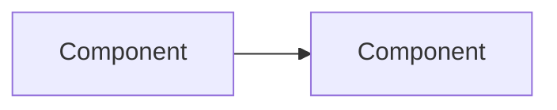

# [Feature Name] Technical Design

## Introduction and Overview

[What is being built and why. Reference related PD and ADRs by name.]

**Prerequisites:** [List ADRs and prior decisions this builds on]

**Goals:**
- [Goal]

**Non-goals:**
- [Explicit non-goal]

**Glossary:**
- **[Term]** — [definition]

## System Design and Architecture

[Prose description of components and data flow.]

## Detailed Design

### [Component Name]

[API signatures, data structures, key logic.]

## Security and Privacy

[Input validation, auth, data exposure.]

## Observability

[Logging levels and events, metrics, alerting.]

## Testing Plan

**Unit tests:**
- [What and how]

**Integration tests:**
- [What requires external components]

## Alternatives Considered

**[Alternative]:**
- Pros: [...]
- Cons: [...]
- **Decision**: [Why rejected]

**Do nothing:**
- Pros: No cost
- Cons: [...]
- **Decision**: [Why rejected]

## Risks

- **[Risk]** (high/medium/low): [mitigation]
