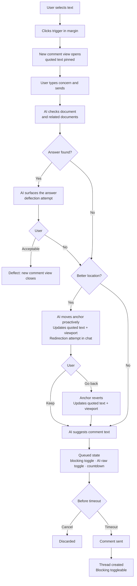

# Comments

## What

Episteme's comment system lets reviewers leave inline feedback anchored to specific text in a document. A reviewer selects a passage, writes a comment, and that comment appears attached to the highlighted text. Other participants can reply, creating a thread. The author can respond and resolve threads when the underlying concern has been addressed.

## Why

Reading a document and having an opinion about it are two different things. Without a way to leave feedback tied to specific text, reviewers fall back to vague notes, separate Slack messages, or in-person conversations — none of which are traceable, resolvable, or visible to the next person who reads the doc.

Comments make the review process legible. A resolved thread is a record of a concern that was raised and addressed. An open thread is a signal that something still needs attention before approval. Over time, the comment history of a document tells the story of how it got to where it is.

## Personas

- **Raquel: Reviewer** — leaves inline feedback anchored to specific text during the review cycle
- **Patricia: Product Manager** — receives comments on her drafts, responds to threads, and resolves them as she revises
- **Aaron: Approver** — reads comment history before sign-off; may add comments if something needs addressing before he'll approve

## Narratives

### Raquel reviews the notification system tech design

Eric wrote the notification system tech design based on an approved product description and requests feedback from several reviewers. Raquel opens the tech design in Review mode.

As Raquel reads through the Architecture section, she encounters a reference to a retry queue. She selects the sentence and types: "what happens when this fails?" The AI scans both the tech design and the linked PD. It finds the answer in the PD's Goals section. It responds: "This is covered in the product description — failed notifications surface as warnings in the activity feed within 60 seconds (Goals, item 3). Does that answer your question?" Raquel confirms it does and continues.

A few paragraphs later, Raquel selects a sentence about the throughput target and types: "this number seems low." The AI asks: "Are you concerned it's too low for the current user base, or for projected growth?" Raquel responds: "curent user base, we already exceed this on busy days." The AI finds that the throughput target follows from a constraint defined two sections earlier and responds: "Your comment may land better in the Constraints section where this target originates. I've also tidied the wording." It highlights the Constraints section and proposes: "The throughput target is already exceeded on busy days with the current user base — the constraint driving this needs revisiting." Raquel marks the comment as blocking, approves the text and the anchor, and it is filed.

Raquel reaches the section on notification templates and selects a paragraph about template versioning. She types: "who owns this?" The AI asks: "Are you asking about ownership of the versioning process, or ownership of the template content itself?" Raquel responds: "the versioning process — it's not clear whether product or engineering is responsible." The AI scans both documents, finds nothing that resolves the question, and proposes: "It's not clear whether product or engineering owns the template versioning process. This should be explicit before implementation begins." Raquel marks the comment as non-blocking, approves, and it is filed.

### Eric works through Raquel's comments

Eric opens the notification system tech design and sees two comment threads in the sidebar. Both were filed by Raquel during her review.

He opens the throughput comment first — it's marked blocking, anchored to the Constraints section. Raquel's comment reads: "The throughput target is already exceeded on busy days with the current user base — the constraint driving this needs revisiting." Eric sees a virtual card prompting him to address the thread. He clicks "Suggest a fix" — the AI proposes updating the constraint to reference current peak load metrics and adds a note that the throughput target will be revisited before implementation. It also drafts a reply: "Updated the constraint and flagged the throughput target for revision before we begin implementation." Eric reviews both, makes a small edit to the proposed document change, and approves. The fix is applied, the reply is posted, and Eric clicks "Mark as resolved." The thread is now resolved.

Eric opens the versioning ownership comment next — non-blocking, anchored to the template versioning paragraph. Raquel's comment asks who owns the versioning process. Eric isn't sure himself and wants Raquel's read before he specifies anything. He starts typing a reply and the AI asks: "Are you asking Raquel to propose an owner, or flagging that this needs a broader decision?" Eric responds that it needs a broader decision. The AI drafts: "Agreed this isn't clear — I'd rather not specify an owner without a conversation. Can you flag whether you think this is blocking or whether we can decide post-implementation?" Eric approves the reply and it posts. The thread stays open.

### Aaron reviews before approving

Aaron opens the notification system tech design to review it for approval. The sidebar shows two comment threads. The throughput comment is resolved — its border and decoration are success green, but the blocking indicator is preserved. The versioning ownership comment is open and non-blocking; the thread shows Eric's reply asking for a broader conversation about ownership before the doc specifies anything.

Aaron reads through the document and the threads. The throughput resolution looks right to him. He adds a reply to the versioning thread: "Engineering should own this. We can document it in the tech design before implementation." He marks his review complete. Since the blocking thread is resolved and the remaining open thread is non-blocking, Aaron can proceed with approval. The versioning thread — with Eric's and Aaron's replies — is automatically resolved on approval, preserving the full conversation as a record.

## User stories

**Raquel reviews the notification system tech design**

- Raquel can select text in a document and initiate a comment in Review mode
- Before filing, AI checks whether the document or a related document already answers Raquel's concern
- When a different passage more precisely captures Raquel's concern, AI suggests moving the anchor there
- AI proposes refined comment text before the comment is filed
- Raquel can mark a comment as blocking or non-blocking before filing
- Raquel can override AI suggestions and file a comment as written

**Eric works through Raquel's comments**

- Eric can see all open comment threads for a document in the sidebar
- AI suggests a document fix when Eric is responding to a comment
- Eric can review and edit an AI-proposed document change before it is applied
- AI drafts a reply for Eric's review when he responds to a comment thread
- AI asks a clarifying question to understand Eric's intent before drafting a reply
- Eric can mark a thread as resolved after applying a fix

**Aaron reviews before approving**

- Aaron can see the blocking/non-blocking and resolved/open status of all comment threads
- Aaron can reply to a comment thread
- Any participant can re-open a resolved thread via the virtual card
- *(out of scope)* Aaron is prevented from approving while a blocking comment is unresolved
- *(out of scope)* Aaron can approve a document once all blocking comments are resolved or confirmed
- *(out of scope)* Open non-blocking threads are automatically resolved when a document is approved

## Goals

- Reviewers leave fewer redundant or answerable comments — AI successfully deflects questions that are already addressed in the document or related documents
- Comments that are filed are higher quality — clearly worded, anchored to the most relevant passage, and marked with appropriate blocking status
- Review cycles produce a legible thread history — every filed comment has a clear resolution path and outcome visible to all participants
- Blocking comments reliably gate downstream actions — a document with an unresolved blocking comment cannot move forward until it is addressed and confirmed

## Non-goals

- Approving documents — blocking comment enforcement is defined here, but the approval action itself is out of scope
- Automatic resolution of open threads when a document is approved
- Document-level comments not anchored to specific text
- Reactions
- Real-time concurrent commenting
- Notifications

## Design spec

### User flows

#### Comment creation flow



### Key UI components

Message rendering follows the existing `ChatMessage` pattern: user messages right-aligned with accent background; AI messages left-aligned with subtle background. Thread messages (multi-participant) add a name + timestamp above each bubble to distinguish participants.

#### New comment view (AI panel state)

New comment view is a state of the AI panel, not a document mode. It opens when the user clicks the comment trigger in the document margin. The quoted text block is pinned at the top throughout the session and updates if the anchor is relocated.

The input uses the existing `ChatInputCard` pattern. Placeholder: "What's your question or concern?"

**State 1 — just opened:**
```
┌──────────────────────────────────────────────┐
│  [message-square-plus]  New comment    [×]   │
├──────────────────────────────────────────────┤
│  ╔════════════════════════════════════════╗  │
│  ║ "The retry queue throughput target     ║  │
│  ║  is set to 1,000 req/s per node"       ║  │
│  ╚════════════════════════════════════════╝  │
├──────────────────────────────────────────────┤
│  ┌──────────────────────────────────────┐   │
│  │  What's your question or concern?    │   │
│  ├──────────────────────────────────────┤   │
│  │                                [↑]   │   │
│  └──────────────────────────────────────┘   │
└──────────────────────────────────────────────┘
```

**State 2 — user sent, AI processing:**
```
│  ╔════════════════════════════════════════╗  │
│  ║ "The retry queue throughput target..." ║  │
│  ╚════════════════════════════════════════╝  │
│                                              │
│                        this number seems low │
│                                   [accent ▶] │
│                                              │
│  [subtle ▶] ·  ·  ·                          │
```

**State 3 — deflection attempt:**
```
│                        this number seems low │
│                                   [accent ▶] │
│                                              │
│  [subtle ▶] This is covered in the product  │
│  description — failed notifications surface  │
│  as warnings within 60 seconds (Goals,       │
│  item 3). Does that answer your question?    │
│                                              │
│  ┌──────────────────────────────────────┐   │
│  │  Reply...                            │   │
│  ├──────────────────────────────────────┤   │
│  │  [No, file anyway]             [↑]   │   │
│  └──────────────────────────────────────┘   │
```

`[No, file anyway]` in the left slot of the input as a quick action; user can also reply naturally.

**State 4 — redirect + queued (anchor already moved, quoted text updated):**
```
│  ╔════════════════════════════════════════╗  │
│  ║ "The infrastructure constraint sets   ║  │
│  ║  the throughput ceiling at..."        ║  │  ← updated anchor
│  ╚════════════════════════════════════════╝  │
│                                              │
│                        this number seems low │
│                                   [accent ▶] │
│                                              │
│  [subtle ▶] Got it. I've moved your comment  │
│  to the Constraints section where this       │
│  target originates — it'll land better       │
│  there.                      [Go back]       │
│                                              │
│  ┌──────────────────────────────────────┐   │
│  │  The throughput target is already    │   │  ← queued card
│  │  exceeded on busy days — the         │   │
│  │  constraint driving this needs       │   │
│  │  revisiting.                         │   │
│  │                                      │   │
│  │  [✨▌👤]          [× ████░░ 24s]    │   │
│  └──────────────────────────────────────┘   │
│  [octagon-x · tertiary]                     │
```

`[Go back]` is inline on the AI message. Quoted block at top updates immediately when anchor moves and again if user reverts.

#### Queued message

Appears in the new comment view message stack when a comment is staged for sending. AI-enhanced version shown by default. A simple status toggle appears below the queued card — the thread does not exist yet so the full status row (with history) is hidden until the comment sends.

- **Toggle group** (`[✨▌👤]`): Radix `ToggleGroup`. Selected segment has accent background. Switches the displayed text and the version that will be sent.
- **Countdown pill** (`[× ████░░ 24s]`): tappable — clicking cancels. Progress bar drains to zero, then comment sends and animates into a normal message bubble.
- **Status toggle below card**: `octagon-x` icon only — no attribution, no history. Clicking toggles blocking for when the thread is created.

```
│  ┌──────────────────────────────────────┐   │
│  │  The throughput target is already    │   │
│  │  exceeded on busy days — the         │   │
│  │  constraint driving this needs       │   │
│  │  revisiting.                         │   │
│  │                                      │   │
│  │  [✨▌👤]          [× ████░░ 24s]    │   │
│  └──────────────────────────────────────┘   │
│  [octagon-x · tertiary]                     │
```

#### Status row

Appears below the quoted text block in thread view. Hidden in new comment view until the first comment sends and a thread is created. Tracks both blocking status and thread status with a full audit history.

Thread **status** (`open` | `resolved`) and **blocking** (boolean) are independent. Blocking is only toggleable when status = open. When status = resolved, the `octagon-x` icon is non-interactive but its value is preserved in case the thread re-opens.

- **Icon**: `octagon-x` from Lucide. Only the icon is clickable — only when status = open.
- **No history yet** (default, never explicitly toggled): icon only, no text.
- **Non-blocking** (explicitly set): icon in `--color-text-tertiary` + `name · time ago`.
- **Blocking** (status = open): icon in `--color-state-danger` + label "blocking" + `name · time ago`.
- **Resolved** (any blocking value): icon in `--color-state-success`, non-interactive + `name · time ago`.
- **Hover anywhere on the row**: history popover appears. Icon brightens to `--color-text-primary` on hover (only when interactive).

**Default (never toggled):**
```
│  [octagon-x · tertiary]                          │
```

**Blocking (status = open):**
```
│  [octagon-x · danger]  blocking · Aaron · 30m ago │
```

**Resolved (blocking preserved but dormant):**
```
│  [octagon-x · success · disabled]  resolved · Eric · 1h ago │
```

**History popover (row hover):**

Each entry uses `→ state` format — consistent across all event types. Possible states: `blocking`, `non-blocking`, `resolved`, `re-opened`.

```
│  ┌──────────────────────────────────┐            │
│  │  → blocking      Raquel · 2h    │            │
│  │  → non-blocking  Eric · 1h      │            │
│  │  → blocking      Aaron · 30m    │            │
│  │  → resolved      Eric · 10m     │            │
│  └──────────────────────────────────┘            │
```

Blocking is a property of the thread, not individual messages. Any participant can toggle it while the thread is open. An open blocking thread prevents document progression regardless of when it was marked blocking.

#### Virtual cards

Persistent AI-generated cards that appear at the end of the message stream in thread view, above the input. Which card shows depends on thread status and the current user's role relative to the document.

**Card A — doc author, status = open**

The document author (identified from frontmatter) sees a card prompting resolution. Only appears once the thread has at least one reply from someone other than the original commenter — avoids prompting resolution on a thread that hasn't been addressed yet.

Two actions: `[Suggest a fix]` triggers the AI fix flow (AI proposes a document edit and draft reply, follows the queued message pattern); `[Mark as resolved]` resolves the thread directly without a document change.

```
│  [✨]  Ready to address this thread?             │
│                                                  │
│  [Suggest a fix]    [Mark as resolved]           │
```

**Card B — all users, status = resolved**

All users see the resolved card. Re-opening requires inline confirmation to prevent accidental clicks:

*Default state:*
```
│  [✨]  This thread was marked as resolved.       │
│                                                  │
│  [Re-open]                                       │
```

*After clicking `[Re-open]`:*
```
│  [✨]  This thread was marked as resolved.       │
│                                                  │
│  Re-open this thread?  [Confirm]  [Cancel]       │
```

Sending any message does not affect thread status. Status only changes via explicit button action.

#### Thread view (AI panel state)

Quoted text pinned at top, followed by the status row. Multi-participant messages show avatar + name + timestamp above each bubble. Messages from the current user are right-aligned (accent); all others are left-aligned (subtle). No separator between messages — bubbles are visually distinguishable. Virtual card appears at end of message stream. Input always available regardless of status.

Header: `[←]  Threads  [×]` — `[←]` returns to threads list, `[×]` closes to chat.

```
┌──────────────────────────────────────────────┐
│  [←]  Threads                          [×]   │
├──────────────────────────────────────────────┤
│  ╔════════════════════════════════════════╗  │
│  ║ "The retry queue throughput target     ║  │
│  ║  is set to 1,000 req/s per node"       ║  │
│  ╚════════════════════════════════════════╝  │
│  [octagon-x · danger]  blocking · Raquel · 2h│
│                                              │
│  [av] Raquel  ·  2h ago                      │
│  [subtle ▶] The throughput target is already │
│  exceeded on busy days — the constraint      │
│  driving this needs revisiting.              │
│                                              │
│  [av] Eric  ·  1h ago                        │
│  [subtle ▶] Updated the constraint and       │
│  flagged the throughput target for revision. │
│                                              │
│  [✨]  Ready to address this thread?         │
│  [Suggest a fix]    [Mark as resolved]       │
│                                              │
├──────────────────────────────────────────────┤
│  ┌──────────────────────────────────────┐   │
│  │  Reply...                            │   │
│  ├──────────────────────────────────────┤   │
│  │                                [↑]   │   │
│  └──────────────────────────────────────┘   │
└──────────────────────────────────────────────┘
```

#### Document decorations

TipTap `Decoration.inline` applies a dotted underline to anchored text. Decoration color reflects thread state — success takes precedence over danger once resolved:

| Status | Blocking | Color token |
|---|---|---|
| open | false | `--color-state-warning` |
| open | true | `--color-state-danger` |
| resolved | any | `--color-state-success` |

Resolved decorations hidden if "show resolved decorations" setting is off (Settings panel, reading preferences, default: on).

Clicking a decorated passage opens thread view in the AI panel.

#### Right rail

A narrow strip (`--width-comment-rail: 24px`) to the right of the document content column showing thread indicator bubbles aligned vertically to their anchor's first line.

Only rendered when the document pane is wide enough to accommodate the rail without consuming content space. Breakpoint: window width ≥ 1440px (doc pane ≥ 768px, leaving ≥ 34px right margin around the 680px content column). Hidden below this breakpoint — underline decorations remain the only inline indicator.

Each bubble shows:
- Thread status icon (color matches underline state)
- Collapsed into a count badge when multiple threads are anchored within the same viewport region

Hover over a bubble: thread preview popover.
Click a bubble: opens thread view in AI panel.

#### Threads view (AI panel state)

Replaces whatever is currently showing in the AI panel. Header: `[messages-square]  Threads` — no back button (top-level view). Accessible from the AI panel header via a `messages-square` icon button.

Each row follows the session history row pattern: 3px state-color left border → pin icon → content → (no ellipsis menu). Pin icon hidden unless pinned; shown on hover. Pinned threads sort to top.

Row content:
- First line: `octagon-x · danger` if blocking, then anchor text snippet (truncated)
- Second line: participant avatars + last activity timestamp + status label if resolved

Currently-open thread has `--color-bg-subtle` background. All rows have a bottom border.

Clicking a row opens thread view. Keyboard shortcuts navigate between anchored passages in the document (next/previous thread).

```
┌──────────────────────────────────────────────┐
│  [messages-square]  Threads                  │
├──────────────────────────────────────────────┤
│                                              │
│▐ [pin] [octagon-x·danger]  "The retry queue  │  ← danger border, bg-subtle (active)
│         throughput target is set to..."      │
│         [av·R] [av·E]  ·  1h ago            │
│                                              │
│▐ [pin] "It's not clear whether product or    │  ← warning border
│         engineering owns the template..."    │
│         [av·R] [av·E] [av·A]  ·  30m ago    │
│                                              │
│▐ [pin] "What happens when this fails?"       │  ← success border, dimmer text
│         [av·R]  ·  3h ago  ·  resolved      │
│                                              │
└──────────────────────────────────────────────┘
```

## Tech spec

*(Added by tech specs stage)*

## Task list

*(Added by task decomposition stage)*
