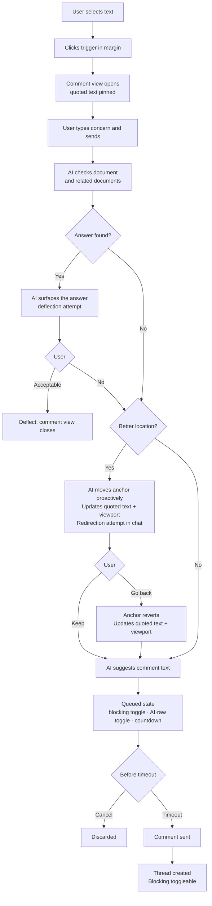

# Comments

## What

Episteme's comment system lets reviewers leave inline feedback anchored to specific text in a document. A reviewer selects a passage, writes a comment, and that comment appears attached to the highlighted text. Other participants can reply, creating a thread. The author can respond and resolve threads when the underlying concern has been addressed.

## Why

Reading a document and having an opinion about it are two different things. Without a way to leave feedback tied to specific text, reviewers fall back to vague notes, separate Slack messages, or in-person conversations — none of which are traceable, resolvable, or visible to the next person who reads the doc.

Comments make the review process legible. A resolved thread is a record of a concern that was raised and addressed. An open thread is a signal that something still needs attention before approval. Over time, the comment history of a document tells the story of how it got to where it is.

## Personas

- **Raquel: Reviewer** — leaves inline feedback anchored to specific text during the review cycle
- **Patricia: Product Manager** — receives comments on her drafts, responds to threads, and resolves them as she revises
- **Aaron: Approver** — reads comment history before sign-off; may add comments if something needs addressing before he'll approve

## Narratives

### Raquel reviews the notification system tech design

Eric wrote the notification system tech design based on an approved product description and requests feedback from several reviewers. Raquel opens the tech design in Review mode.

As Raquel reads through the Architecture section, she encounters a reference to a retry queue. She selects the sentence and types: "what happens when this fails?" The AI scans both the tech design and the linked PD. It finds the answer in the PD's Goals section. It responds: "This is covered in the product description — failed notifications surface as warnings in the activity feed within 60 seconds (Goals, item 3). Does that answer your question?" Raquel confirms it does and continues.

A few paragraphs later, Raquel selects a sentence about the throughput target and types: "this number seems low." The AI asks: "Are you concerned it's too low for the current user base, or for projected growth?" Raquel responds: "curent user base, we already exceed this on busy days." The AI finds that the throughput target follows from a constraint defined two sections earlier and responds: "Your comment may land better in the Constraints section where this target originates. I've also tidied the wording." It highlights the Constraints section and proposes: "The throughput target is already exceeded on busy days with the current user base — the constraint driving this needs revisiting." Raquel marks the comment as blocking, approves the text and the anchor, and it is filed.

Raquel reaches the section on notification templates and selects a paragraph about template versioning. She types: "who owns this?" The AI asks: "Are you asking about ownership of the versioning process, or ownership of the template content itself?" Raquel responds: "the versioning process — it's not clear whether product or engineering is responsible." The AI scans both documents, finds nothing that resolves the question, and proposes: "It's not clear whether product or engineering owns the template versioning process. This should be explicit before implementation begins." Raquel marks the comment as non-blocking, approves, and it is filed.

### Eric works through Raquel's comments

Eric opens the notification system tech design and sees two comment threads in the sidebar. Both were filed by Raquel during her review.

He opens the throughput comment first — it's marked blocking, anchored to the Constraints section. Raquel's comment reads: "The throughput target is already exceeded on busy days with the current user base — the constraint driving this needs revisiting." Eric agrees. He clicks to have AI suggest a fix. The AI proposes updating the constraint to reference current peak load metrics and adds a note that the throughput target will be revisited before implementation. It also drafts a reply to Raquel's thread: "Updated the constraint and flagged the throughput target for revision before we begin implementation." Eric reviews both, makes a small edit to the proposed document change, and approves. The fix is applied and the reply is posted. The comment moves to resolved pending confirmation.

Eric opens the versioning ownership comment next — non-blocking, anchored to the template versioning paragraph. Raquel's comment asks who owns the versioning process. Eric isn't sure himself and wants Raquel's read before he specifies anything. He starts typing a reply and the AI asks: "Are you asking Raquel to propose an owner, or flagging that this needs a broader decision?" Eric responds that it needs a broader decision. The AI drafts: "Agreed this isn't clear — I'd rather not specify an owner without a conversation. Can you flag whether you think this is blocking or whether we can decide post-implementation?" Eric approves the reply and it posts. The thread stays open.

### Aaron reviews before approving

Aaron opens the notification system tech design to review it for approval. The sidebar shows two comment threads. The throughput comment — blocking — is marked "resolved pending confirmation." The versioning ownership comment is open and non-blocking; the thread shows Eric's reply asking for a broader conversation about ownership before the doc specifies anything.

Aaron reads through the document and the threads. The throughput fix looks right to him. He can't approve yet — the blocking comment is waiting on Raquel — but he adds a reply to the versioning thread: "Engineering should own this. We can document it in the tech design before implementation." He marks his review complete and waits.

Raquel returns, sees Eric's fix to the Constraints section, and agrees it addresses her concern. She closes the thread. Aaron is notified that the blocking comment is resolved. He opens the document, sees both threads are now either resolved or non-blocking, and approves. The versioning thread — with Eric's and Aaron's replies — is automatically resolved on approval, preserving the full conversation as a record.

## User stories

**Raquel reviews the notification system tech design**

- Raquel can select text in a document and initiate a comment in Review mode
- Before filing, AI checks whether the document or a related document already answers Raquel's concern
- When a different passage more precisely captures Raquel's concern, AI suggests moving the anchor there
- AI proposes refined comment text before the comment is filed
- Raquel can mark a comment as blocking or non-blocking before filing
- Raquel can override AI suggestions and file a comment as written

**Eric works through Raquel's comments**

- Eric can see all open comment threads for a document in the sidebar
- AI suggests a document fix when Eric is responding to a comment
- Eric can review and edit an AI-proposed document change before it is applied
- AI drafts a reply for Eric's review when he responds to a comment thread
- AI asks a clarifying question to understand Eric's intent before drafting a reply
- Eric can see a blocking comment move to "resolved pending confirmation" after addressing it

**Aaron reviews before approving**

- Aaron can see the blocking/non-blocking status of all comment threads
- Aaron can see when a blocking comment is "resolved pending confirmation"
- Aaron can reply to a comment thread
- Raquel can close a "resolved pending confirmation" thread after reviewing the fix
- *(out of scope)* Aaron is prevented from approving while a blocking comment is unresolved
- *(out of scope)* Aaron can approve a document once all blocking comments are resolved or confirmed
- *(out of scope)* Open non-blocking threads are automatically resolved when a document is approved

## Goals

- Reviewers leave fewer redundant or answerable comments — AI successfully deflects questions that are already addressed in the document or related documents
- Comments that are filed are higher quality — clearly worded, anchored to the most relevant passage, and marked with appropriate blocking status
- Review cycles produce a legible thread history — every filed comment has a clear resolution path and outcome visible to all participants
- Blocking comments reliably gate downstream actions — a document with an unresolved blocking comment cannot move forward until it is addressed and confirmed

## Non-goals

- Approving documents — blocking comment enforcement is defined here, but the approval action itself is out of scope
- Automatic resolution of open threads when a document is approved
- Document-level comments not anchored to specific text
- Reactions
- Real-time concurrent commenting
- Notifications

## Design spec

### User flows

#### Comment creation flow



### Key UI components

#### Comment view (AI panel state)

Comment view is a state of the AI panel, not a document mode. It opens when the user clicks the comment trigger in the document margin. The quoted text block is pinned at the top throughout the session and updates if the anchor is relocated.

The input uses the existing `ChatInputCard` pattern. Placeholder: "What's your question or concern?"

#### Queued message

Appears in the comment view message stack when a comment is staged for sending. Shows the version that will be sent (AI-enhanced by default) with a toggle group to switch between versions and a countdown pill to cancel.

```
│  [👤]  just now                  [queued]    │
│  ┌──────────────────────────────────────┐   │
│  │  The throughput target is already    │   │
│  │  exceeded on busy days — the         │   │
│  │  constraint driving this needs       │   │
│  │  revisiting.                         │   │
│  │                                      │   │
│  │  [blocking?]  [✨▌👤] [× ████░░ 24s]│   │
│  └──────────────────────────────────────┘   │
```

- **Toggle group** (`[✨▌👤]`): Radix `ToggleGroup`. Selected segment has accent background. Switches the displayed text and the version that will be sent. User avatar shown at top regardless of selection.
- **Countdown pill** (`[× ████░░ 24s]`): tappable — clicking cancels the comment entirely. Progress bar drains to zero then comment sends and animates into a normal message bubble.
- **Blocking toggle** (`[blocking?]`): sets blocking/non-blocking before send. Remains toggleable on the thread after send.

#### Thread view (AI panel state)

Same panel state as comment view but shows an existing thread. Quoted text pinned at top. Messages in chronological order. Input at bottom with same queued message behaviour on reply.

```
│  [bot-message-square]  Thread          [×]   │
│  ╔════════════════════════════════════════╗  │
│  ║ "The retry queue throughput target     ║  │
│  ║  is set to 1,000 req/s per node"       ║  │
│  ╚════════════════════════════════════════╝  │
│                                  [blocking]  │
│                                              │
│  [👤]  Raquel  ·  2h ago                     │
│  The throughput target is already exceeded   │
│  on busy days — the constraint driving       │
│  this needs revisiting.                      │
│                                              │
│  ───────────────────────────────────────     │
│                                              │
│  [👤]  Eric  ·  1h ago                       │
│  Updated the constraint and flagged the      │
│  throughput target for revision before       │
│  implementation begins.                      │
│                          [resolved pending]  │
│                                              │
│  ┌──────────────────────────────────────┐   │
│  │  Reply...                            │   │
│  ├──────────────────────────────────────┤   │
│  │                                [↑]   │   │
│  └──────────────────────────────────────┘   │

## Tech spec

*(Added by tech specs stage)*

## Task list

*(Added by task decomposition stage)*
