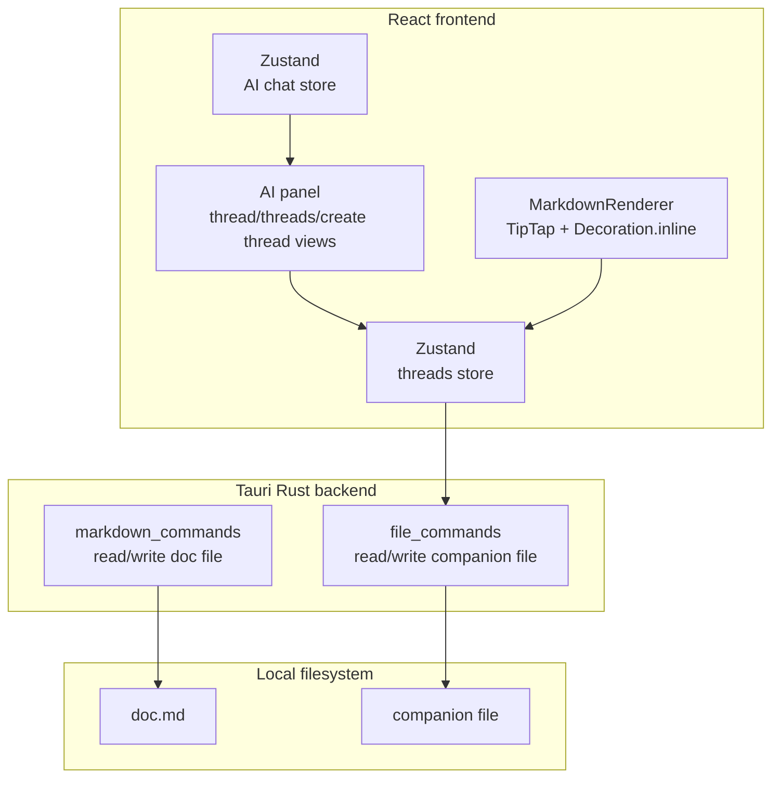
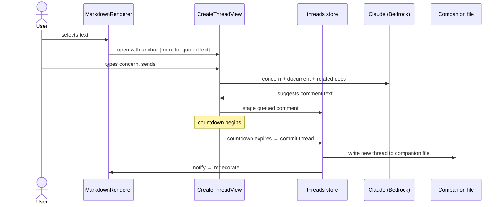

# Comments

## What

Episteme's comment system lets reviewers leave inline feedback anchored to specific text in a document. A reviewer selects a passage, writes a comment, and that comment appears attached to the highlighted text. Other participants can reply, creating a thread. The author can respond and resolve threads when the underlying concern has been addressed.

## Why

Reading a document and having an opinion about it are two different things. Without a way to leave feedback tied to specific text, reviewers fall back to vague notes, separate Slack messages, or in-person conversations — none of which are traceable, resolvable, or visible to the next person who reads the doc.

Comments make the review process legible. A resolved thread is a record of a concern that was raised and addressed. An open thread is a signal that something still needs attention before approval. Over time, the comment history of a document tells the story of how it got to where it is.

## Personas

- **Raquel: Reviewer** — leaves inline feedback anchored to specific text during the review cycle
- **Patricia: Product Manager** — receives comments on her drafts, responds to threads, and resolves them as she revises
- **Aaron: Approver** — reads comment history before sign-off; may add comments if something needs addressing before he'll approve

## Narratives

### Raquel reviews the notification system tech design

Eric wrote the notification system tech design based on an approved product description and requests feedback from several reviewers. Raquel opens the tech design in Review mode.

As Raquel reads through the Architecture section, she encounters a reference to a retry queue. She selects the sentence and types: "what happens when this fails?" The AI scans both the tech design and the linked PD. It finds the answer in the PD's Goals section. It responds: "This is covered in the product description — failed notifications surface as warnings in the activity feed within 60 seconds (Goals, item 3). Does that answer your question?" Raquel confirms it does and continues.

A few paragraphs later, Raquel selects a sentence about the throughput target and types: "this number seems low." The AI asks: "Are you concerned it's too low for the current user base, or for projected growth?" Raquel responds: "curent user base, we already exceed this on busy days." The AI finds that the throughput target follows from a constraint defined two sections earlier and responds: "Your comment may land better in the Constraints section where this target originates. I've also tidied the wording." It highlights the Constraints section and proposes: "The throughput target is already exceeded on busy days with the current user base — the constraint driving this needs revisiting." Raquel marks the comment as blocking, approves the text and the anchor, and it is filed.

Raquel reaches the section on notification templates and selects a paragraph about template versioning. She types: "who owns this?" The AI asks: "Are you asking about ownership of the versioning process, or ownership of the template content itself?" Raquel responds: "the versioning process — it's not clear whether product or engineering is responsible." The AI scans both documents, finds nothing that resolves the question, and proposes: "It's not clear whether product or engineering owns the template versioning process. This should be explicit before implementation begins." Raquel marks the comment as non-blocking, approves, and it is filed.

### Eric works through Raquel's comments

Eric opens the notification system tech design and sees two comment threads in the sidebar. Both were filed by Raquel during her review.

He opens the throughput comment first — it's marked blocking, anchored to the Constraints section. Raquel's comment reads: "The throughput target is already exceeded on busy days with the current user base — the constraint driving this needs revisiting." Eric sees a virtual card prompting him to address the thread. He clicks "Suggest a fix" — the AI proposes updating the constraint to reference current peak load metrics and adds a note that the throughput target will be revisited before implementation. It also drafts a reply: "Updated the constraint and flagged the throughput target for revision before we begin implementation." Eric reviews both, makes a small edit to the proposed document change, and approves. The fix is applied, the reply is posted, and Eric clicks "Mark as resolved." The thread is now resolved.

Eric opens the versioning ownership comment next — non-blocking, anchored to the template versioning paragraph. Raquel's comment asks who owns the versioning process. Eric isn't sure himself and wants Raquel's read before he specifies anything. He starts typing a reply and the AI asks: "Are you asking Raquel to propose an owner, or flagging that this needs a broader decision?" Eric responds that it needs a broader decision. The AI drafts: "Agreed this isn't clear — I'd rather not specify an owner without a conversation. Can you flag whether you think this is blocking or whether we can decide post-implementation?" Eric approves the reply and it posts. The thread stays open.

### Aaron reviews before approving

Aaron opens the notification system tech design to review it for approval. The sidebar shows two comment threads. The throughput comment is resolved — its border and decoration are success green, but the blocking indicator is preserved. The versioning ownership comment is open and non-blocking; the thread shows Eric's reply asking for a broader conversation about ownership before the doc specifies anything.

Aaron reads through the document and the threads. The throughput resolution looks right to him. He adds a reply to the versioning thread: "Engineering should own this. We can document it in the tech design before implementation." He marks his review complete. Since the blocking thread is resolved and the remaining open thread is non-blocking, Aaron can proceed with approval. The versioning thread — with Eric's and Aaron's replies — is automatically resolved on approval, preserving the full conversation as a record.

## User stories

**Raquel reviews the notification system tech design**

- Raquel can select text in a document and initiate a comment in Review mode
- Before filing, AI checks whether the document or a related document already answers Raquel's concern
- When a different passage more precisely captures Raquel's concern, AI suggests moving the anchor there
- AI proposes refined comment text before the comment is filed
- Raquel can mark a comment as blocking or non-blocking before filing
- Raquel can override AI suggestions and file a comment as written

**Eric works through Raquel's comments**

- Eric can see all open comment threads for a document in the sidebar
- AI suggests a document fix when Eric is responding to a comment
- Eric can review and edit an AI-proposed document change before it is applied
- AI drafts a reply for Eric's review when he responds to a comment thread
- AI asks a clarifying question to understand Eric's intent before drafting a reply
- Eric can mark a thread as resolved after applying a fix

**Aaron reviews before approving**

- Aaron can see the blocking/non-blocking and resolved/open status of all comment threads
- Aaron can reply to a comment thread
- Any participant can re-open a resolved thread via the virtual card
- *(out of scope)* Aaron is prevented from approving while a blocking comment is unresolved
- *(out of scope)* Aaron can approve a document once all blocking comments are resolved or confirmed
- *(out of scope)* Open non-blocking threads are automatically resolved when a document is approved

## Goals

- Reviewers leave fewer redundant or answerable comments — AI successfully deflects questions that are already addressed in the document or related documents
- Comments that are filed are higher quality — clearly worded, anchored to the most relevant passage, and marked with appropriate blocking status
- Review cycles produce a legible thread history — every filed comment has a clear resolution path and outcome visible to all participants
- Blocking comments reliably gate downstream actions — a document with an unresolved blocking comment cannot move forward until it is addressed and confirmed

## Non-goals

- Approving documents — blocking comment enforcement is defined here, but the approval action itself is out of scope
- Automatic resolution of open threads when a document is approved
- Document-level comments not anchored to specific text
- Reactions
- Real-time concurrent commenting
- Notifications

## Design spec

### Thread states

Each thread has two independent properties:

- **Status**: `open` | `resolved`
- **Blocking**: boolean — only toggleable when status = `open`; preserved when resolved

Visual treatment across all surfaces (decoration, rail bubble, threads view border, status row icon):

| Status | Blocking | Color |
|---|---|---|
| open | false | `--color-state-warning` |
| open | true | `--color-state-danger` |
| resolved | any | `--color-state-success` |

Success takes precedence over danger once resolved — a thread that was blocking shows success coloring when resolved, with the blocking value preserved silently.

### Document decorations and comment trigger

TipTap `Decoration.inline` applies a dotted underline to anchored text using the color from the thread state table above. Resolved decorations are hidden if "show resolved decorations" is off (Settings panel, reading preferences, default: on).

**Comment trigger:** when the user selects text, a small popover appears anchored to the end of the selection containing a `message-square-plus` button. Clicking it opens the create thread view in the AI panel with the selection quoted.

```
  ...the throughput target is set to 1,000 req/s▌
                                    ┌──────────┐
                                    │  [✚ msg] │
                                    └──────────┘
```

**Overlapping threads:** multiple threads can anchor to overlapping or identical text ranges. Where threads overlap, each character's decoration uses the worst color across all threads spanning it (danger > warning > success). Clicking behavior depends on how many threads span the clicked position:

- **One thread**: opens thread view directly.
- **Multiple threads**: opens a filtered threads view showing only the threads that span the clicked position.

Example: a phrase "the throughput target is set to 1,000 req/s" has two threads — one spanning the whole phrase (resolved, success) and one spanning only "1,000" (open + blocking, danger). "1,000" renders danger and clicking it shows a filtered threads view with both threads. The rest of the phrase renders danger (because the blocking thread spans it too, even though its anchor is narrower — worst color wins) and clicking shows the filtered view with both. If the blocking thread covered only "1,000" then the surrounding text would render success and clicking there would go straight to thread view for the resolved thread.

Clicking a decorated passage opens thread view (single thread) or filtered threads view (multiple threads) in the AI panel.

**Right rail:** a narrow strip (`--width-comment-rail: 24px`) to the right of the content column showing thread indicator bubbles aligned to their anchor's first line. Only rendered at window width ≥ 1440px — below this breakpoint, decorations are the only inline indicator. Each bubble uses the thread state color; bubbles collapse into a count badge when multiple threads are anchored within the same viewport region. Hover: thread preview popover. Click: opens thread view or filtered threads view.

### AI panel views

Three views handle comments in the AI panel. Each replaces whatever is currently showing. All follow the existing `ChatMessage` rendering pattern: current user messages right-aligned with accent background; all others left-aligned with subtle background. All messages in comment views show avatar + name + timestamp above the bubble regardless of participant count.

| View | Header | Trigger |
|---|---|---|
| Create thread view | `[message-square-plus]  New comment  [×]` | Comment trigger popover in document |
| Thread view | `[←]  "[first ~25 chars of quoted text]..."  [↑] [↓] [×]` | Clicking a decoration or threads view row |
| Threads view | `[messages-square]  Threads  [×]` | `messages-square` icon in AI panel header |

All three `[×]` buttons return the user to chat view. `[↑]` and `[↓]` in thread view navigate to the previous/next thread in anchor order.

### Create thread view

The create thread view guides the user through creating a comment. It is not a document mode — it can be opened from any mode. The quoted selection is pinned at the top throughout and updates if the anchor is relocated.

#### Comment creation flow


#### UI states

**State 1 — just opened**

The panel switches to create thread view. The quoted selection is pinned at the top as a persistent reference. The input awaits the user's question or concern.

```
┌──────────────────────────────────────────────┐
│  [message-square-plus]  New comment    [×]   │
├──────────────────────────────────────────────┤
│  ╔════════════════════════════════════════╗  │
│  ║ "The retry queue throughput target     ║  │
│  ║  is set to 1,000 req/s per node"       ║  │
│  ╚════════════════════════════════════════╝  │
├──────────────────────────────────────────────┤
│  ┌──────────────────────────────────────┐   │
│  │  What's your question or concern?    │   │
│  ├──────────────────────────────────────┤   │
│  │                                [↑]   │   │
│  └──────────────────────────────────────┘   │
└──────────────────────────────────────────────┘
```

The create thread view has no virtual cards. The redirect and deflect responses are transient AI responses. The comment order is: sent comments → queued card (at most one). There is no virtual card in this view.

When the countdown expires, the thread is created and the view animates into thread view — the queued card becomes the first comment bubble and the status row, virtual card, and reply input appear.

**State 2 — processing**

The user's comment appears right-aligned with avatar + name + timestamp. AI is scanning the document and related documents.

```
│  ╔════════════════════════════════════════╗  │
│  ║ "The retry queue throughput target..." ║  │
│  ╚════════════════════════════════════════╝  │
│                                              │
│  [av] you  ·  just now                       │
│                        this number seems low │
│                                   [accent ▶] │
│                                              │
│  [✨] AI  ·  just now                        │
│  [subtle ▶] ·  ·  ·                          │
```

**State 3 — deflection attempt**

AI has found what it believes answers the concern and surfaces the reference. The user can confirm (view closes) or reject and continue filing. `[No, file anyway]` in the left slot of the input is a quick action; the user can also reply naturally.

```
│  [av] you  ·  just now                       │
│                        this number seems low │
│                                   [accent ▶] │
│                                              │
│  [✨] AI  ·  just now                        │
│  [subtle ▶] This is covered in the product  │
│  description — failed notifications surface  │
│  as warnings within 60 seconds (Goals,       │
│  item 3). Does that answer your question?    │
│                                              │
│  ┌──────────────────────────────────────┐   │
│  │  Reply...                            │   │
│  ├──────────────────────────────────────┤   │
│  │  [No, file anyway]             [↑]   │   │
│  └──────────────────────────────────────┘   │
```

**State 4 — redirect + queued**

AI found a better anchor and moved it proactively — the quoted text block updates and the document scrolls to the new location. The redirect response appears as a regular AI response with an inline `[Go back]` link. The comment is immediately staged as a queued card. The user can revert the anchor at any time before the countdown expires.

```
│  ╔════════════════════════════════════════╗  │
│  ║ "The infrastructure constraint sets   ║  │
│  ║  the throughput ceiling at..."        ║  │  ← updated anchor
│  ╚════════════════════════════════════════╝  │
│                                              │
│  [av] you  ·  just now                       │
│                        this number seems low │
│                                   [accent ▶] │
│                                              │
│  [✨] AI  ·  just now                        │
│  [subtle ▶] Got it. I've moved your comment  │
│  to the Constraints section where this       │
│  target originates — it'll land better       │
│  there.                      [Go back]       │
│                                              │
│  ┌──────────────────────────────────────┐   │
│  │  The throughput target is already    │   │
│  │  exceeded on busy days — the         │   │
│  │  constraint driving this needs       │   │
│  │  revisiting.                         │   │
│  │                                      │   │
│  │  [✨▌👤]          [× ████░░ 24s]    │   │
│  └──────────────────────────────────────┘   │
│  [octagon-x · tertiary]                     │
```

### Thread view

The thread view shows an existing thread. Quoted text is pinned at the top, followed by the status row. All comments show avatar + name + timestamp. Thread view opens scrolled to the bottom. The chat box is always available regardless of thread status.

At most one virtual card is visible at any time. The comment order is: sent comments → virtual card (if conditions met) → queued card (if staging a reply).

Header: `[←]  "[first ~25 chars]..."  [↑] [↓] [×]` — `[←]` returns to threads list, `[↑]`/`[↓]` navigate to previous/next thread by anchor order, `[×]` closes to chat.

#### Queued comment

Appears in the comment stack when a reply is staged for sending. AI-enhanced version shown by default. The blocking toggle (`octagon-x` icon only) appears below the queued card in both create thread view and thread view — it is more discoverable here and allows quickly marking a thread blocking when an important new reply is added.

- **Toggle group** (`[✨▌👤]`): Radix `ToggleGroup`. Selected segment has accent background. Switches the displayed text and the version that will be sent.
- **Countdown pill** (`[× ████░░ 24s]`): tappable — clicking cancels. Progress bar drains to zero, then the comment sends and animates into a normal bubble.

```
│  ┌──────────────────────────────────────┐   │
│  │  Agreed this needs broader           │   │
│  │  discussion before we specify        │   │
│  │  an owner in the doc.                │   │
│  │                                      │   │
│  │  [✨▌👤]          [× ████░░ 24s]    │   │
│  └──────────────────────────────────────┘   │
│  [octagon-x · tertiary]                     │
```

#### Status row

Appears below the quoted text block. Tracks blocking and thread status with a full audit history. Thread status and blocking are independent — see thread states table above.

The `octagon-x` icon is either `--color-state-danger` (blocking) or `--color-text-tertiary` (non-blocking). The row background communicates thread status:

- **open, non-blocking**: no background
- **open, blocking**: `--color-state-danger-subtle` background
- **resolved**: `--color-state-success-subtle` background

The `octagon-x` icon is only clickable when status = `open`. Every thread has history from creation — there is always at least one entry. Hover anywhere on the row: history popover.

```
[octagon-x · tertiary]  open · Raquel · 2h                  ← open, non-blocking
░░░░░░░░░░░░░░░░░░░░░░░░░░░░░░░░░░░░░░░░░░░░░░░░░░░░░░░░░░
[octagon-x · danger]  blocking · Aaron · 30m  (danger-subtle bg)  ← open, blocking
░░░░░░░░░░░░░░░░░░░░░░░░░░░░░░░░░░░░░░░░░░░░░░░░░░░░░░░░░░
[octagon-x · tertiary · disabled]  resolved · Eric · 1h  (success-subtle bg)  ← resolved
```

**History popover** — `→ state` format, consistent across all event types. No row coloration in the popover.

```
│  ┌──────────────────────────────────┐  │
│  │  → open          Raquel · 3h    │  │
│  │  → blocking      Raquel · 2h    │  │
│  │  → non-blocking  Eric · 1h      │  │
│  │  → blocking      Aaron · 30m    │  │
│  │  → resolved      Eric · 10m     │  │
│  └──────────────────────────────────┘  │
```

Possible states: `open`, `blocking`, `non-blocking`, `resolved`, `re-opened`.

#### Virtual cards

At most one virtual card is visible at a time, appearing between the last comment and the chat box. Cards are mutually exclusive — conditions determine which one (if any) shows. Sending a comment does not change thread status; only explicit button actions do.

**Suggest card — document editor, status = open, last comment from someone other than document editor:**

The document editor is invited to use AI to propose a fix. Clicking `[Suggest a fix]` sends the full thread and document to AI. The AI responds with a proposed fix. The document editor can iterate with AI before accepting. When accepted, the fix is applied to the document, a summary comment is added to the thread, and the thread is resolved.

```
│  [✨]  Want me to suggest a fix for this thread? │
│  [Suggest a fix]                                 │
```

**Resolve card — document editor, status = open, last comment from document editor:**

```
│  [✨]  Ready to mark this thread as resolved?    │
│  [Mark as resolved]                              │
```

**Reopen card — all users, status = resolved:**

```
│  [✨]  This thread was marked as resolved.       │
│  [Re-open]                                       │
```
After clicking `[Re-open]`, inline confirmation:
```
│  [✨]  This thread was marked as resolved.       │
│  Re-open this thread?  [Confirm]  [Cancel]       │
```

#### Thread view mock

Mock shows the thread from Eric's perspective (document editor). The suggest card is visible because the last comment is from Raquel (not the document editor).

```
┌──────────────────────────────────────────────┐
│  [←]  "The retry queue throughput..." [↑][↓][×]│
├──────────────────────────────────────────────┤
│  ╔════════════════════════════════════════╗  │
│  ║ "The retry queue throughput target     ║  │
│  ║  is set to 1,000 req/s per node"       ║  │
│  ╚════════════════════════════════════════╝  │
│ ░[octagon-x·danger] blocking·Raquel·2h ░░░░ │  ← danger-subtle bg
│                                              │
│  [av] Raquel  ·  2h ago                      │
│  [subtle ▶] The throughput target is already │
│  exceeded on busy days — the constraint      │
│  driving this needs revisiting.              │
│                                              │
│  [✨] Want me to suggest a fix for this      │
│  thread?                                     │
│  [Suggest a fix]                             │
│                                              │
├──────────────────────────────────────────────┤
│  ┌──────────────────────────────────────┐   │
│  │  Reply...                            │   │
│  ├──────────────────────────────────────┤   │
│  │                                [↑]   │   │
│  └──────────────────────────────────────┘   │
└──────────────────────────────────────────────┘
```

### Threads view

Replaces whatever is currently showing in the AI panel. Header: `[messages-square]  Threads  [×]` — no back button (top-level view), `[×]` closes to chat. Accessible from the AI panel header via a `messages-square` icon button.

Each row follows the session history row pattern: 3px state-color left border → pin icon → content. Pin icon hidden unless pinned; shown on hover. No ellipsis menu — threads are not user-managed objects.

**Sort order:** threads are sorted by anchor position in the document (top to bottom). Pinned threads are also sorted by anchor position but appear at the top of the list, before unpinned threads.

Row content:
- First line: `octagon-x · danger` if blocking, then anchor text snippet (truncated)
- Second line: participant avatars + last activity timestamp + status label if resolved

Currently-open thread has `--color-bg-subtle` background. All rows have a bottom border. Clicking a row opens thread view. Keyboard shortcuts navigate between anchored passages in the document (next/previous thread).

```
┌──────────────────────────────────────────────┐
│  [messages-square]  Threads            [×]   │
├──────────────────────────────────────────────┤
│                                              │
│▐ [pin] [octagon-x·danger]  "The retry queue  │  ← danger border, bg-subtle (active)
│         throughput target is set to..."      │
│         [av·R] [av·E]  ·  1h ago            │
│                                              │
│▐ [pin] "It's not clear whether product or    │  ← warning border
│         engineering owns the template..."    │
│         [av·R] [av·E] [av·A]  ·  30m ago    │
│                                              │
│▐ [pin] "What happens when this fails?"       │  ← success border, dimmer text
│         [av·R]  ·  3h ago  ·  resolved      │
│                                              │
└──────────────────────────────────────────────┘
```

## Tech spec

### 1. Introduction and overview

#### Prerequisites and dependencies

- ADR-002: TipTap document editor — ProseMirror/TipTap is the rendering and decoration layer for all inline anchors
- ADR-003: Zustand — state management for thread and UI state
- ADR-005: GitHub OAuth — user identity; document editor identification currently approximated from frontmatter
- ADR-013: Document contents — establishes that comment data lives in external storage, not in the markdown file
- Feature: AI Chat Assistant — comment views are states of the existing AI panel; the AI fix flow uses the same Claude/Bedrock integration

#### Goals

- Comment threads are stored durably and survive app restarts
- Anchor positions survive external edits to markdown files via quotedText fallback reconciliation
- External content for a document lives in a single companion file, co-located with the document (either in the same directory or a shadow structure under `.episteme/`), structured to accommodate future content types beyond comments (reactions, etc.)
- The AI vetting flow (deflect, redirect, suggest) responds within a reasonable latency for interactive use
- Queued comments that survive an app close are resolved on next launch
- TipTap decorations accurately reflect thread state across all anchored passages including overlaps

#### Non-goals

- Real-time multi-user sync
- Server-side storage — all comment data is local
- Notification delivery
- Approval gating enforcement — blocking status is stored and displayed; preventing approval is out of scope

#### Glossary

| Term | Definition |
|---|---|
| Thread | Top-level comment entity: anchor + status + blocking + ordered list of comments |
| Comment | An individual entry in a thread — either the opening comment or a reply. AI responses visible in the panel during the creation flow are transient and not stored as comments. |
| Anchor | The document position a thread is attached to: `{ from, to, quotedText }` |
| Status | Thread lifecycle: `open` or `resolved` |
| Blocking | Boolean on a thread; when true and status = open, signals the thread gates document progression |
| Queued comment | A staged comment held locally with a countdown before it sends |
| Create thread view | AI panel state for creating a comment (`CreateThreadView`) |
| Thread view | AI panel state for viewing/replying to a thread (`ThreadView`) |
| Threads view | AI panel state listing all threads for the open document (`ThreadsView`) |
| Virtual card | A persistent AI-generated card at the end of the thread comment stream that surfaces status-change actions |
| Document editor | Any user with write access to the document. Determines who sees the suggest and resolve virtual cards. Approximated from frontmatter for now; intended to accommodate multiple contributors. |
| AI enhancement | The queued-comment flow where AI rewrites a draft comment before it sends |

### 2. System design and architecture

#### High-level architecture



#### Component breakdown

| Component | New / Modified | Description |
|---|---|---|
| `threads` Zustand store | New | Owns thread state: load, persist, anchor reconciliation, queued comment lifecycle |
| `MarkdownRenderer` | Modified | Subscribe to threads store; apply `Decoration.inline` per anchor |
| `AiChatPanel` | Modified | Route to `CreateThreadView`, `ThreadView`, or `ThreadsView` based on active view state |
| `CreateThreadView` | New | Create thread view — comment creation flow |
| `ThreadView` | New | Thread view — single thread display, virtual cards, queued comment |
| `ThreadsView` | New | Threads view — thread list with pin, sort, filter |
| `file_commands` (Rust) | Modified | Add read/write for companion file |
| Companion file | New | Single file per document storing all external content |

#### Sequence: creating a comment (happy path — no deflect/redirect)



### 3. Detailed design

#### Data model

The companion database lives at `.episteme/content.db` relative to the workspace root — one database for all external content across all documents. Future content types (reactions, etc.) are added as new tables.

**Document identity:** each document is identified in the database by a `doc_id` UUID v4 stored in the document's frontmatter under the key `doc_id`. When any feature first needs to reference a document in the database, it writes `doc_id` to the frontmatter if absent (it may already exist from a prior feature). This `doc_id` is the stable reference, surviving file renames and moves.

```sql
CREATE TABLE threads (
  id           TEXT    PRIMARY KEY,                     -- UUID v4
  doc_id       TEXT    NOT NULL,                        -- frontmatter doc_id
  quoted_text  TEXT    NOT NULL,                        -- fallback for anchor reconciliation
  anchor_from  INTEGER NOT NULL,                        -- ProseMirror position (start)
  anchor_to    INTEGER NOT NULL,                        -- ProseMirror position (end)
  anchor_stale BOOLEAN NOT NULL DEFAULT FALSE,
  status       TEXT    NOT NULL DEFAULT 'open',         -- 'open' | 'resolved'
  blocking     BOOLEAN NOT NULL DEFAULT FALSE,
  pinned       BOOLEAN NOT NULL DEFAULT FALSE,
  created_at   TEXT    NOT NULL                         -- ISO 8601
);

CREATE TABLE comments (
  id         TEXT    PRIMARY KEY,                       -- UUID v4
  thread_id  TEXT    NOT NULL REFERENCES threads(id) ON DELETE CASCADE,
  body       TEXT    NOT NULL,
  author     TEXT    NOT NULL,                          -- GitHub login
  created_at TEXT    NOT NULL                           -- ISO 8601
);

CREATE TABLE thread_events (
  id         TEXT    PRIMARY KEY,                       -- UUID v4
  thread_id  TEXT    NOT NULL REFERENCES threads(id) ON DELETE CASCADE,
  event      TEXT    NOT NULL,                          -- 'open' | 'blocking' | 'non-blocking' | 'resolved' | 're-opened'
  changed_by TEXT    NOT NULL,
  changed_at TEXT    NOT NULL                           -- ISO 8601
);

-- A queued_comment is either a new thread (doc_id + anchor columns set, thread_id NULL)
-- or a reply to an existing thread (thread_id set, anchor columns NULL).
-- The CHECK constraint enforces exactly one case.
-- body_original is the user's raw text. body_enhanced is the AI-rewritten version
-- (NULL until enhancement completes). use_body_enhanced tracks which is selected.
CREATE TABLE queued_comments (
  id            TEXT    PRIMARY KEY,                    -- UUID v4 (generated by frontend)
  thread_id     TEXT,                                   -- NULL for new threads
  doc_id        TEXT,                                   -- NULL for replies
  quoted_text   TEXT,                                   -- NULL for replies
  anchor_from   INTEGER,                                -- NULL for replies
  anchor_to     INTEGER,                                -- NULL for replies
  body_original TEXT    NOT NULL,
  body_enhanced TEXT,                                   -- NULL until AI enhancement completes
  use_body_enhanced  BOOLEAN NOT NULL DEFAULT TRUE,
  blocking      BOOLEAN NOT NULL DEFAULT FALSE,
  created_at    TEXT    NOT NULL,                       -- ISO 8601
  expires_at    TEXT    NOT NULL,                       -- ISO 8601; set to now() for immediate commit
  CHECK (
    (thread_id IS NOT NULL AND doc_id IS NULL
      AND quoted_text IS NULL AND anchor_from IS NULL AND anchor_to IS NULL)
    OR
    (thread_id IS NULL AND doc_id IS NOT NULL
      AND quoted_text IS NOT NULL AND anchor_from IS NOT NULL AND anchor_to IS NOT NULL)
  )
);

CREATE INDEX idx_threads_doc_id     ON threads(doc_id);
CREATE INDEX idx_comments_thread    ON comments(thread_id);
CREATE INDEX idx_events_thread      ON thread_events(thread_id);
CREATE INDEX idx_queued_expires     ON queued_comments(expires_at);
```

#### Tauri commands

Current user identity is resolved from the auth session in Rust — not passed as a parameter. Parameter order follows schema column order where applicable.

```
load_threads(doc_id: str) → Vec<Thread>
  Load all threads for a document. Triggers anchor reconciliation on each.
  doc_id is read from the document's frontmatter by the frontend before calling.

update_thread_status(thread_id: str, status: str) → ThreadEvent
  Set status = 'open' | 'resolved'. Inserts thread_event (→ resolved | → re-opened).

toggle_blocking(thread_id: str) → ThreadEvent
  Flips blocking flag. Only valid when status = 'open'.
  Inserts thread_event (→ blocking | → non-blocking).

toggle_pinned(thread_id: str) → ()
  Flips pinned flag.

queue_comment(id: str, thread_id: str | null, doc_id: str | null,
              quoted_text: str | null, anchor_from: int | null, anchor_to: int | null,
              body_original: str, body_enhanced: str | null, use_body_enhanced: bool,
              blocking: bool, created_at: str, expires_at: str) → ()
  Upsert a queued comment by id. Called on initial staging and when
  body_enhanced is populated by AI. For immediate commit (e.g. AI fix
  acceptance), set expires_at = now() and call commit_comment immediately after.

toggle_queued_body(id: str) → ()
  Flip use_body_enhanced. Only meaningful once body_enhanced is populated.

commit_comment(id: str) → Thread | Comment
  Commit a queued comment. If doc_id is set, creates a new thread + first
  comment and emits (→ open) and optionally (→ blocking). If thread_id is set,
  appends a comment. Deletes the queued row. doc_id is guaranteed to exist in
  frontmatter before this is called (frontend writes it if absent).
  Called on countdown expiry or immediately for zero-timeout cases.

cancel_queued_comment(id: str) → ()
  Discard a queued comment.

load_queued_comments() → Vec<QueuedComment>
  Called on app launch. Returns all queued comments — caller commits
  expired ones and surfaces unexpired ones to resume their countdowns.

update_thread_anchors(updates: Vec<{thread_id: str, anchor_from: int, anchor_to: int}>) → ()
  Update anchor positions after a document content change while threads are loaded.
  Called by the threads store whenever the TipTap document changes.
```

#### Key algorithms

**Anchor reconciliation** (run on `load_threads`):
1. For each thread, check if the text at `[anchor_from, anchor_to]` in the current TipTap doc matches `quoted_text`
2. If match: anchor valid, use positions as-is
3. If no match: fuzzy-search document content for `quoted_text`
   - Found: update `anchor_from`/`anchor_to`, clear `anchor_stale`
   - Not found: set `anchor_stale = TRUE` — thread renders without highlight, shown as stale in threads view

**Decoration computation** (run whenever threads store updates):

For each character position in the document, collect all threads whose anchor spans it. Apply worst-case color precedence: danger > warning > success. Apply as `Decoration.inline` with a CSS class carrying the appropriate color token. Decoration boundaries transition at thread anchor boundaries.

**Queued comment lifecycle**:
1. Stage: call `stage_comment` to persist draft, start countdown in React state
2. Expire: call `flush_queued_comment` → Rust creates thread/comment, deletes queued row → `CreateThreadView` animates to `ThreadView`
3. App launch: call `load_expired_queued_comments` → flush each immediately
4. Cancel: call `delete_queued_comment`, clear React state

### 4. Security, privacy, and compliance

**Authentication and authorization**

Comment creation and mutation require an authenticated session (GitHub OAuth, ADR-005). The current user identity is resolved from the auth session in Rust on every command — never trusted from the frontend. There is no per-thread access control in this version; any authenticated user can add comments, toggle blocking, and toggle pinned.

**Data privacy**

Comment data is stored locally in `.episteme/content.db`. The only PII stored is GitHub logins in the `author` and `changed_by` columns. No comment data is transmitted to any server — AI calls send document content and comment thread context to Claude via Bedrock (existing pattern from the AI chat feature; no new data exposure introduced by this feature).

The `doc_id` UUID written to frontmatter is non-sensitive.

**Input validation**

Comment bodies are user-supplied text rendered in the AI panel. They must be sanitized before rendering to prevent XSS. TipTap's `MarkdownRenderer` handles this for document content; comment bodies should pass through the same renderer or an equivalent sanitization step — raw HTML must not be injected into the DOM.

SQLite queries use parameterized statements throughout — no string interpolation in SQL.

## Task list

*(Added by task decomposition stage)*
