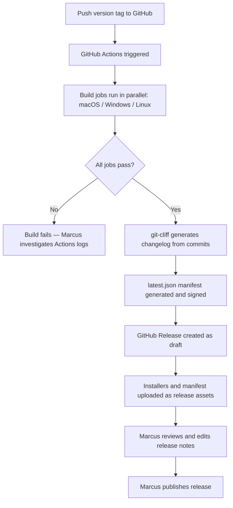
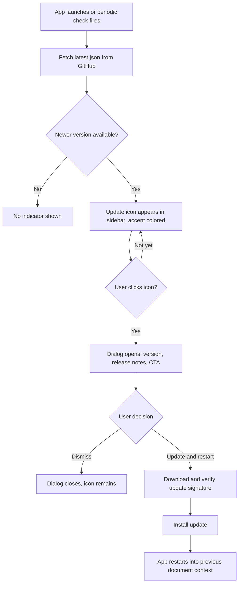
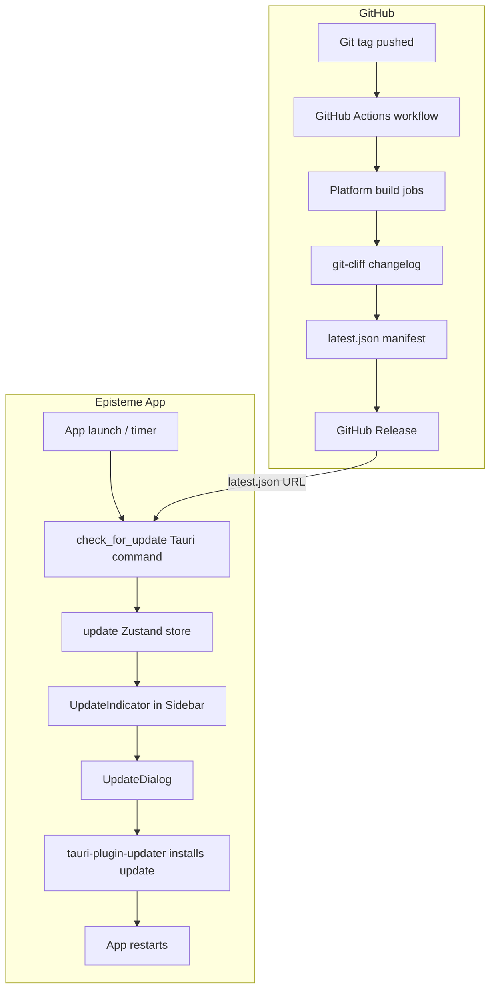
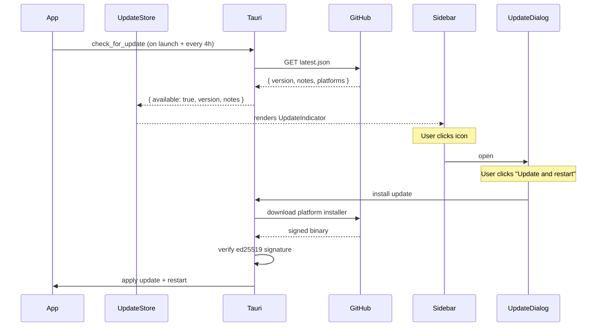
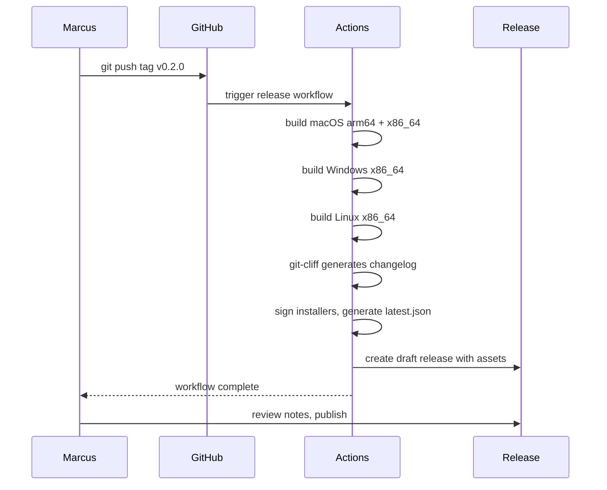

# Releases and auto-update

## What

Episteme ships as a native desktop application. This feature establishes a release pipeline that lets the maintainer publish versioned releases, and lets installed copies of the app detect and apply updates automatically.

When the maintainer is ready to ship a version, they tag a commit. An automated pipeline builds the application for all supported platforms, signs the update packages, and publishes a GitHub Release with downloadable installers and an update manifest. Users running Episteme see an in-app notification when a new version is available and can apply the update without leaving the app or visiting any website.

## Why

Right now, shipping a new version of Episteme means each user rebuilds from source. This creates a high barrier to staying current — most users won't bother, meaning bug fixes and improvements don't reach them. A formal release pipeline makes Episteme behave like a real application: releases are intentional, versioned events, and users stay up to date without any manual steps.

The auto-update capability is particularly important because Episteme is a tool people will integrate into their daily workflow. When it improves, they should benefit automatically. An in-app update flow removes the friction entirely — the app tells the user there's something new, the user approves, and it's done.

## Personas

- **Marcus: Maintainer** — tags versions, triggers the release pipeline, monitors build results
- **Any persona (Patricia, Eric, et al.)** — receives update notifications and applies updates from within the app

## Narratives

### Publishing a release

Marcus has been merging features to main over the past couple of weeks and decides it's time to cut a release. He bumps the version number in `tauri.conf.json` and `package.json` to `0.2.0`, commits the change, and pushes a tag: `git tag v0.2.0 && git push origin v0.2.0`. Within seconds, GitHub Actions picks up the tag and kicks off the build pipeline.

The pipeline runs three parallel jobs — one each for macOS (arm64 and x86_64), Windows, and Linux. Each job compiles the Rust backend, bundles the frontend, and produces a signed installer. Marcus watches the Actions run in GitHub; after about fifteen minutes, all jobs are green. In parallel, git-cliff scans the commits since the last tag and generates a structured changelog from the conventional commit messages — features, fixes, and breaking changes grouped automatically.

The pipeline generates a `latest.json` update manifest pointing to the new installers, then creates a GitHub Release named "v0.2.0" with all platform installers attached as assets, the manifest published as a release artifact, and the git-cliff changelog pre-populated as the release description. Marcus glances at the release notes, makes a small edit to highlight the most important change, and publishes the release. Users can now download installers directly from the release page, and any running copy of Episteme will discover the new version on its next update check.

### Receiving and applying an update

Patricia is mid-session on a Tuesday morning when an accent-colored update icon appears in the sidebar next to the folder name. She's in the middle of a document, so she ignores it for now. An hour later, at a natural stopping point, she clicks the icon. A dialog appears centered in the app showing the version number and the release notes — she can see that this release includes a fix for the editor behavior she'd found annoying.

Patricia clicks "Update and restart." Episteme downloads the new version in the background, verifies the update signature, and applies it. The app restarts and opens back to the document she was working on. The notification is gone, and she's now running 0.2.0 without having visited a website, run a command, or manually moved any files.

## User stories

**Publishing a release**

- Marcus can trigger a full multi-platform build by pushing a git tag
- Marcus can see build status for all platform jobs in GitHub Actions
- Marcus can find auto-generated release notes from git-cliff on the GitHub Release
- Marcus can edit release notes before publishing the release
- Marcus can share a GitHub Release page with users for manual downloads

**Receiving and applying an update**

- Patricia can see a notification when a new version is available
- Patricia can dismiss an update notification and act on it later
- Patricia can read release notes before deciding to update
- Patricia can apply an update with a single click from within the app
- Patricia can expect the app to reopen to her previous context after an update

## Goals

- A version tag push produces a complete GitHub Release with installers for all platforms within 30 minutes
- Running copies of the app check for updates on launch and periodically while running, and notify the user when one is available
- Users can apply an update entirely from within the app in under 2 minutes
- Release notes are auto-generated from commit history with no manual steps required beyond optional editing
- The update pipeline works without OS code signing (macOS users may need to re-approve after each update)

## Non-goals

- macOS notarization / Apple Developer Program enrollment (deferred)
- Windows Authenticode signing (deferred)
- Delta/incremental updates — each update is a full app replacement
- Forced or silent updates — users always choose when to apply

## Design spec

### User flows

**Flow 1: Publishing a release (Marcus)**



**Flow 2: Receiving and applying an update (Patricia)**



### Key UI components

#### Update indicator icon

- Appears right-aligned on the sidebar folder name row when an update is available; hidden otherwise
- Rendered in the accent color to distinguish it from surrounding monochrome icons
- Uses an "up arrow" or similar update-connoting icon (e.g. `ArrowUpCircle` from Lucide, which is already in the project)
- Tooltip on hover: "Version X.Y.Z available"
- Clicking opens the update dialog
- Acknowledged as a temporary placement — will move to sidebar header when sidebar redesign ships

#### Update dialog

- Centered in the app window regardless of trigger icon position
- Contains:
  - Version number ("Version 0.2.0 available")
  - Release notes — the git-cliff changelog rendered as markdown using the same renderer as the main document viewer, scrollable if long
  - "Update and restart" primary button
  - "Dismiss" secondary action (closes dialog; icon remains visible)
- Uses the existing Radix `Dialog` primitive (ADR-010)
- Standard design system surface styling — no custom chrome needed

## Tech spec

### System design and architecture

**High-level architecture**

This feature has two independent subsystems: a CI/CD pipeline that runs on GitHub, and an in-app updater that runs inside Episteme.



**Component breakdown**

| Component | Type | New / Modified |
|---|---|---|
| `.github/workflows/release.yml` | GitHub Actions workflow | New |
| `cliff.toml` | git-cliff config | New |
| `tauri-plugin-updater` | Rust dependency | New |
| `check_for_update` Tauri command | Rust | New |
| `src/stores/update.ts` | Zustand store | New |
| `src/components/UpdateIndicator.tsx` | React component | New |
| `src/components/UpdateDialog.tsx` | React component | New |
| `src/components/Sidebar.tsx` | React component | Modified — add indicator to folder header row |
| `src-tauri/lib.rs` | Rust | Modified — register plugin and command |
| `tauri.conf.json` | Config | Modified — add updater endpoint URL |

**Sequence diagrams**

*Update check and install:*



*Release pipeline:*



### Risks

**macOS update re-approval friction**

Without notarization, each update applied by the auto-updater will be quarantined by macOS Gatekeeper, requiring the user to right-click → Open on next launch. This is a known, accepted limitation per the non-goals. Mitigation: document clearly in release notes and README; revisit when/if Apple Developer Program enrollment happens.

**Build matrix complexity**

macOS cross-compilation (arm64 and x86_64 in one job) can be unreliable on GitHub Actions. Mitigation: use separate matrix jobs per target rather than cross-compiling, accepting slightly longer build times.

**Rust compile time in CI**

Cold Rust builds on GitHub Actions can take 20–40 minutes per platform. Mitigation: use `Swatinem/rust-cache` to cache the Cargo registry and build artifacts between runs; subsequent builds should complete within the 30-minute goal.

**ed25519 key loss**

If the private signing key is lost, no future updates can be delivered to existing installs — users would need to manually reinstall. Mitigation: store a backup of the private key securely outside GitHub (e.g., a password manager) at key generation time.

**Conventional commit discipline**

git-cliff produces useful changelogs only if commit messages follow conventional commit format. Poorly formatted messages produce empty or misleading release notes. Mitigation: document the convention in CONTRIBUTING.md; this is low-risk for a single-maintainer project.

### Alternatives considered

**Alternative updater: Squirrel (Electron-style)**

Squirrel is the update framework used by Electron apps. It was not considered seriously — Episteme is a Tauri app and `tauri-plugin-updater` is the native, first-party solution. Squirrel would require significant custom integration work with no meaningful benefit.

**Alternative manifest host: self-hosted update server**

Rather than hosting `latest.json` as a GitHub Release asset, a custom update server (e.g., a small Cloudflare Worker) could serve the manifest dynamically. This would enable features like staged rollouts or A/B update targeting. Rejected for now as unnecessary complexity — GitHub Releases is sufficient for the current distribution scale and requires no additional infrastructure.

**Alternative changelog tool: release-please**

release-please automates the full release cycle including version bump PRs. Rejected because it inverts the release workflow — it drives releases via merged PRs rather than manual tags, which conflicts with the chosen strategy of the maintainer controlling release timing. See ADR-011.

### Testing plan

**Unit tests**

- `update` Zustand store: test state transitions for `idle → checking → available`, `idle → checking → unavailable`, and `available → downloading → error`
- `UpdateIndicator`: renders when `available: true`, hidden when `available: false`
- `UpdateDialog`: renders version and notes correctly; "Dismiss" closes dialog; "Update and restart" calls `installUpdate`

**Integration tests**

The Tauri command layer (`check_for_update`) is not unit-testable in isolation without a running Tauri runtime. Manual verification against a test release is the practical approach here.

**E2E tests**

Full update flow E2E is not feasible in CI without a real signed release to update to. The UI states (indicator visible, dialog opens, dismiss works) can be tested by seeding the update store with mock data in Playwright tests.

**Pipeline verification**

The Actions workflow itself is verified by creating a test tag (`v0.0.1-test`) on a branch before the first real release, confirming all jobs pass, assets upload correctly, and the manifest is well-formed.

### Observability

**Logging**

All update lifecycle events logged via `tauri-plugin-log` at `Info` level:
- Update check initiated
- Update found: version X.Y.Z
- No update available
- Update download started
- Update download complete
- Update install initiated

Errors (network failure, signature mismatch, install failure) logged at `Error` level with the error message.

**Metrics**

No application-level metrics infrastructure exists yet. No metrics are collected for this feature.

**Alerting**

No alerting infrastructure exists yet. Build failures in GitHub Actions send email notifications to the repository owner by default — no additional configuration needed.

### Security, privacy, and compliance

**Update integrity**

All update packages are signed with a Tauri ed25519 keypair. The private key is stored as a GitHub Actions secret and never committed to the repository. The public key is embedded in `tauri.conf.json`. `tauri-plugin-updater` verifies the signature before installing any update — a tampered or unsigned package will be rejected.

**Secret management**

Two secrets are required in GitHub Actions:
- `TAURI_SIGNING_PRIVATE_KEY` — the ed25519 private key for signing update packages
- `TAURI_SIGNING_PRIVATE_KEY_PASSWORD` — the password protecting the private key (if set)

These are set once in the repository's GitHub Actions secrets and never appear in source code or logs.

**Data privacy**

The update check sends a GET request to GitHub's public release endpoint. No user data, device identifiers, or telemetry is transmitted. The only information exchanged is the app fetching a public JSON file.

**Input validation**

The `latest.json` manifest is consumed by `tauri-plugin-updater`, which validates the signature and version format. The `notes` field (release notes) is rendered via the existing `MarkdownRenderer` component, which already handles untrusted markdown safely.

### Detailed design

**Update store (`src/stores/update.ts`)**

```ts
interface UpdateState {
  available: boolean;
  version: string | null;
  notes: string | null;
  status: 'idle' | 'checking' | 'downloading' | 'error';
  error: string | null;
  checkForUpdate: () => Promise<void>;
  installUpdate: () => Promise<void>;
}
```

**Tauri command: `check_for_update`**

Called by the frontend on launch and every 4 hours via `setInterval`. Uses `tauri-plugin-updater` internally. Returns:

```ts
// Success — update available
{ available: true, version: "0.2.0", notes: "## What's new\n..." }

// Success — no update
{ available: false, version: null, notes: null }

// Error propagated to store.error
```

**`tauri.conf.json` updater config**

```json
"plugins": {
  "updater": {
    "endpoints": [
      "https://github.com/markdstafford/episteme/releases/latest/download/latest.json"
    ],
    "dialog": false,
    "pubkey": "<ed25519-public-key>"
  }
}
```

`dialog: false` disables Tauri's built-in update UI so the custom `UpdateDialog` is used instead.

**`latest.json` manifest format** (generated by the Actions workflow)

```json
{
  "version": "0.2.0",
  "notes": "## What's new\n...",
  "pub_date": "2026-03-13T00:00:00Z",
  "platforms": {
    "darwin-aarch64": { "url": "...", "signature": "..." },
    "darwin-x86_64":  { "url": "...", "signature": "..." },
    "linux-x86_64":   { "url": "...", "signature": "..." },
    "windows-x86_64": { "url": "...", "signature": "..." }
  }
}
```

**GitHub Actions workflow structure (`.github/workflows/release.yml`)**

- Trigger: `push` to tags matching `v*`
- Jobs: matrix across `[macos-latest, ubuntu-latest, windows-latest]`
- Each job: checkout → install Node deps → install Rust → **`Swatinem/rust-cache`** (cache Cargo registry and compiled deps) → `tauri build` → sign with ed25519 private key from GitHub Actions secret
- Post-build job: run git-cliff, generate `latest.json`, create GitHub Release as draft, upload all assets
- The release is created as a **draft** so Marcus can review notes before publishing

**`cliff.toml` configuration**

Conventional commit sections mapped to changelog headings:
- `feat` → "Features"
- `fix` → "Bug fixes"
- `chore`, `refactor`, `docs` → omitted from user-facing notes
- Breaking changes → "Breaking changes" (top of notes)

### Introduction and overview

**Prerequisites and assumptions**

- ADR-001: Tauri desktop framework — defines the app's native platform
- ADR-003: Zustand — update check state will be managed here
- ADR-010: Radix UI primitives — Dialog used for the update UI
- ADR-011: git-cliff — changelog generation in the release pipeline
- `tauri-plugin-updater` (Tauri v2 first-party plugin) is the update implementation; no meaningful alternative exists within the Tauri ecosystem
- GitHub Releases serves as both distribution endpoint and update manifest host — no separate server required
- The app is signed with Tauri's own ed25519 keypair but not OS-notarized (per non-goals)
- Version is maintained manually in both `tauri.conf.json` and `package.json` as part of the release commit

**Goals and objectives**

- Tag push → GitHub Release published within 30 minutes
- Update check completes in under 5 seconds on a reasonable connection
- Update applies and app restarts within 2 minutes of user confirmation

**Non-goals**

- Same as feature non-goals: no OS code signing, no delta updates, no forced or silent updates

**Glossary**

- **ed25519**: Tauri's own cryptographic signing for update packages — separate from and independent of OS code signing (Apple notarization, Windows Authenticode)
- **latest.json**: The update manifest file hosted as a GitHub Release asset, consumed by `tauri-plugin-updater` to discover available versions
- **tauri-plugin-updater**: First-party Tauri v2 plugin that handles update checking, download, signature verification, and installation

## Task list

- [ ] **Story: Signing key setup**
  - [ ] **Task: Generate ed25519 signing keypair**
    - **Description**: Run `npm run tauri signer generate` to produce the ed25519 keypair used to sign update packages. Save the private key and password to a secure location outside the repository (e.g., a password manager) before proceeding.
    - **Acceptance criteria**:
      - [ ] Keypair generated successfully
      - [ ] Private key and password stored securely outside the repository
      - [ ] Public key noted for use in `tauri.conf.json`
    - **Dependencies**: None
  - [ ] **Task: Store private key as GitHub Actions secrets**
    - **Description**: Add `TAURI_SIGNING_PRIVATE_KEY` and `TAURI_SIGNING_PRIVATE_KEY_PASSWORD` to the repository's GitHub Actions secrets (Settings → Secrets and variables → Actions).
    - **Acceptance criteria**:
      - [ ] `TAURI_SIGNING_PRIVATE_KEY` secret created in GitHub Actions
      - [ ] `TAURI_SIGNING_PRIVATE_KEY_PASSWORD` secret created in GitHub Actions
      - [ ] Neither value appears in any source file or commit
    - **Dependencies**: "Task: Generate ed25519 signing keypair"

- [ ] **Story: Tauri updater plugin**
  - [ ] **Task: Add tauri-plugin-updater dependency**
    - **Description**: Add `tauri-plugin-updater = "2"` to `src-tauri/Cargo.toml` dependencies and `@tauri-apps/plugin-updater` to `package.json` dependencies.
    - **Acceptance criteria**:
      - [ ] `tauri-plugin-updater` added to `Cargo.toml`
      - [ ] `@tauri-apps/plugin-updater` added to `package.json`
      - [ ] `cargo build` succeeds
      - [ ] `npm install` succeeds
    - **Dependencies**: None
  - [ ] **Task: Configure tauri.conf.json updater settings**
    - **Description**: Add the `plugins.updater` block to `tauri.conf.json` with the `latest.json` endpoint URL, `dialog: false`, and the ed25519 public key.
    - **Acceptance criteria**:
      - [ ] `plugins.updater.endpoints` set to `["https://github.com/markdstafford/episteme/releases/latest/download/latest.json"]`
      - [ ] `plugins.updater.dialog` set to `false`
      - [ ] `plugins.updater.pubkey` set to the generated public key
      - [ ] `tauri build` succeeds with the updated config
    - **Dependencies**: "Task: Generate ed25519 signing keypair", "Task: Add tauri-plugin-updater dependency"
  - [ ] **Task: Implement check_for_update Tauri command**
    - **Description**: Create `src-tauri/src/commands/updater.rs` with a `check_for_update` command that uses `tauri-plugin-updater` to check the manifest endpoint. Returns `{ available, version, notes }`. Register the command in `commands/mod.rs` and the invoke handler in `lib.rs`. Log all update lifecycle events via `tauri-plugin-log`.
    - **Acceptance criteria**:
      - [ ] `check_for_update` command returns `{ available: false, version: null, notes: null }` when no update is available
      - [ ] `check_for_update` command returns `{ available: true, version, notes }` when an update is available
      - [ ] Command registered in `lib.rs` invoke handler
      - [ ] Update check initiated, found, and not-found events logged at `Info` level
      - [ ] Network errors logged at `Error` level and returned as Err
      - [ ] `cargo build` succeeds
    - **Dependencies**: "Task: Configure tauri.conf.json updater settings"
  - [ ] **Task: Implement install_update Tauri command**
    - **Description**: Create an `install_update` command in `src-tauri/src/commands/updater.rs` that triggers the download and installation of the pending update using `tauri-plugin-updater`. Logs download started, download complete, and install initiated events. Register in `lib.rs`.
    - **Acceptance criteria**:
      - [ ] `install_update` command triggers download and installation
      - [ ] Download started, download complete, install initiated events logged at `Info` level
      - [ ] Errors logged at `Error` level
      - [ ] Command registered in `lib.rs` invoke handler
      - [ ] `cargo build` succeeds
    - **Dependencies**: "Task: Implement check_for_update Tauri command"

- [ ] **Story: Update state management**
  - [ ] **Task: Create update Zustand store**
    - **Description**: Create `src/stores/update.ts` implementing the `UpdateState` interface from the tech spec: `{ available, version, notes, status, error, checkForUpdate(), installUpdate() }`. `checkForUpdate` calls the `check_for_update` Tauri command and updates store state. `installUpdate` calls the `install_update` Tauri command. Status transitions: `idle → checking → available/idle`, `available → downloading → error`.
    - **Acceptance criteria**:
      - [ ] Store shape matches the `UpdateState` interface in the tech spec
      - [ ] `checkForUpdate()` sets `status: 'checking'`, then updates `available`, `version`, `notes` on success
      - [ ] `checkForUpdate()` sets `status: 'error'` and `error` message on failure
      - [ ] `installUpdate()` sets `status: 'downloading'` while installing
      - [ ] Unit tests cover all state transitions (see testing story)
    - **Dependencies**: "Task: Implement check_for_update Tauri command", "Task: Implement install_update Tauri command"

- [ ] **Story: Update UI components**
  - [ ] **Task: Create UpdateIndicator component**
    - **Description**: Create `src/components/UpdateIndicator.tsx`. Renders an `ArrowUpCircle` Lucide icon in the accent color when `update.available` is true; renders nothing otherwise. Shows a tooltip "Version X.Y.Z available" on hover. Clicking opens the `UpdateDialog`.
    - **Acceptance criteria**:
      - [ ] Component renders the icon when `available: true`
      - [ ] Component renders nothing when `available: false`
      - [ ] Icon uses accent color token
      - [ ] Tooltip shows correct version string on hover
      - [ ] Clicking the icon opens `UpdateDialog`
      - [ ] Unit tests pass (see testing story)
    - **Dependencies**: "Task: Create update Zustand store"
  - [ ] **Task: Create UpdateDialog component**
    - **Description**: Create `src/components/UpdateDialog.tsx` using the existing Radix `Dialog` primitive. Dialog is centered in the window. Contains: version heading ("Version X.Y.Z available"), release notes rendered via the existing `MarkdownRenderer` component in a scrollable container, a primary "Update and restart" button that calls `installUpdate()`, and a "Dismiss" secondary action that closes the dialog. Dialog remains dismissible (icon stays visible after dismiss).
    - **Acceptance criteria**:
      - [ ] Dialog is centered in the app window
      - [ ] Version number displayed correctly
      - [ ] Release notes rendered via `MarkdownRenderer`
      - [ ] Release notes container is scrollable when content is long
      - [ ] "Update and restart" calls `installUpdate()` from the update store
      - [ ] "Dismiss" closes the dialog without changing `available` state
      - [ ] Unit tests pass (see testing story)
    - **Dependencies**: "Task: Create UpdateIndicator component"
  - [ ] **Task: Add UpdateIndicator to Sidebar folder header row**
    - **Description**: Modify `src/components/Sidebar.tsx` to render `<UpdateIndicator />` right-aligned in the folder header row (the div at line ~27 that already uses `flex items-center justify-between`). The indicator should only render when a folder is open (inside the `folderName &&` block).
    - **Acceptance criteria**:
      - [ ] `UpdateIndicator` renders right-aligned in the folder header row when a folder is open
      - [ ] `UpdateIndicator` does not render when no folder is open
      - [ ] Existing folder header layout and click behavior unchanged
      - [ ] Sidebar unit tests still pass
    - **Dependencies**: "Task: Create UpdateIndicator component"

- [ ] **Story: App wiring**
  - [ ] **Task: Wire update checks in App.tsx**
    - **Description**: In `src/App.tsx`, call `checkForUpdate()` from the update store on app mount. Set up a `setInterval` to call `checkForUpdate()` every 4 hours (14,400,000ms). Clear the interval on unmount.
    - **Acceptance criteria**:
      - [ ] `checkForUpdate()` called once on app mount
      - [ ] `checkForUpdate()` called every 4 hours while the app is running
      - [ ] Interval cleared on component unmount
      - [ ] No duplicate intervals if App re-renders
    - **Dependencies**: "Task: Create update Zustand store", "Task: Add UpdateIndicator to Sidebar folder header row"

- [ ] **Story: GitHub Actions release pipeline**
  - [ ] **Task: Create cliff.toml**
    - **Description**: Create `cliff.toml` at the repository root. Configure conventional commit sections: `feat` → "Features", `fix` → "Bug fixes", breaking changes → "Breaking changes" (pinned to top). Omit `chore`, `refactor`, `docs`, `test` from user-facing output.
    - **Acceptance criteria**:
      - [ ] `cliff.toml` present at repository root
      - [ ] Running `git-cliff` locally produces a changelog with correct section headings
      - [ ] `feat` commits appear under "Features"
      - [ ] `fix` commits appear under "Bug fixes"
      - [ ] `chore`/`refactor`/`docs` commits do not appear in output
    - **Dependencies**: None
  - [ ] **Task: Create release.yml GitHub Actions workflow**
    - **Description**: Create `.github/workflows/release.yml`. Trigger on `push` to tags matching `v*`. Matrix jobs across `macos-latest` (targets: `aarch64-apple-darwin` and `x86_64-apple-darwin`), `ubuntu-latest`, and `windows-latest`. Each job: checkout → setup Node → setup Rust → `Swatinem/rust-cache` → `tauri-apps/tauri-action` to build and sign. Post-build job: run git-cliff to generate changelog, generate `latest.json` manifest, use `softprops/action-gh-release` to create a draft GitHub Release with all platform installers and `latest.json` as assets and the git-cliff output as the release body.
    - **Acceptance criteria**:
      - [ ] Workflow triggers on `v*` tags
      - [ ] All four platform targets build successfully
      - [ ] `Swatinem/rust-cache` step present in each build job
      - [ ] Installers signed with `TAURI_SIGNING_PRIVATE_KEY` secret
      - [ ] `latest.json` generated with correct platform URLs and signatures
      - [ ] GitHub Release created as draft with all assets attached
      - [ ] Release body populated with git-cliff changelog
    - **Dependencies**: "Task: Create cliff.toml", "Task: Store private key as GitHub Actions secrets", "Task: Configure tauri.conf.json updater settings"
  - [ ] **Task: Verify pipeline with test tag**
    - **Description**: Push a test tag (`v0.0.1-test`) on the feature branch to trigger the workflow and verify end-to-end that all jobs pass, assets upload correctly, `latest.json` is well-formed, and the draft release is created. Delete the test tag and draft release after verification.
    - **Acceptance criteria**:
      - [ ] All platform build jobs pass in GitHub Actions
      - [ ] Draft GitHub Release created with four platform installers attached
      - [ ] `latest.json` attached and contains valid JSON with correct platform keys
      - [ ] Test tag and draft release deleted after verification
    - **Dependencies**: "Task: Create release.yml GitHub Actions workflow"

- [ ] **Story: Tests**
  - [ ] **Task: Unit tests for update store**
    - **Description**: Create `tests/unit/stores/update.test.ts`. Test all state transitions: `idle → checking → available`, `idle → checking → idle` (no update), `available → downloading → error`. Mock the Tauri `invoke` calls.
    - **Acceptance criteria**:
      - [ ] `idle → checking → available` transition tested
      - [ ] `idle → checking → idle` (no update available) transition tested
      - [ ] `available → downloading → error` transition tested
      - [ ] Tauri `invoke` mocked — no real IPC calls in tests
      - [ ] All tests pass
    - **Dependencies**: "Task: Create update Zustand store"
  - [ ] **Task: Unit tests for UpdateIndicator**
    - **Description**: Create `tests/unit/components/UpdateIndicator.test.tsx`. Test that the icon renders when `available: true` and renders nothing when `available: false`. Test that clicking the icon opens `UpdateDialog`.
    - **Acceptance criteria**:
      - [ ] Icon renders when store has `available: true`
      - [ ] Nothing renders when store has `available: false`
      - [ ] Clicking icon opens dialog
      - [ ] All tests pass
    - **Dependencies**: "Task: Create UpdateIndicator component"
  - [ ] **Task: Unit tests for UpdateDialog**
    - **Description**: Create `tests/unit/components/UpdateDialog.test.tsx`. Test that the dialog renders version and notes correctly. Test that "Dismiss" closes the dialog. Test that "Update and restart" calls `installUpdate()`.
    - **Acceptance criteria**:
      - [ ] Version string displayed correctly
      - [ ] Release notes rendered in dialog body
      - [ ] "Dismiss" closes dialog without changing store state
      - [ ] "Update and restart" calls `installUpdate()`
      - [ ] All tests pass
    - **Dependencies**: "Task: Create UpdateDialog component"
  - [ ] **Task: E2E tests for update UI**
    - **Description**: Add a Playwright test that seeds the update store with mock data (`available: true, version: "0.2.0", notes: "## Features\n- Test"`) and verifies: the `UpdateIndicator` icon is visible in the sidebar, clicking it opens the dialog, the dialog shows version and notes, and the dismiss button closes it.
    - **Acceptance criteria**:
      - [ ] Update indicator visible when store seeded with update data
      - [ ] Dialog opens on indicator click
      - [ ] Dialog shows correct version and notes
      - [ ] Dismiss closes dialog
      - [ ] All tests pass
    - **Dependencies**: "Task: Add UpdateIndicator to Sidebar folder header row", "Task: Create UpdateDialog component"

- [ ] **Story: Documentation**
  - [ ] **Task: Add conventional commits guidance to CONTRIBUTING.md**
    - **Description**: Create or update `CONTRIBUTING.md` at the repository root with a section on conventional commit format. Cover the prefixes used in this project (`feat`, `fix`, `chore`, `refactor`, `docs`, `test`), explain that `feat` and `fix` appear in release notes, and give examples of well-formed commit messages.
    - **Acceptance criteria**:
      - [ ] `CONTRIBUTING.md` exists at repository root
      - [ ] Conventional commit format documented with examples
      - [ ] `feat` and `fix` identified as user-facing prefixes
      - [ ] At least three example commit messages provided
    - **Dependencies**: None
