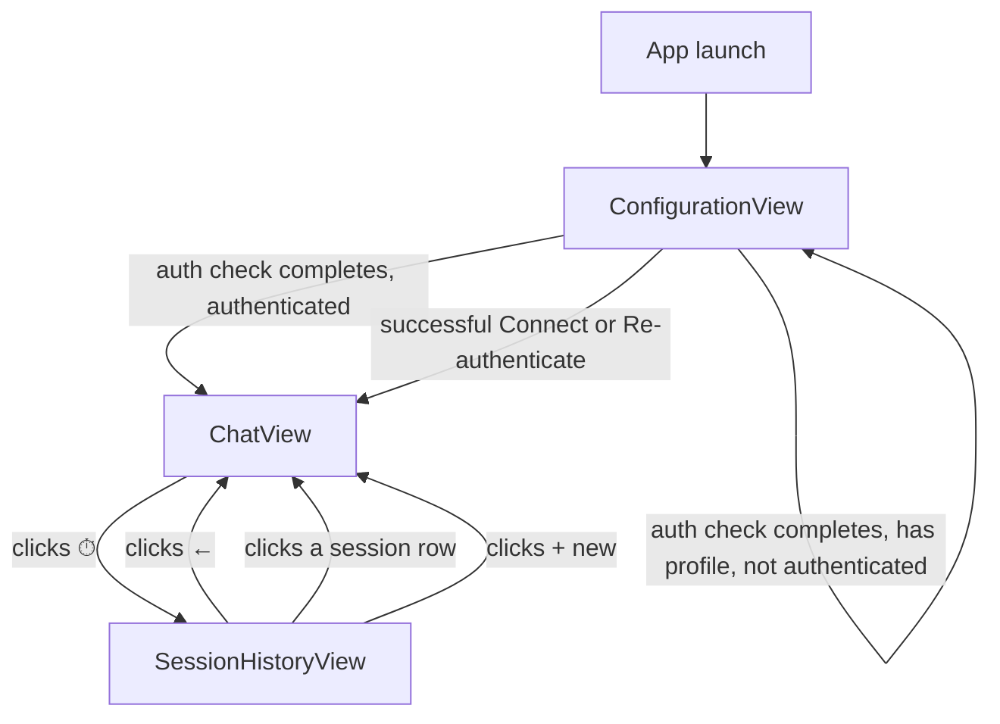

# Enhancement: AI chat panel states

## Parent feature

`feature-ai-chat-assistant.md` — the AI chat panel this redesign restructures

## What

The AI chat panel gains three formally defined views — configuration, chat, and session history — each a self-contained component owning its own header and content area. `AiChatPanel` becomes a thin router that slots in the appropriate view. This replaces the current organic conditional rendering with an explicit, consistent model.

## Why

The panel's current states evolved alongside individual features rather than being designed together. The header and content area behave differently depending on which feature last touched them, making the panel feel inconsistent and making future changes harder to reason about. Formalizing the three states gives each a clear owner for header and content, makes transitions explicit, and creates a stable foundation for features that build on the panel.

## User stories

- Eric sees a consistent header and content area regardless of which panel view he's in
- Patricia is taken directly to the configuration view when AI has never been set up or credentials have expired
- Raquel can use the history and new session actions from the chat view header without navigating away

## Design changes

### User flow



The configuration view handles all three sub-cases: loading (auth in progress), first-time setup (no profile), and credential error (has profile, not authenticated). It resolves to chat view on successful auth.

### Key UI components

#### ConfigurationView

Self-contained component owning its own header and content. Header: "AI settings" title, no action buttons. Content: loading spinner (while auth check is in progress), first-time setup form (no profile), or credential error + re-authenticate prompt (has profile, not authenticated).

#### ChatView

New self-contained component extracted from `AiChatPanel`. Header: session name left-aligned (fallback "AI assistant"), Clock (⏱) then Plus (+) right-aligned — Plus replaces the current RotateCcw for new session. Content: messages pane and chat input card (unchanged).

#### SessionHistoryView

No change — already self-contained with its own header and content (issue #89).

#### AiChatPanel (delta)

Reduced to a thin router. Derives the active view from auth state and the `view` local variable, then renders the appropriate view component into the full panel slot.

## Technical changes

### Affected files

- `src/components/AiChatPanel.tsx` — reduced to a thin router; chat and configuration logic extracted into new components
- `src/components/ChatView.tsx` — new; chat header + messages pane + input card extracted from `AiChatPanel`
- `src/components/ConfigurationView.tsx` — new; configuration header + loading/setup/credential-error content
- `tests/unit/components/AiChatPanel.test.tsx` — update to reflect new routing structure
- `tests/unit/components/ChatView.test.tsx` — new; covers chat view header and content states
- `tests/unit/components/ConfigurationView.test.tsx` — new; covers all configuration sub-cases

### Changes

#### Introduction and overview

**Prerequisites:**
- ADR-001 (Tauri), ADR-003 (Zustand), ADR-004 (Tailwind), ADR-010 (Radix UI) — inherited from parent feature
- `feature-ai-chat-assistant.md` — `AiChatPanel` and `useAiChatStore` patterns established
- `feature-ai-chat-sessions.md` — `currentSession`, `sessions`, `view` local state in `AiChatPanel`

**Goals:**
- The panel header always reflects the active view — no chat-view action buttons visible during the configuration view
- Configuration view renders from app launch with no flash of the chat header before auth check completes
- No new Tauri commands, store actions, or data model changes required

**Non-goals:**
- Session history view design or implementation (issue #89)
- Any changes to auth logic or store state
- Visual redesign beyond the header and icon swap

**Glossary:**
- **panel view** — the top-level rendering mode of `AiChatPanel`: `configuration`, `chat`, or `history`; configuration is derived from auth state (`authChecked`, `isAuthenticated`); chat/history are selected via the `view` local state variable

#### System design and architecture

**Component breakdown — what changes:**

- **`AiChatPanel`** — shrinks to a router. Derives the active view: `isConfigurationView = !authChecked || !isAuthenticated`. Renders `ConfigurationView`, `ChatView`, or `SessionHistoryView` into the full panel slot. Owns no header or content of its own.
- **`ConfigurationView`** (new) — owns the "AI settings" header and all configuration content sub-cases. Accesses store directly (same pattern as existing components).
- **`ChatView`** (new) — owns the chat header (session name, Clock, Plus) and all chat content. Extracted directly from `AiChatPanel`'s existing `renderBody()` and header block. Plus replaces RotateCcw.
- **`SessionHistoryView`** — unchanged.

**Panel view derivation (in `AiChatPanel`):**

```
isConfigurationView = !authChecked || !isAuthenticated

if (isConfigurationView) → <ConfigurationView />
else if (view === "history") → <SessionHistoryView />
else → <ChatView />
```

#### Detailed design

**Component contracts:**

`ConfigurationView` — accesses `useAiChatStore` directly (no props needed beyond what the store provides). Manages its own `profileInput` local state.

`ChatView` — accesses `useAiChatStore` and `useFileTreeStore` directly. Receives `onShowHistory: () => void` and `onNewSession: () => void` as props (callbacks to trigger view transitions in `AiChatPanel`).

`AiChatPanel` — holds `view: "chat" | "history"` local state. Passes `onShowHistory={() => setView("history")}` and `onNewSession={() => { newSession(); setView("chat"); }}` to `ChatView`. Passes existing session/scope/callbacks to `SessionHistoryView` unchanged.

**Behavioral note — view reset on auth loss:** When `isConfigurationView` becomes true (credentials expire mid-session), `view` local state may still be `"history"`. This is harmless — `isConfigurationView` takes precedence in the routing condition. On re-authentication, the panel returns to `ChatView` regardless of `view` value. No explicit reset needed.

#### Security, privacy, and compliance

No new attack surface. `ConfigurationView` and `ChatView` access the same store and make the same Tauri calls as the current `AiChatPanel`. No new inputs, endpoints, or data flows.

#### Observability

No new logging needed. Existing log events in the store are unchanged.

#### Testing plan

**Unit tests (Vitest):**

- `ConfigurationView.test.tsx` (new):
  - Renders loading spinner when `!authChecked`
  - Renders first-time setup form when `!isAuthenticated && !awsProfile`
  - Renders re-authenticate prompt when `!isAuthenticated && awsProfile`
  - Successful connect transitions to authenticated state
  - Header always shows "AI settings" with no action buttons

- `ChatView.test.tsx` (new):
  - Header shows session name when set, "AI assistant" fallback when not
  - Clock button calls `onShowHistory`
  - Plus button calls `onNewSession`
  - Existing message/streaming/empty-state tests migrated from `AiChatPanel.test.tsx`

- `AiChatPanel.test.tsx` (update):
  - Renders `ConfigurationView` when not authenticated
  - Renders `ChatView` when authenticated and `view === "chat"`
  - Renders `SessionHistoryView` when `view === "history"`
  - `ConfigurationView` takes precedence when credentials expire while `view === "history"`

#### Alternatives considered

**Conditional header in `AiChatPanel` rather than extracting view components:** Keeps fewer files but perpetuates the inconsistency — `SessionHistoryView` already owns its header, so configuration and chat would remain special cases. The slot approach is more consistent and easier to extend.

#### Risks

No significant risks. This is a pure component restructuring with no logic changes — auth flows, store actions, and Tauri commands are untouched. The main risk is test coverage gaps during the migration; mitigated by moving existing `AiChatPanel` tests to the new component test files rather than rewriting them.

## Task list

- [x] **Story: `ConfigurationView` component**
  - [x] **Task: Implement `ConfigurationView`**
    - **Description**: Create `src/components/ConfigurationView.tsx`. Access `useAiChatStore` directly. Manage `profileInput` local state. Render header with "AI settings" title and no action buttons. Render content based on auth state: loading spinner when `!authChecked`; first-time setup form (profile text input + Connect button) when `!isAuthenticated && !awsProfile`; re-authenticate prompt (Re-authenticate button + Change profile link) when `!isAuthenticated && awsProfile`. Error message below buttons when `error` is set. Logic and markup extracted from the corresponding blocks in the current `AiChatPanel.renderBody()`.
    - **Acceptance criteria**:
      - [x] Header renders "AI settings" title with no action buttons in all sub-cases
      - [x] Loading spinner renders when `!authChecked`
      - [x] First-time setup form renders when `!isAuthenticated && !awsProfile`
      - [x] Re-authenticate prompt renders when `!isAuthenticated && awsProfile`
      - [x] Connect action calls `setAwsProfile` then `login`
      - [x] Re-authenticate action calls `login`
      - [x] Change profile link resets `awsProfile` to null
      - [x] Error message renders when `error` is set
      - [x] TypeScript compiles with no errors
    - **Dependencies**: None
  - [x] **Task: Write unit tests for `ConfigurationView`**
    - **Description**: Create `tests/unit/components/ConfigurationView.test.tsx`. Cover all rendering sub-cases and interactions described in the testing plan.
    - **Acceptance criteria**:
      - [x] Renders loading spinner when `!authChecked`
      - [x] Renders first-time setup form when `!isAuthenticated && !awsProfile`
      - [x] Renders re-authenticate prompt when `!isAuthenticated && awsProfile`
      - [x] Header shows "AI settings" with no action buttons in all sub-cases
      - [x] All tests pass
    - **Dependencies**: "Task: Implement `ConfigurationView`"

- [x] **Story: `ChatView` component**
  - [x] **Task: Implement `ChatView`**
    - **Description**: Create `src/components/ChatView.tsx`. Access `useAiChatStore` and `useFileTreeStore` directly. Receive `onShowHistory: () => void` and `onNewSession: () => void` as props. Render header with session name left-aligned (fallback "AI assistant"), Clock icon button calling `onShowHistory`, and Plus icon button calling `onNewSession` — replacing the current RotateCcw. Render content using the existing `renderBody()` logic (empty state, messages, streaming) and `ChatInputCard`, extracted from `AiChatPanel`. Manage `input` local state and `messagesEndRef`/`panelRef` refs internally.
    - **Acceptance criteria**:
      - [x] Header shows session name when `currentSession.name` is set, "AI assistant" otherwise
      - [x] Clock button calls `onShowHistory`
      - [x] Plus button calls `onNewSession`
      - [x] Plus icon used (not RotateCcw)
      - [x] Empty state with suggested prompts renders when authenticated with no messages
      - [x] Message list and streaming content render correctly
      - [x] `ChatInputCard` renders and sends messages
      - [x] Messages pane auto-scrolls to bottom on new messages/tokens
      - [x] TypeScript compiles with no errors
    - **Dependencies**: None
  - [x] **Task: Write unit tests for `ChatView`**
    - **Description**: Create `tests/unit/components/ChatView.test.tsx`. Migrate applicable existing tests from `AiChatPanel.test.tsx` and cover the new header behavior.
    - **Acceptance criteria**:
      - [x] Header shows "AI assistant" fallback when session name is empty
      - [x] Header shows session name when set
      - [x] Clock button calls `onShowHistory`
      - [x] Plus button calls `onNewSession`
      - [x] Empty state renders with suggested prompts
      - [x] Message list renders correctly
      - [x] All tests pass
    - **Dependencies**: "Task: Implement `ChatView`"

- [x] **Story: `AiChatPanel` refactor**
  - [x] **Task: Reduce `AiChatPanel` to thin router**
    - **Description**: Refactor `src/components/AiChatPanel.tsx` to a thin router. Remove all header and content rendering. Keep `view: "chat" | "history"` local state. Derive `isConfigurationView = !authChecked || !isAuthenticated` from the store. Route: `isConfigurationView` → `<ConfigurationView />`; `view === "history"` → `<SessionHistoryView .../>` (props unchanged); otherwise → `<ChatView onShowHistory={() => setView("history")} onNewSession={() => { newSession(); setView("chat"); }} />`. Remove all imports that are now owned by `ConfigurationView` or `ChatView`.
    - **Acceptance criteria**:
      - [x] `AiChatPanel` renders `ConfigurationView` when `!authChecked || !isAuthenticated`
      - [x] `AiChatPanel` renders `SessionHistoryView` when `view === "history"` and authenticated
      - [x] `AiChatPanel` renders `ChatView` when authenticated and `view === "chat"`
      - [x] `ConfigurationView` takes precedence when `isConfigurationView` is true regardless of `view` value
      - [x] No header or content rendering remains in `AiChatPanel` itself
      - [x] `SessionHistoryView` props unchanged
      - [x] TypeScript compiles with no errors
      - [x] App runs and all three views are reachable
    - **Dependencies**: "Task: Implement `ConfigurationView`", "Task: Implement `ChatView`"
  - [x] **Task: Update `AiChatPanel` unit tests**
    - **Description**: Update `tests/unit/components/AiChatPanel.test.tsx` to reflect the new routing structure. Remove tests now covered by `ConfigurationView.test.tsx` and `ChatView.test.tsx`. Add routing-level tests.
    - **Acceptance criteria**:
      - [x] Renders `ConfigurationView` when not authenticated
      - [x] Renders `ChatView` when authenticated and `view === "chat"`
      - [x] Renders `SessionHistoryView` when authenticated and `view === "history"`
      - [x] `ConfigurationView` takes precedence when credentials expire while `view === "history"`
      - [x] No duplicate tests from component-level test files
      - [x] All tests pass
    - **Dependencies**: "Task: Reduce `AiChatPanel` to thin router"
