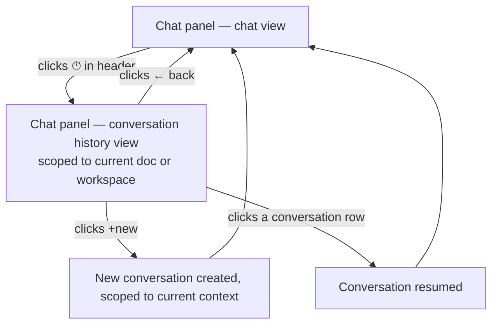
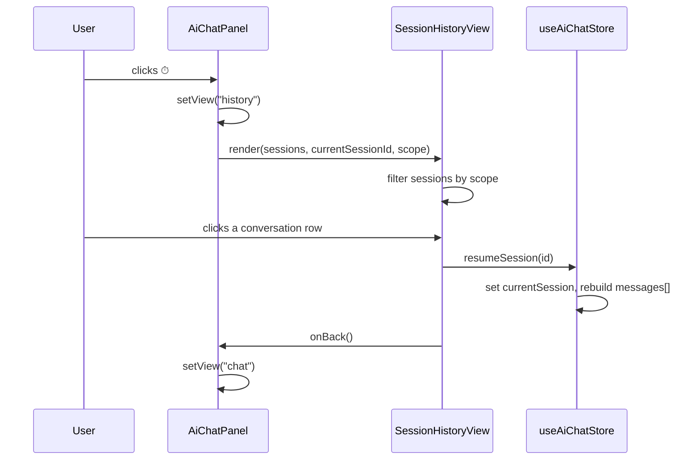
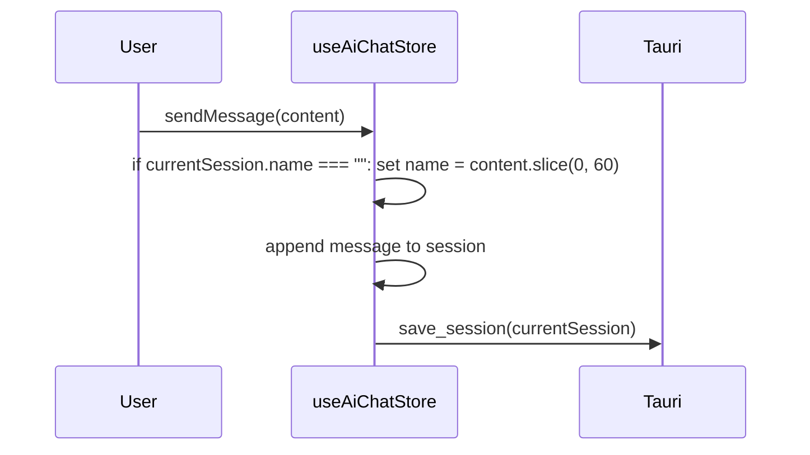

# Enhancement: AI chat session history

## Parent features

- `feature-ai-chat-assistant.md` — the chat panel this history view extends
- `feature-ai-chat-sessions.md` — the session persistence layer this UI builds on top of

## What

The AI chat assistant gains persistent session history. Each conversation is saved as a session on disk and associated with a scope — either a specific document (when a file is open in the document viewer) or the workspace (when no file is open). A history view (accessed via a clock icon in the panel header) lists sessions scoped to the current context — the active document's sessions when a file is open, workspace sessions otherwise — sorted newest-first, showing the last-active mode, a relative timestamp, and the first user message as a preview. Users can resume any listed session, start a new one, or navigate back to the current session without losing it.

## Why

Without session persistence, every app restart wipes the conversation. Users lose context they've built up — questions asked, summaries generated, threads they were in the middle of — and have to start over. For Patricia drafting a document over multiple sessions, or Eric returning to a review the next day, this is a real interruption. Persistent sessions make the AI assistant a reliable collaborator across the full document lifecycle, not just a single sitting. The 90-day pruning keeps storage bounded without requiring users to manage their history manually.

## User stories

- Eric can open a conversation history view from the chat panel header to browse all past conversations
- Eric can resume a past conversation and pick up where he left off with full message history restored
- Patricia can start a new conversation directly from the history view
- Raquel can see the name, mode, and relative timestamp for each conversation at a glance
- Eric can navigate back to his active conversation from the history view without losing it

## Design changes

### User flow



### Panel states

The chat panel header and content area are both owned by the current view state. Switching to history view replaces the entire panel content including the header — it does not layer on top of the chat view.

**Chat view header**: "AI assistant" title (or conversation name once first message is sent), RotateCcw (new conversation) button, ⏱ (history) button.

**History view header**: "Conversation history" title, ← back button (left), + new conversation button (right). No ⏱ button.

### Key UI components

#### Session history header bar

Replaces the standard chat panel header when in history view. Left: `←` back button (`ArrowLeft` icon). Center-left: "Conversation history" title. Right: `+` new conversation button. No ⏱ icon — it only appears in the chat view header.

#### Conversation list

Scrollable list filling the content area, sorted newest-first. Each row is a clickable item showing:

- **Conversation name** (prominent) — auto-populated from the first user message at session creation; will be editable in a future issue (#95)
- **Mode badge** — `last_mode` value (e.g. "view", "edit")
- **Relative timestamp** — "Today, 2:14pm" for today, "Yesterday" for yesterday, date otherwise

The active (current) conversation is indicated by a vertical accent-colored bar on the left edge of its row — styled like a blockquote left border.

**Empty state** — shown when no conversations exist for the current scope: "No conversations yet" with a "Start a conversation" CTA button that navigates back to the chat view.

#### Interactive state header (delta from parent feature)

The header title changes from the static "AI assistant" label to the current conversation's name once a name is set (i.e. once the first message is sent).

## Technical changes

### Affected files

- `src-tauri/src/session.rs` — add `SessionScope` enum and `scope`/`name` fields to `Session`
- `src/lib/session.ts` — mirror Rust changes; update `newSession()` signature to accept `scope`
- `src/stores/aiChat.ts` — update `newSession` action to derive scope; add `resumeSession` action; auto-populate name on first message
- `src/components/AiChatPanel.tsx` — add `view` state; swap header + content when in history view; show session name in chat view header
- `src/components/SessionHistoryView.tsx` — new presentational component
- `tests/unit/components/SessionHistoryView.test.tsx` — new test file

### Changes

#### Introduction and overview

**Prerequisites:**
- ADR-001 (Tauri), ADR-003 (Zustand), ADR-004 (Tailwind) — inherited from parent features
- `feature-ai-chat-sessions.md` — `Session` type, `save_session`/`load_sessions` commands, and store actions all implemented
- `feature-ai-chat-assistant.md` — `AiChatPanel` and `useAiChatStore` patterns established

**Technical goals:**
- History view renders immediately — data is already in store, no async required
- Scope filtering is correct: document sessions match on exact path; workspace sessions match when no file is selected
- Session name is set on first message send with no additional Tauri round-trip

**Non-goals:**
- New Tauri commands — `save_session` persists `name` and `scope` automatically
- AI-generated or editable session names (issue #95)
- Viewing sessions outside the current scope (issue #94)
- Panel state redesign (issue #94)

**Glossary:**
- **scope** — `SessionScope` discriminated union set at session creation; `{ type: "document", path: string }` or `{ type: "workspace" }`; never mutated
- **name** — short string on `Session`; empty until first message is sent, then auto-populated from message content

#### System design and architecture

**Component breakdown — what changes:**

- **`session.rs` + `session.ts`** — add `SessionScope` and `name` to `Session`
- **`session.ts`** — update `newSession()` to accept `scope`; name initialises as `""`
- **`useAiChatStore`** — update `newSession` to derive scope from `selectedFilePath`; update `sendMessage` to auto-populate name on first message; add `resumeSession(id)`
- **`AiChatPanel.tsx`** — add `view: "chat" | "history"` local state; replace header + content when in history view; show session name in chat view header once set
- **`SessionHistoryView.tsx`** (new) — presentational; receives sessions, current session id, scope, and callbacks; handles filtering, formatting, and empty state

**Scope immutability.** A session's scope is set when `newSession()` is called and never mutated. Known edge case: authoring mode — if a conversation starts before a document exists, the session is workspace-scoped even though it closely relates to the document created by the AI. These sessions appear under workspace scope in the history view. Acceptable for now; a future enhancement could offer re-scoping after document creation.

**Sequence — opening and resuming from history:**



**Sequence — first message auto-names the session:**



#### Detailed design

##### Data model changes

**Rust** (`src-tauri/src/session.rs`):
```rust
#[derive(Serialize, Deserialize, Clone, Debug)]
#[serde(tag = "type", rename_all = "snake_case")]
pub enum SessionScope {
    Document { path: String },
    Workspace,
}

// Added to Session:
pub name: String,         // "" until first message sent
pub scope: SessionScope,  // set at creation; never mutated
```

**TypeScript** (`src/lib/session.ts`):
```typescript
export type SessionScope =
  | { type: "document"; path: string }
  | { type: "workspace" };

// Added to Session interface:
name: string;        // "" until first message sent
scope: SessionScope; // set at creation; never mutated

// newSession() signature change:
export function newSession(lastMode: string, scope: SessionScope): Session
```

No migration needed — existing sessions on disk without `name`/`scope` will fail to deserialize and be silently dropped on first load, consistent with existing error handling in `load_sessions`.

##### Key algorithms

**Scope derivation** — called in the store's `newSession` action:
```
selectedFilePath = useFileTreeStore.getState().selectedFilePath
scope = selectedFilePath != null
  ? { type: "document", path: selectedFilePath }
  : { type: "workspace" }
```

**Session name auto-population** — in `sendMessage`, before appending to session:
```
if currentSession.name === "":
  name = content.length > 60 ? content.slice(0, 60) + "…" : content
  update currentSession with new name
```

**`resumeSession(id)`** — new store action:
```
session = sessions.find(s => s.id === id)
if not found: return (no-op)
messages = session.messages_all.map(m =>
  textBlock = m.content.find(b => b.type === "text")
  { role: m.role, content: textBlock?.text ?? "" }
)
set { currentSession: session, messages, isStreaming: false, streamingContent: "", error: null }
```

**History filtering** — inside `SessionHistoryView`, derived from `currentScope` prop:
```
filteredSessions = sessions
  .filter(s =>
    s.scope.type === currentScope.type &&
    (s.scope.type === "workspace" || s.scope.path === currentScope.path)
  )
  .sort by last_active_at descending
```

**Relative timestamp formatting** — pure utility function:
```
d = date(last_active_at)
today     → "Today, {h}:{mm}{am/pm}"
yesterday → "Yesterday"
older     → d.toLocaleDateString()
```

##### Component contracts

**`SessionHistoryView`** — purely presentational, no store access:
```typescript
interface SessionHistoryViewProps {
  sessions: Session[];
  currentSessionId: string | null;
  currentScope: SessionScope;
  onResume: (id: string) => void;
  onNewSession: () => void;
  onBack: () => void;
}
```

**`AiChatPanel`** — local state addition only:
```typescript
const [view, setView] = useState<"chat" | "history">("chat")
```
`currentScope` is derived inline from `useFileTreeStore` before passing to `SessionHistoryView`. On resume or new session, `setView("chat")` is called immediately after the store action.

#### Security, privacy, and compliance

No new attack surface. `SessionHistoryView` is purely presentational with no direct Tauri calls. `scope.path` and `name` are stored in `sessions.json` — same file and OS-level protections already documented in `feature-ai-chat-sessions.md`. `resumeSession` accepts an id from a click event; the existing no-op behavior when id is not found is sufficient validation.

#### Observability

No new logging needed. The existing `save_session` DEBUG timing log covers the additional `name`/`scope` fields transparently.

#### Testing plan

**Unit tests (Vitest) — `SessionHistoryView.test.tsx`:**
- Renders sessions for the current scope with name, mode, and timestamp
- Excludes sessions outside the current scope
- Clicking a row calls `onResume` with the correct session id
- Clicking +new calls `onNewSession`
- Clicking ← calls `onBack`
- Marks the current session with the accent indicator
- Renders the empty state when no sessions match the current scope

**Unit tests (Vitest) — `aiChat.test.ts` additions:**
- `resumeSession` sets `currentSession` and reconstructs `messages[]` correctly
- `resumeSession` is a no-op when id is not found
- `newSession` sets scope to `document` when a file is selected
- `newSession` sets scope to `workspace` when no file is selected
- `sendMessage` sets `name` from first message content
- `sendMessage` does not overwrite `name` if already set

**Unit tests (Vitest) — `session.test.ts`:**
- `newSession()` produces a session with empty `name` and correct `scope`
- `SessionScope` serialises correctly for both variants

#### Alternatives considered

**Derive scope dynamically in the history view** rather than storing it on the session: rejected — a session viewed later may have been started against a different document than what's currently open. Stored scope is the only reliable record of context.

**Truncate session name at render time rather than at creation:** rejected — storing the truncated name keeps `Session` simple and means the display contract is just "render `session.name`."

#### Risks

- **Existing sessions drop on first load** — sessions written before this change lack `name` and `scope` and will be silently dropped on deserialisation. Intentional and consistent with existing error handling; low impact pre-release.
- **60-char name truncation feels arbitrary** — editable names (issue #95) means this is a temporary default, not permanent.

## Task list

- [x] **Story: Session data model — scope and name**
  - [x] **Task: Add `SessionScope` enum and `name`/`scope` fields to `session.rs`**
    - **Description**: Add a `SessionScope` enum with `Document { path: String }` and `Workspace` variants, using `#[serde(tag = "type", rename_all = "snake_case")]`. Add `pub name: String` and `pub scope: SessionScope` to the `Session` struct. Both fields are required (no `Option`); `name` defaults to `""` at construction time.
    - **Acceptance criteria**:
      - [x] `SessionScope` defined and serialises to `{"type":"document","path":"..."}` / `{"type":"workspace"}`
      - [x] `Session` struct includes `name: String` and `scope: SessionScope`
      - [x] Round-trip unit test: serialise and deserialise a `Session` with both scope variants
      - [x] Project compiles with no errors or warnings
    - **Dependencies**: None
  - [x] **Task: Mirror changes in `session.ts`; update `newSession()` signature**
    - **Description**: Add `SessionScope` as a discriminated union type. Add `name: string` and `scope: SessionScope` to the `Session` interface. Update `newSession(lastMode, scope)` to accept a `scope: SessionScope` parameter and initialise `name: ""` and `scope` on the returned object.
    - **Acceptance criteria**:
      - [x] `SessionScope` exported as `{ type: "document"; path: string } | { type: "workspace" }`
      - [x] `Session` interface includes `name: string` and `scope: SessionScope`
      - [x] `newSession()` accepts `scope` and sets `name: ""` on the returned session
      - [x] All existing call sites of `newSession()` updated to pass a scope
      - [x] TypeScript compiles with no errors
    - **Dependencies**: "Task: Add `SessionScope` enum and `name`/`scope` fields to `session.rs`"

- [x] **Story: Store updates**
  - [x] **Task: Update `newSession` action to derive scope; add `resumeSession` action**
    - **Description**: In the `newSession` store action, derive scope at call time: read `useFileTreeStore.getState().selectedFilePath` — if non-null, use `{ type: "document", path: selectedFilePath }`; otherwise `{ type: "workspace" }`. Pass the derived scope to the `newSession()` helper. Add a new `resumeSession(id: string)` action: find the session in `sessions[]` by id (no-op if not found), reconstruct `messages: ChatMessage[]` from `session.messages_all` by extracting the text content of each message, then set `currentSession`, `messages`, `isStreaming: false`, `streamingContent: ""`, `error: null`.
    - **Acceptance criteria**:
      - [x] `newSession` action derives `document` scope when a file is selected
      - [x] `newSession` action derives `workspace` scope when no file is selected
      - [x] `resumeSession` sets `currentSession` to the found session
      - [x] `resumeSession` reconstructs `messages[]` correctly from `messages_all`
      - [x] `resumeSession` is a no-op when id is not found in `sessions[]`
      - [x] `resumeSession` added to the `AiChatStore` interface
      - [x] Unit tests cover all cases above
    - **Dependencies**: "Task: Mirror changes in `session.ts`; update `newSession()` signature"
  - [x] **Task: Auto-populate session name on first message in `sendMessage`**
    - **Description**: At the start of `sendMessage`, before appending the user message to the session, check if `currentSession.name === ""`. If so, set `name` to the first 60 characters of `content`, appending `"…"` if truncated. Update `currentSession` with the new name before the `saveCurrentSession` call.
    - **Acceptance criteria**:
      - [x] Name is set from message content when session name is empty
      - [x] Name is not overwritten if already set
      - [x] Truncation appends `"…"` at 60 chars
      - [x] Name is persisted via the existing `saveCurrentSession` call (no extra Tauri call)
      - [x] Unit tests cover: name set on first message, name unchanged on subsequent messages, truncation
    - **Dependencies**: "Task: Update `newSession` action to derive scope; add `resumeSession` action"

- [x] **Story: `SessionHistoryView` component**
  - [x] **Task: Implement `SessionHistoryView` component**
    - **Description**: Create `src/components/SessionHistoryView.tsx` as a purely presentational component (no store access). Props: `sessions`, `currentSessionId`, `currentScope`, `onResume`, `onNewSession`, `onBack`. Filter `sessions` to those matching `currentScope` (exact path match for document scope; type match for workspace), sort newest-first by `last_active_at`. Render a header bar with a `←` back button, "Conversation history" title, and `+` new conversation button. Render a scrollable list of session rows, each showing: session name, mode badge, relative timestamp ("Today, H:MMam/pm" / "Yesterday" / locale date). Apply a vertical accent-colored left border to the row whose id matches `currentSessionId`. Render an empty state with "No conversations yet" and a "Start a conversation" button (calls `onNewSession`) when the filtered list is empty.
    - **Acceptance criteria**:
      - [x] Only sessions matching `currentScope` are rendered
      - [x] Sessions sorted newest-first
      - [x] Each row shows name, mode badge, and relative timestamp
      - [x] Current session row has accent left border indicator
      - [x] Clicking a row calls `onResume(session.id)`
      - [x] Clicking `+` new calls `onNewSession`
      - [x] Clicking `←` calls `onBack`
      - [x] Empty state renders with CTA when no sessions match scope
      - [x] Component has no direct store imports
    - **Dependencies**: "Task: Mirror changes in `session.ts`; update `newSession()` signature"
  - [x] **Task: Write unit tests for `SessionHistoryView`**
    - **Description**: Create `tests/unit/components/SessionHistoryView.test.tsx`. Cover all behaviour described in the testing plan section of the tech spec.
    - **Acceptance criteria**:
      - [x] Renders sessions for current scope; excludes sessions outside scope
      - [x] Clicking a row calls `onResume` with correct session id
      - [x] Clicking `+` new calls `onNewSession`
      - [x] Clicking `←` calls `onBack`
      - [x] Current session row has accent indicator
      - [x] Empty state renders when no sessions match scope
      - [x] All tests pass
    - **Dependencies**: "Task: Implement `SessionHistoryView` component"

- [ ] **Story: `AiChatPanel` history integration**
  - [ ] **Task: Wire view state, header swap, and history toggle into `AiChatPanel`**
    - **Description**: Add `const [view, setView] = useState<"chat" | "history">("chat")` to `AiChatPanel`. When `view === "history"`, replace the entire panel content (header + body) with `SessionHistoryView`. Pass `sessions` and `currentSession?.id` from the store, `currentScope` derived from `useFileTreeStore.getState().selectedFilePath`, and callbacks: `onResume` calls `resumeSession(id)` then `setView("chat")`; `onNewSession` calls `newSession()` then `setView("chat")`; `onBack` calls `setView("chat")`. Wire the existing `Clock` icon button to `setView("history")`.
    - **Acceptance criteria**:
      - [ ] Clicking ⏱ switches to history view
      - [ ] History view replaces both header and content area
      - [ ] Resuming a session restores messages and returns to chat view
      - [ ] Creating a new session from history returns to chat view
      - [ ] Back arrow returns to chat view without changing session
      - [ ] `currentScope` correctly reflects selected file or workspace
    - **Dependencies**: "Task: Implement `SessionHistoryView` component", "Task: Update `newSession` action to derive scope; add `resumeSession` action"
  - [ ] **Task: Show session name in chat view header**
    - **Description**: In the chat view header, replace the static "AI assistant" label with the current session's name when `currentSession.name` is non-empty; fall back to "AI assistant" when name is empty (i.e. before first message is sent).
    - **Acceptance criteria**:
      - [ ] Header shows "AI assistant" before first message is sent
      - [ ] Header shows session name after first message is sent
      - [ ] Header updates reactively when name changes (no page reload needed)
    - **Dependencies**: "Task: Wire view state, header swap, and history toggle into `AiChatPanel`"
