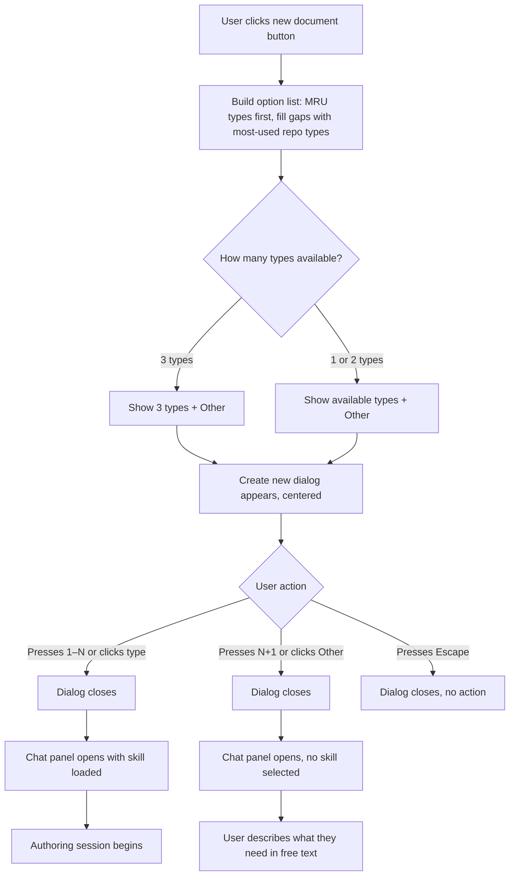
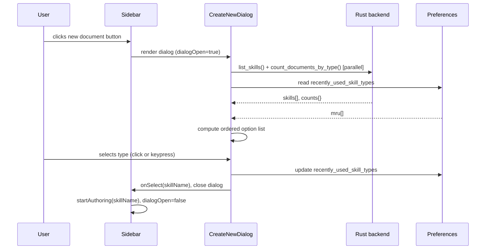

# Enhancement: Authoring Skill Picker

## Parent feature

`feature-document-authoring.md`

## What

When a user clicks the "New document" button, a small centered dialog titled "Create new" appears. It shows up to three document types plus an "Other" option. The list is populated by the user's recently used types first; any remaining slots are filled by the most frequently created types in the repository. If fewer than three types exist in total, the dialog shows only what's available. Each option displays a static icon, a label, and a keyboard shortcut badge. Selecting a type closes the dialog, sets the active skill, and opens the chat panel ready to begin the guided authoring session. Selecting "Other" opens the chat panel in authoring mode without a pre-selected skill, where the user can describe what they need in free text.

## Why

Choosing a document type upfront ensures the right skill is loaded before the first message, so the AI enters the authoring session with the correct structure, process, and conventions already in context. The dialog also surfaces available document types at the moment they're most relevant — when the user has just decided to create something — without requiring them to know what types exist or how to ask for them.

## User stories

- Patricia can click the new document button and immediately see available document types without navigating away from her current context
- Patricia can select a document type with a single keypress
- Eric can start a tech design authoring session with the correct skill loaded from the first message
- Devon can select "Other" when he doesn't know which template applies
- Devon can describe what he needs in free text in the AI chat panel
- Any user sees their recently used document types listed first, with gaps filled by the most commonly created types in the repository
- Any user sees only the available document type options when fewer than three types exist in the workspace

## Design changes

### User flow



### UI components

#### Click capture layer

- `fixed inset-0` with no background — invisible, exists only to dismiss the dialog on outside click

#### Dialog container

- `fixed top-1/3 left-1/2 -translate-x-1/2 -translate-y-1/2`
- `bg-white dark:bg-gray-800 border border-gray-200 dark:border-gray-700 rounded-xl shadow-lg`
- `w-72 p-2` — fixed width, height auto-fits to content (no min/max height needed; 4 rows + title naturally sizes correctly)

#### Option row (document type or "Other")

- `flex items-center gap-3 px-3 py-2 rounded-lg hover:bg-gray-100 dark:hover:bg-gray-700 cursor-pointer`
- Left: Lucide icon `w-4 h-4 text-gray-400 shrink-0`
- Middle: `flex-1 min-w-0` wrapper with `text-sm text-gray-900 dark:text-gray-100 truncate` — truncates with ellipsis when name is too long
- Right: shortcut badge `shrink-0 text-xs text-gray-400 bg-gray-100 dark:bg-gray-700 rounded px-1.5 py-0.5`

## Technical changes

### Affected files

*(Populated during tech specs stage)*

### Changes

#### Introduction

**Prerequisites:** `feature-document-authoring.md` complete — `list_skills` exists in `skill_loader.rs` but is not yet exposed as a Tauri command; preferences system exists for persisting MRU state; `useAiChatStore` has `startAuthoring()`.

**Goals:**
- Dialog appears immediately on button click with no perceptible delay
- Correct skill is injected into the system prompt from the first message after type selection
- MRU order persists across sessions

**Non-goals:**
- Keyboard shortcut registry (ADR-009 infrastructure is not yet built — dialog shortcuts hardcoded locally for now, to be refactored when the registry lands)
- Natural language type inference (separate issue)

**Note on ADR-009:** The dialog ships with hardcoded number key bindings rather than routing through a central shortcut registry. This is a known deviation from ADR-009 to avoid blocking on registry infrastructure. It should be updated when the registry is built.

#### System design

**Component breakdown:**

- `CreateNewDialog.tsx` (new) — floating dialog; fetches skills and document counts on mount, computes the option list, handles selection and keyboard shortcuts
- `Sidebar.tsx` (modified) — adds local `dialogOpen` state; button click sets it to `true`; renders `CreateNewDialog` when open
- `src-tauri/src/commands/skills.rs` (new) — exposes `list_skills` and a new `count_documents_by_type` function as Tauri commands
- `src/lib/preferences.ts` (modified) — adds `recently_used_skill_types: string[]`, default `[]`

**Option list algorithm** (runs in `CreateNewDialog` on mount):
1. Read `recently_used_skill_types` from preferences
2. Fetch `list_skills()` and `count_documents_by_type()` in parallel
3. Start with MRU types (up to 3), filtered to types that still exist as skills
4. Fill remaining slots with non-MRU types sorted by repo count descending, then alphabetically ascending on ties
5. Cap at 3 total type options
6. Always append "Other" as the final option

**Sequence diagram:**



#### Detailed design

**`list_skills` Tauri command**

Already implemented in `skill_loader.rs`. Add `#[tauri::command]` annotation and register in `lib.rs`. No logic changes.

**`count_documents_by_type` (new Rust function)**

Scans all markdown files in the workspace, reads each file's YAML frontmatter, extracts the `type` field (which matches the skill directory name, e.g. `product-description`), and returns a count per type:

```
Input: workspace_path: String
Output: Result<HashMap<String, u32>, String>
Behavior:
  - Walk workspace directory (reuse logic from files.rs)
  - For each .md file, read first ~20 lines to find frontmatter block
  - Parse YAML between --- delimiters, extract `type` field
  - Skip files with no frontmatter or no type field
  - Return map of type name → document count
```

**Preferences extension**

Add `recently_used_skill_types: Vec<String>` (Rust) / `recently_used_skill_types: z.array(z.string())` (TypeScript) to the preferences schema. Default: empty array. Capped at 3 entries — when a type is selected, prepend it and trim to 3.

**`CreateNewDialog` option list computation**

```
1. filter mru[] to types present in skills[]
2. slots = mru[0..3]  (up to 3)
3. remaining = skills not in slots,
               sorted by counts[skill] descending,
               then alphabetically ascending on ties
4. fill slots from remaining until length === 3 or remaining exhausted
5. options = slots + ["other"]
```

#### Security

No new security surface. All file reads are within the workspace path, reusing the existing path validation pattern from `files.rs`.

#### Testing plan

**Unit tests (Vitest):**
- Option list computation: MRU ordering, gap-filling, alpha tie-breaking, fewer than 3 types, zero types
- Preferences: `recently_used_skill_types` parse/save round-trip, cap at 3, prepend behavior

**Unit tests (Rust):**
- `count_documents_by_type`: files with type field, files without frontmatter, empty workspace, type counts with ties

**Component tests:**
- `CreateNewDialog`: renders correct options, keyboard shortcuts dismiss and select correctly, Escape closes without action, "Other" calls `startAuthoring(null)`

## Task list

- [x] **Story: Rust backend — skill commands**
  - [x] **Task: Expose `list_skills` as a Tauri command**
    - **Description**: Add `#[tauri::command]` to the existing `list_skills` function in `skill_loader.rs` and register it in `lib.rs`. No logic changes — it already works, it just isn't callable from the frontend.
    - **Acceptance criteria**:
      - [x] `list_skills` callable via `invoke("list_skills", { workspace_path })` from the frontend
      - [x] Returns `Vec<SkillInfo>` with name and description for each skill
      - [x] Registered in `lib.rs` invoke handler
    - **Dependencies**: None
  - [x] **Task: Implement `count_documents_by_type` Tauri command**
    - **Description**: In `src-tauri/src/commands/skills.rs`, add a command that walks the workspace directory (reusing logic from `files.rs`), reads the first ~20 lines of each `.md` file to extract YAML frontmatter, reads the `type` field, and returns a `HashMap<String, u32>` of type name → document count. Skip files with no frontmatter or no `type` field.
    - **Acceptance criteria**:
      - [x] Returns correct counts for a workspace with multiple document types
      - [x] Skips files with no frontmatter or missing `type` field gracefully
      - [x] Returns empty map for an empty workspace
      - [x] Path validation reuses existing workspace boundary checks
      - [x] Registered as Tauri command
      - [x] Unit tests cover: documents with type, documents without frontmatter, empty workspace, type counts with ties
    - **Dependencies**: None

- [x] **Story: Preferences extension**
  - [x] **Task: Add `recently_used_skill_types` to preferences**
    - **Description**: Add `recently_used_skill_types: Option<Vec<String>>` to the Rust `Preferences` struct and `recently_used_skill_types: z.array(z.string()).default([])` to the TypeScript Zod schema. Default to empty array. Existing preferences files without this field must load without error.
    - **Acceptance criteria**:
      - [x] Rust struct updated, existing preferences files load without error
      - [x] TypeScript Zod schema updated with correct default
      - [x] Save/load round-trip preserves the field
      - [x] Unit tests cover: missing field defaults to `[]`, round-trip with values
    - **Dependencies**: None

- [x] **Story: `CreateNewDialog` component**
  - [x] **Task: Build `CreateNewDialog` component**
    - **Description**: Create `src/components/CreateNewDialog.tsx`. On mount, fetch `list_skills()` and `count_documents_by_type()` in parallel and read `recently_used_skill_types` from preferences. Compute the option list using the algorithm in the tech spec (MRU first, fill with count-sorted then alpha-sorted remaining, cap at 3, always append "Other"). Render the floating dialog per the design spec: click-capture layer, dialog container, option rows with icon/label/shortcut badge. Number keys 1–N select the corresponding type; the next key selects "Other"; Escape closes without action. On selection, prepend the chosen type to `recently_used_skill_types` (capped at 3), save preferences, and call `onSelect(skillName)` or `onSelect(null)` for "Other". Call `onClose` in all exit paths.
    - **Acceptance criteria**:
      - [x] Dialog renders with correct option list (MRU first, gap-filled, capped at 3 + Other)
      - [x] Fresh workspace with no documents shows types in alphabetical order
      - [x] Long type names truncate with ellipsis
      - [x] Number keypresses select the correct option
      - [x] Escape closes without calling `onSelect`
      - [x] Click outside (capture layer) closes without calling `onSelect`
      - [x] Selecting a type updates `recently_used_skill_types` in preferences
      - [x] "Other" calls `onSelect(null)`
      - [ ] Dark mode styles apply correctly
      - [x] Unit tests cover: option list computation, keyboard shortcuts, MRU update, fewer than 3 types
    - **Dependencies**: "Task: Expose `list_skills` as a Tauri command", "Task: Implement `count_documents_by_type` Tauri command", "Task: Add `recently_used_skill_types` to preferences"

- [x] **Story: Sidebar integration**
  - [x] **Task: Wire new document button to `CreateNewDialog`**
    - **Description**: In `Sidebar.tsx`, add local `dialogOpen` state. Change the button's `onClick` from calling `onStartAuthoring` directly to setting `dialogOpen = true`. Render `CreateNewDialog` when `dialogOpen` is true, passing `onSelect(skillName)` (which calls `startAuthoring(skillName)` and sets `dialogOpen = false`) and `onClose` (sets `dialogOpen = false`). Remove the "New document" text label from the button, keeping only the `Plus` icon (this is issue #16 combined).
    - **Acceptance criteria**:
      - [x] Clicking the button opens the dialog instead of immediately starting authoring
      - [x] Selecting a type from the dialog starts the authoring session with the correct skill
      - [x] Closing the dialog without selecting does not start authoring
      - [x] Button renders as icon-only (no text label)
      - [x] `aria-label` and `title="New document"` remain on the button
    - **Dependencies**: "Task: Build `CreateNewDialog` component"
