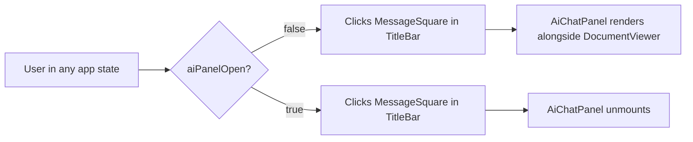
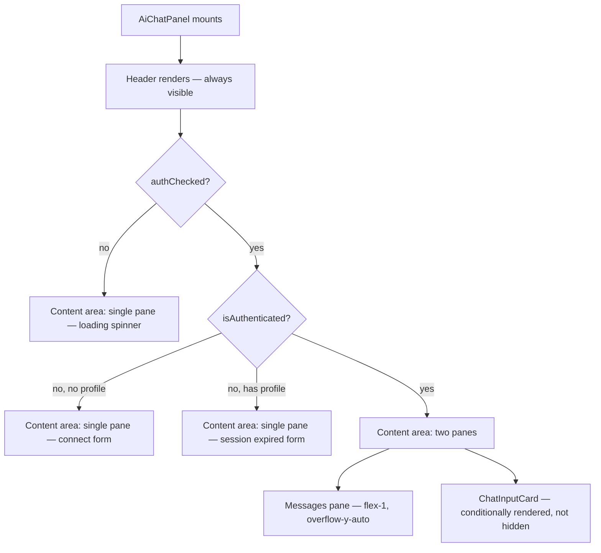
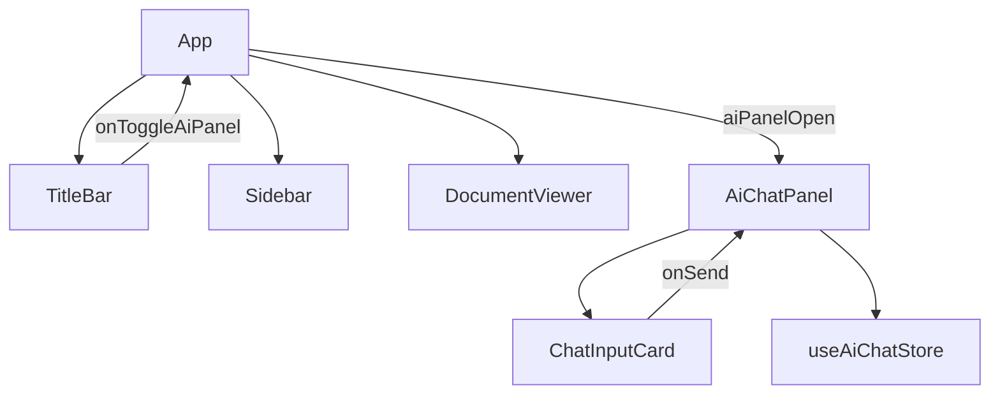
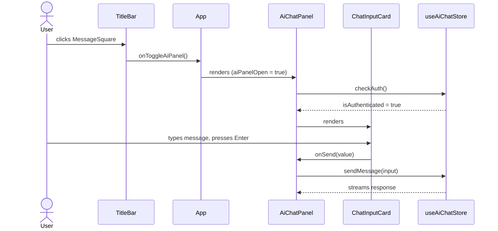

# Enhancement: AI Chat Panel Restructure with Expandable Card Input

## Parent feature

`feature-ai-chat-assistant.md`

## What

The AI chat panel is restructured into a two-zone layout — a persistent header and a content area — and the chat input is replaced with an expandable card-style component extracted into `ChatInputCard`. In chat view, the content area has two panes: a scrollable message list and the input card. A toggle button is added to the app title bar to open and close the panel.

## Why

Different functionality in the AI panel requires different layouts — chat needs two subpanels and session history just needs one. A top-level structure of a persistent header and a content area provides the reusable skeleton each of those features slots into. This enhancement also puts the right content structure in place for the chat view specifically, with a scrollable message list and an input card as two distinct panes, and `ChatInputCard` extracted as a reusable component.

## Goals

1. Users can type multi-line messages without text being hidden behind a truncated single-line input
2. The input grows automatically with content — no manual action required
3. The input expands up to 50% of the chat panel height, then scrolls internally
4. The send button is always visible regardless of input height

## User stories

- User can open and close the AI chat panel from the title bar without navigating away
- User can type a multi-line message and see the input grow line by line without taking any action
- User can insert a newline with `Shift+Enter` and see the input expand to accommodate it
- User can send a message with `Enter` or `Cmd+Enter`
- When the input reaches 50% of the panel height, it stops growing and scrolls internally
- The send button is always visible regardless of how tall the input is

## Design spec

### User flows

**Panel toggle**



**Chat panel content area**



### Layout

**States 1–3 (loading / unauthenticated)**

```
┌──────────────────────────────────────┐
│ AI assistant                    [⏱] │  ← header
├──────────────────────────────────────┤
│                                      │
│                                      │
│        [content varies by state]     │  ← single pane, full height
│                                      │
│                                      │
└──────────────────────────────────────┘
```

**State 4 (authenticated)**

```
┌──────────────────────────────────────┐
│ AI assistant                    [⏱] │  ← header
├──────────────────────────────────────┤
│                                      │
│  User: What does this doc cover?     │  ← messages pane
│                                      │    flex-1, overflow-y-auto
│  AI: This document covers...         │
│                                      │
├──────────────────────────────────────┤
│ ┌────────────────────────────────┐   │
│ │ Ask a question...              │   │  ← textarea, grows upward
│ ├────────────────────────────────┤   │
│ │ [mode slot]         [send ↑]  │   │  ← toolbar
│ └────────────────────────────────┘   │
└──────────────────────────────────────┘
```

### Component hierarchy

**States 1–3 (loading / unauthenticated) — single-pane content area**

```
AiChatPanel
├── Header
│   ├── "AI assistant" label
│   └── [Clock icon — reserved]
└── Content area (flex-1)
    └── Single pane (full height)
        ├── State 1: Loader2 spinner
        ├── State 2: connect form (profile input + Connect button)
        └── State 3: session expired form (Re-authenticate + Change profile)
```

`ChatInputCard` is not rendered in states 1–3.

**States 4a–4b (authenticated) — two-pane content area**

```
AiChatPanel
├── Header
│   ├── "AI assistant" label
│   └── [Clock icon — reserved]
└── Content area (flex-1, flex-col)
    ├── Messages pane (flex-1, overflow-y-auto)
    │   ├── State 4a: suggested prompts
    │   └── State 4b: ChatMessage[], streaming message, pulse indicator
    └── ChatInputCard
        ├── Textarea (auto-grows, 1 row → 50% panel height)
        └── Toolbar
            ├── [mode slot — reserved]
            └── Send button (ArrowUp, disabled when empty or streaming)
```

### Key UI components

#### TitleBar — MessageSquare toggle (new)
- `MessageSquare` icon button added to the right section alongside Share and Plus
- Active color (`text-blue-600`) when `aiPanelOpen` is true; tertiary text color otherwise
- Clicking toggles `aiPanelOpen` in `App.tsx`
- Panel has no close button of its own — the toggle is the only way to open and close it

#### AiChatPanel — header changes
- Remove `×` close button; panel is closed via the TitleBar toggle only
- Replace `RotateCcw` (new conversation) with `Clock` icon button, reserved for session history (#86)
- Clock button is present but wired to no-op for now; active color applies when history view is showing (not applicable in this issue)

#### ChatInputCard (new component)
- Outer card: `rounded-xl border border-gray-200 dark:border-gray-700`
- `focus-within:ring-2 focus-within:ring-blue-500` when textarea is focused
- **Textarea**: `bg-transparent border-none outline-none resize-none`, starts at 1 row, auto-grows via `scrollHeight` up to 50% of panel height, then `overflow-y-auto` kicks in
- **Toolbar**: separated from textarea by `border-t`; left slot reserved for mode picker; right side has Send button (`ArrowUp` icon, disabled when input empty or streaming)
- Accepts `modeButton: ReactNode` render prop for the left toolbar slot
- Accepts `panelRef: RefObject<HTMLDivElement | null>` to compute the 50% height cap

## Tech spec

### 1. Introduction and overview

**Prerequisites and assumptions**
- `feature-ai-chat-assistant.md` is complete — `AiChatPanel.tsx`, `useAiChatStore`, and the AWS auth flow all exist
- No ADRs required — this is a UI restructure with no new data storage, API changes, or auth decisions
- Frontend state management (Zustand) and component patterns are established

**Goals**
- `AiChatPanel` renders correctly inside the two-zone layout across all four content states
- `ChatInputCard` textarea grows from 1 row to 50% of panel height, then scrolls
- Panel opens and closes via the TitleBar toggle with no regressions to existing functionality

**Non-goals**
- Session history view (`ChatHistoryView`) — reserved for #86
- Mode picker wired into `ChatInputCard` toolbar — slot is present but empty
- Clock/history icon functionality — button present but no-op
- Any backend, store, or Tauri changes

**Glossary**
- *Content area* — the `flex-1` zone below the header; renders one of two layouts depending on auth state
- *Two-pane layout* — the authenticated content area: messages pane (flex-1) + ChatInputCard (fixed)
- *Single-pane layout* — the unauthenticated/loading content area: full-height slot

### 2. System design and architecture

**High-level architecture**



**Component breakdown**

| Component | Change |
|---|---|
| `App.tsx` | Add `aiPanelOpen` state; wire toggle to TitleBar; render `AiChatPanel` conditionally alongside `DocumentViewer` |
| `TitleBar.tsx` | Add `aiPanelOpen?` and `onToggleAiPanel?` props; add `MessageSquare` button to right section |
| `AiChatPanel.tsx` | Remove `onClose` prop, × button, and `RotateCcw`/`clearConversation`; add `Clock` (no-op); restructure content area as two-pane when authenticated; delegate input to `ChatInputCard` |
| `ChatInputCard.tsx` | New component — auto-growing textarea + toolbar card |

**Sequence diagram — user sends a message**



### 3. Detailed design

**`ChatInputCard` props interface**

```ts
interface ChatInputCardProps {
  value: string;
  onChange: (value: string) => void;
  onSend: () => void;
  isStreaming: boolean;
  modeButton?: ReactNode;
  panelRef: RefObject<HTMLDivElement | null>;
}
```

**Auto-grow algorithm**

In a `useEffect` watching `value`:

```ts
const textarea = textareaRef.current;
const panel = panelRef.current;
if (!textarea) return;
textarea.style.height = 'auto';
const maxHeight = panel ? panel.offsetHeight * 0.5 : Infinity;
textarea.style.height = Math.min(textarea.scrollHeight, maxHeight) + 'px';
```

Resetting to `'auto'` first forces the browser to recompute natural height before reading `scrollHeight`. `overflow-y-auto` on the textarea handles scrolling once max height is reached. Height resets to `'auto'` (back to 1 row) when `value` is cleared after send.

**Keyboard handling (in `ChatInputCard`)**

```
Enter (no modifiers)  → preventDefault, call onSend()
Meta+Enter            → preventDefault, call onSend()
Shift+Enter           → fall through to default (inserts newline, textarea grows)
```

No send while `isStreaming`.

**Content area layout**

The content area must use `flex flex-col flex-1 min-h-0` — the `min-h-0` overrides flex's default `min-height: auto`, which is required for the messages pane to scroll correctly inside a flex column:

```
AiChatPanel         flex flex-col h-full
  Header            flex-shrink-0
  Content area      flex flex-col flex-1 min-h-0
    Messages pane   flex-1 overflow-y-auto p-4
    ChatInputCard   flex-shrink-0 p-3
```

**App-level panel rendering**

`AiChatPanel` renders as a sibling to `DocumentViewer` inside the existing `flex flex-1 min-h-0` row. The `onClose` prop is removed; `AiChatPanel` takes no close callback. `App.tsx` owns `aiPanelOpen: boolean` (default `false`).

### 6. Testing plan

Unit tests only; no integration or E2E tests required.

`tests/unit/components/ChatInputCard.test.tsx` (new):
- `Enter` calls `onSend`
- `Cmd+Enter` calls `onSend`
- `Ctrl+Enter` calls `onSend`
- `Shift+Enter` does not call `onSend`
- Send button disabled when `value` is empty
- Send button disabled when `isStreaming` is true
- `modeButton` render prop renders in the toolbar

`tests/unit/TitleBar.test.tsx` (update):
- `MessageSquare` button renders with active color when `aiPanelOpen` is true
- `MessageSquare` button renders with tertiary color when `aiPanelOpen` is false

`tests/unit/AiChatPanel` (update existing):
- All four auth states render correctly in the restructured layout
- `onClose` prop, × button, and `RotateCcw` are gone
- Existing 415-test suite passes with no regressions

### 7. Alternatives considered

*Keep input inline in `AiChatPanel`* — skip extracting `ChatInputCard`. Simpler short-term, but the mode picker and future toolbar additions would require touching `AiChatPanel` each time. Extracting now isolates that concern correctly.

*`display:none` instead of conditional rendering for `ChatInputCard`* — simpler branching logic but wastes DOM in unauthenticated states and could cause `scrollHeight` to measure incorrectly. Conditional rendering is cleaner.

### 8. Risks

| Risk | Mitigation |
|---|---|
| `min-h-0` flex layout — without it, the messages pane won't scroll inside a flex column | Test all four auth states; verify scroll behavior |
| `scrollHeight` timing — reading before layout completes gives wrong values | Resetting to `'auto'` first forces recompute; well-established pattern |
| TitleBar right section overflow — currently fixed at 80px; a third button may clip | Check rendered width; widen right section if needed |

## Task list

- [ ] **Story: `ChatInputCard` component**
  - [ ] **Task: Write `ChatInputCard` tests**
    - **Description**: Create `tests/unit/components/ChatInputCard.test.tsx`. Test all keyboard behaviors and disabled states before implementing the component. Mount with stub props (`value`, `onChange`, `onSend`, `isStreaming`, `modeButton`, `panelRef`).
    - **Acceptance criteria**:
      - [ ] `Enter` (no modifiers) calls `onSend`
      - [ ] `Cmd+Enter` calls `onSend`
      - [ ] `Shift+Enter` does not call `onSend`
      - [ ] Send button is disabled when `value` is empty
      - [ ] Send button is disabled when `isStreaming` is true
      - [ ] `modeButton` render prop renders in the toolbar
    - **Dependencies**: None
  - [ ] **Task: Implement `ChatInputCard`**
    - **Description**: Create `src/components/ChatInputCard.tsx`. Outer card is `rounded-xl border` with `focus-within:ring-2 focus-within:ring-blue-500`. Textarea is `bg-transparent border-none outline-none resize-none`, starts at 1 row, auto-grows via `scrollHeight` in a `useEffect` watching `value` (reset to `'auto'` first, then set to `Math.min(scrollHeight, panelRef.current.offsetHeight * 0.5)`). Toolbar separated by `border-t`: left slot renders `modeButton`, right side renders Send button (`ArrowUp` icon, disabled when `value` empty or `isStreaming`). All dark mode styles applied throughout.
    - **Acceptance criteria**:
      - [ ] Card renders with `rounded-xl border`
      - [ ] Focus ring activates on textarea focus
      - [ ] Textarea starts at 1 row when `value` is empty
      - [ ] Textarea grows line by line as `value` increases
      - [ ] Textarea stops growing at 50% of panel height and scrolls internally
      - [ ] Textarea height resets to 1 row when `value` is cleared
      - [ ] Send button uses `ArrowUp` icon
      - [ ] `modeButton` renders in toolbar left slot when provided
      - [ ] All existing `ChatInputCard` tests pass
    - **Dependencies**: "Task: Write `ChatInputCard` tests"

- [ ] **Story: Restructure `AiChatPanel`**
  - [ ] **Task: Remove `onClose`, ×, `RotateCcw`, and `clearConversation`; add `Clock` no-op**
    - **Description**: In `AiChatPanel.tsx`, remove the `onClose` prop and its × button from the header. Remove the `RotateCcw` button and its `clearConversation` call. Add a `Clock` icon button (from Lucide) in the header as a no-op placeholder for session history (#86). Remove `clearConversation` from the `useAiChatStore` destructure.
    - **Acceptance criteria**:
      - [ ] `onClose` prop removed from `AiChatPanelProps`
      - [ ] × button no longer renders in the header
      - [ ] `RotateCcw` button and `clearConversation` call removed
      - [ ] `Clock` icon button renders in the header with no action on click
      - [ ] Existing tests pass with updated component signature
    - **Dependencies**: None
  - [ ] **Task: Restructure content area and wire `ChatInputCard`**
    - **Description**: In `AiChatPanel.tsx`, restructure the content area to use `flex flex-col flex-1 min-h-0`. When authenticated, render two panes: messages pane (`flex-1 overflow-y-auto p-4`) and `ChatInputCard` (`flex-shrink-0 p-3`). When not authenticated or loading, render a single full-height pane with the existing auth state content. `ChatInputCard` is conditionally rendered (not hidden) — only mounted when `isAuthenticated`. Add a `panelRef` on the outer panel div and pass it to `ChatInputCard`. Remove the existing inline textarea and send button.
    - **Acceptance criteria**:
      - [ ] Content area uses `flex flex-col flex-1 min-h-0`
      - [ ] Messages pane is `flex-1 overflow-y-auto` — content scrolls correctly
      - [ ] `ChatInputCard` is not rendered in states 1–3 (loading, no profile, session expired)
      - [ ] `ChatInputCard` is rendered (not hidden) in state 4 (authenticated)
      - [ ] All four auth states render correctly in the restructured layout
      - [ ] Sending a message via `ChatInputCard` works end-to-end
    - **Dependencies**: "Task: Implement `ChatInputCard`", "Task: Remove `onClose`, ×, `RotateCcw`, and `clearConversation`; add `Clock` no-op"

- [ ] **Story: Panel toggle**
  - [ ] **Task: Add `MessageSquare` toggle to `TitleBar`**
    - **Description**: Add `aiPanelOpen?: boolean` and `onToggleAiPanel?: () => void` props to `TitleBarProps`. Add a `MessageSquare` icon button to the right section alongside Share and Plus. Apply active color (`text-blue-600` or design token equivalent) when `aiPanelOpen` is true; tertiary text color otherwise. The right section is currently fixed at 80px — widen if a third button causes clipping.
    - **Acceptance criteria**:
      - [ ] `MessageSquare` button renders in TitleBar right section
      - [ ] Button shows active color when `aiPanelOpen` is true
      - [ ] Button shows tertiary color when `aiPanelOpen` is false or undefined
      - [ ] Clicking calls `onToggleAiPanel`
      - [ ] Right section does not clip with three buttons
      - [ ] Existing TitleBar tests pass
    - **Dependencies**: None
  - [ ] **Task: Wire `aiPanelOpen` state in `App.tsx`**
    - **Description**: Add `const [aiPanelOpen, setAiPanelOpen] = useState(false)` to `App`. Pass `aiPanelOpen` and `onToggleAiPanel={() => setAiPanelOpen(v => !v)}` to `TitleBar` in all three render paths (loading, no folder, main). In the main render path, conditionally render `AiChatPanel` as a sibling to `DocumentViewer` inside the `flex flex-1 min-h-0` row when `aiPanelOpen` is true. Remove the three `TODO` comments referencing the panel toggle.
    - **Acceptance criteria**:
      - [ ] `AiChatPanel` renders alongside `DocumentViewer` when `aiPanelOpen` is true
      - [ ] `AiChatPanel` is not rendered when `aiPanelOpen` is false
      - [ ] Toggle works correctly — clicking `MessageSquare` opens and closes the panel
      - [ ] All three `TODO` comments removed
      - [ ] Existing test suite (415 tests) passes with no regressions
    - **Dependencies**: "Task: Add `MessageSquare` toggle to `TitleBar`", "Task: Restructure content area and wire `ChatInputCard`"
