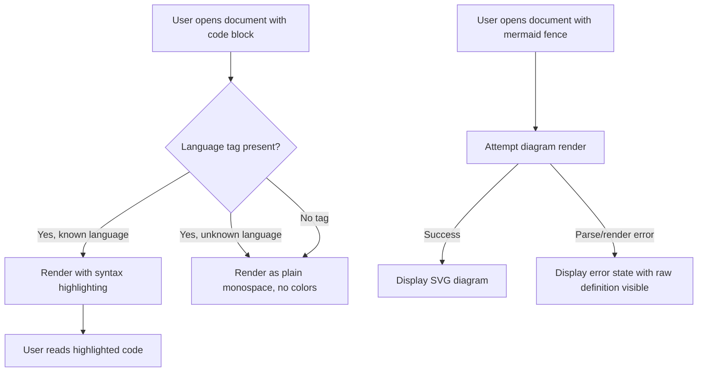
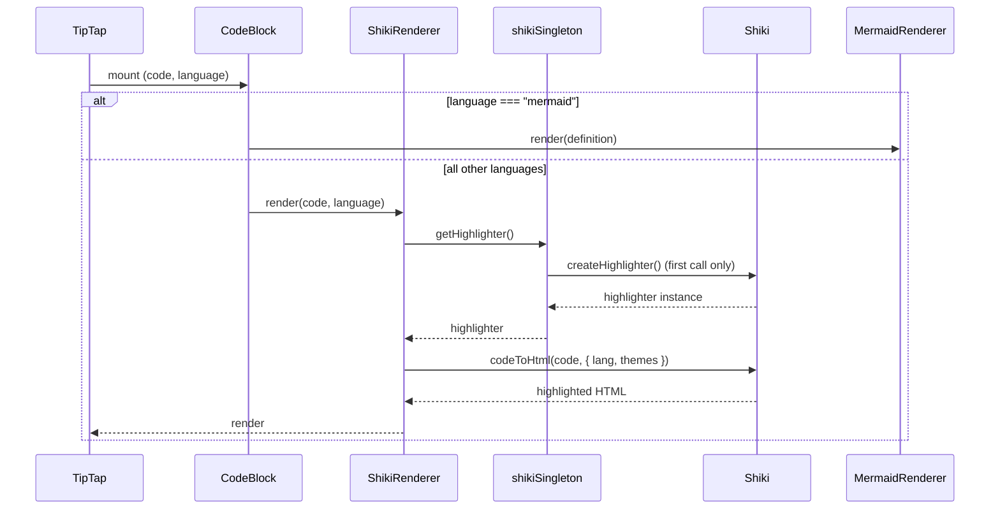
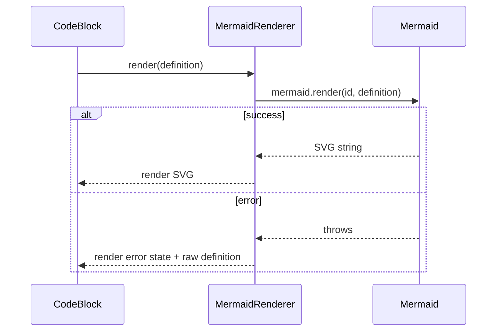

# Enhancement: Code rendering

## Parent feature

`feature-markdown-rendering.md`

## What

The markdown renderer gains two code-specific rendering capabilities. Fenced code blocks (e.g. ` ```typescript `) display with syntax highlighting — token colors that visually distinguish keywords, strings, identifiers, and other language constructs. Mermaid diagram fences (` ```mermaid `) render as SVG diagrams instead of plain text, giving users a visual representation of flowcharts, sequence diagrams, and other diagram types defined inline in their documents.

## Why

Reading and understanding documentation is the core job Episteme does. Syntax-highlighted code is faster to read, easier to follow, and less error-prone to interpret than monochrome text — engineers spend less cognitive effort parsing structure and more on understanding content. Rendered Mermaid diagrams turn architecture and process descriptions into something users can see and reason about instantly, rather than mentally reconstructing from a text definition. Both improvements directly reduce the effort required to get value from a document.

## User stories

- Eric can read a code block in a tech design and immediately identify language constructs by color, without mentally parsing raw text
- Eric can view a Mermaid architecture diagram embedded in a document as a rendered diagram, not a text definition
- Patricia can open a product description that contains a Mermaid flowchart and see the diagram render correctly
- Eric can open a document with an unrecognized or misspelled language fence and still see a readable code block (graceful fallback)
- Eric can see Mermaid render errors surfaced clearly rather than silently displaying nothing

## Design changes

### User flow



### UI components

#### Syntax highlighted code block

- Rendered by shiki via a custom Tiptap node view (replaces StarterKit's default CodeBlock)
- Theme: Catppuccin Latte in light mode, Catppuccin Mocha in dark mode — loaded from `@catppuccin/vscode`, switching via `prefers-color-scheme`
- Font: `--font-mono`, same block background and padding as existing code blocks
- Unknown or missing language tag: renders as plain monospace, no token colors, no error
- Future: any VS Code theme file can be substituted for Catppuccin with no architectural change

#### Mermaid diagram

- Rendered inline at the code fence location via a custom Tiptap node view
- Scaled to fit content column width (`max-width: 100%`), aspect ratio preserved; no horizontal scroll at this stage
- Themed: Mermaid's `base` theme with variables adjusted for light/dark mode via `prefers-color-scheme`
- Future: selectable theme, tied to whatever theme system is introduced for syntax highlighting
- **Error state**: bordered box (`--color-border-default`), warning icon, short message ("Diagram could not be rendered"), raw definition shown below in a dimmed plain code block
- Clicking to expand is out of scope — noted as a follow-on

## Technical changes

### Affected files

- `src/components/markdown/CodeBlock.tsx` — new; TipTap node extension + dispatcher component
- `src/components/markdown/ShikiRenderer.tsx` — new; shiki-based code renderer
- `src/components/markdown/MermaidRenderer.tsx` — new; Mermaid diagram renderer
- `src/lib/shikiSingleton.ts` — new; app-scoped shiki highlighter singleton
- `src/components/MarkdownRenderer.tsx` — modified; disable StarterKit's default codeBlock, register CodeBlock extension
- `src/app.css` — modified; add shiki dark mode CSS to `prose-tiptap` utility

### Changes

#### System design and architecture

**Component breakdown:**

One TipTap node extension replaces the default `codeBlock`, backed by three focused components:

- **`CodeBlock`** — TipTap node extension + React entry point. Receives `code` and `language` from the ProseMirror node attributes and dispatches to the appropriate renderer based on `language`. Owns no rendering logic itself. Wrapped in a React `ErrorBoundary` as a last-resort safety net for unexpected renderer failures.
- **`ShikiRenderer`** — renders syntax-highlighted code via the shiki singleton. Owns its own error handling: unknown/missing language falls back to plain monospace; a shiki initialisation failure also falls back to plain monospace. Never surfaces an error UI — degraded output is always better than an error message for code.
- **`MermaidRenderer`** — calls `mermaid.render()` on the raw definition. Owns its own error handling: render failures show the error state UI (warning icon, message, raw definition in a dimmed code block). Never throws to the parent.
- **`shikiSingleton.ts`** — module-level singleton (app-scoped via JavaScript's module cache). Initialises a shiki highlighter once on first use — loads Catppuccin Latte + Mocha themes and a curated language list — and returns the same instance on all subsequent calls. Expensive initialisation (WASM + themes) happens once per app lifetime.

**Sequence diagram — code block rendering:**



**Sequence diagram — Mermaid rendering:**



---

#### Detailed design

**Dependencies to add:**

```bash
npm install shiki @catppuccin/vscode mermaid
```

**`shikiSingleton.ts`:**

```typescript
import { createHighlighter, type Highlighter } from 'shiki'

// Curated language list — covers the majority of documentation code
const SUPPORTED_LANGUAGES = [
  'typescript', 'javascript', 'tsx', 'jsx',
  'python', 'rust', 'go', 'bash', 'sh',
  'json', 'yaml', 'toml', 'markdown',
  'sql', 'html', 'css', 'dockerfile',
]

let highlighterPromise: Promise<Highlighter> | null = null

export function getHighlighter(): Promise<Highlighter> {
  if (!highlighterPromise) {
    highlighterPromise = createHighlighter({
      themes: [
        import('@catppuccin/vscode/themes/latte.json'),
        import('@catppuccin/vscode/themes/mocha.json'),
      ],
      langs: SUPPORTED_LANGUAGES,
    })
  }
  return highlighterPromise
}
```

**`CodeBlock.tsx`** (TipTap node extension):

```typescript
import { Node } from '@tiptap/core'
import { ReactNodeViewRenderer, NodeViewWrapper } from '@tiptap/react'
import { ShikiRenderer } from './ShikiRenderer'
import { MermaidRenderer } from './MermaidRenderer'

function CodeBlockDispatcher({ node }: { node: Node }) {
  const language = node.attrs.language as string | null
  const code = node.textContent

  if (language === 'mermaid') {
    return (
      <NodeViewWrapper>
        <MermaidRenderer definition={code} />
      </NodeViewWrapper>
    )
  }
  return (
    <NodeViewWrapper>
      <ShikiRenderer code={code} language={language ?? ''} />
    </NodeViewWrapper>
  )
}

export const CodeBlock = Node.create({
  name: 'codeBlock',
  addNodeView() {
    return ReactNodeViewRenderer(CodeBlockDispatcher)
  },
})
```

**`ShikiRenderer.tsx`:**

```typescript
// On mount: calls getHighlighter(), then codeToHtml().
// While loading: renders plain <pre><code> (no flash of unstyled content).
// On unknown language: passes 'text' to shiki (plain monospace, no error).
// On any failure: silently falls back to plain <pre><code>.
// Dark/light mode: shiki dual-theme output + prefers-color-scheme CSS.
```

**`MermaidRenderer.tsx`:**

```typescript
// On mount: initialises mermaid once (startOnLoad: false, theme: 'base').
// Calls mermaid.render(uniqueId, definition) in useEffect.
// On success: renders SVG via dangerouslySetInnerHTML (safe — SVG is from mermaid, not user HTML).
// On error: renders error state (warning icon + message + raw definition in dimmed code block).
// Dark/light mode: Mermaid themeVariables set via prefers-color-scheme media query in app.css.
```

**`MarkdownRenderer.tsx` change:**

```typescript
// Replace:
StarterKit,
// With:
StarterKit.configure({ codeBlock: false }),
CodeBlock,
```

**Dark mode CSS (added to `prose-tiptap` utility in `app.css`):**

```css
/* Shiki dual-theme switching */
@media (prefers-color-scheme: dark) {
  .shiki, .shiki span {
    color: var(--shiki-dark) !important;
    background-color: var(--shiki-dark-bg) !important;
  }
}
```

---

#### Security, privacy, and compliance

- **`dangerouslySetInnerHTML` in `ShikiRenderer`** — safe. The HTML is produced by shiki from the code content. Shiki escapes all user-supplied code before inserting it into the HTML output. No raw user HTML is injected.
- **`dangerouslySetInnerHTML` in `MermaidRenderer`** — safe with a caveat. Mermaid renders SVG from a controlled grammar; arbitrary JavaScript cannot be injected via Mermaid's diagram syntax. However, if Mermaid's own rendering has a vulnerability, the SVG output could contain malicious content. Mitigation: keep `mermaid` up to date; consider adding `Content-Security-Policy` headers if/when the app gains web distribution.
- No new user input surfaces, no new network calls, no new data stored.

#### Observability

No logging or metrics infrastructure exists in the app today — this section is a placeholder.

If errors are introduced later: shiki failures and Mermaid render failures should log to console in development. Mermaid render failures are surfaced visually to the user.

#### Testing plan

**Unit tests:**
- `shikiSingleton.ts` — verify the promise is created once and the same instance is returned on repeated calls
- `ShikiRenderer` — renders plain code while loading; renders highlighted HTML after load; renders plain fallback on unknown language
- `MermaidRenderer` — renders SVG on success (mock `mermaid.render`); renders error state on failure; renders loading state before render completes
- `CodeBlock` (dispatcher) — routes to `ShikiRenderer` for normal languages; routes to `MermaidRenderer` for `language === 'mermaid'`

**Integration tests:**
- `MarkdownRenderer` with a TypeScript code fence → shiki output present in DOM
- `MarkdownRenderer` with a mermaid fence → SVG present in DOM (mock mermaid)
- `MarkdownRenderer` with no language tag → plain code block, no error
- `MarkdownRenderer` with unknown language → plain code block, no error

**E2E tests:**
- Document with a fenced TypeScript block renders with colored tokens
- Document with a mermaid diagram renders an SVG
- Document with an invalid mermaid definition shows the error state

#### Alternatives considered

**lowlight (`@tiptap/extension-code-block-lowlight`)** — official Tiptap extension using highlight.js. Drop-in replacement for StarterKit's CodeBlock, half-day implementation. Rejected because highlight.js themes are not VS Code theme files; when the theme-selection feature arrives, a migration to shiki would be required. Shiki's upfront cost is paid back on the first theme swap.

#### Risks

- **shiki bundle size** — shiki with language grammars and themes can add significant weight to the JS bundle. Mitigation: load only the curated language list (not `bundledLanguages`); use dynamic imports for themes. Measure bundle impact before shipping.
- **shiki WASM initialisation time** — first render of a code block may be delayed while shiki initialises. Mitigation: `ShikiRenderer` renders plain code immediately as a loading state, so there is no blank flash — highlighting appears once ready.
- **Mermaid bundle size** — `mermaid` is a large dependency (~1MB minified). Mitigation: dynamic import (`import('mermaid')`) so it is only loaded when a mermaid fence is encountered in the rendered document.
- **tiptap-markdown compatibility** — replacing StarterKit's `codeBlock` with a custom node of the same name requires verifying that `tiptap-markdown`'s markdown parser continues to emit the correct node type and attributes. Mitigation: integration tests cover this path; verify manually during implementation.

---

#### Introduction and overview

**Prerequisites:**
- ADR-002 (TipTap) — this enhancement extends the existing TipTap configuration in `MarkdownRenderer`
- ADR-004 (Tailwind CSS) — styling approach unchanged; shiki outputs inline color styles rather than CSS classes
- `feature-markdown-rendering.md` — parent feature; this builds directly on its TipTap setup and `tiptap-markdown` parsing pipeline

No API, database, or auth changes. Frontend-only.

**Goals:**
- Fenced code blocks with recognized language tags render with shiki syntax highlighting
- Unrecognized or missing language tags fall back to plain monospace — no error shown
- Mermaid fences (` ```mermaid `) render as SVG diagrams via the `mermaid` library
- Both features respond to `prefers-color-scheme` (Catppuccin Latte / Catppuccin Mocha for code; Mermaid `base` theme variables for diagrams)
- Mermaid render failures surface an error state — not silent failures
- Shiki highlighter is initialized once (singleton) and reused across all code block instances in a document

**Non-goals:**
- Syntax theme selection UI (follow-on)
- VS Code theme file loading via the UI (follow-on)
- Mermaid diagram expand/fullscreen (follow-on)
- Inline code highlighting (fenced blocks only)
- Live re-highlighting during editing (read-only renderer only)

**Glossary:**
- **shiki** — syntax highlighter using TextMate grammars and VS Code themes; produces inline-styled HTML
- **Node view** — TipTap/ProseMirror mechanism for rendering a React component in place of a standard editor node
- **Catppuccin** — the chosen syntax color theme, distributed as a VS Code theme package (`@catppuccin/vscode`)
- **Mermaid** — JavaScript library that renders diagram definitions (flowcharts, sequence diagrams, etc.) as SVG

## Task list

- [x] **Story: Dependencies and shiki singleton**
  - [x] **Task: Install npm dependencies**
    - **Description**: Add `shiki`, `@catppuccin/vscode`, and `mermaid` to the project.
    - **Acceptance criteria**:
      - [x] `npm install shiki @catppuccin/vscode mermaid` runs without errors
      - [x] All three packages appear in `package.json` dependencies
      - [x] `npm run test:unit` still passes with no regressions
    - **Dependencies**: None

  - [x] **Task: Create shikiSingleton.ts**
    - **Description**: Create `src/lib/shikiSingleton.ts` — a module-level singleton that initialises a shiki highlighter once (Catppuccin Latte + Mocha themes, curated language list) and returns the same promise on all subsequent calls.
    - **Acceptance criteria**:
      - [x] File exists at `src/lib/shikiSingleton.ts`
      - [x] `getHighlighter()` returns a `Promise<Highlighter>`
      - [x] Calling `getHighlighter()` twice returns the same promise (no double-init)
      - [x] Loads Catppuccin Latte (light) and Mocha (dark) from `@catppuccin/vscode`
      - [x] Loads the curated language list: `typescript`, `javascript`, `tsx`, `jsx`, `python`, `rust`, `go`, `bash`, `sh`, `json`, `yaml`, `toml`, `markdown`, `sql`, `html`, `css`, `dockerfile`
    - **Dependencies**: "Task: Install npm dependencies"

- [x] **Story: CodeBlock node extension**
  - [x] **Task: Create CodeBlock.tsx**
    - **Description**: Create `src/components/markdown/CodeBlock.tsx` containing the TipTap node extension and dispatcher React component. The extension overrides the default `codeBlock` node. The component reads `language` and `code` from the ProseMirror node, routes to `MermaidRenderer` when `language === 'mermaid'`, and routes to `ShikiRenderer` for all other languages. Wrap the component in a React `ErrorBoundary` as a last-resort safety net.
    - **Acceptance criteria**:
      - [x] File exists at `src/components/markdown/CodeBlock.tsx`
      - [x] TipTap node extension named `'codeBlock'` registered with `ReactNodeViewRenderer`
      - [x] Renders `MermaidRenderer` when `language === 'mermaid'`
      - [x] Renders `ShikiRenderer` for all other language values (including empty/null)
      - [x] Wrapped in a React `ErrorBoundary` that renders a plain `<pre><code>` fallback on unexpected error
    - **Dependencies**: "Task: Create ShikiRenderer.tsx", "Task: Create MermaidRenderer.tsx"

  - [x] **Task: Update MarkdownRenderer to register CodeBlock**
    - **Description**: In `src/components/MarkdownRenderer.tsx`, disable StarterKit's built-in `codeBlock` extension and add the new `CodeBlock` extension.
    - **Acceptance criteria**:
      - [x] `StarterKit` configured with `codeBlock: false`
      - [x] `CodeBlock` extension imported and added to the extensions array
      - [x] All existing `npm run test:unit` tests continue to pass
    - **Dependencies**: "Task: Create CodeBlock.tsx"

- [x] **Story: ShikiRenderer**
  - [x] **Task: Create ShikiRenderer.tsx**
    - **Description**: Create `src/components/markdown/ShikiRenderer.tsx`. On mount, call `getHighlighter()` then `codeToHtml(code, { lang, themes: { light: 'catppuccin-latte', dark: 'catppuccin-mocha' } })`. Render plain `<pre><code>` while loading. If language is unrecognised by shiki, pass `'text'` as the language (plain monospace, no error). On any failure, silently fall back to plain `<pre><code>`. Render highlighted HTML via `dangerouslySetInnerHTML`.
    - **Acceptance criteria**:
      - [x] File exists at `src/components/markdown/ShikiRenderer.tsx`
      - [x] Renders plain `<pre><code>` immediately on mount (loading state)
      - [x] Replaces plain code with shiki-highlighted HTML once the highlighter resolves
      - [x] Unknown language renders as plain code with no error UI
      - [x] Any exception during highlighting falls back to plain `<pre><code>` silently
      - [x] Uses `dangerouslySetInnerHTML` for highlighted output
    - **Dependencies**: "Task: Create shikiSingleton.ts"

- [x] **Story: MermaidRenderer**
  - [x] **Task: Create MermaidRenderer.tsx**
    - **Description**: Create `src/components/markdown/MermaidRenderer.tsx`. Dynamically import `mermaid` on first use (reduces bundle load). Initialise mermaid once (`startOnLoad: false`, `theme: 'base'`). On mount, call `mermaid.render(uniqueId, definition)` in a `useEffect`. On success, render the SVG string via `dangerouslySetInnerHTML` (safe — SVG is from mermaid, not user HTML) scaled to `max-width: 100%`. On error, render the error state: a bordered box (`--color-border-default`) with a warning icon (Lucide `AlertTriangle`, 16px), the message "Diagram could not be rendered", and the raw definition in a dimmed `<pre><code>` block below.
    - **Acceptance criteria**:
      - [x] File exists at `src/components/markdown/MermaidRenderer.tsx`
      - [x] `mermaid` is dynamically imported (not a top-level static import)
      - [x] Successful render displays the SVG at `max-width: 100%`
      - [x] Failed render shows: bordered box, warning icon, error message, raw definition
      - [x] SVG rendered via `dangerouslySetInnerHTML`
      - [x] Unique render ID generated per component instance (avoids Mermaid ID conflicts when multiple diagrams appear in one document)
    - **Dependencies**: "Task: Install npm dependencies"

- [x] **Story: Dark mode CSS**
  - [x] **Task: Add shiki and Mermaid dark mode CSS to app.css**
    - **Description**: Add CSS to `src/app.css` to handle dark mode for both renderers. For shiki: add a `@media (prefers-color-scheme: dark)` rule inside `@utility prose-tiptap` that applies `--shiki-dark` and `--shiki-dark-bg` CSS variables to `.shiki` and `.shiki span`. For Mermaid: add appropriate `themeVariables` or a CSS override that adjusts Mermaid's `base` theme for dark mode.
    - **Acceptance criteria**:
      - [x] Shiki code blocks use Catppuccin Latte token colors in light mode
      - [x] Shiki code blocks use Catppuccin Mocha token colors in dark mode
      - [x] Mermaid diagrams are legible in both light and dark mode
      - [x] No regressions in existing prose styles
    - **Dependencies**: "Task: Create ShikiRenderer.tsx", "Task: Create MermaidRenderer.tsx"

- [x] **Story: Tests**
  - [x] **Task: Unit tests for shikiSingleton**
    - **Description**: Write unit tests in `tests/unit/lib/shikiSingleton.test.ts` verifying singleton behaviour.
    - **Acceptance criteria**:
      - [x] Test: `getHighlighter()` returns a promise
      - [x] Test: calling `getHighlighter()` twice returns the same promise reference
      - [x] All tests pass
    - **Dependencies**: "Task: Create shikiSingleton.ts"

  - [x] **Task: Unit tests for ShikiRenderer**
    - **Description**: Write unit tests in `tests/unit/components/markdown/ShikiRenderer.test.tsx`. Mock `getHighlighter` to control async behaviour.
    - **Acceptance criteria**:
      - [x] Test: renders `<pre><code>` immediately before highlighter resolves
      - [x] Test: renders highlighted HTML after highlighter resolves
      - [x] Test: unknown language renders plain code with no error element
      - [x] Test: highlighter rejection renders plain `<pre><code>` fallback
      - [x] All tests pass
    - **Dependencies**: "Task: Create ShikiRenderer.tsx"

  - [x] **Task: Unit tests for MermaidRenderer**
    - **Description**: Write unit tests in `tests/unit/components/markdown/MermaidRenderer.test.tsx`. Mock `mermaid.render` to control success/failure.
    - **Acceptance criteria**:
      - [x] Test: successful render contains an SVG element
      - [x] Test: failed render shows error message and raw definition
      - [x] Test: each instance generates a unique render ID
      - [x] All tests pass
    - **Dependencies**: "Task: Create MermaidRenderer.tsx"

  - [x] **Task: Unit tests for CodeBlock dispatcher**
    - **Description**: Write unit tests in `tests/unit/components/markdown/CodeBlock.test.tsx` verifying routing logic.
    - **Acceptance criteria**:
      - [x] Test: `language === 'mermaid'` renders `MermaidRenderer`
      - [x] Test: `language === 'typescript'` renders `ShikiRenderer`
      - [x] Test: `language === null` renders `ShikiRenderer`
      - [x] All tests pass
    - **Dependencies**: "Task: Create CodeBlock.tsx"

  - [x] **Task: Integration tests for MarkdownRenderer**
    - **Description**: Write integration tests in `tests/unit/MarkdownRenderer.codeblocks.test.tsx` covering the full markdown → TipTap → renderer pipeline.
    - **Acceptance criteria**:
      - [x] Test: TypeScript fenced block → shiki output present in DOM (mock `getHighlighter`)
      - [x] Test: mermaid fenced block → `MermaidRenderer` mounted (mock `mermaid.render`)
      - [x] Test: fenced block with no language tag → plain code, no error
      - [x] Test: fenced block with unknown language → plain code, no error
      - [x] All tests pass
    - **Dependencies**: "Task: Update MarkdownRenderer to register CodeBlock"
