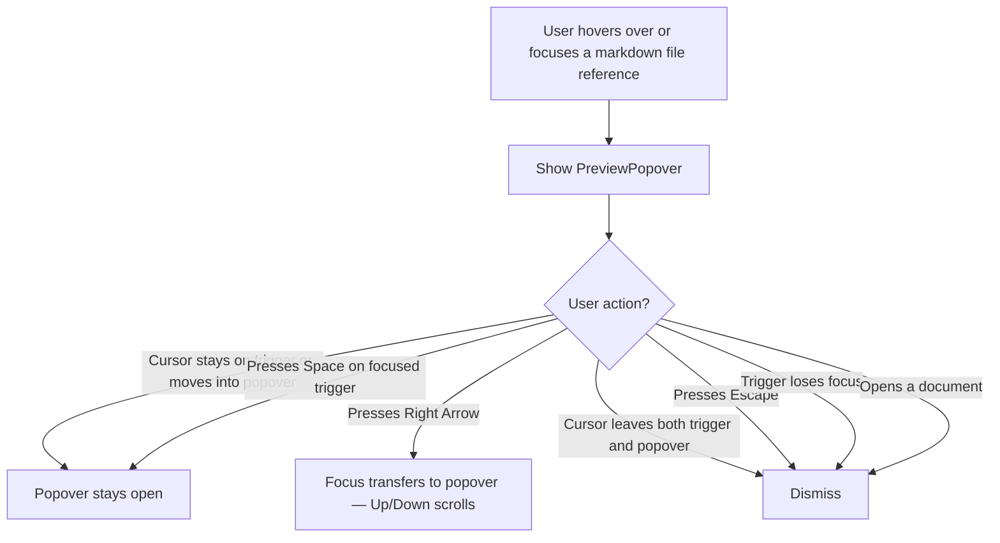
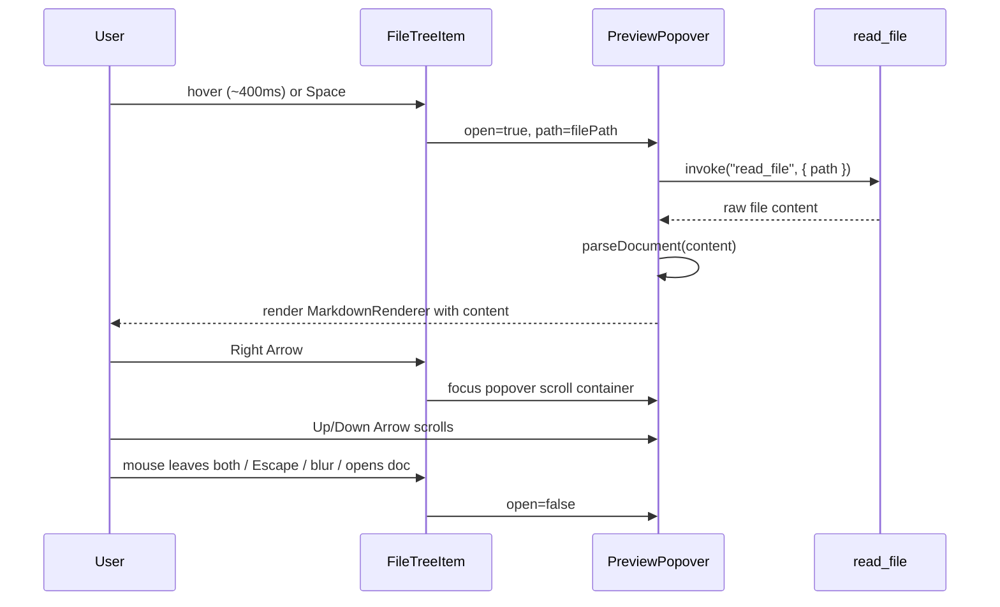

# Enhancement: Preview popover

## Parent feature

`feature-markdown-rendering.md`

## What

A `PreviewPopover` component renders a file's markdown content in a floating popover, triggered by hover or keyboard focus on any file reference in the UI. The popover is scrollable and supports keyboard focus transfer. This PR wires it into the sidebar file tree as the first use case; future surfaces (tabs, search results, etc.) attach the same component to their own triggers.

## Why

Scanning a list of files to find the right document means opening each file to check its contents, then navigating back if it's not the one you need. A hover preview lets users identify document content at a glance without leaving their current view.

## User stories

- Eric can hover over a sidebar file and see its rendered markdown content without opening it
- Eric can press Space on a keyboard-focused sidebar item to show the preview
- Eric can scroll the preview with the mouse wheel when the cursor is over it
- Eric can press Right Arrow from the sidebar to move focus into the preview, then scroll with Up/Down Arrow
- Patricia can move the cursor freely between the sidebar item and the popover without the preview dismissing
- Eric can dismiss the preview by pressing Escape, moving focus away from the trigger, or opening a document

## Design changes

### User flow



Note: hover has a short delay (~400ms) to prevent triggering on fast mouse movement. Space is immediate.

### UI components

#### PreviewPopover

- Built on Radix `Popover` with controlled open state — handles Escape, keyboard accessibility, and focus management; respects the Radix primitive stack so context menus and dialogs dismiss before the popover
- Positioned to the right of the trigger, vertically aligned with it (`side="right"`, `align="start"`)
- Width: `min(previewWidth, 50vw)` — `previewWidth` is a user setting, default `400px`
- Max height: `min(previewHeight, 75vh)` — `previewHeight` is a user setting, default `480px`
- Overflow-y: scrollable (user can scroll with mouse wheel or keyboard after Right Arrow transfers focus)
- Background: `--color-bg-elevated`
- Border: `1px solid var(--color-border-subtle)`
- Border radius: `--radius-lg`
- Shadow: `--shadow-lg`
- Padding: `--space-4`
- Content: `MarkdownRenderer` with `className="prose prose-tiptap dark:prose-invert max-w-none"` at `--font-size-doc-sm` (14px)
- No frontmatter bar — content only
- Loading state: centered `Loader2` spinner while the file loads

#### Settings entries (in settings panel)

- **Preview width** — text input accepting px or % (e.g. `400px`, `50%`), default `400px`, label "Preview width" — used as `min(previewWidth, 50vw)`
- **Preview height** — text input accepting px or % (e.g. `480px`, `75%`), default `480px`, label "Preview height" — used as `min(previewHeight, 75vh)`

The stored value is a CSS length string, applied directly in the `min()` expression. Validation should reject values that aren't valid CSS lengths.

## Technical changes

### Affected files

- `src/components/PreviewPopover.tsx` — new; the popover component
- `src/components/FileTreeItem.tsx` — modified; wires `PreviewPopover` as the first trigger
- `src/config/settings.ts` — modified; add "Editor" category with preview size settings
- `src/lib/preferences.ts` — modified; add `preview_width`, `preview_height` to schema

### Changes

#### System design and architecture

**Component breakdown:**

- **`PreviewPopover.tsx`** — new component. Accepts `path`, `workspacePath`, `open`, `onOpenChange`, and an `anchorRef` for positioning. Renders `Popover.Content` with a scrollable `MarkdownRenderer`. Reads the file via `read_file` when opened; shows `Loader2` while loading. Reads `preview_width` and `preview_height` from preferences for sizing.
- **`FileTreeItem.tsx`** — modified to render `PreviewPopover` alongside the existing button. Manages open state, hover delay timer, and keyboard handlers (Space to open, Right Arrow to focus popover, Escape to close). Only activates for non-directory markdown files.
- **`src/config/settings.ts`** — add a new "Editor" category with a "Preview" section containing `preview_width` and `preview_height` text settings.
- **`src/lib/preferences.ts`** — add `preview_width` and `preview_height` to `PreferencesSchema` with defaults of `"400px"` and `"480px"`.

**Sequence diagram:**



---

#### Introduction and overview

**Prerequisites:**
- ADR-002 (TipTap) — `MarkdownRenderer` is reused as-is
- ADR-003 (Zustand) — preferences store pattern for the new settings
- ADR-010 (Radix UI) — `Popover` primitive for the preview container
- `feature-markdown-rendering.md` — parent feature; `MarkdownRenderer` and the Tauri `read_file` command are consumed directly
- `feature-sidebar-browser.md` — `FileTreeItem` is the first trigger

No API, database, or auth changes. Frontend-only.

**Goals:**
- `PreviewPopover` is a standalone component attachable to any file reference trigger
- Hovering a markdown file item for ~400ms shows the preview
- Pressing Space on a focused markdown file item shows the preview immediately
- The popover dismisses on: mouse leaving both trigger and popover, Escape, trigger blur, document open
- Pressing Right Arrow transfers keyboard focus to the popover
- Preview width and height are user-configurable via settings (CSS length strings, px or %)
- File content is loaded lazily on open — not preloaded

**Non-goals:**
- Preview for non-markdown files (folders, other file types)
- Pinning or detaching the preview
- Showing frontmatter in the preview
- Wiring to surfaces other than the sidebar file tree (future)

#### Detailed design

**`preferences.ts` additions:**

```typescript
export const PreferencesSchema = z.object({
  // existing fields...
  preview_width: z.string().default('400px'),
  preview_height: z.string().default('480px'),
})
```

**`settings.ts` additions:**

```typescript
{
  id: 'editor',
  label: 'Editor',
  icon: FileText,
  order: 2,
  sections: [{
    id: 'preview',
    label: 'Hover preview',
    order: 1,
    settings: [
      { id: 'preview_width', label: 'Preview width', type: 'text', order: 1, defaultValue: '400px' },
      { id: 'preview_height', label: 'Preview height', type: 'text', order: 2, defaultValue: '480px' },
    ],
  }],
}
```

**`FileTreeItem.tsx` changes:**
- For non-directory `.md` files only, render `<PreviewPopover>` alongside the existing `<ContextMenu>` structure
- Manage `open` state, 400ms hover delay timer (`useRef` for timer ID), and keyboard handlers
- `onMouseEnter`: start 400ms timer → `setOpen(true)`
- `onMouseLeave` on trigger: clear timer; close only if mouse is not over the popover (coordinated via a shared `isMouseInPopover` ref passed to `PreviewPopover`)
- `onKeyDown`: Space → `setOpen(true)`; Right Arrow (when open) → focus the popover scroll container; Escape → `setOpen(false)`
- Call `setOpen(false)` in the existing `onSelect` handler when a document is opened

**`PreviewPopover.tsx`:**
- Props: `path: string`, `workspacePath: string`, `open: boolean`, `onOpenChange: (open: boolean) => void`, `onMouseEnter: () => void`, `onMouseLeave: () => void`
- Reads file via `invoke('read_file', { filePath: path, workspacePath })` in a `useEffect` when `open` becomes true; cancels on close
- Parses content via `parseDocument()` from `@/lib/markdown`
- Renders `Popover.Content` with `side="right"`, `align="start"`, `sideOffset={8}`
- Scroll container: `ref={scrollRef}`, `tabIndex={0}` (so Right Arrow from trigger can call `scrollRef.current?.focus()`)
- `MarkdownRenderer` receives `className="prose prose-tiptap dark:prose-invert max-w-none"`
- Sizing: `width: \`min(${previewWidth}, 50vw)\``, `maxHeight: \`min(${previewHeight}, 75vh)\``
- `onMouseEnter` and `onMouseLeave` forwarded to allow the trigger to keep the popover open while mouse is inside

**CSS length validation:**
Input values validated against `/^\d+(\.\d+)?(px|%)$/` before saving. Invalid values rejected with inline error; previous valid value preserved.

**Security:** Content goes through `MarkdownRenderer`/TipTap (ProseMirror schema sanitisation). No new attack surface beyond the existing document viewer.

#### Testing plan

**Unit tests:**
- `PreviewPopover` — renders loading state while file loads; renders `MarkdownRenderer` after load; renders nothing when `open=false`
- `FileTreeItem` — opens popover on Space keydown for markdown files; does not open for directories; closes on document open

**Integration tests:**
- `FileTreeItem` with a markdown file → hover triggers popover after delay
- Popover dismisses when `onSelect` is called

## Task list

- [ ] **Story: Settings infrastructure**
  - [ ] **Task: Add preview_width and preview_height to PreferencesSchema**
    - **Description**: Add `preview_width` and `preview_height` as optional string fields to the Zod schema in `src/lib/preferences.ts`, with defaults of `"400px"` and `"480px"`. Validate that any stored value matches `/^\d+(\.\d+)?(px|%)$/` before accepting it; fall back to the default if invalid.
    - **Acceptance criteria**:
      - [ ] `PreferencesSchema` includes `preview_width: z.string().default('400px')` and `preview_height: z.string().default('480px')`
      - [ ] `DEFAULT_PREFERENCES` reflects the new fields
      - [ ] `parsePreferences` returns defaults for missing or invalid length values
      - [ ] Unit tests cover: valid px, valid %, invalid string, missing field
    - **Dependencies**: None

  - [ ] **Task: Add Editor category with preview settings to settings config**
    - **Description**: Add a new `"editor"` category to `settingsConfig` in `src/config/settings.ts` with a `"preview"` section containing two `"text"` settings: `preview_width` (label "Preview width", default `"400px"`) and `preview_height` (label "Preview height", default `"480px"`).
    - **Acceptance criteria**:
      - [ ] `settingsConfig` contains an `"editor"` category
      - [ ] Category contains a `"preview"` section with `preview_width` and `preview_height` settings
      - [ ] Both settings have `type: "text"` and correct defaults
      - [ ] Settings panel renders the new fields without error
    - **Dependencies**: "Task: Add preview_width and preview_height to PreferencesSchema"

- [ ] **Story: PreviewPopover component**
  - [ ] **Task: Create PreviewPopover.tsx**
    - **Description**: Create `src/components/PreviewPopover.tsx`. The component accepts `path`, `workspacePath`, `open`, `onOpenChange`, `onMouseEnter`, and `onMouseLeave` props. When `open` becomes true, it reads the file via `invoke('read_file', ...)`, parses content with `parseDocument()`, then renders `Popover.Content` (Radix) containing a scrollable `MarkdownRenderer`. Shows a centered `Loader2` while loading. Reads `preview_width` and `preview_height` from preferences to compute `min(width, 50vw)` and `min(height, 75vh)` sizing. The scroll container has `tabIndex={0}` so it can receive keyboard focus.
    - **Acceptance criteria**:
      - [ ] File exists at `src/components/PreviewPopover.tsx`
      - [ ] Renders `Loader2` while file is loading
      - [ ] Renders `MarkdownRenderer` with parsed content after load
      - [ ] Renders nothing visible when `open=false`
      - [ ] Width and max-height computed from preferences with `min()` viewport caps
      - [ ] Scroll container is focusable (`tabIndex={0}`)
      - [ ] `onMouseEnter`/`onMouseLeave` forwarded to `Popover.Content`
      - [ ] Uses `side="right"`, `align="start"`, `sideOffset={8}`
    - **Dependencies**: "Task: Add preview_width and preview_height to PreferencesSchema"

- [ ] **Story: Wire PreviewPopover into FileTreeItem**
  - [ ] **Task: Update FileTreeItem to manage open state and hover/keyboard triggers**
    - **Description**: Add open state management, hover delay logic, and keyboard handlers to `FileTreeItem.tsx` for non-directory `.md` files. Use a `useRef` for the 400ms hover timer. `onMouseEnter` starts the timer; `onMouseLeave` cancels it and closes the popover if the mouse is not inside the popover. `onKeyDown`: Space opens immediately, Right Arrow focuses the popover scroll container when open, Escape closes. `onSelect` closes the popover when a document is opened.
    - **Acceptance criteria**:
      - [ ] `open` state initialises to `false`
      - [ ] Hover on a `.md` file starts a 400ms timer; popover opens after the delay
      - [ ] Moving mouse off the trigger before 400ms cancels the timer (no flash)
      - [ ] Space opens immediately on a focused `.md` file item
      - [ ] Escape closes the popover
      - [ ] Selecting a document closes the popover
      - [ ] Directories never open a popover
      - [ ] Non-`.md` files never open a popover
    - **Dependencies**: None

  - [ ] **Task: Connect PreviewPopover to FileTreeItem**
    - **Description**: Render `PreviewPopover` inside `FileTreeItem` for non-directory `.md` files, passing `open`, `onOpenChange`, `path`, `workspacePath`, and mouse enter/leave handlers. Pass a `scrollRef` callback so `FileTreeItem` can focus the scroll container on Right Arrow.
    - **Acceptance criteria**:
      - [ ] `PreviewPopover` renders adjacent to the file button for `.md` files
      - [ ] `PreviewPopover` is not rendered for directories or non-`.md` files
      - [ ] Right Arrow from the trigger moves focus to the popover scroll container
      - [ ] Mouse can move freely between trigger and popover without closing
      - [ ] Popover stays open while mouse is inside `PreviewPopover`
    - **Dependencies**: "Task: Create PreviewPopover.tsx", "Task: Update FileTreeItem to manage open state and hover/keyboard triggers"

- [ ] **Story: Tests**
  - [ ] **Task: Unit tests for PreviewPopover**
    - **Description**: Write tests in `tests/unit/components/PreviewPopover.test.tsx`. Mock `invoke` and `getHighlighter`. Test: renders loader while loading, renders content after load, renders nothing when closed.
    - **Acceptance criteria**:
      - [ ] Test: `open=false` — `Popover.Content` not visible
      - [ ] Test: `open=true` — `Loader2` shown while `read_file` resolves
      - [ ] Test: `open=true` — `MarkdownRenderer` shown after `read_file` resolves
      - [ ] All tests pass
    - **Dependencies**: "Task: Connect PreviewPopover to FileTreeItem"

  - [ ] **Task: Unit tests for FileTreeItem popover behaviour**
    - **Description**: Extend `tests/unit/FileTreeItem.test.tsx` to cover the new popover trigger logic. Test: Space opens for `.md` file, Space does not open for directory, Escape closes, `onSelect` closes.
    - **Acceptance criteria**:
      - [ ] Test: Space on a `.md` file item sets open state to true
      - [ ] Test: Space on a directory does not open a popover
      - [ ] Test: Escape closes the popover
      - [ ] Test: `onSelect` closes the popover
      - [ ] All tests pass
    - **Dependencies**: "Task: Connect PreviewPopover to FileTreeItem"
