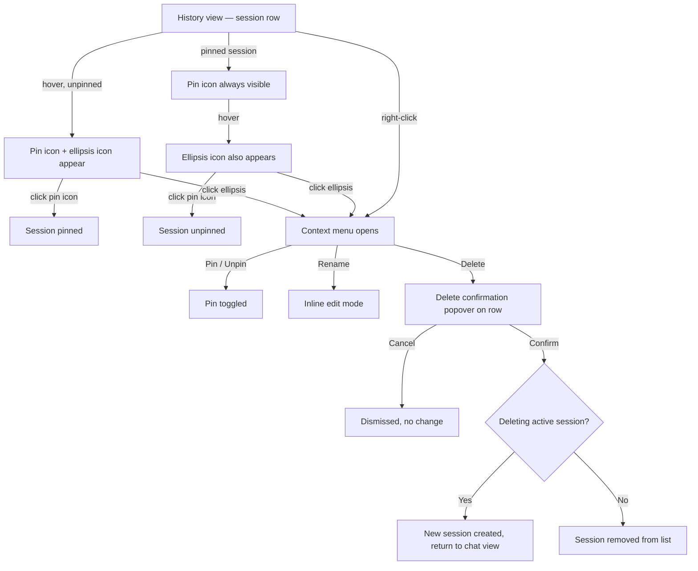
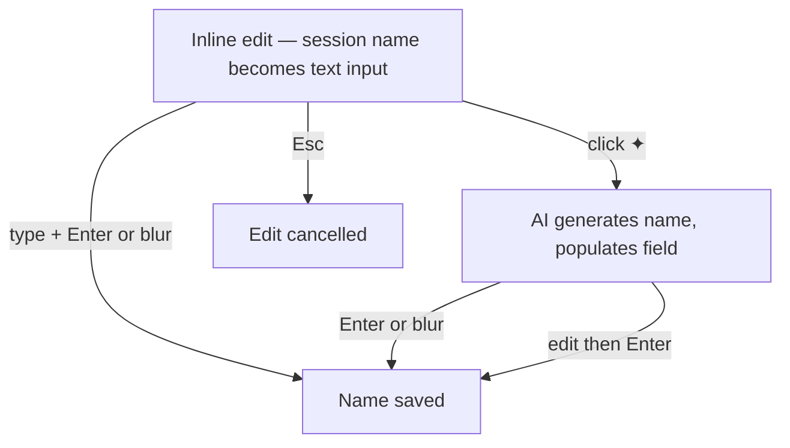
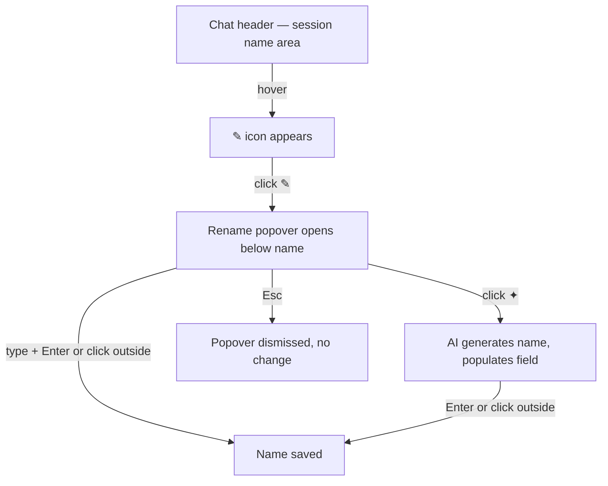
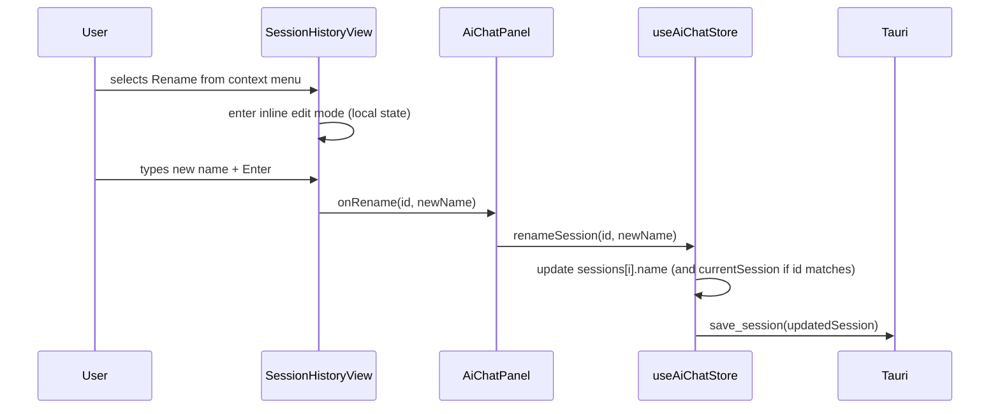
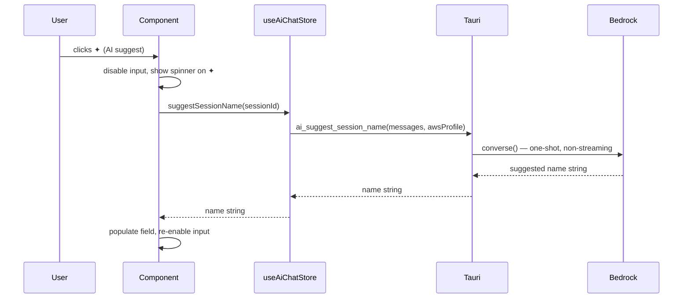

# Enhancement: Session management actions (rename, pin, delete)

## Parent feature

`enhancement-ai-chat-session-history.md` (issue #89) — adds persistent session history with names auto-populated from the first user message, displayed in the history view rows and the chat panel header.

## What

Sessions can be renamed, pinned, and deleted from the history view. The active session's name can also be edited from the chat panel header.

## Why

Sessions are currently named automatically from the first message and cannot be changed, pinned, or removed. For users with many sessions, this makes history hard to navigate — names may be cryptic, and unneeded sessions accumulate without a way to clean them up. Pinning lets users protect important conversations from the 90-day prune; renaming lets them give sessions meaningful titles; deletion gives them direct control over their history.

## User stories

- Patricia can rename a session to something meaningful after the conversation has evolved beyond its auto-generated name
- Eric can pin an important session so it is never removed by the 90-day prune
- Raquel can delete sessions she no longer needs to keep her history clean
- Patricia can rename the active session from the chat panel header without navigating to the history view
- Eric can have AI suggest a name for a session based on its conversation content

## Design changes

### User flows

**History row — pin and context menu:**



**History row — inline rename:**



**Chat header — rename:**



### Key UI components

#### Session row hover actions

The session name area occupies the center of the row. The left edge always reserves space for a pin icon (16px + padding) so rows don't shift on hover — for unpinned sessions this space is transparent until hover. The right edge always reserves space for the ellipsis button. On hover of an unpinned row, both icons become visible. For pinned rows, the pin icon is always visible at full opacity; the ellipsis appears on hover.

#### Session context menu

Radix `ContextMenu` (right-click) and `DropdownMenu` (ellipsis button) share the same menu items: **Pin / Unpin**, **Rename**, **Delete**. The Pin/Unpin label reflects the current state. Selecting Rename enters inline edit mode on the session name. Selecting Delete opens a confirmation popover anchored to the row.

#### Inline rename (history row)

When Rename is selected from the context menu, the session name text is replaced by a text input pre-populated with the current name, with a ✦ (sparkle) button on the right. Enter or blur saves; Esc cancels and restores the original name. Clicking ✦ invokes an AI name suggestion: the ✦ button shows a spinner and the input is disabled while the suggestion loads; once it arrives the field is populated and re-enabled for editing before confirming.

#### Delete confirmation popover

A small Radix `Popover` anchored to the row. When deleting a session that is not the active one, the text reads "Delete this conversation?". When deleting the active session, the text is more specific: "This is your active conversation. Deleting it will start a new one." Both variants have a destructive **Delete** button and a **Cancel** button.

#### Chat header rename

When the user hovers over the session name in the chat header, a `✎` (Pencil icon) appears to its right. Clicking it opens a Radix `Popover` anchored below the name containing a text field pre-populated with the current name and a ✦ AI suggest button. Clicking ✦ invokes an AI name suggestion: the ✦ button shows a spinner and the input is disabled while the suggestion loads; once it arrives the field is populated and re-enabled for editing. Enter or clicking outside saves; Esc cancels.

## Technical changes

### Affected files

- `src-tauri/src/commands/ai.rs` — new `ai_suggest_session_name` command
- `src/stores/aiChat.ts` — new store actions: `renameSession`, `pinSession`, `deleteSession`, `suggestSessionName`
- `src/components/SessionHistoryView.tsx` — add hover row actions, context menu, inline rename, delete confirmation popover
- `src/components/ChatView.tsx` — add hover state on session name, pencil icon, rename popover
- `src/components/AiChatPanel.tsx` — wire new callbacks to `SessionHistoryView`
- `tests/unit/components/SessionHistoryView.test.tsx` — extend with new interaction tests
- `tests/unit/components/ChatView.test.tsx` — extend with rename popover tests
- `tests/unit/stores/aiChat.test.ts` — extend with new action tests

### Changes

#### System design and architecture

**Component breakdown (delta from parent):**

- **`commands/ai.rs`** — new `ai_suggest_session_name(messages, aws_profile)` command; uses `client.converse()` (non-streaming); sends a minimal system prompt asking for a 5-word-or-fewer session name; returns the name string
- **`useAiChatStore`** — four new actions: `renameSession`, `pinSession`, `deleteSession`, `suggestSessionName`; `deleteSession` calls `newSession()` internally when the deleted id matches `currentSession.id`
- **`SessionHistoryView.tsx`** — gains local hover state per row, inline rename edit state, and four new callback props: `onRename`, `onPin`, `onDelete`, `onSuggestName`
- **`ChatView.tsx`** — session name in header gains hover state and a Pencil icon; clicking opens a Radix `Popover` with rename + AI suggest
- **`AiChatPanel.tsx`** — wires the four new callbacks to `SessionHistoryView`; handles `onDelete` navigation (calls `setView("chat")` when the deleted session is the active one)

**Sequence diagrams:**





```mermaid
sequenceDiagram
    participant User
    participant SessionHistoryView
    participant AiChatPanel
    participant Store as useAiChatStore
    participant Tauri

    User->>SessionHistoryView: confirms Delete (active session)
    SessionHistoryView->>AiChatPanel: onDelete(id)
    AiChatPanel->>Store: deleteSession(id)
    Store->>Tauri: delete_session(id)
    Store->>Store: remove from sessions[]; call newSession() (id === currentSession.id)
    AiChatPanel->>AiChatPanel: setView("chat")
```

---

#### Detailed design

**New Tauri command — `ai_suggest_session_name`**

```rust
// commands/ai.rs
#[tauri::command]
pub async fn ai_suggest_session_name(
    messages: Vec<CanonicalMessage>,
    aws_profile: String,
) -> Result<String, String>
```

- Validates `aws_profile` using existing `validate_aws_profile()`
- Returns `Err` if `messages` is empty (frontend disables ✦ when session has no messages)
- Builds a Bedrock client using the same pattern as `ai_chat`
- Sends a single `converse()` call (non-streaming) with system prompt: *"Based on the following conversation, suggest a short session name (5 words or fewer). Respond with only the name — no punctuation, no quotes, no explanation."*
- Returns the text content of the first response block, trimmed

**New store actions**

```typescript
renameSession: (id: string, name: string) => Promise<void>
// updates sessions[i].name; also updates currentSession if id matches; calls save_session

pinSession: (id: string, pinned: boolean) => Promise<void>
// calls pin_session Tauri command; updates sessions[i].pinned in local state

deleteSession: (id: string) => Promise<void>
// calls delete_session Tauri command; removes from sessions[];
// if id === currentSession.id, calls newSession()

suggestSessionName: (sessionId: string) => Promise<string>
// looks up session by id; calls ai_suggest_session_name with messages_compacted;
// returns suggested name string (does not apply it — caller decides)
```

**`SessionHistoryView` new props**

```typescript
onRename: (id: string, name: string) => void
onPin: (id: string, pinned: boolean) => void
onDelete: (id: string) => void
onSuggestName: (id: string) => Promise<string>
```

The ✦ button is disabled when `session.messages_compacted.length === 0`.

---

#### Security, privacy, and compliance

No new attack surface. `ai_suggest_session_name` uses the same `validate_aws_profile` guard and Bedrock client pattern as `ai_chat`. `renameSession` accepts a free-text string — no backend validation needed beyond the existing `save_session` path (local file write, no injection risk). `deleteSession` and `pinSession` pass a session id to existing Tauri commands that already handle unknown ids as a no-op.

#### Observability

No new logging beyond what's already covered by existing commands. `save_session`, `pin_session`, and `delete_session` all have existing DEBUG/INFO logging. Add `INFO` log in `ai_suggest_session_name` on success (session id only, not content) and `ERROR` on Bedrock failure, consistent with existing patterns.

#### Testing plan

**Store (Vitest — `aiChat.test.ts`):**
- `renameSession`: updates `sessions[i].name`; updates `currentSession.name` when ids match; calls `save_session`
- `pinSession`: updates `sessions[i].pinned`; calls `pin_session` Tauri command
- `deleteSession`: removes session from `sessions[]`; calls `newSession()` when deleting active session
- `suggestSessionName`: returns string from Tauri command

**`SessionHistoryView.test.tsx`:**
- Pin icon always visible for pinned sessions; visible on hover for unpinned
- Clicking pin icon calls `onPin` with toggled value
- Context menu opens on ellipsis click and on right-click
- Rename enters inline edit; Enter calls `onRename`; Esc cancels
- ✦ disabled when session has no messages; calls `onSuggestName` when clicked; input disabled during loading
- Delete confirmation shows generic text for inactive session; specific text for active session
- Confirm delete calls `onDelete`

**`ChatView.test.tsx`:**
- ✎ icon appears on hover of session name
- Clicking ✎ opens rename popover; Enter saves; Esc cancels
- ✦ in popover triggers suggestion, disables input during loading

**Rust (`commands/ai.rs`):**
- `ai_suggest_session_name`: returns `Err` on invalid profile
- `ai_suggest_session_name`: returns `Err` on empty messages

#### Alternatives considered

- **Reuse `ai_chat` for name suggestion**: rejected — `ai_chat` is streaming, tool-use-aware, and tied to the session message history; routing a one-shot utility call through it is heavyweight and would pollute the session state
- **Client-side name generation (no LLM)**: rejected — truncating the first message is already the auto-population approach; AI suggestion adds distinct value by summarizing the full conversation

#### Risks

- **AI suggestion latency**: Bedrock `converse()` may take 2–5s; mitigated by disabled input + spinner, and Esc to cancel
- **`renameSession` currentSession sync**: must update both `sessions[i]` and `currentSession` when ids match, or the chat header will show a stale name; covered by unit test

---

#### Introduction and overview

**Prerequisites:**
- ADR-001 (Tauri), ADR-003 (Zustand), ADR-004 (Tailwind), ADR-010 (Radix UI)
- `feature-ai-chat-sessions.md` — `save_session`, `pin_session`, `delete_session` Tauri commands all implemented
- `enhancement-ai-chat-session-history.md` — `Session` type with `name`/`pinned` fields, `SessionHistoryView`, history view UI all implemented

**Technical goals:**
- Rename, pin, and delete persist in <100ms (no new Tauri round-trips beyond existing `save_session`/`pin_session`/`delete_session`)
- AI name suggestion returns in under 5s under normal network conditions
- Deleting the active session leaves no inconsistent UI state

**Non-goals:**
- Bulk actions (delete all, unpin all)
- Undo for delete
- Keyboard shortcuts for these actions (deferred to keyboard shortcuts feature)

**Glossary:**
- **active session** — the session currently loaded in `currentSession`; may be in-progress or just resumed
- **inactive session** — any session in `sessions[]` that is not `currentSession`

**Key design decision — AI name suggestion:** The existing `ai_chat` command is streaming and designed for multi-turn conversations with tool use. A name suggestion is a one-shot, non-streaming call. The simplest approach is a new lightweight `ai_suggest_session_name` Tauri command that uses the Bedrock `converse()` API (not `converse_stream()`) and returns a plain string. This keeps the existing chat flow unaffected and avoids routing a single-turn utility call through the streaming infrastructure.

## Task list

- [x] **Story: AI name suggestion Tauri command**
  - [x] **Task: Implement `ai_suggest_session_name` in `commands/ai.rs`**
    - **Description**: Add a new non-streaming `#[tauri::command]` function `ai_suggest_session_name(messages: Vec<CanonicalMessage>, aws_profile: String)` in `commands/ai.rs`. Validate `aws_profile` using the existing `validate_aws_profile()` helper. Return `Err` if `messages` is empty. Build an AWS config and Bedrock client using the same pattern as `ai_chat`. Call `client.converse()` (not `converse_stream()`) with a system prompt: "Based on the following conversation, suggest a short session name (5 words or fewer). Respond with only the name — no punctuation, no quotes, no explanation." Pass the messages converted to Bedrock format (text blocks only; skip non-text blocks as in `ai_chat`). Extract and return the text content of the first response block, trimmed.
    - **Acceptance criteria**:
      - [x] Returns `Err("messages must not be empty")` when messages is empty
      - [x] Returns `Err` on invalid `aws_profile` (via `validate_aws_profile`)
      - [x] Returns a non-empty trimmed string on success
      - [x] Uses `client.converse()`, not `converse_stream()`
      - [x] Rust unit test: returns `Err` on invalid profile
      - [x] Rust unit test: returns `Err` on empty messages
      - [x] App compiles with no errors
    - **Dependencies**: None

  - [x] **Task: Register `ai_suggest_session_name` in `lib.rs`**
    - **Description**: Add `commands::ai::ai_suggest_session_name` to the `invoke_handler` in `lib.rs`, following the same pattern as existing commands.
    - **Acceptance criteria**:
      - [x] Command callable from frontend via `invoke("ai_suggest_session_name", ...)`
      - [x] App compiles and existing commands unaffected
    - **Dependencies**: "Task: Implement `ai_suggest_session_name` in `commands/ai.rs`"

- [x] **Story: Store session management actions**
  - [x] **Task: Add `renameSession`, `pinSession`, `deleteSession`, `suggestSessionName` to `useAiChatStore`**
    - **Description**: Add four new actions to `useAiChatStore` and the `AiChatStore` interface:
      - `renameSession(id, name)`: find session in `sessions[]` by id; update its `name`; if id matches `currentSession.id`, also update `currentSession.name`; call `invoke("save_session", { session: updatedSession })`
      - `pinSession(id, pinned)`: call `invoke("pin_session", { id, pinned })`; update `sessions[i].pinned` in local state
      - `deleteSession(id)`: call `invoke("delete_session", { id })`; remove session from `sessions[]`; if id matches `currentSession.id`, call `get().newSession()`
      - `suggestSessionName(sessionId)`: find session by id in `sessions[]`; call `invoke<string>("ai_suggest_session_name", { messages: session.messages_compacted, awsProfile: get().awsProfile })`; return the resulting string
    - **Acceptance criteria**:
      - [x] `renameSession`: updates `sessions[i].name` for matching id
      - [x] `renameSession`: updates `currentSession.name` when id matches `currentSession.id`
      - [x] `renameSession`: calls `save_session` with the updated session
      - [x] `pinSession`: calls `pin_session` Tauri command; updates `sessions[i].pinned` in local state
      - [x] `deleteSession`: removes session from `sessions[]`
      - [x] `deleteSession`: calls `newSession()` when deleting the active session
      - [x] `suggestSessionName`: returns string from Tauri command
      - [x] All four actions added to the `AiChatStore` interface
      - [x] Unit tests cover all acceptance criteria above
    - **Dependencies**: "Task: Register `ai_suggest_session_name` in `lib.rs`"

- [x] **Story: Session history row actions**
  - [x] **Task: Add pin icon and ellipsis button with hover behavior**
    - **Description**: In `SessionHistoryView`, add per-row hover state using Tailwind `group` class and `group-hover:` utilities. Add a `Pin` (or `PinOff`) Lucide icon on the left of the row content — always visible at full opacity for pinned sessions, visible on hover for unpinned, but always occupying space so rows don't shift. Add an `Ellipsis` Lucide icon on the right — visible on hover for all rows, always occupying space. Clicking the pin icon calls `onPin(session.id, !session.pinned)` directly (no menu required).
    - **Acceptance criteria**:
      - [x] Pin icon space always reserved; icon visible without hover for pinned sessions; icon appears on hover for unpinned
      - [x] Ellipsis space always reserved; icon appears on hover for all rows
      - [x] Clicking pin icon calls `onPin` with the toggled `pinned` value
      - [x] Row layout does not shift on hover
      - [x] Unit tests: pin visible for pinned without hover; pin visible on hover for unpinned; `onPin` called with correct args
    - **Dependencies**: "Task: Add `renameSession`, `pinSession`, `deleteSession`, `suggestSessionName` to `useAiChatStore`"

  - [x] **Task: Add context menu to session rows**
    - **Description**: Wrap each session row in a Radix `ContextMenu` (right-click trigger). Wire the `Ellipsis` button from the previous task to open a Radix `DropdownMenu` with the same items. Menu items: **Pin** / **Unpin** (label reflects current state, calls `onPin`), **Rename** (sets local `renamingId` state), **Delete** (sets local `deletingId` state). Style the Delete item text with `--color-state-danger`.
    - **Acceptance criteria**:
      - [x] Right-clicking the row opens the context menu
      - [x] Clicking the ellipsis button opens the dropdown menu
      - [x] Both menus contain Pin/Unpin, Rename, and Delete items
      - [x] Pin/Unpin label reflects current pinned state
      - [x] Selecting Pin/Unpin calls `onPin` with the toggled value
      - [x] Selecting Rename enters inline edit mode (Task 5)
      - [x] Delete item styled with danger color
      - [x] Unit tests: context menu opens on right-click; dropdown opens on ellipsis click; all items present; pin calls `onPin`; rename enters edit mode
    - **Dependencies**: "Task: Add pin icon and ellipsis button with hover behavior"

  - [x] **Task: Implement inline rename with AI suggest**
    - **Description**: When `renamingId` matches a session's id, replace the session name `<p>` with a text `<input>` pre-populated with the current name, and a ✦ (Sparkle) button to its right. On Enter or blur: call `onRename(session.id, inputValue)` and clear `renamingId`. On Esc: clear `renamingId` without calling `onRename`. On ✦ click: set `isSuggestingId` state, call `onSuggestName(session.id)`, await the result, populate the input, clear `isSuggestingId`. While suggestion is loading: disable the input and show a `Loader2` spinner in place of the ✦ icon. Disable ✦ when `session.messages_compacted.length === 0`.
    - **Acceptance criteria**:
      - [x] Input pre-populated with current session name
      - [x] Enter calls `onRename` with new value and exits edit mode
      - [x] Blur calls `onRename` with current value and exits edit mode
      - [x] Esc exits edit mode without calling `onRename`
      - [x] ✦ disabled when session has no messages
      - [x] ✦ click calls `onSuggestName`; input disabled and spinner shown while loading; input populated and re-enabled on resolution
      - [x] Unit tests cover all cases above
    - **Dependencies**: "Task: Add context menu to session rows"

  - [x] **Task: Implement delete confirmation popover**
    - **Description**: When `deletingId` matches a session's id, show a Radix `Popover` anchored to that row. If the session id matches `currentSessionId`, text reads: "This is your active conversation. Deleting it will start a new one." Otherwise: "Delete this conversation?" Both variants include a destructive **Delete** button (calls `onDelete(session.id)`, clears `deletingId`) and a **Cancel** button (clears `deletingId`). Style the Delete button with `--color-state-danger`.
    - **Acceptance criteria**:
      - [x] Shows "Delete this conversation?" for inactive sessions
      - [x] Shows active-session-specific text when id matches `currentSessionId`
      - [x] Delete button calls `onDelete` with correct id and closes popover
      - [x] Cancel closes popover without calling `onDelete`
      - [x] Unit tests cover both text variants and both button actions
    - **Dependencies**: "Task: Add context menu to session rows"

  - [x] **Task: Wire new callbacks in `AiChatPanel`**
    - **Description**: Pass the four new props to `SessionHistoryView` from `AiChatPanel`: `onRename` calls `renameSession`, `onPin` calls `pinSession`, `onSuggestName` calls `suggestSessionName`, `onDelete` calls `deleteSession` and — if the deleted id matches `currentSession?.id` — also calls `setView("chat")`.
    - **Acceptance criteria**:
      - [x] All four props wired to the corresponding store actions
      - [x] `setView("chat")` called after deleting the active session
      - [x] TypeScript compiles with no errors
    - **Dependencies**: "Task: Implement inline rename with AI suggest", "Task: Implement delete confirmation popover"

- [x] **Story: Chat header rename**
  - [x] **Task: Add rename popover to chat header in `ChatView`**
    - **Description**: In `ChatView`, wrap the session name `<span>` and `MessageSquare` icon in a Tailwind `group`. On hover, show a `Pencil` icon button to the right of the name. Clicking the button opens a Radix `Popover` anchored below containing: a text input pre-populated with `currentSession.name`, and a ✦ (Sparkle) button. On Enter or clicking outside the popover: call `renameSession(currentSession.id, inputValue)` from the store and close the popover. On Esc: close without saving. On ✦ click: call `suggestSessionName(currentSession.id)`, disable input and show `Loader2` spinner while loading, populate field on resolution. Disable ✦ when `currentSession.messages_compacted.length === 0`.
    - **Acceptance criteria**:
      - [x] Pencil icon appears on hover of the session name area
      - [x] Clicking Pencil opens rename popover below the header
      - [x] Input pre-populated with current session name
      - [x] Enter calls `renameSession` and closes popover
      - [x] Clicking outside calls `renameSession` and closes popover
      - [x] Esc closes popover without saving
      - [x] ✦ disabled when session has no messages
      - [x] ✦ click triggers suggestion; input disabled during loading; field populated on resolution
      - [x] Chat header updates reactively after rename (store subscription)
      - [x] Unit tests cover all cases above
    - **Dependencies**: "Task: Add `renameSession`, `pinSession`, `deleteSession`, `suggestSessionName` to `useAiChatStore`"
