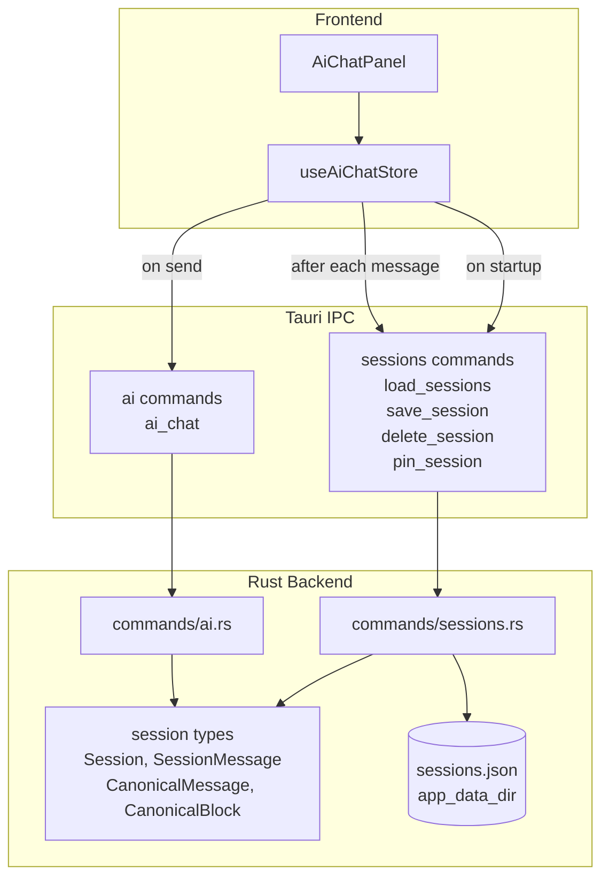
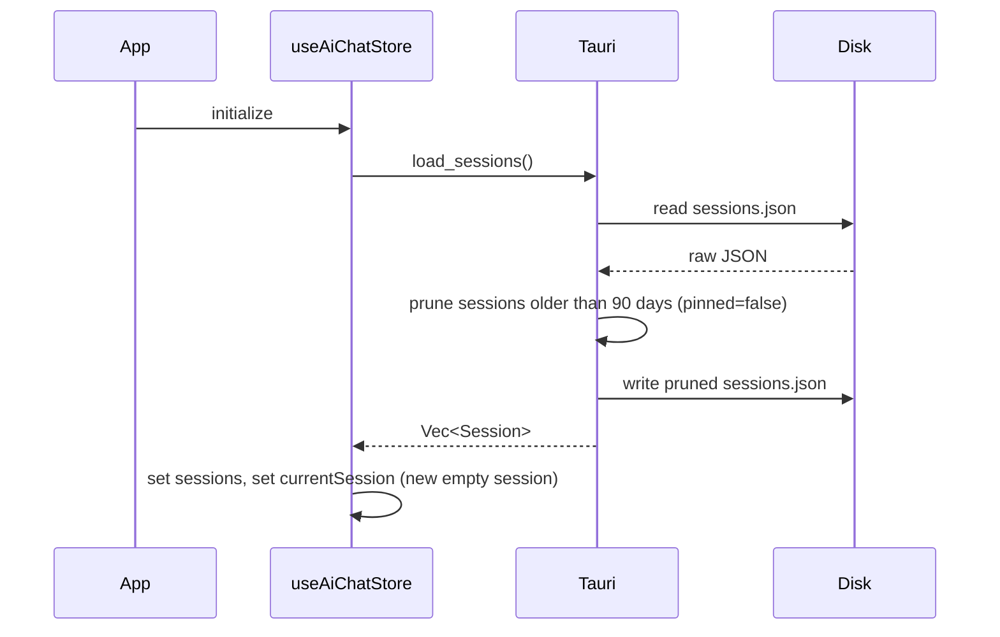
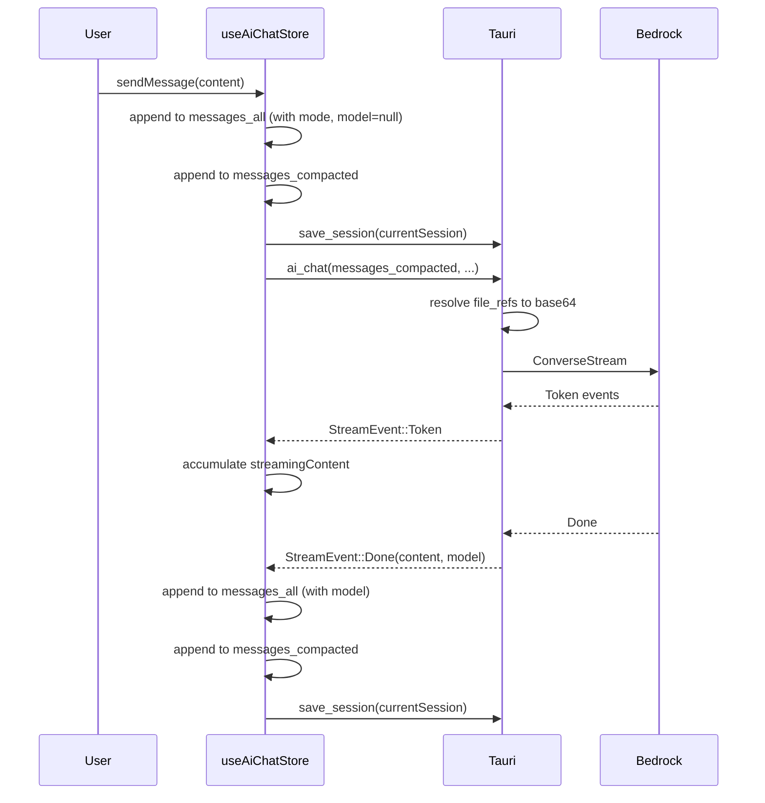

# AI chat sessions

## What

The AI chat assistant gains a persistent session model. Each conversation is a discrete session — a named unit with its own message history, timestamps, and last-active mode. Sessions are saved to disk automatically as the user interacts, so conversations survive app restarts. Users always have a current session in progress; starting a new conversation creates a new session rather than erasing the old one. Sessions older than 90 days are pruned automatically to keep storage bounded.

## Why

Today, every app restart wipes the AI conversation. There's no way to pick up where you left off, reference what was discussed yesterday, or understand what mode was active when a particular exchange happened. For users working on long-lived documents — a product description across multiple sessions, a technical design under active review — this means repeatedly re-establishing context with the AI. It also means there's no record of the AI's contributions to the document lifecycle.

Persistent sessions make the AI a genuine collaborator rather than a stateless tool. Conversations become part of the document's history, and users can return to any thread with full context intact.

## Personas

Inherited from `feature-ai-chat-assistant.md`.

## Narratives

*(skipped — backend-only feature)*

## User stories

*(skipped — backend-only feature)*

## Goals

- Sessions survive app restarts with no data loss
- Save latency is imperceptible — write to disk completes in <100ms
- Load time at startup is <200ms for up to 500 sessions
- Storage stays bounded — 90-day pruning keeps the sessions file manageable

## Non-goals

- Session history UI (issue #89)
- Context compaction (issue #91)
- Prompt caching (issue #92)
- Cloud sync or cross-device session access
- User-facing session naming or organization

## Design spec

*(Added by design specs stage)*

## Tech spec

### System design and architecture

**High-level architecture**

Sessions slot into the existing Tauri architecture alongside preferences — a new Rust module handles disk I/O via Tauri commands, and the existing `useAiChatStore` is extended with session state.



**Component breakdown**

- **`commands/sessions.rs`** (new) — four Tauri commands: `load_sessions`, `save_session`, `delete_session`, `pin_session`. Owns the sessions file path (via `app_data_dir()`), upsert/prune logic, and file I/O. Follows the same pattern as `commands/preferences.rs`.
- **`src-tauri/src/session.rs`** (new) — canonical Rust types: `Session`, `SessionMessage`, `CanonicalMessage`, `CanonicalBlock`, `ImageSource`. Shared by `commands/sessions.rs` and `commands/ai.rs` (the call layer converts `CanonicalMessage` to provider wire format here).
- **`commands/ai.rs`** (modified) — `ai_chat` receives `messages_compacted: Vec<CanonicalMessage>` instead of `Vec<ChatMessage>`; resolves `file_ref` and path-based image sources before building Bedrock messages. `ChatMessage` is replaced by `CanonicalMessage`.
- **`useAiChatStore`** (modified) — gains `currentSession: Session | null`, `sessions: Session[]`, and actions: `loadSessions`, `saveCurrentSession`, `newSession`. `sendMessage` appends to both `messages_all` and `messages_compacted` and saves after each turn. `clearConversation` is replaced by `newSession`.
- **`src/lib/session.ts`** (new) — TypeScript types mirroring the Rust structs, shared across the store and any future session UI. Includes `SessionScope` discriminated union.

**Sequence diagrams**

App startup:


Send message:


---

### Introduction and overview

**Prerequisites**
- ADR-001 (Tauri) — Rust backend handles all persistence; session file lives alongside `preferences.json` in `app_data_dir()`
- ADR-003 (Zustand) — frontend state management pattern for session state
- `feature-ai-chat-assistant.md` — existing `ChatMessage` type and `useAiChatStore` being extended

**Technical goals**
- `save_session` completes in <100ms (single file write, JSON serialization)
- `load_sessions` completes in <200ms for up to 500 sessions
- No data loss: session is persisted after every user message, assistant response, and mode switch
- `messages_compacted` serializes without loss to Bedrock, Anthropic, and OpenAI wire formats

**Non-goals**
- Session history UI, including pin/delete controls (issue #89) — `pinned: bool` is defined in the data model so pinned sessions survive pruning, but the UI to pin or delete sessions is deferred
- Context compaction (issue #91) — `messages_compacted` is designed to support it but compaction logic is not implemented here
- Prompt caching (issue #92)
- Multi-modal content rendering — `CanonicalBlock` types are defined here but the UI to compose or display non-text blocks is out of scope
- Migration of pre-existing in-memory conversations to disk

**Glossary**
- **Session** — a discrete conversation with its own ID, message history, and timestamps
- **`messages_all`** — the complete append-only message history; used for display and scrolling; never modified after a message is written
- **`messages_compacted`** — the LLM-facing message array in canonical format; structurally identical to `messages_all` at session start; overwritten entirely by compaction (issue #91)
- **`SessionMessage`** — a single entry in `messages_all`; includes display-only metadata (`mode`, `model`) not present in `messages_compacted`
- **`CanonicalMessage`** — a single entry in `messages_compacted`; `{role, content: Vec<CanonicalBlock>}`; convertible to any provider's wire format
- **`CanonicalBlock`** — provider-agnostic content block; one of `text`, `image`, or `file_ref`; `file_ref` and path-based image sources are resolved to base64 at call time, not at storage time
- **pinned** — a boolean flag on a session; pinned sessions are excluded from 90-day pruning and cannot be deleted by the prune sweep (only by explicit user action)
- **mode** — a mode ID (string reference into the app's mode registry); recorded on each `SessionMessage` to capture which mode's system prompt was active when the message was sent
- **model** — the model identifier string (e.g. `us.anthropic.claude-sonnet-4-6`) recorded on assistant `SessionMessage`s

### Detailed design

#### Data model

Rust types in `src-tauri/src/session.rs`:

```rust
#[derive(Serialize, Deserialize, Clone, Debug)]
#[serde(tag = "type", rename_all = "snake_case")]
pub enum SessionScope {
    Document { path: String },  // absolute path to the document
    Workspace,
}

#[derive(Serialize, Deserialize, Clone, Debug)]
pub struct Session {
    pub id: String,
    pub created_at: String,       // ISO 8601
    pub last_active_at: String,   // ISO 8601; updated on every save
    pub last_mode: String,        // mode ID of most recent message
    pub scope: SessionScope,      // set at creation; never changes
    pub pinned: bool,
    pub messages_all: Vec<SessionMessage>,
    pub messages_compacted: Vec<CanonicalMessage>,
}

#[derive(Serialize, Deserialize, Clone, Debug)]
pub struct SessionMessage {
    pub role: String,             // "user" | "assistant"
    pub content: Vec<CanonicalBlock>,
    pub mode: Option<String>,     // mode ID active when sent
    pub model: Option<String>,    // model ID; set on assistant messages only
}

#[derive(Serialize, Deserialize, Clone, Debug)]
pub struct CanonicalMessage {
    pub role: String,             // "user" | "assistant"
    pub content: Vec<CanonicalBlock>,
}

#[derive(Serialize, Deserialize, Clone, Debug)]
#[serde(tag = "type", rename_all = "snake_case")]
pub enum CanonicalBlock {
    Text { text: String },
    Image { media_type: String, source: ImageSource },
    FileRef { path: String, name: String, media_type: String },
}

#[derive(Serialize, Deserialize, Clone, Debug)]
#[serde(tag = "type", rename_all = "snake_case")]
pub enum ImageSource {
    Base64 { data: String },
    Path { path: String },  // workspace-relative; resolved to base64 at call time
}
```

TypeScript types in `src/lib/session.ts` mirror the above:

```typescript
export type SessionScope =
  | { type: "document"; path: string }  // absolute path to the document
  | { type: "workspace" };

export interface Session {
  id: string;
  created_at: string;
  last_active_at: string;
  last_mode: string;
  scope: SessionScope;      // set at creation; never changes
  pinned: boolean;
  messages_all: SessionMessage[];
  messages_compacted: CanonicalMessage[];
}

export interface SessionMessage {
  role: "user" | "assistant";
  content: CanonicalBlock[];
  mode: string | null;
  model: string | null;
}

export interface CanonicalMessage {
  role: "user" | "assistant";
  content: CanonicalBlock[];
}

export type CanonicalBlock =
  | { type: "text"; text: string }
  | { type: "image"; media_type: string; source: ImageSource }
  | { type: "file_ref"; path: string; name: string; media_type: string };

export type ImageSource =
  | { type: "base64"; data: string }
  | { type: "path"; path: string };
```

Sessions are persisted to `app_data_dir()/sessions.json` as a JSON array of `Session` objects, following the same pattern as `preferences.json`.

#### Tauri command contracts

**`load_sessions() -> Result<Vec<Session>, String>`**
- Reads `sessions.json`; returns empty vec if file does not exist
- Prunes: removes sessions where `pinned == false` AND `last_active_at` is older than 90 days
- Writes pruned list back to disk before returning
- Returns the surviving sessions

**`save_session(session: Session) -> Result<(), String>`**
- Reads current `sessions.json`
- Upserts by `id`: replaces the existing entry if found, appends if not
- Writes back to disk

**`delete_session(id: String) -> Result<(), String>`**
- Reads current `sessions.json`
- Removes the entry with matching `id`
- Writes back to disk

**`pin_session(id: String, pinned: bool) -> Result<(), String>`**
- Reads current `sessions.json`
- Sets `pinned` on the matching entry
- Writes back to disk

#### StreamEvent changes

`StreamEvent::Done` is extended to carry the model ID so the store can record it on the assistant `SessionMessage`:

```rust
pub enum StreamEvent {
    Token(String),
    Done { content: String, model: String },
    Error(String),
    DocumentUpdated(String),
}
```

#### Key algorithms

**Prune on load** (runs inside `load_sessions`):
```
cutoff = now() - 90 days
surviving = sessions.filter(|s| s.pinned || s.last_active_at > cutoff)
write surviving to disk
return surviving
```

**Upsert** (used by `save_session`):
```
sessions = read_or_default()
match sessions.iter().position(|s| s.id == session.id) {
  Some(i) => sessions[i] = session,
  None    => sessions.push(session),
}
write sessions to disk
```

**`file_ref` resolution** (in `commands/ai.rs`, before building Bedrock messages):
```
for each CanonicalBlock::FileRef { path, media_type, .. }:
  abs_path = canonicalize(workspace_path.join(path))
  assert abs_path starts_with workspace_path  // path traversal guard
  data = base64::encode(fs::read(abs_path))
  replace block with CanonicalBlock::Image { media_type, source: ImageSource::Base64 { data } }

for each CanonicalBlock::Image { source: ImageSource::Path { path }, .. }:
  same resolution as above
```

#### Store changes

New fields and actions added to `useAiChatStore`:

```typescript
// New state
currentSession: Session | null
sessions: Session[]

// New actions
loadSessions: () => Promise<void>       // called on app startup
saveCurrentSession: () => Promise<void> // called after each message and mode switch
newSession: () => void                  // replaces clearConversation
```

`sendMessage` is updated to:
1. Build user `SessionMessage` (role, content, mode, model: null)
2. Append to `currentSession.messages_all` and `currentSession.messages_compacted`
3. Call `saveCurrentSession`
4. Invoke `ai_chat` with `currentSession.messages_compacted`
5. On `Done { content, model }`: build assistant `SessionMessage`, append to both arrays, call `saveCurrentSession`

### Security, privacy, and compliance

**Authentication and authorization**: N/A — single-user local desktop app. Sessions are stored in `app_data_dir()`, which is user-scoped by the OS.

**Data privacy**: `sessions.json` contains full conversation history, including document content sent to the LLM as context. This is sensitive data at rest. No additional encryption is applied beyond OS-level file permissions — consistent with how `preferences.json` is handled. Users should be aware that deleting `sessions.json` permanently removes all conversation history.

**Input validation**:
- `delete_session` and `pin_session` accept a session `id`; validate it is a non-empty string before use (UUID format preferred but not strictly enforced — the only risk is a no-op if the id doesn't match)
- `file_ref` resolution applies the same path traversal guard already used in `execute_write_file`: canonicalize the resolved path and assert it starts with `workspace_path` before reading

**No new attack surface**: `save_session` and `load_sessions` operate entirely on local files with no network calls. The only externally-sourced data written to disk is LLM response content, which is already trusted in the existing chat flow.

### Observability

**Logging** (via existing `tauri-plugin-log`):
- `INFO`: session created (id only), session loaded (count returned, count pruned)
- `INFO`: `file_ref` resolved (path, no content)
- `ERROR`: file read/write failures for `sessions.json`
- `DEBUG`: save duration (for performance tracking against <100ms goal)

**Metrics**: deferred (per `app.md` operations decisions)

**Alerting**: N/A for desktop app

### Testing plan

**Unit tests (Rust)**:
- `load_sessions`: returns empty vec when file does not exist
- `load_sessions`: prunes sessions older than 90 days where `pinned == false`
- `load_sessions`: preserves pinned sessions older than 90 days
- `save_session`: creates file on first save
- `save_session`: upserts correctly — replaces existing session by id, appends new session
- `delete_session`: removes correct session by id, no-ops on unknown id
- `pin_session`: toggles `pinned` field correctly
- `file_ref` resolution: resolves path-relative file refs to base64
- `file_ref` resolution: rejects path traversal attempts

**Unit tests (Vitest)**:
- `useAiChatStore`: `newSession` creates a session with a new UUID and empty message arrays
- `useAiChatStore`: `sendMessage` appends to both `messages_all` and `messages_compacted`
- `useAiChatStore`: assistant response recorded with correct `model` from `Done` event
- `useAiChatStore`: `saveCurrentSession` called after user message and after assistant response
- `CanonicalBlock` TypeScript types parse correctly from JSON (text, image, file_ref variants)

**Integration tests**:
- Full send-message flow: user message + assistant response persisted to sessions.json
- Load after save: session round-trips without data loss
- Prune on load: expired sessions absent after reload

**E2E tests**: deferred — session persistence is not directly observable in the UI until issue #89

### Alternatives considered

**SQLite instead of JSON file**: Would provide better query performance and atomic writes. Rejected — the existing app uses JSON for preferences and the session list is small enough (~500 entries) that full-file reads and writes are well within the performance goals. SQLite would add a dependency (tower-llm considered this) with no meaningful benefit at this scale.

**Separate file per session**: Would avoid full-file rewrites on every save. Rejected — at the expected session count and size, a single file is simpler to manage, easier to back up, and consistent with the preferences pattern. Revisit if sessions grow very large (e.g., due to embedded base64 image data).

**Embedding base64 content at storage time**: Would make sessions self-contained. Rejected — storing `file_ref` and path-based image sources as references keeps `sessions.json` small and avoids duplicating workspace content on disk. The tradeoff (dead references if files are moved) is acceptable.

### Risks

- **`sessions.json` write contention**: Rapid consecutive messages could cause overlapping writes. Mitigation: serialize writes in Rust using a `Mutex<()>` around the file operation, or debounce saves on the frontend (e.g., save at most once per 500ms, always save on `Done`).
- **Large sessions.json**: Long sessions with many `base64` image sources stored inline could make the file unwieldy. Mitigation: `file_ref` references avoid this for workspace files; monitor in practice once multi-modal is implemented.
- **Dead `file_ref` links**: If a workspace file is renamed or deleted, its `file_ref` entries become unresolvable at call time. Mitigation: log a warning and skip the block rather than hard-failing; surface a warning in the UI (deferred to issue #89).
- **`StreamEvent::Done` shape change**: Changing `Done(String)` to `Done { content, model }` is a breaking change to the existing stream handler and frontend event parser. Mitigation: update both sides together in the same PR; covered by existing `aiChat` store unit tests.

## Task list

- [x] **Story: Canonical session types**
  - [x] **Task: Define Rust session types in `src-tauri/src/session.rs`**
    - **Description**: Create a new `session.rs` module with the canonical session types: `Session`, `SessionMessage`, `CanonicalMessage`, `CanonicalBlock`, and `ImageSource`. All types derive `Serialize`, `Deserialize`, `Clone`, `Debug`. `CanonicalBlock` and `ImageSource` use `#[serde(tag = "type", rename_all = "snake_case")]`. Declare the module in `lib.rs` or `main.rs`.
    - **Acceptance criteria**:
      - [x] All types defined exactly as specified in the data model section of the tech spec
      - [x] `CanonicalBlock` serializes to `{"type":"text","text":"..."}`, `{"type":"image",...}`, `{"type":"file_ref",...}`
      - [x] `ImageSource` serializes to `{"type":"base64","data":"..."}` and `{"type":"path","path":"..."}`
      - [x] Module declared and accessible from `commands/sessions.rs` and `commands/ai.rs`
      - [x] Unit test: round-trip serialize/deserialize a `Session` with all block types present
    - **Dependencies**: None

  - [x] **Task: Define TypeScript session types in `src/lib/session.ts`**
    - **Description**: Create `src/lib/session.ts` with TypeScript interfaces and types that mirror the Rust structs: `Session`, `SessionMessage`, `CanonicalMessage`, `CanonicalBlock` (discriminated union), `ImageSource` (discriminated union).
    - **Acceptance criteria**:
      - [x] All types defined and exported from `src/lib/session.ts`
      - [x] `CanonicalBlock` and `ImageSource` are discriminated unions on `type`
      - [x] Types are consistent with the Rust serde output (snake_case field names)
      - [x] No runtime code — types only
    - **Dependencies**: "Task: Define Rust session types in `src-tauri/src/session.rs`"

- [x] **Story: Session persistence commands**
  - [x] **Task: Implement `load_sessions` with 90-day prune**
    - **Description**: Create `src-tauri/src/commands/sessions.rs`. Implement `load_sessions`: read `sessions.json` from `app_data_dir()` (return empty vec if absent), filter out sessions where `pinned == false` AND `last_active_at` is older than 90 days, write the surviving list back to disk, return it. Use `serde_json` for serialization, same file path pattern as `preferences.rs`.
    - **Acceptance criteria**:
      - [x] Returns empty vec when `sessions.json` does not exist
      - [x] Prunes non-pinned sessions older than 90 days and writes pruned list back before returning
      - [x] Pinned sessions older than 90 days are preserved
      - [x] Sessions within 90 days are preserved regardless of `pinned`
      - [x] Unit tests cover all four prune cases above
    - **Dependencies**: "Task: Define Rust session types in `src-tauri/src/session.rs`"

  - [x] **Task: Implement `save_session` with upsert and write mutex**
    - **Description**: Add `save_session` to `commands/sessions.rs`. Upsert the given session by `id` (replace if found, append if not) and write to disk. Use a `tokio::sync::Mutex` (or `std::sync::Mutex` via `tauri::State`) around the file write to prevent contention from rapid consecutive saves.
    - **Acceptance criteria**:
      - [x] Creates `sessions.json` on first save
      - [x] Replaces an existing session with the same `id`
      - [x] Appends a session with a new `id`
      - [x] Mutex prevents concurrent write corruption (verified by test: two rapid saves do not corrupt the file)
      - [x] Unit tests cover create, replace, and append cases
    - **Dependencies**: "Task: Implement `load_sessions` with 90-day prune"

  - [x] **Task: Implement `delete_session`**
    - **Description**: Add `delete_session(id: String)` to `commands/sessions.rs`. Read `sessions.json`, remove the entry with matching `id`, write back. No-op if `id` not found.
    - **Acceptance criteria**:
      - [x] Removes the correct session by `id`
      - [x] No-ops silently when `id` is not found
      - [x] Unit test covers both cases
    - **Dependencies**: "Task: Implement `load_sessions` with 90-day prune"

  - [x] **Task: Implement `pin_session`**
    - **Description**: Add `pin_session(id: String, pinned: bool)` to `commands/sessions.rs`. Read `sessions.json`, set `pinned` on the matching entry, write back. No-op if `id` not found.
    - **Acceptance criteria**:
      - [x] Sets `pinned: true` and `pinned: false` correctly
      - [x] No-ops silently when `id` is not found
      - [x] Unit test covers pin, unpin, and not-found cases
    - **Dependencies**: "Task: Implement `load_sessions` with 90-day prune"

  - [x] **Task: Register session commands in `lib.rs` invoke handler**
    - **Description**: Declare `mod commands::sessions` and add `load_sessions`, `save_session`, `delete_session`, and `pin_session` to the `invoke_handler` in `lib.rs`. Expose any required Tauri `State` (e.g. the write mutex) via `manage()`.
    - **Acceptance criteria**:
      - [x] All four commands callable from the frontend via `invoke()`
      - [x] Write mutex state registered via `app.manage()`
      - [x] App compiles and existing commands unaffected
    - **Dependencies**: "Task: Implement `save_session` with upsert and write mutex", "Task: Implement `delete_session`", "Task: Implement `pin_session`"

- [x] **Story: Stream and call layer updates**
  - [x] **Task: Update `StreamEvent::Done` to carry model ID**
    - **Description**: Change `StreamEvent::Done(String)` to `StreamEvent::Done { content: String, model: String }` in `commands/ai.rs`. Update the `ConverseStream` handler to capture the model ID from the Bedrock response metadata and include it in the `Done` event. Update the frontend `onmessage` handler in `useAiChatStore` to read `event.data.content` and `event.data.model` instead of `event.data`.
    - **Acceptance criteria**:
      - [x] `StreamEvent::Done` serializes to `{"type":"Done","data":{"content":"...","model":"..."}}`
      - [x] Model ID populated from Bedrock response (e.g. `us.anthropic.claude-sonnet-4-6`)
      - [x] Frontend handler reads `content` and `model` from `Done` event
      - [x] Existing `aiChat` store unit tests updated and passing
      - [x] App compiles with no type errors
    - **Dependencies**: "Task: Define Rust session types in `src-tauri/src/session.rs`"

  - [x] **Task: Update `ai_chat` to accept `Vec<CanonicalMessage>` and resolve `file_ref` blocks**
    - **Description**: Change the `messages` parameter of `ai_chat` from `Vec<ChatMessage>` to `Vec<CanonicalMessage>`. Before building Bedrock messages, iterate over each message's content blocks and resolve `CanonicalBlock::FileRef` and `CanonicalBlock::Image { source: ImageSource::Path }` to base64-encoded `Image` blocks. Apply the same path traversal guard used in `execute_write_file` (canonicalize, assert starts with `workspace_path`). Remove the now-unused `ChatMessage` struct.
    - **Acceptance criteria**:
      - [x] `ai_chat` accepts `Vec<CanonicalMessage>`
      - [x] Text-only messages work identically to before
      - [x] `file_ref` blocks resolved to base64 before Bedrock call
      - [x] Path traversal rejected with error (unit test)
      - [x] Missing file returns error logged as `WARN`, block skipped (not hard failure)
      - [x] `ChatMessage` struct removed; no compilation errors
      - [x] Existing `ai_chat` unit tests updated and passing
    - **Dependencies**: "Task: Define Rust session types in `src-tauri/src/session.rs`", "Task: Update `StreamEvent::Done` to carry model ID"

- [x] **Story: Store session integration**
  - [x] **Task: Add session state and actions to `useAiChatStore`**
    - **Description**: Extend `useAiChatStore` with: `currentSession: Session | null`, `sessions: Session[]`, `loadSessions()`, and `saveCurrentSession()`. `loadSessions` invokes the `load_sessions` Tauri command and sets `sessions`; it also initialises `currentSession` to a new empty session (new UUID, empty arrays, `last_mode` from current mode, `pinned: false`). `saveCurrentSession` invokes `save_session` with the current session. Update `sendMessage` to append the user message to both `currentSession.messages_all` and `currentSession.messages_compacted`, call `saveCurrentSession`, pass `currentSession.messages_compacted` to `ai_chat`, and on `Done` append the assistant message (with `model`) to both arrays and call `saveCurrentSession` again.
    - **Acceptance criteria**:
      - [x] `loadSessions` populates `sessions` from Tauri command
      - [x] `currentSession` initialised to a new session on `loadSessions`
      - [x] `sendMessage` appends user message to both arrays before calling `ai_chat`
      - [x] `sendMessage` passes `messages_compacted` (not `messages_all`) to `ai_chat`
      - [x] Assistant response appended to both arrays with correct `model` field
      - [x] `saveCurrentSession` called after user message and after assistant response
      - [x] Unit tests cover all state transitions (extend existing `aiChat.test.ts`)
    - **Dependencies**: "Task: Define TypeScript session types in `src/lib/session.ts`", "Task: Update `StreamEvent::Done` to carry model ID", "Task: Register session commands in `lib.rs` invoke handler"

  - [x] **Task: Replace `clearConversation` with `newSession`**
    - **Description**: Remove `clearConversation` from `useAiChatStore` and replace with `newSession`. `newSession` creates a fresh `Session` (new UUID via `crypto.randomUUID()`, empty `messages_all` and `messages_compacted`, `last_active_at` and `created_at` set to now, `last_mode` from current mode, `pinned: false`) and sets it as `currentSession`. Does not save to disk until the first message is sent. Update all call sites of `clearConversation` in the codebase.
    - **Acceptance criteria**:
      - [x] `clearConversation` removed; no references remain in codebase
      - [x] `newSession` sets `currentSession` to a fresh session with a new UUID
      - [x] New session not persisted to disk until first message
      - [x] All previous call sites of `clearConversation` updated to `newSession`
      - [x] Unit tests updated
    - **Dependencies**: "Task: Add session state and actions to `useAiChatStore`"

  - [x] **Task: Wire `loadSessions` into app startup**
    - **Description**: Call `loadSessions()` during app initialisation alongside the existing `load_preferences` call. The call site is wherever `checkAuth` is currently triggered on mount (likely `App.tsx`). `loadSessions` must complete before the first message can be sent (the store's `currentSession` must be non-null).
    - **Acceptance criteria**:
      - [x] `loadSessions` called on app mount
      - [x] `currentSession` is non-null before the chat input is enabled
      - [x] Sessions loaded from disk are available in `sessions` state
      - [x] No regression in existing startup behaviour (preferences load, auth check)
      - [x] Unit test: store initialises with a non-null `currentSession` after `loadSessions`
    - **Dependencies**: "Task: Add session state and actions to `useAiChatStore`"
