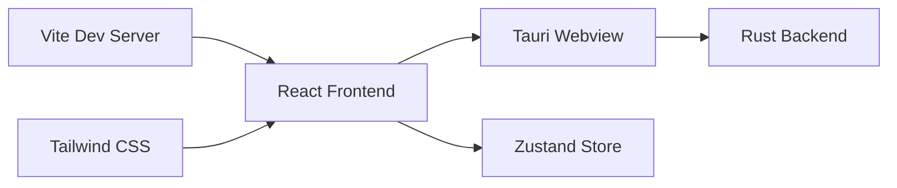

# Feature: Baseline Desktop App

## What

Create the foundational Tauri + React + Vite application structure with TypeScript. This establishes the technical foundation for Episteme—a working desktop application that can be launched, displays a basic UI, and demonstrates that the tech stack (Tauri, React, Zustand, Tailwind, TipTap) is integrated and functional.

## Personas

All personas benefit from this foundational work, as it enables all future features.

## Goals

- Working Tauri desktop app that launches on macOS
- React + TypeScript frontend with Vite build system
- Tailwind CSS integrated and functional
- Basic "Hello World" UI demonstrating the stack works
- Project structure established following best practices

## Non-goals

- Any real user features (those come in subsequent features)
- Multi-platform support (Windows/Linux come later)
- Production-ready error handling or polish

## User stories

- Developer can run `npm install` and `npm run dev` to launch the app
- Developer can see a basic UI proving the stack works
- Developer can build the app for distribution
- App launches as a native macOS application

## Testing requirements

### Test infrastructure
- Vitest configured and running with TypeScript support
- Playwright configured for Tauri E2E testing
- Test scripts in package.json (`test`, `test:unit`, `test:e2e`)
- CI-ready test commands (can run headless)

### Unit tests (Vitest)
- Verify Vite config resolves correctly
- Verify TypeScript compilation succeeds with strict mode
- Verify Tailwind classes are generated
- Basic React component renders without errors

### E2E tests (Playwright)
- App window opens successfully
- App window has correct title ("Episteme")
- App window displays React-rendered content
- App window meets minimum size requirements

### Acceptance criteria
- All tests pass on `npm run test`
- Test coverage reporting is configured
- Tests complete in under 30 seconds
- Zero test warnings or skipped tests

## Design spec

(Not needed for baseline technical setup)

## Tech spec

### Introduction and overview

**Prerequisites:** ADR-001 (Tauri), ADR-003 (Zustand), ADR-004 (Tailwind), ADR-007 (Vitest+Playwright)

**Goals:**
- Scaffolded Tauri v2 + React 18 + TypeScript + Vite project
- Tailwind CSS configured and working
- Zustand installed and importable
- Vitest and Playwright configured with passing smoke tests
- App launches as native macOS window

**Non-goals:**
- Any user-facing features
- Production build optimization
- CI/CD pipeline (future)

### System design and architecture



**Project structure:**
```
episteme/
├── src/                    # React frontend
│   ├── App.tsx             # Root component
│   ├── main.tsx            # React entry point
│   ├── app.css             # Tailwind imports
│   └── stores/             # Zustand stores (empty for now)
├── src-tauri/              # Rust backend
│   ├── src/
│   │   ├── main.rs         # Tauri entry point
│   │   └── lib.rs          # Command definitions
│   ├── Cargo.toml
│   ├── tauri.conf.json     # Tauri config (window title, size, etc.)
│   └── capabilities/       # Tauri v2 permissions
├── tests/
│   ├── unit/               # Vitest unit tests
│   │   └── app.test.tsx    # Smoke test
│   └── e2e/                # Playwright E2E tests
│       └── app.spec.ts     # App launch test
├── index.html
├── package.json
├── tsconfig.json
├── vite.config.ts
├── tailwind.config.ts
├── postcss.config.js
├── vitest.config.ts
├── playwright.config.ts
└── .eng-docs/              # Planning artifacts (already exists)
```

### Detailed design

**Tauri configuration (`tauri.conf.json`):**
- Window title: "Episteme"
- Default size: 1200x800
- Min size: 800x600
- macOS: titlebar overlay style

**Vite configuration:**
- React plugin
- TypeScript strict mode
- Path alias: `@/` → `src/`

**Tailwind configuration:**
- Content paths: `./src/**/*.{ts,tsx}`
- Dark mode: `class` strategy
- Typography plugin: `@tailwindcss/typography`

**Vitest configuration:**
- Environment: `jsdom`
- Setup files for React Testing Library
- Coverage reporter configured

**Playwright configuration:**
- Tauri driver setup
- Timeout: 30 seconds
- Screenshots on failure

### Testing plan

**Unit tests (Vitest):**
- `app.test.tsx`: App component renders without crashing
- Verify Tailwind classes apply correctly

**E2E tests (Playwright):**
- `app.spec.ts`: App window opens with title "Episteme"
- Window meets minimum size

### Risks

- **Tauri v2 API changes**: Tauri v2 is newer; some APIs may differ from documentation. Mitigation: pin exact version.
- **Playwright + Tauri integration**: E2E testing with Tauri requires specific driver setup. Mitigation: follow official Tauri testing guide.

## Task list

- [x] **Story: Project scaffolding**
  - [x] **Task: Scaffold Tauri v2 + React + TypeScript + Vite project**
    - **Description**: Use `create-tauri-app` to generate the project structure with React and TypeScript template, then verify it compiles and launches
    - **Acceptance criteria**:
      - [x] Tauri v2 project created in `/Users/mark.stafford/git/episteme/`
      - [x] `npm install` completes without errors
      - [x] `npm run tauri dev` launches a native macOS window
      - [x] Window displays default React content
      - [x] TypeScript strict mode enabled in `tsconfig.json`
    - **Dependencies**: None
  - [x] **Task: Configure Tailwind CSS with typography plugin**
    - **Description**: Install and configure Tailwind CSS v4 with `@tailwindcss/typography` plugin, dark mode using `class` strategy, and verify styles apply
    - **Acceptance criteria** (updated for Tailwind v4 — uses `@tailwindcss/vite` plugin, no separate config files):
      - [x] `tailwindcss` and `@tailwindcss/typography` installed
      - [x] `@tailwindcss/vite` plugin added to `vite.config.ts`
      - [x] `src/app.css` imports via `@import "tailwindcss"` and `@plugin "@tailwindcss/typography"`
      - [x] A Tailwind class (e.g., `bg-blue-600`) visually applies in the app
    - **Dependencies**: "Task: Scaffold Tauri v2 + React + TypeScript + Vite project"
  - [x] **Task: Install Zustand**
    - **Description**: Install Zustand and create a placeholder store to verify it works
    - **Acceptance criteria**:
      - [x] `zustand` installed
      - [x] `src/stores/` directory created
      - [x] Placeholder store created and importable without errors
    - **Dependencies**: "Task: Scaffold Tauri v2 + React + TypeScript + Vite project"
  - [x] **Task: Configure Vite path aliases**
    - **Description**: Set up `@/` path alias pointing to `src/` in both Vite and TypeScript configs
    - **Acceptance criteria**:
      - [x] `vite.config.ts` has resolve alias for `@/` → `src/`
      - [x] `tsconfig.json` has matching path mapping
      - [x] Imports using `@/` resolve correctly
    - **Dependencies**: "Task: Scaffold Tauri v2 + React + TypeScript + Vite project"
  - [x] **Task: Configure Tauri window settings**
    - **Description**: Set window title, default size, minimum size, and macOS-specific settings in `tauri.conf.json`
    - **Acceptance criteria**:
      - [x] Window title is "Episteme"
      - [x] Default window size: 1200x800
      - [x] Minimum window size: 800x600
      - [x] App launches with correct title and size
    - **Dependencies**: "Task: Scaffold Tauri v2 + React + TypeScript + Vite project"
- [x] **Story: Test infrastructure**
  - [x] **Task: Configure Vitest with React Testing Library**
    - **Description**: Install and configure Vitest with jsdom environment, React Testing Library, and coverage reporting
    - **Acceptance criteria**:
      - [x] `vitest`, `@testing-library/react`, `@testing-library/jest-dom`, `jsdom` installed
      - [x] `vitest.config.ts` created with jsdom environment and setup files
      - [x] `npm run test:unit` command works
      - [x] Coverage reporting configured and outputs to `coverage/`
    - **Dependencies**: "Task: Scaffold Tauri v2 + React + TypeScript + Vite project"
  - [x] **Task: Write unit smoke test**
    - **Description**: Create `tests/unit/app.test.tsx` that verifies the App component renders without crashing
    - **Acceptance criteria**:
      - [x] Test file created at `tests/unit/app.test.tsx`
      - [x] Test renders App component and asserts it mounts
      - [x] `npm run test:unit` passes
    - **Dependencies**: "Task: Configure Vitest with React Testing Library"
  - [x] **Task: Configure Playwright for Tauri**
    - **Description**: Install and configure Playwright against Vite dev server for E2E testing (note: Tauri's WebDriver-based E2E doesn't support macOS; full native window tests deferred)
    - **Acceptance criteria**:
      - [x] `@playwright/test` installed
      - [x] `playwright.config.ts` configured with Vite dev server
      - [x] `npm run test:e2e` command works
      - [x] Tests can launch the app UI and interact with it
    - **Dependencies**: "Task: Configure Tauri window settings"
  - [x] **Task: Write E2E smoke test**
    - **Description**: Create `tests/e2e/app.spec.ts` that verifies the app window opens with correct title
    - **Acceptance criteria**:
      - [x] Test file created at `tests/e2e/app.spec.ts`
      - [x] Test verifies page title is "Episteme"
      - [x] Test verifies window displays React-rendered content
      - [x] `npm run test:e2e` passes
    - **Dependencies**: "Task: Configure Playwright for Tauri"
  - [x] **Task: Add test scripts to package.json**
    - **Description**: Add `test`, `test:unit`, `test:e2e`, and `test:coverage` scripts to package.json
    - **Acceptance criteria**:
      - [x] `npm run test` runs all tests
      - [x] `npm run test:unit` runs Vitest
      - [x] `npm run test:e2e` runs Playwright
      - [x] `npm run test:coverage` runs Vitest with coverage
      - [x] All scripts pass
    - **Dependencies**: "Task: Write unit smoke test", "Task: Write E2E smoke test"
