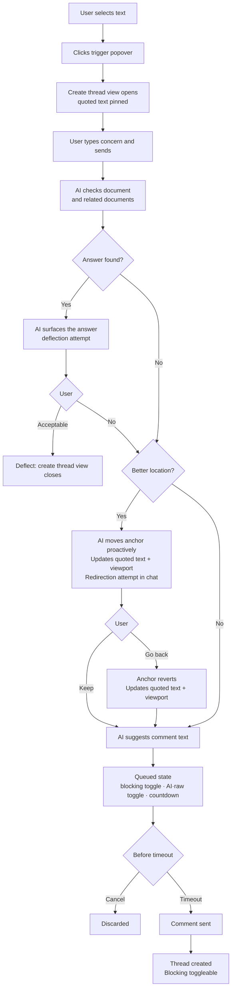
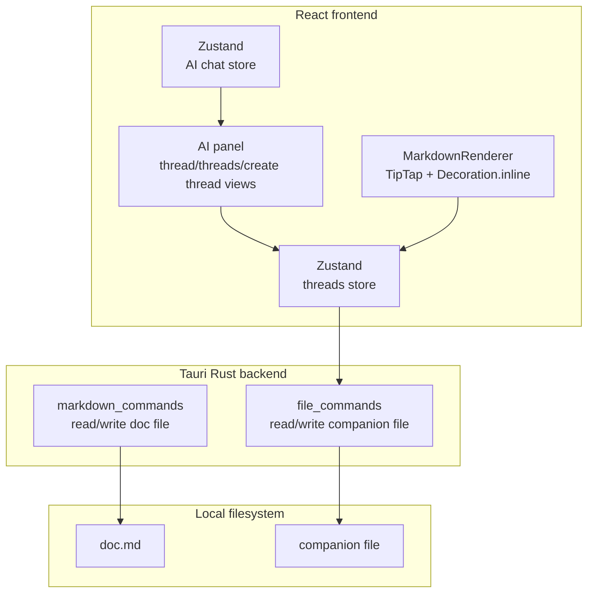
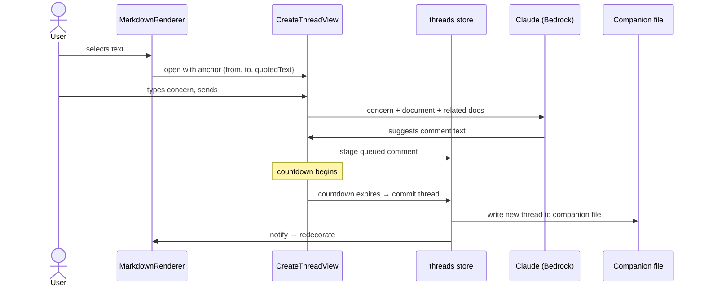

# Comments

## What

Episteme's comment system lets reviewers leave inline feedback anchored to specific text in a document. A reviewer selects a passage, writes a comment, and that comment appears attached to the highlighted text. Other participants can reply, creating a thread. The author can respond and resolve threads when the underlying concern has been addressed.

## Why

Reading a document and having an opinion about it are two different things. Without a way to leave feedback tied to specific text, reviewers fall back to vague notes, separate Slack messages, or in-person conversations — none of which are traceable, resolvable, or visible to the next person who reads the doc.

Comments make the review process legible. A resolved thread is a record of a concern that was raised and addressed. An open thread is a signal that something still needs attention before approval. Over time, the comment history of a document tells the story of how it got to where it is.

## Personas

- **Raquel: Reviewer** — leaves inline feedback anchored to specific text during the review cycle
- **Patricia: Product Manager** — receives comments on her drafts, responds to threads, and resolves them as she revises
- **Aaron: Approver** — reads comment history before sign-off; may add comments if something needs addressing before he'll approve

## Narratives

### Raquel reviews the notification system tech design

Eric wrote the notification system tech design based on an approved product description and requests feedback from several reviewers. Raquel opens the tech design in Review mode.

As Raquel reads through the Architecture section, she encounters a reference to a retry queue. She selects the sentence and types: "what happens when this fails?" The AI scans both the tech design and the linked PD. It finds the answer in the PD's Goals section. It responds: "This is covered in the product description — failed notifications surface as warnings in the activity feed within 60 seconds (Goals, item 3). Does that answer your question?" Raquel confirms it does and continues.

A few paragraphs later, Raquel selects a sentence about the throughput target and types: "this number seems low." The AI asks: "Are you concerned it's too low for the current user base, or for projected growth?" Raquel responds: "curent user base, we already exceed this on busy days." The AI finds that the throughput target follows from a constraint defined two sections earlier and responds: "Your comment may land better in the Constraints section where this target originates. I've also tidied the wording." It highlights the Constraints section and proposes: "The throughput target is already exceeded on busy days with the current user base — the constraint driving this needs revisiting." Raquel marks the comment as blocking, approves the text and the anchor, and it is filed.

Raquel reaches the section on notification templates and selects a paragraph about template versioning. She types: "who owns this?" The AI asks: "Are you asking about ownership of the versioning process, or ownership of the template content itself?" Raquel responds: "the versioning process — it's not clear whether product or engineering is responsible." The AI scans both documents, finds nothing that resolves the question, and proposes: "It's not clear whether product or engineering owns the template versioning process. This should be explicit before implementation begins." Raquel marks the comment as non-blocking, approves, and it is filed.

### Eric works through Raquel's comments

Eric opens the notification system tech design and sees two comment threads in the sidebar. Both were filed by Raquel during her review.

He opens the throughput comment first — it's marked blocking, anchored to the Constraints section. Raquel's comment reads: "The throughput target is already exceeded on busy days with the current user base — the constraint driving this needs revisiting." Eric sees a virtual card prompting him to address the thread. He clicks "Suggest a fix" — the AI proposes updating the constraint to reference current peak load metrics and adds a note that the throughput target will be revisited before implementation. It also drafts a reply: "Updated the constraint and flagged the throughput target for revision before we begin implementation." Eric reviews both, makes a small edit to the proposed document change, and approves. The fix is applied, the reply is posted, and Eric clicks "Mark as resolved." The thread is now resolved.

Eric opens the versioning ownership comment next — non-blocking, anchored to the template versioning paragraph. Raquel's comment asks who owns the versioning process. Eric isn't sure himself and wants Raquel's read before he specifies anything. He starts typing a reply and the AI asks: "Are you asking Raquel to propose an owner, or flagging that this needs a broader decision?" Eric responds that it needs a broader decision. The AI drafts: "Agreed this isn't clear — I'd rather not specify an owner without a conversation. Can you flag whether you think this is blocking or whether we can decide post-implementation?" Eric approves the reply and it posts. The thread stays open.

### Aaron reviews before approving

Aaron opens the notification system tech design to review it for approval. The sidebar shows two comment threads. The throughput comment is resolved — its border and decoration are success green, but the blocking indicator is preserved. The versioning ownership comment is open and non-blocking; the thread shows Eric's reply asking for a broader conversation about ownership before the doc specifies anything.

Aaron reads through the document and the threads. The throughput resolution looks right to him. He adds a reply to the versioning thread: "Engineering should own this. We can document it in the tech design before implementation." He marks his review complete. Since the blocking thread is resolved and the remaining open thread is non-blocking, Aaron can proceed with approval. The versioning thread — with Eric's and Aaron's replies — is automatically resolved on approval, preserving the full conversation as a record.

## User stories

**Raquel reviews the notification system tech design**

- Raquel can select text in a document and initiate a comment in Review mode
- Before filing, AI checks whether the document or a related document already answers Raquel's concern
- When a different passage more precisely captures Raquel's concern, AI suggests moving the anchor there
- AI proposes refined comment text before the comment is filed
- Raquel can mark a comment as blocking or non-blocking before filing
- Raquel can override AI suggestions and file a comment as written

**Eric works through Raquel's comments**

- Eric can see all open comment threads for a document in the sidebar
- AI suggests a document fix when Eric is responding to a comment
- Eric can review and edit an AI-proposed document change before it is applied
- AI drafts a reply for Eric's review when he responds to a comment thread
- AI asks a clarifying question to understand Eric's intent before drafting a reply
- Eric can mark a thread as resolved after applying a fix

**Aaron reviews before approving**

- Aaron can see the blocking/non-blocking and resolved/open status of all comment threads
- Aaron can reply to a comment thread
- Any participant can re-open a resolved thread via the virtual card
- *(out of scope)* Aaron is prevented from approving while a blocking comment is unresolved
- *(out of scope)* Aaron can approve a document once all blocking comments are resolved or confirmed
- *(out of scope)* Open non-blocking threads are automatically resolved when a document is approved

## Goals

- Reviewers leave fewer redundant or answerable comments — AI successfully deflects questions that are already addressed in the document or related documents
- Comments that are filed are higher quality — clearly worded, anchored to the most relevant passage, and marked with appropriate blocking status
- Review cycles produce a legible thread history — every filed comment has a clear resolution path and outcome visible to all participants
- Blocking comments reliably gate downstream actions — a document with an unresolved blocking comment cannot move forward until it is addressed and confirmed

## Non-goals

- Approving documents — blocking comment enforcement is defined here, but the approval action itself is out of scope
- Automatic resolution of open threads when a document is approved
- Document-level comments not anchored to specific text
- Reactions
- Real-time concurrent commenting
- Notifications

## Design spec

### Thread states

Each thread has two independent properties:

- **Status**: `open` | `resolved`
- **Blocking**: boolean — only toggleable when status = `open`; preserved when resolved

Visual treatment across all surfaces (decoration, rail bubble, threads view border, status row icon):

| Status | Blocking | Color |
|---|---|---|
| open | false | `--color-state-warning` |
| open | true | `--color-state-danger` |
| resolved | any | `--color-state-success` |

Success takes precedence over danger once resolved — a thread that was blocking shows success coloring when resolved, with the blocking value preserved silently.

### Document decorations and comment trigger

TipTap `Decoration.inline` applies a dotted underline to anchored text using the color from the thread state table above. Resolved decorations are hidden if "show resolved decorations" is off (Settings panel, reading preferences, default: on).

**Comment trigger:** when the user selects text, a small popover appears anchored to the end of the selection containing a `message-square-plus` button. Clicking it opens the create thread view in the AI panel with the selection quoted.

```
  ...the throughput target is set to 1,000 req/s▌
                                    ┌──────────┐
                                    │  [✚ msg] │
                                    └──────────┘
```

**Overlapping threads:** multiple threads can anchor to overlapping or identical text ranges. Where threads overlap, each character's decoration uses the worst color across all threads spanning it (danger > warning > success). Clicking behavior depends on how many threads span the clicked position:

- **One thread**: opens thread view directly.
- **Multiple threads**: opens a filtered threads view showing only the threads that span the clicked position.

Example: a phrase "the throughput target is set to 1,000 req/s" has two threads — one spanning the whole phrase (resolved, success) and one spanning only "1,000" (open + blocking, danger). "1,000" renders danger and clicking it shows a filtered threads view with both threads. The rest of the phrase renders danger (because the blocking thread spans it too, even though its anchor is narrower — worst color wins) and clicking shows the filtered view with both. If the blocking thread covered only "1,000" then the surrounding text would render success and clicking there would go straight to thread view for the resolved thread.

Clicking a decorated passage opens thread view (single thread) or filtered threads view (multiple threads) in the AI panel.

**Right rail:** a narrow strip (`--width-comment-rail: 24px`) to the right of the content column showing thread indicator bubbles aligned to their anchor's first line. Only rendered at window width ≥ 1440px — below this breakpoint, decorations are the only inline indicator. Each bubble uses the thread state color; bubbles collapse into a count badge when multiple threads are anchored within the same viewport region. Hover: thread preview popover. Click: opens thread view or filtered threads view.

### AI panel views

Three views handle comments in the AI panel. Each replaces whatever is currently showing. All follow the existing `ChatMessage` rendering pattern: current user messages right-aligned with accent background; all others left-aligned with subtle background. All messages in comment views show avatar + name + timestamp above the bubble regardless of participant count.

| View | Header | Trigger |
|---|---|---|
| Create thread view | `[message-square-plus]  New comment  [×]` | Comment trigger popover in document |
| Thread view | `[←]  "[first ~25 chars of quoted text]..."  [↑] [↓] [×]` | Clicking a decoration or threads view row |
| Threads view | `[messages-square]  Threads  [×]` | `messages-square` icon in AI panel header |

All three `[×]` buttons return the user to chat view. `[↑]` and `[↓]` in thread view navigate to the previous/next thread in anchor order.

### Create thread view

The create thread view guides the user through creating a comment. It is not a document mode — it can be opened from any mode. The quoted selection is pinned at the top throughout and updates if the anchor is relocated.

#### Comment creation flow



#### UI states

**State 1 — just opened**

The panel switches to create thread view. The quoted selection is pinned at the top as a persistent reference. The input awaits the user's question or concern.

```
┌──────────────────────────────────────────────┐
│  [message-square-plus]  New comment    [×]   │
├──────────────────────────────────────────────┤
│  ╔════════════════════════════════════════╗  │
│  ║ "The retry queue throughput target     ║  │
│  ║  is set to 1,000 req/s per node"       ║  │
│  ╚════════════════════════════════════════╝  │
├──────────────────────────────────────────────┤
│  ┌──────────────────────────────────────┐   │
│  │  What's your question or concern?    │   │
│  ├──────────────────────────────────────┤   │
│  │                                [↑]   │   │
│  └──────────────────────────────────────┘   │
└──────────────────────────────────────────────┘
```

The create thread view has no virtual cards. The redirect and deflect responses are transient AI responses. The comment order is: sent comments → queued card (at most one). There is no virtual card in this view.

When the countdown expires, the thread is created and the view animates into thread view — the queued card becomes the first comment bubble and the status row, virtual card, and reply input appear.

**State 2 — processing**

The user's comment appears right-aligned with avatar + name + timestamp. AI is scanning the document and related documents.

```
│  ╔════════════════════════════════════════╗  │
│  ║ "The retry queue throughput target..." ║  │
│  ╚════════════════════════════════════════╝  │
│                                              │
│  [av] you  ·  just now                       │
│                        this number seems low │
│                                   [accent ▶] │
│                                              │
│  [✨] AI  ·  just now                        │
│  [subtle ▶] ·  ·  ·                          │
```

**State 3 — deflection attempt**

AI has found what it believes answers the concern and surfaces the reference. The user can confirm (view closes) or reject and continue filing. `[No, file anyway]` in the left slot of the input is a quick action; the user can also reply naturally.

```
│  [av] you  ·  just now                       │
│                        this number seems low │
│                                   [accent ▶] │
│                                              │
│  [✨] AI  ·  just now                        │
│  [subtle ▶] This is covered in the product  │
│  description — failed notifications surface  │
│  as warnings within 60 seconds (Goals,       │
│  item 3). Does that answer your question?    │
│                                              │
│  ┌──────────────────────────────────────┐   │
│  │  Reply...                            │   │
│  ├──────────────────────────────────────┤   │
│  │  [No, file anyway]             [↑]   │   │
│  └──────────────────────────────────────┘   │
```

**State 4 — redirect + queued**

AI found a better anchor and moved it proactively — the quoted text block updates and the document scrolls to the new location. The redirect response appears as a regular AI response with an inline `[Go back]` link. The comment is immediately staged as a queued card. The user can revert the anchor at any time before the countdown expires.

```
│  ╔════════════════════════════════════════╗  │
│  ║ "The infrastructure constraint sets   ║  │
│  ║  the throughput ceiling at..."        ║  │  ← updated anchor
│  ╚════════════════════════════════════════╝  │
│                                              │
│  [av] you  ·  just now                       │
│                        this number seems low │
│                                   [accent ▶] │
│                                              │
│  [✨] AI  ·  just now                        │
│  [subtle ▶] Got it. I've moved your comment  │
│  to the Constraints section where this       │
│  target originates — it'll land better       │
│  there.                      [Go back]       │
│                                              │
│  ┌──────────────────────────────────────┐   │
│  │  The throughput target is already    │   │
│  │  exceeded on busy days — the         │   │
│  │  constraint driving this needs       │   │
│  │  revisiting.                         │   │
│  │                                      │   │
│  │  [✨▌👤]          [× ████░░ 24s]    │   │
│  └──────────────────────────────────────┘   │
│  [octagon-x · tertiary]                     │
```

### Thread view

The thread view shows an existing thread. Quoted text is pinned at the top, followed by the status row. All comments show avatar + name + timestamp. Thread view opens scrolled to the bottom. The chat box is always available regardless of thread status.

At most one virtual card is visible at any time. The comment order is: sent comments → virtual card (if conditions met) → queued card (if staging a reply).

Header: `[←]  "[first ~25 chars]..."  [↑] [↓] [×]` — `[←]` returns to threads list, `[↑]`/`[↓]` navigate to previous/next thread by anchor order, `[×]` closes to chat.

#### Queued comment

Appears in the comment stack when a reply is staged for sending. AI-enhanced version shown by default. The blocking toggle (`octagon-x` icon only) appears below the queued card in both create thread view and thread view — it is more discoverable here and allows quickly marking a thread blocking when an important new reply is added.

- **Toggle group** (`[✨▌👤]`): Radix `ToggleGroup`. Selected segment has accent background. Switches the displayed text and the version that will be sent.
- **Countdown pill** (`[× ████░░ 24s]`): tappable — clicking cancels. Progress bar drains to zero, then the comment sends and animates into a normal bubble.

```
│  ┌──────────────────────────────────────┐   │
│  │  Agreed this needs broader           │   │
│  │  discussion before we specify        │   │
│  │  an owner in the doc.                │   │
│  │                                      │   │
│  │  [✨▌👤]          [× ████░░ 24s]    │   │
│  └──────────────────────────────────────┘   │
│  [octagon-x · tertiary]                     │
```

#### Status row

Appears below the quoted text block. Tracks blocking and thread status with a full audit history. Thread status and blocking are independent — see thread states table above.

The `octagon-x` icon is either `--color-state-danger` (blocking) or `--color-text-tertiary` (non-blocking). The row background communicates thread status:

- **open, non-blocking**: no background
- **open, blocking**: `--color-state-danger-subtle` background
- **resolved**: `--color-state-success-subtle` background

The `octagon-x` icon is only clickable when status = `open`. Every thread has history from creation — there is always at least one entry. Hover anywhere on the row: history popover.

```
[octagon-x · tertiary]  open · Raquel · 2h                  ← open, non-blocking
░░░░░░░░░░░░░░░░░░░░░░░░░░░░░░░░░░░░░░░░░░░░░░░░░░░░░░░░░░
[octagon-x · danger]  blocking · Aaron · 30m  (danger-subtle bg)  ← open, blocking
░░░░░░░░░░░░░░░░░░░░░░░░░░░░░░░░░░░░░░░░░░░░░░░░░░░░░░░░░░
[octagon-x · tertiary · disabled]  resolved · Eric · 1h  (success-subtle bg)  ← resolved
```

**History popover** — `→ state` format, consistent across all event types. No row coloration in the popover.

```
│  ┌──────────────────────────────────┐  │
│  │  → open          Raquel · 3h    │  │
│  │  → blocking      Raquel · 2h    │  │
│  │  → non-blocking  Eric · 1h      │  │
│  │  → blocking      Aaron · 30m    │  │
│  │  → resolved      Eric · 10m     │  │
│  └──────────────────────────────────┘  │
```

Possible states: `open`, `blocking`, `non-blocking`, `resolved`, `re-opened`.

#### Virtual cards

At most one virtual card is visible at a time, appearing between the last comment and the chat box. Cards are mutually exclusive — conditions determine which one (if any) shows. Sending a comment does not change thread status; only explicit button actions do.

**Suggest card — document editor, status = open, last comment from someone other than document editor:**

The document editor is invited to use AI to propose a fix. Clicking `[Suggest a fix]` sends the full thread and document to AI. The AI responds with a proposed fix. The document editor can iterate with AI before accepting. When accepted, the fix is applied to the document, a summary comment is added to the thread, and the thread is resolved.

```
│  [✨]  Want me to suggest a fix for this thread? │
│  [Suggest a fix]                                 │
```

**Resolve card — document editor, status = open, last comment from document editor:**

```
│  [✨]  Ready to mark this thread as resolved?    │
│  [Mark as resolved]                              │
```

**Reopen card — all users, status = resolved:**

```
│  [✨]  This thread was marked as resolved.       │
│  [Re-open]                                       │
```
After clicking `[Re-open]`, inline confirmation:
```
│  [✨]  This thread was marked as resolved.       │
│  Re-open this thread?  [Confirm]  [Cancel]       │
```

#### Thread view mock

Mock shows the thread from Eric's perspective (document editor). The suggest card is visible because the last comment is from Raquel (not the document editor).

```
┌──────────────────────────────────────────────┐
│  [←]  "The retry queue throughput..." [↑][↓][×]│
├──────────────────────────────────────────────┤
│  ╔════════════════════════════════════════╗  │
│  ║ "The retry queue throughput target     ║  │
│  ║  is set to 1,000 req/s per node"       ║  │
│  ╚════════════════════════════════════════╝  │
│ ░[octagon-x·danger] blocking·Raquel·2h ░░░░ │  ← danger-subtle bg
│                                              │
│  [av] Raquel  ·  2h ago                      │
│  [subtle ▶] The throughput target is already │
│  exceeded on busy days — the constraint      │
│  driving this needs revisiting.              │
│                                              │
│  [✨] Want me to suggest a fix for this      │
│  thread?                                     │
│  [Suggest a fix]                             │
│                                              │
├──────────────────────────────────────────────┤
│  ┌──────────────────────────────────────┐   │
│  │  Reply...                            │   │
│  ├──────────────────────────────────────┤   │
│  │                                [↑]   │   │
│  └──────────────────────────────────────┘   │
└──────────────────────────────────────────────┘
```

### Threads view

Replaces whatever is currently showing in the AI panel. Header: `[messages-square]  Threads  [×]` — no back button (top-level view), `[×]` closes to chat. Accessible from the AI panel header via a `messages-square` icon button.

Each row follows the session history row pattern: 3px state-color left border → pin icon → content. Pin icon hidden unless pinned; shown on hover. No ellipsis menu — threads are not user-managed objects.

**Sort order:** threads are sorted by anchor position in the document (top to bottom). Pinned threads are also sorted by anchor position but appear at the top of the list, before unpinned threads.

Row content:
- First line: `octagon-x · danger` if blocking, then anchor text snippet (truncated)
- Second line: participant avatars + last activity timestamp + status label if resolved

Currently-open thread has `--color-bg-subtle` background. All rows have a bottom border. Clicking a row opens thread view. Keyboard shortcuts navigate between anchored passages in the document (next/previous thread).

```
┌──────────────────────────────────────────────┐
│  [messages-square]  Threads            [×]   │
├──────────────────────────────────────────────┤
│                                              │
│▐ [pin] [octagon-x·danger]  "The retry queue  │  ← danger border, bg-subtle (active)
│         throughput target is set to..."      │
│         [av·R] [av·E]  ·  1h ago            │
│                                              │
│▐ [pin] "It's not clear whether product or    │  ← warning border
│         engineering owns the template..."    │
│         [av·R] [av·E] [av·A]  ·  30m ago    │
│                                              │
│▐ [pin] "What happens when this fails?"       │  ← success border, dimmer text
│         [av·R]  ·  3h ago  ·  resolved      │
│                                              │
└──────────────────────────────────────────────┘
```

## Tech spec

### 1. Introduction and overview

#### Prerequisites and dependencies

- ADR-002: TipTap document editor — ProseMirror/TipTap is the rendering and decoration layer for all inline anchors
- ADR-003: Zustand — state management for thread and UI state
- ADR-005: GitHub OAuth — user identity; document editor identification currently approximated from frontmatter
- ADR-013: Document contents — establishes that comment data lives in external storage, not in the markdown file
- Feature: AI Chat Assistant — comment views are states of the existing AI panel; the AI fix flow uses the same Claude/Bedrock integration

#### Goals

- Comment threads are stored durably and survive app restarts
- Anchor positions survive external edits to markdown files via quotedText fallback reconciliation
- External content for a document lives in a single companion file, co-located with the document (either in the same directory or a shadow structure under `.episteme/`), structured to accommodate future content types beyond comments (reactions, etc.)
- The AI vetting flow (deflect, redirect, suggest) responds within a reasonable latency for interactive use
- Queued comments that survive an app close are resolved on next launch
- TipTap decorations accurately reflect thread state across all anchored passages including overlaps

#### Non-goals

- Real-time multi-user sync
- Server-side storage — all comment data is local
- Notification delivery
- Approval gating enforcement — blocking status is stored and displayed; preventing approval is out of scope

#### Glossary

| Term | Definition |
|---|---|
| Thread | Top-level comment entity: anchor + status + blocking + ordered list of comments |
| Comment | An individual entry in a thread — either the opening comment or a reply. AI responses visible in the panel during the creation flow are transient and not stored as comments. |
| Anchor | The document position a thread is attached to: `{ from, to, quotedText }` |
| Status | Thread lifecycle: `open` or `resolved` |
| Blocking | Boolean on a thread; when true and status = open, signals the thread gates document progression |
| Queued comment | A staged comment held locally with a countdown before it sends |
| Create thread view | AI panel state for creating a comment (`CreateThreadView`) |
| Thread view | AI panel state for viewing/replying to a thread (`ThreadView`) |
| Threads view | AI panel state listing all threads for the open document (`ThreadsView`) |
| Virtual card | A persistent AI-generated card at the end of the thread comment stream that surfaces status-change actions |
| Document editor | Any user with write access to the document. Determines who sees the suggest and resolve virtual cards. Approximated from frontmatter for now; intended to accommodate multiple contributors. |
| AI enhancement | The queued-comment flow where AI rewrites a draft comment before it sends |

### 2. System design and architecture

#### High-level architecture



#### Component breakdown

| Component | New / Modified | Description |
|---|---|---|
| `threads` Zustand store | New | Owns thread state: load, persist, anchor reconciliation, queued comment lifecycle |
| `MarkdownRenderer` | Modified | Subscribe to threads store; apply `Decoration.inline` per anchor |
| `AiChatPanel` | Modified | Route to `CreateThreadView`, `ThreadView`, or `ThreadsView` based on active view state |
| `CreateThreadView` | New | Create thread view — comment creation flow |
| `ThreadView` | New | Thread view — single thread display, virtual cards, queued comment |
| `ThreadsView` | New | Threads view — thread list with pin, sort, filter |
| `file_commands` (Rust) | Modified | Add read/write for companion file |
| Companion file | New | Single file per document storing all external content |

#### Sequence: creating a comment (happy path — no deflect/redirect)



### 3. Detailed design

#### Data model

The companion database lives at `.episteme/content.db` relative to the workspace root — one database for all external content across all documents. Future content types (reactions, etc.) are added as new tables.

**Document identity:** each document is identified in the database by a `doc_id` UUID v4 stored in the document's frontmatter under the key `doc_id`. When any feature first needs to reference a document in the database, it writes `doc_id` to the frontmatter if absent (it may already exist from a prior feature). This `doc_id` is the stable reference, surviving file renames and moves.

```sql
CREATE TABLE threads (
  id           TEXT    PRIMARY KEY,                     -- UUID v4
  doc_id       TEXT    NOT NULL,                        -- frontmatter doc_id
  quoted_text  TEXT    NOT NULL,                        -- fallback for anchor reconciliation
  anchor_from  INTEGER NOT NULL,                        -- ProseMirror position (start)
  anchor_to    INTEGER NOT NULL,                        -- ProseMirror position (end)
  anchor_stale BOOLEAN NOT NULL DEFAULT FALSE,
  status       TEXT    NOT NULL DEFAULT 'open',         -- 'open' | 'resolved'
  blocking     BOOLEAN NOT NULL DEFAULT FALSE,
  pinned       BOOLEAN NOT NULL DEFAULT FALSE,
  created_at   TEXT    NOT NULL                         -- ISO 8601
);

CREATE TABLE comments (
  id         TEXT    PRIMARY KEY,                       -- UUID v4
  thread_id  TEXT    NOT NULL REFERENCES threads(id) ON DELETE CASCADE,
  body       TEXT    NOT NULL,
  author     TEXT    NOT NULL,                          -- GitHub login
  created_at TEXT    NOT NULL                           -- ISO 8601
);

CREATE TABLE thread_events (
  id         TEXT    PRIMARY KEY,                       -- UUID v4
  thread_id  TEXT    NOT NULL REFERENCES threads(id) ON DELETE CASCADE,
  event      TEXT    NOT NULL,                          -- 'open' | 'blocking' | 'non-blocking' | 'resolved' | 're-opened'
  changed_by TEXT    NOT NULL,
  changed_at TEXT    NOT NULL                           -- ISO 8601
);

-- A queued_comment is either a new thread (doc_id + anchor columns set, thread_id NULL)
-- or a reply to an existing thread (thread_id set, anchor columns NULL).
-- The CHECK constraint enforces exactly one case.
-- body_original is the user's raw text. body_enhanced is the AI-rewritten version
-- (NULL until enhancement completes). use_body_enhanced tracks which is selected.
CREATE TABLE queued_comments (
  id            TEXT    PRIMARY KEY,                    -- UUID v4 (generated by frontend)
  thread_id     TEXT,                                   -- NULL for new threads
  doc_id        TEXT,                                   -- NULL for replies
  quoted_text   TEXT,                                   -- NULL for replies
  anchor_from   INTEGER,                                -- NULL for replies
  anchor_to     INTEGER,                                -- NULL for replies
  body_original TEXT    NOT NULL,
  body_enhanced TEXT,                                   -- NULL until AI enhancement completes
  use_body_enhanced  BOOLEAN NOT NULL DEFAULT TRUE,
  blocking      BOOLEAN NOT NULL DEFAULT FALSE,
  created_at    TEXT    NOT NULL,                       -- ISO 8601
  expires_at    TEXT    NOT NULL,                       -- ISO 8601; set to now() for immediate commit
  CHECK (
    (thread_id IS NOT NULL AND doc_id IS NULL
      AND quoted_text IS NULL AND anchor_from IS NULL AND anchor_to IS NULL)
    OR
    (thread_id IS NULL AND doc_id IS NOT NULL
      AND quoted_text IS NOT NULL AND anchor_from IS NOT NULL AND anchor_to IS NOT NULL)
  )
);

CREATE INDEX idx_threads_doc_id     ON threads(doc_id);
CREATE INDEX idx_comments_thread    ON comments(thread_id);
CREATE INDEX idx_events_thread      ON thread_events(thread_id);
CREATE INDEX idx_queued_expires     ON queued_comments(expires_at);
```

#### Tauri commands

Current user identity is resolved from the auth session in Rust — not passed as a parameter. Parameter order follows schema column order where applicable.

```
load_threads(doc_id: str) → Vec<Thread>
  Load all threads for a document. Triggers anchor reconciliation on each.
  doc_id is read from the document's frontmatter by the frontend before calling.

update_thread_status(thread_id: str, status: str) → ThreadEvent
  Set status = 'open' | 'resolved'. Inserts thread_event (→ resolved | → re-opened).

toggle_blocking(thread_id: str) → ThreadEvent
  Flips blocking flag. Only valid when status = 'open'.
  Inserts thread_event (→ blocking | → non-blocking).

toggle_pinned(thread_id: str) → ()
  Flips pinned flag.

queue_comment(id: str, thread_id: str | null, doc_id: str | null,
              quoted_text: str | null, anchor_from: int | null, anchor_to: int | null,
              body_original: str, body_enhanced: str | null, use_body_enhanced: bool,
              blocking: bool, created_at: str, expires_at: str) → ()
  Upsert a queued comment by id. Called on initial staging and when
  body_enhanced is populated by AI. For immediate commit (e.g. AI fix
  acceptance), set expires_at = now() and call commit_comment immediately after.

toggle_queued_body(id: str) → ()
  Flip use_body_enhanced. Only meaningful once body_enhanced is populated.

commit_comment(id: str) → Thread | Comment
  Commit a queued comment. If doc_id is set, creates a new thread + first
  comment and emits (→ open) and optionally (→ blocking). If thread_id is set,
  appends a comment. Deletes the queued row. doc_id is guaranteed to exist in
  frontmatter before this is called (frontend writes it if absent).
  Called on countdown expiry or immediately for zero-timeout cases.

cancel_queued_comment(id: str) → ()
  Discard a queued comment.

load_queued_comments() → Vec<QueuedComment>
  Called on app launch. Returns all queued comments — caller commits
  expired ones and surfaces unexpired ones to resume their countdowns.

update_thread_anchors(updates: Vec<{thread_id: str, anchor_from: int, anchor_to: int}>) → ()
  Update anchor positions after a document content change while threads are loaded.
  Called by the threads store whenever the TipTap document changes.
```

#### Key algorithms

**Anchor reconciliation** (run on `load_threads`):
1. For each thread, check if the text at `[anchor_from, anchor_to]` in the current TipTap doc matches `quoted_text`
2. If match: anchor valid, use positions as-is
3. If no match: fuzzy-search document content for `quoted_text`
   - Found: update `anchor_from`/`anchor_to`, clear `anchor_stale`
   - Not found: set `anchor_stale = TRUE` — thread renders without highlight, shown as stale in threads view

**Decoration computation** (run whenever threads store updates):

For each character position in the document, collect all threads whose anchor spans it. Apply worst-case color precedence: danger > warning > success. Apply as `Decoration.inline` with a CSS class carrying the appropriate color token. Decoration boundaries transition at thread anchor boundaries.

**Queued comment lifecycle**:
1. Stage: call `stage_comment` to persist draft, start countdown in React state
2. Expire: call `flush_queued_comment` → Rust creates thread/comment, deletes queued row → `CreateThreadView` animates to `ThreadView`
3. App launch: call `load_expired_queued_comments` → flush each immediately
4. Cancel: call `delete_queued_comment`, clear React state

### 5. Observability

For a local desktop app, traditional server observability (metrics dashboards, alerting) doesn't apply. The relevant concerns are logging and future instrumentation hooks.

**Logging**

| Event | Level | Notes |
|---|---|---|
| Thread created | `info` | Include `thread_id`, `doc_id` |
| Comment committed | `info` | Include `thread_id`, source (queued/immediate) |
| Anchor reconciliation: stale anchor | `warn` | Include `thread_id`, `quoted_text` |
| Anchor reconciliation: position updated | `debug` | |
| AI vetting call (deflect/redirect/suggest) | `debug` | Include latency |
| AI enhancement call | `debug` | Include latency, whether enhanced version was used |
| DB write failure | `error` | |
| Queued comments flushed on launch | `info` | Include count |

**Metrics**

No runtime metrics infrastructure in this version. Candidate for future addition: AI deflection rate (comments deflected / total comment attempts) as a product health signal.

**Alerting**

Not applicable for a local desktop app.

### 6. Testing plan

**Unit tests**

| Module | Cases |
|---|---|
| `threads` Zustand store | Load threads for a document; stage queued comment; cancel queued comment; commit queued comment (new thread path); commit queued comment (reply path); anchor reconciliation — exact match; anchor reconciliation — fuzzy match found, positions updated; anchor reconciliation — fuzzy match not found, `anchor_stale` set; `update_thread_anchors` updates in-memory positions; decoration set computation — single thread per state; decoration set computation — overlapping threads, worst-color precedence; decoration set boundary precision at anchor edges |
| `CreateThreadView` | Renders with quoted text pinned; deflect path — user accepts, no thread created; deflect path — user rejects ("No, file anyway"), continues to queue; redirect path — anchor moves, quoted text updates; redirect path — "Go back" reverts anchor and quoted text; queued card appears after redirect; queued card appears with no deflect/redirect; countdown expires → thread committed, view transitions to `ThreadView`; cancel → no thread created; AI enhancement disabled → only `body_original` shown; AI enhancement enabled → `body_enhanced` populated, toggle works; `toggle_queued_body` switches displayed text; blocking toggle sets correct initial `blocking` value before commit |
| `ThreadView` | Opens scrolled to bottom; header shows truncated quoted text; status row — open non-blocking: tertiary icon, no background; status row — open blocking: danger icon, danger-subtle background; status row — resolved: tertiary icon, success-subtle background, non-interactive; blocking toggle rejected when status = resolved; history popover shows all events in chronological order; history popover includes all event types (open, blocking, non-blocking, resolved, re-opened); suggest card shown — doc editor, status open, last comment from non-editor; resolve card shown — doc editor, status open, last comment from editor; reopen card shown — all users, status resolved; no virtual card — non-editor, status open; suggest card transitions to resolve card when doc editor posts reply; resolve card transitions to suggest card when non-editor posts reply; both cards transition to reopen card on resolve; reopen card transitions to suggest/resolve on re-open; at most one virtual card visible; reopen inline confirmation appears; reopen confirmation cancel dismisses without action; chat box available when status = resolved; queued comment blocking toggle sets blocking on commit; queued comment cancel |
| `ThreadsView` | Rows sorted by anchor position (top to bottom); pinned rows sorted by anchor position but appear before unpinned; border color matches thread state; active thread has subtle background; blocking indicator shown for blocking threads; status label shown for resolved threads; stale anchor shown with stale indicator |
| Decoration computation | Single open non-blocking thread → warning color; single open blocking thread → danger color; single resolved thread → success color; resolved thread with decoration setting off → no decoration; two threads same span → worst color applied; two threads one nested → inner span gets worst, outer-only span gets its own color; three-way overlap → danger wins over all; decoration updates on thread status change; stale thread → no decoration |
| Anchor reconciliation | Exact position match; text moved, fuzzy found → positions updated, stale cleared; text deleted, not found → stale set; multiple threads, some stale some not |

**Integration tests**

| Scenario | What to verify |
|---|---|
| `commit_comment` — new thread | Thread row, first comment row, thread_events `→ open`; if blocking=true also `→ blocking` immediately after |
| `commit_comment` — new thread, blocking=false | Only `→ open` event emitted |
| `commit_comment` — reply | Comment appended; thread row unchanged; no thread_events |
| `commit_comment` — writes `doc_id` to frontmatter | Written when absent; preserved when already present (from another feature) |
| `toggle_blocking` — open thread | Flag flips; correct thread_event inserted |
| `toggle_blocking` — resolved thread | Command rejected; no DB change |
| `update_thread_status` → resolved | `blocking` value preserved; `→ resolved` event emitted |
| `update_thread_status` → re-opened | `blocking` value preserved; `→ re-opened` event emitted |
| `toggle_pinned` | Flips correctly; idempotent on double-call |
| `queue_comment` upsert | Insert on first call; update body columns on second call with same id |
| `toggle_queued_body` | Flips `use_body_enhanced`; no-op if `body_enhanced` is NULL |
| `load_queued_comments` on launch — expired | Returned; `commit_comment` called → thread/comment created, row deleted |
| `load_queued_comments` on launch — unexpired | Returned; countdown resumed from remaining time, not full timeout |
| `cancel_queued_comment` | Row deleted; no thread/comment created |
| `update_thread_anchors` | Positions updated in DB; subsequent `load_threads` returns new positions |
| `ON DELETE CASCADE` | Deleting thread deletes all associated comments and thread_events |
| Anchor reconciliation round-trip | Create thread; externally edit file; reload → fuzzy match updates positions |
| Overlapping thread decoration | Two threads with overlapping anchors; decoration color at each character position is correct worst-case |

**E2E tests**

| Flow | What to verify |
|---|---|
| Happy path: file a comment (no deflect/redirect) | Select text → create thread view opens → type concern → AI suggests text → countdown → animates to thread view → thread and comment in DB |
| Deflect path: accepted | AI answers → user confirms → view closes → no thread in DB |
| Deflect path: rejected | AI answers → "No, file anyway" → queued card appears → commits normally |
| Redirect path: accepted | AI moves anchor → quoted text updates → commit at new anchor |
| Redirect path: reverted | "Go back" → original anchor restored → commit at original anchor |
| Queued comment survives app close | Stage comment → kill app → relaunch → comment committed → appears in thread view |
| Unexpired queued comment on relaunch | Stage comment, set long timeout → kill app → relaunch → countdown resumes at remaining time |
| Toggle body version before commit | Stage → AI enhances → toggle to raw → commit → raw body stored in comment |
| Blocking thread creation | Mark blocking before commit → thread has blocking=TRUE, `→ open` and `→ blocking` events in DB |
| Resolve and re-open cycle | Resolve thread → blocking preserved → re-open → blocking still set, `→ re-opened` event |
| Overlapping threads click | Two overlapping threads → click overlap → filtered threads view shows both; click non-overlap → thread view directly |
| Stale anchor handling | Thread exists → externally delete quoted text from file → reload → thread shown as stale, no decoration |
| "Show resolved decorations" off | Resolve thread → no decoration visible in document |
| Up/down navigation in thread view | Navigate to next/previous thread by anchor order |
| AI enhancement disabled in settings | Queue comment → no AI enhancement attempted → only raw body available |

### 7. Alternatives considered

**SQLite vs. JSON sidecar files for external content storage**

JSON sidecar files (one per document) were the initial candidate. They are human-readable, git-diffable, and require no schema migration. SQLite was chosen because it is queryable (cross-document queries, filtered views), handles concurrent writes more gracefully, provides a natural home for Yjs update logs when real-time sync is added, and accommodates future content types as new tables without file proliferation. The git-diff concern is moot given ADR-013 establishes that this data is not document truth.

**W3C Web Annotation / Hypothesis multi-selector anchor model**

The W3C approach stores multiple selector types simultaneously (`TextQuoteSelector`, `TextPositionSelector`, `RangeSelector`) and resolves them in priority order. Episteme's `{ anchor_from, anchor_to, quoted_text }` model is a simplified version of this — ProseMirror positions as the fast path, `quoted_text` as the resilient fallback. Full multi-selector support was not adopted because the two-field model covers the relevant failure modes for a local-first, single-user-at-a-time workflow.

**Yjs `RelativePosition` for anchor tracking**

Yjs `RelativePosition` anchors are CRDT-native and survive concurrent edits perfectly. They were not adopted because Yjs is not yet in the stack, and the migration path when it is added is contained to the anchor sub-object — a small, isolated change.

### 8. Risks

| Risk | Likelihood | Mitigation |
|---|---|---|
| Anchor drift after bulk AI document rewrites | High | See markdstafford/episteme#121. `update_thread_anchors` + `quoted_text` fallback handles incremental edits. For bulk rewrites, the proposed approach is to pass thread anchors as context in the AI edit request and ask AI to return updated positions. Open question: whether ProseMirror integer positions can be reliably mapped by AI, or whether conversion to raw character offsets is required first. |
| `doc_id` frontmatter write conflicts with concurrent edits | Low | Write is guarded by "if absent" check; worst case is two writes of different UUIDs in a race — the second overwrites the first, orphaning any threads created under the first UUID. Acceptable risk for initial version. |
| SQLite file corruption on abrupt app termination during write | Low | SQLite's WAL mode provides crash safety; queued comment table gives a recovery path for in-flight commits |
| AI vetting latency makes comment creation feel slow | Medium | Vetting runs after user sends; the queued countdown gives perceived responsiveness. If AI call exceeds countdown, file without vetting. Timeout configurable in settings. |
| `quoted_text` fuzzy match finds wrong passage in docs with repeated text | Low-Medium | Prefix/suffix context in `quoted_text` (from ProseMirror selection) disambiguates; stale flag set if confidence is low |
| Overlapping thread decoration complexity at scale | Low | Decoration recomputed on thread store updates; performance should be fine for typical document sizes, but may need debouncing for large documents with many threads |

### 4. Security, privacy, and compliance

**Authentication and authorization**

Comment creation and mutation require an authenticated session (GitHub OAuth, ADR-005). The current user identity is resolved from the auth session in Rust on every command — never trusted from the frontend. There is no per-thread access control in this version; any authenticated user can add comments, toggle blocking, and toggle pinned.

**Data privacy**

Comment data is stored locally in `.episteme/content.db`. The only PII stored is GitHub logins in the `author` and `changed_by` columns. No comment data is transmitted to any server — AI calls send document content and comment thread context to Claude via Bedrock (existing pattern from the AI chat feature; no new data exposure introduced by this feature).

The `doc_id` UUID written to frontmatter is non-sensitive.

**Input validation**

Comment bodies are user-supplied text rendered in the AI panel. They must be sanitized before rendering to prevent XSS. TipTap's `MarkdownRenderer` handles this for document content; comment bodies should pass through the same renderer or an equivalent sanitization step — raw HTML must not be injected into the DOM.

SQLite queries use parameterized statements throughout — no string interpolation in SQL.

## Task list

- [x] **Story: Database and Rust infrastructure**
  - [x] **Task: Initialize `.episteme/` directory and SQLite schema**
    - **Description**: On workspace load, ensure `.episteme/` exists at the workspace root and `content.db` is created at `.episteme/content.db` with the full schema. Must be idempotent — safe to run on every app launch against an existing database. Enable WAL mode for crash safety.
    - **Acceptance criteria**:
      - [x] `.episteme/` directory created at workspace root if absent
      - [x] `content.db` created if absent; existing DB untouched on subsequent launches
      - [x] `threads`, `comments`, `thread_events`, `queued_comments` tables created with correct columns, types, defaults, and constraints
      - [x] All indexes created (`idx_threads_doc_id`, `idx_comments_thread`, `idx_events_thread`, `idx_queued_expires`)
      - [x] `queued_comments` CHECK constraint enforced — inserting a row with both `thread_id` and `doc_id` set returns an error
      - [x] WAL mode enabled
      - [x] Called automatically on workspace open before any DB command executes
    - **Dependencies**: None

  - [x] **Task: Implement `doc_id` frontmatter utilities**
    - **Description**: Two Rust helper functions for reading and writing the `doc_id` field in YAML frontmatter. `get_doc_id(doc_path)` returns the existing value or `None`. `ensure_doc_id(doc_path)` returns the existing value, or generates a UUID v4, writes it to frontmatter, and returns it. Preserves all other frontmatter fields unchanged.
    - **Acceptance criteria**:
      - [x] `get_doc_id` returns `Some(uuid)` when `doc_id` is present in frontmatter
      - [x] `get_doc_id` returns `None` when `doc_id` is absent
      - [x] `get_doc_id` returns `None` for documents with no frontmatter block
      - [x] `ensure_doc_id` returns the existing value without modifying the file when `doc_id` is already present
      - [x] `ensure_doc_id` writes a new UUID v4 and returns it when `doc_id` is absent
      - [x] `ensure_doc_id` write preserves all existing frontmatter fields
      - [x] `ensure_doc_id` creates a frontmatter block if the document has none
      - [x] Unit tests cover all cases above
    - **Dependencies**: None

  - [x] **Task: Implement `load_threads`**
    - **Description**: Tauri command that loads all threads for a `doc_id` from SQLite, including nested comments and thread_events ordered by `created_at`/`changed_at`. Performs anchor reconciliation for each thread: checks `[anchor_from, anchor_to]` against current document content, updates positions if text has moved, sets `anchor_stale = TRUE` if `quoted_text` not found. Persists reconciliation results to DB.
    - **Acceptance criteria**:
      - [x] Returns all threads for the given `doc_id` with nested comments and thread_events
      - [x] Thread anchors with exact position match returned unchanged
      - [x] Thread anchors where text has moved but `quoted_text` is found elsewhere have positions updated, `anchor_stale` cleared, and results persisted to DB
      - [x] Thread anchors where `quoted_text` is not found have `anchor_stale = TRUE` persisted to DB
      - [x] Returns empty array (not error) when no threads exist for the given `doc_id`
      - [x] Comments ordered by `created_at` ascending; thread_events ordered by `changed_at` ascending
      - [x] Unit tests cover all three reconciliation outcomes
    - **Dependencies**: Task: Initialize `.episteme/` directory and SQLite schema

  - [x] **Task: Implement `commit_comment`**
    - **Description**: Commits a queued comment from `queued_comments`. Two paths: (1) new thread — `doc_id` set, creates thread + first comment + thread_events, calls `ensure_doc_id`; (2) reply — `thread_id` set, appends comment. Deletes the queued row in both cases. All DB operations in a single transaction. Body used is determined by `use_body_enhanced` (uses `body_enhanced` if true and non-NULL, else `body_original`).
    - **Acceptance criteria**:
      - [x] New thread path: `threads` row inserted with correct values from queued row
      - [x] New thread path: `comments` row inserted with body per `use_body_enhanced`
      - [x] New thread path, `blocking = false`: single `→ open` thread_event inserted
      - [x] New thread path, `blocking = true`: `→ open` event first, then `→ blocking` event
      - [x] Reply path: `comments` row appended to existing thread; thread row unchanged; no thread_events
      - [x] Queued row deleted after successful commit in both paths
      - [x] `ensure_doc_id` called for new thread path; frontmatter updated if absent
      - [x] All inserts wrapped in a single transaction
      - [x] Returns created `Thread` (new thread path) or `Comment` (reply path)
      - [x] Integration tests cover both paths and transaction atomicity
    - **Dependencies**: Task: Implement `doc_id` frontmatter utilities, Task: Initialize `.episteme/` directory and SQLite schema

  - [x] **Task: Implement `update_thread_status`**
    - **Description**: Sets a thread's `status` to `'open'` or `'resolved'`. Inserts the corresponding thread_event. The `blocking` value is preserved unchanged in both directions.
    - **Acceptance criteria**:
      - [x] Status set to `'resolved'`: `threads.status` updated, `→ resolved` thread_event inserted, `blocking` unchanged
      - [x] Status set to `'open'` (re-open): `threads.status` updated, `→ re-opened` thread_event inserted, `blocking` unchanged
      - [x] Returns the inserted `ThreadEvent`
      - [x] Returns error for unknown `thread_id`
    - **Dependencies**: Task: Initialize `.episteme/` directory and SQLite schema

  - [x] **Task: Implement `toggle_blocking`**
    - **Description**: Flips the `blocking` boolean on a thread and inserts the corresponding thread_event. Only valid when `status = 'open'` — returns an error if called on a resolved thread.
    - **Acceptance criteria**:
      - [x] `blocking` false → true: `threads.blocking` updated, `→ blocking` thread_event inserted
      - [x] `blocking` true → false: `threads.blocking` updated, `→ non-blocking` thread_event inserted
      - [x] Returns error when `status = 'resolved'`; no DB changes made
      - [x] Returns the inserted `ThreadEvent`
    - **Dependencies**: Task: Initialize `.episteme/` directory and SQLite schema

  - [x] **Task: Implement `toggle_pinned`**
    - **Description**: Flips the `pinned` boolean on a thread. No thread_event is emitted — pinning is a UI preference, not a workflow state change.
    - **Acceptance criteria**:
      - [x] `pinned` false → true: `threads.pinned` updated to true
      - [x] `pinned` true → false: `threads.pinned` updated to false
      - [x] Returns `()`
      - [x] Returns error for unknown `thread_id`
    - **Dependencies**: Task: Initialize `.episteme/` directory and SQLite schema

  - [x] **Task: Implement `queue_comment` and `toggle_queued_body`**
    - **Description**: `queue_comment` is an upsert keyed by `id` — inserts or updates a `queued_comments` row. Used for initial staging and for updating `body_enhanced` when AI enhancement completes. `toggle_queued_body` flips `use_body_enhanced`; no-op if `body_enhanced` is NULL.
    - **Acceptance criteria**:
      - [x] `queue_comment` inserts a new row when `id` is absent
      - [x] `queue_comment` updates all fields of the existing row when `id` is already present
      - [x] `queue_comment` enforces CHECK constraint — error if both `thread_id` and `doc_id` are set
      - [x] `toggle_queued_body` flips `use_body_enhanced` true → false and false → true
      - [x] `toggle_queued_body` is a no-op (no error, no change) when `body_enhanced` is NULL
    - **Dependencies**: Task: Initialize `.episteme/` directory and SQLite schema

  - [x] **Task: Implement `cancel_queued_comment`, `load_queued_comments`, and `update_thread_anchors`**
    - **Description**: Three utility commands. `cancel_queued_comment(id)` deletes a queued row. `load_queued_comments()` returns all queued rows regardless of expiry. `update_thread_anchors(updates)` batch-updates `anchor_from` and `anchor_to` for multiple threads in a single transaction.
    - **Acceptance criteria**:
      - [x] `cancel_queued_comment` deletes the correct row; no-op (no error) if `id` not found
      - [x] `load_queued_comments` returns all rows, both expired and unexpired
      - [x] `update_thread_anchors` updates all provided `{thread_id, anchor_from, anchor_to}` tuples in a single transaction
      - [x] `update_thread_anchors` with empty `updates` array is a no-op (no error)
      - [x] `update_thread_anchors` skips unknown `thread_id` values without failing the whole batch
    - **Dependencies**: Task: Initialize `.episteme/` directory and SQLite schema

- [x] **Story: Threads Zustand store**
  - [x] **Task: Define TypeScript types**
    - **Description**: Define all TypeScript types for comment-related data structures used across the frontend. These mirror the DB schema and Tauri command return types. Exported from a central `src/types/comments.ts`.
    - **Acceptance criteria**:
      - [x] `Anchor` type: `{ from: number, to: number, quotedText: string, stale: boolean }`
      - [x] `Thread` type: all `threads` table fields plus `comments: Comment[]` and `events: ThreadEvent[]`
      - [x] `Comment`, `ThreadEvent`, `QueuedComment` types match their respective table schemas
      - [x] `ThreadStatus` union: `'open' | 'resolved'`
      - [x] `ThreadEventType` union: `'open' | 'blocking' | 'non-blocking' | 'resolved' | 're-opened'`
      - [x] All types exported from `src/types/comments.ts`
    - **Dependencies**: None

  - [x] **Task: Implement store structure and `loadThreads` action**
    - **Description**: Create the `threads` Zustand store. `loadThreads(docId)` calls the `load_threads` Tauri command, populates store state, and triggers decoration recomputation. Store clears when the active document changes.
    - **Acceptance criteria**:
      - [x] Store holds `threads: Thread[]` for the active document
      - [x] `loadThreads` invokes `load_threads` and populates the store
      - [x] Store clears threads when the active document changes
      - [x] `loadThreads` called automatically when a document is opened
      - [x] Loading state exposed for UI
      - [x] Unit tests cover load and clear behaviors
    - **Dependencies**: Task: Define TypeScript types, Task: Implement `load_threads`

  - [x] **Task: Implement decoration computation**
    - **Description**: Pure function that takes the current thread list and TipTap document, and returns a `DecorationSet` applying the correct color to each anchored character range. Handles overlapping threads with worst-color precedence (danger > warning > success). Integrated into the store — recomputed whenever threads change.
    - **Acceptance criteria**:
      - [x] Open non-blocking thread → `--color-state-warning` dotted underline
      - [x] Open blocking thread → `--color-state-danger` dotted underline
      - [x] Resolved thread → `--color-state-success` dotted underline (or none if setting off)
      - [x] Stale thread → no decoration
      - [x] Overlapping threads: each character gets worst-case color across all spanning threads
      - [x] Decoration boundaries precise at anchor endpoints
      - [x] Decoration recomputed when any thread status, blocking, or stale flag changes
      - [x] Unit tests: single thread per state, two overlapping, three-way overlap, stale, setting off
    - **Dependencies**: Task: Implement store structure and `loadThreads` action

  - [x] **Task: Implement thread mutation actions**
    - **Description**: Store actions wrapping each Tauri mutation command: `resolveThread`, `reopenThread`, `toggleBlocking`, `togglePinned`. Each calls the appropriate Tauri command, updates store state optimistically, and triggers decoration recomputation.
    - **Acceptance criteria**:
      - [x] `resolveThread` calls `update_thread_status`, updates status and appends `→ resolved` event in store
      - [x] `reopenThread` calls `update_thread_status`, updates status and appends `→ re-opened` event
      - [x] `toggleBlocking` calls `toggle_blocking`, flips blocking in store, appends event; shows error toast if thread is resolved
      - [x] `togglePinned` calls `toggle_pinned`, flips pinned in store
      - [x] All actions trigger decoration recomputation
      - [x] Unit tests for each action
    - **Dependencies**: Task: Implement store structure and `loadThreads` action, Task: Implement `update_thread_status`, Task: Implement `toggle_blocking`, Task: Implement `toggle_pinned`

  - [x] **Task: Implement in-session anchor update**
    - **Description**: When the TipTap document changes, the threads store remaps all in-memory anchor positions using ProseMirror's `tr.mapping.map()`, persists the new positions via `update_thread_anchors`, and triggers decoration recomputation. Anchors whose positions collapse to the same point are marked stale.
    - **Acceptance criteria**:
      - [x] A ProseMirror plugin or TipTap extension listens to every document-changing transaction
      - [x] All thread anchors remapped using `tr.mapping.map(from)` and `tr.mapping.map(to)` on each transaction
      - [x] Remapped positions written to store and persisted via `update_thread_anchors`
      - [x] Decorations recomputed after anchor update
      - [x] Anchors where `from` and `to` map to the same point are marked stale
      - [x] Unit tests: insert before anchor, insert inside anchor, delete overlapping anchor
    - **Dependencies**: Task: Implement decoration computation, Task: Implement `cancel_queued_comment`, `load_queued_comments`, and `update_thread_anchors`

  - [x] **Task: Implement queued comment state management**
    - **Description**: Store actions for the full queued comment lifecycle: `stageComment`, `commitComment`, `cancelQueuedComment`. `stageComment` persists via `queue_comment` and starts a countdown timer. `commitComment` calls `commit_comment` and transitions the UI. On app launch, `loadQueuedComments` flushes expired rows and resumes countdowns for unexpired ones from remaining time.
    - **Acceptance criteria**:
      - [x] `stageComment` calls `queue_comment` Tauri command and stores queued entry in state
      - [x] Countdown timer tracks `expires_at` and fires `commitComment` at expiry
      - [x] `commitComment` calls `commit_comment`, adds resulting thread/comment to store, removes queued entry
      - [x] `cancelQueuedComment` calls `cancel_queued_comment`, removes queued entry from store
      - [x] On app launch, `load_queued_comments` called; expired rows immediately committed; unexpired rows resume countdown from remaining time (not full timeout)
      - [x] `updateQueuedBody` calls `queue_comment` upsert with updated body; `toggleQueuedBody` calls `toggle_queued_body`
      - [x] Unit tests: stage → commit, stage → cancel, launch with expired, launch with unexpired
    - **Dependencies**: Task: Implement store structure and `loadThreads` action, Task: Implement `commit_comment`, Task: Implement `queue_comment` and `toggle_queued_body`, Task: Implement `cancel_queued_comment`, `load_queued_comments`, and `update_thread_anchors`

- [x] **Story: Document decorations and comment trigger**
  - [x] **Task: Wire TipTap decoration to threads store**
    - **Description**: Integrate the `DecorationSet` from the threads store into `MarkdownRenderer`. Decorations update in real-time when thread state changes. CSS classes applied to decorated ranges map to the correct color tokens. Decorations render as dotted underlines.
    - **Acceptance criteria**:
      - [x] `MarkdownRenderer` subscribes to the threads store decoration set
      - [x] Decorations update when thread status, blocking, or stale flag changes
      - [x] CSS classes map correctly to `--color-state-warning`, `--color-state-danger`, `--color-state-success`
      - [x] Decorations render as dotted underlines
      - [x] Resolved decorations absent when "show resolved decorations" setting is off
      - [x] No decoration for stale threads
    - **Dependencies**: Task: Implement decoration computation

  - [x] **Task: Build comment trigger popover**
    - **Description**: When the user selects text in the document, a small popover anchored to the end of the selection appears containing a `message-square-plus` button. Clicking it opens `CreateThreadView` with the selection quoted. The popover dismisses if the selection is cleared.
    - **Acceptance criteria**:
      - [x] Popover appears at the end of the selection when text is selected
      - [x] Popover disappears when selection is cleared or user clicks elsewhere
      - [x] `message-square-plus` icon displayed inside the popover
      - [x] Clicking opens `CreateThreadView` with `{ from, to, quotedText }` derived from the TipTap selection
      - [x] Popover does not appear on cursor-only selection (no text selected)
    - **Dependencies**: Task: Wire TipTap decoration to threads store

  - [x] **Task: Implement click handler for decorated text**
    - **Description**: Clicking decorated text opens the appropriate view. A click spanning exactly one thread opens `ThreadView`. A click spanning multiple threads opens a filtered `ThreadsView` showing only those threads.
    - **Acceptance criteria**:
      - [x] Clicking single-thread decoration opens `ThreadView` for that thread
      - [x] Clicking multi-thread overlap opens filtered `ThreadsView` with only spanning threads
      - [x] Click detection uses the clicked character position, not the element
      - [x] Stale threads (no decoration) not accessible via document click
      - [x] Click handler does not interfere with text selection
    - **Dependencies**: Task: Build comment trigger popover, Task: Implement store structure and `loadThreads` action

- [x] **Story: CreateThreadView**
  - [x] **Task: Build CreateThreadView shell and quoted text header**
    - **Description**: Base structure of `CreateThreadView`: header (`[message-square-plus] New comment [×]`), pinned quoted text block, and `ChatInputCard` at bottom with placeholder "What's your question or concern?". `[×]` closes to chat. Quoted text block updates if anchor is relocated.
    - **Acceptance criteria**:
      - [x] Panel renders with correct header, quoted text block, and input
      - [x] Quoted text displays the `quotedText` from the anchor
      - [x] `[×]` returns to chat view
      - [x] Input has placeholder "What's your question or concern?"
      - [x] Quoted text block updates when anchor is relocated during redirect flow
      - [x] View is not a document mode — openable from any mode
    - **Dependencies**: Task: Implement store structure and `loadThreads` action

  - [x] **Task: Implement AI vetting — deflect flow**
    - **Description**: When the user sends a concern, call the AI vetting service with the concern, current document, and related documents. If a deflect result is returned, display it as an AI response bubble. Show `[No, file anyway]` in the `ChatInputCard` left slot. Accepting closes `CreateThreadView`; rejecting proceeds to redirect check. If AI call fails, proceed directly to queue.
    - **Acceptance criteria**:
      - [x] Sending concern triggers AI vetting call with concern + document + related docs
      - [x] Loading indicator shown while AI processes
      - [x] Deflect response rendered as left-aligned AI bubble with avatar + "AI" + timestamp
      - [x] `[No, file anyway]` appears in left slot of input during deflect state
      - [x] Accepting answer closes `CreateThreadView`; no thread created
      - [x] Rejecting ("No, file anyway" or typed reply) proceeds to redirect check
      - [x] AI call failure proceeds directly to queued state without error
    - **Dependencies**: Task: Build CreateThreadView shell and quoted text header, Task: Implement AI vetting service (deflect and redirect)

  - [x] **Task: Implement AI vetting — redirect flow**
    - **Description**: After a non-deflected concern, if the AI vetting service returns a redirect result, move the anchor proactively: update the quoted text block, scroll the document to the new passage, and display the redirect response with an inline `[Go back]` link. If the user clicks `[Go back]`, revert the anchor and scroll back. Proceed immediately to queued state (no additional user input required for either path).
    - **Acceptance criteria**:
      - [x] Redirect response rendered as AI bubble with inline `[Go back]` link
      - [x] Anchor updated to new position; quoted text block updated; document scrolled to new location
      - [x] `[Go back]` reverts anchor to original position; quoted text block updated; document scrolled back
      - [x] Redirect proceeds immediately to queued state (queued card appears below redirect message)
      - [x] If no redirect, proceed directly to queued state
    - **Dependencies**: Task: Implement AI vetting — deflect flow

  - [x] **Task: Implement queued comment card in CreateThreadView**
    - **Description**: After vetting, the AI suggests comment text and the queued card appears in the message stream. The card shows the current body (AI-enhanced by default when available), a `[✨▌👤]` ToggleGroup, and a countdown pill `[× ████░░ Xs]`. A simple `[octagon-x]` blocking toggle appears below the card. The queued comment is persisted via `stageComment`.
    - **Acceptance criteria**:
      - [x] Queued card appears with AI-suggested text as `body_original`; `body_enhanced` populated when AI enhancement completes
      - [x] AI-enhanced version shown by default when available; toggle group active once both versions exist
      - [x] Toggle group switches displayed text between `body_original` and `body_enhanced`; calls `toggleQueuedBody`
      - [x] Countdown pill shows progress bar draining to zero
      - [x] Clicking countdown pill calls `cancelQueuedComment` and dismisses the card
      - [x] `[octagon-x]` blocking toggle below card defaults to non-blocking; clicking toggles via `updateQueuedBody`
      - [x] `stageComment` called when card appears; persists to DB
    - **Dependencies**: Task: Implement AI vetting — redirect flow, Task: Implement queued comment state management

  - [x] **Task: Implement countdown expiry and transition to ThreadView**
    - **Description**: When the countdown reaches zero, call `commitComment`. On success, `CreateThreadView` calls `onThreadCreated` which triggers transition to `ThreadView` for the newly created thread.
    - **Acceptance criteria**:
      - [x] `commitComment` fires when `expires_at` is reached
      - [x] `ThreadView` appears after commit with the new thread loaded and scrolled to bottom
      - [x] Transition is animated — queued card becomes first comment bubble
      - [x] Committed body matches the version selected (`body_enhanced` or `body_original`) at expiry
      - [x] Thread has correct `status = 'open'`, `blocking` matches pre-expiry toggle state
      - [x] Thread_events contain `→ open` (and `→ blocking` if applicable)
    - **Dependencies**: Task: Implement queued comment card in CreateThreadView

- [x] **Story: ThreadView**
  - [x] **Task: Build ThreadView shell and header**
    - **Description**: Base structure of `ThreadView`: header with `[←]`, truncated quoted text title (~25 chars with ellipsis), `[↑]`, `[↓]`, `[×]`; pinned quoted text block below header; scrollable area; chat box at bottom. `[←]` returns to `ThreadsView`. `[×]` closes to chat. View opens scrolled to bottom.
    - **Acceptance criteria**:
      - [x] Header renders with `[←]`, quoted text title (truncated at ~25 chars), `[↑]`, `[↓]`, `[×]`
      - [x] `[←]` returns to `ThreadsView` (or chat if accessed directly from document click)
      - [x] `[×]` closes to chat view
      - [x] View opens scrolled to bottom of comment list
      - [x] Quoted text block pinned below header throughout
    - **Dependencies**: Task: Implement store structure and `loadThreads` action

  - [x] **Task: Build status row component**
    - **Description**: The status row appears below the quoted text block. Icon and background vary by state: open non-blocking (tertiary icon, no bg), open blocking (danger icon, danger-subtle bg), resolved (success bg, non-interactive icon). Clicking the icon toggles blocking when open.
    - **Acceptance criteria**:
      - [x] Open non-blocking: tertiary `octagon-x`, no background, `open · name · time` if explicitly set
      - [x] Open blocking: danger `octagon-x`, `--color-state-danger-subtle` background, `blocking · name · time`
      - [x] Resolved: tertiary `octagon-x` non-interactive, `--color-state-success-subtle` background, `resolved · name · time`
      - [x] Icon clickable only when `status = 'open'`; cursor indicates non-interactive when resolved
      - [x] Clicking icon calls `toggleBlocking`
      - [x] Hovering anywhere on the row shows history popover
    - **Dependencies**: Task: Build ThreadView shell and header, Task: Implement thread mutation actions

  - [x] **Task: Build history popover**
    - **Description**: Shown on hover over the status row. Lists all `thread_events` for the thread in `→ state  name · time` format, chronologically. No row coloration.
    - **Acceptance criteria**:
      - [x] Popover appears on status row hover; dismisses on mouse leave
      - [x] Each event rendered as `→ [event]  [changed_by] · [relative time]`
      - [x] Events in chronological order (`changed_at` ascending)
      - [x] All event types displayed: `open`, `blocking`, `non-blocking`, `resolved`, `re-opened`
      - [x] No row background coloring in the popover
    - **Dependencies**: Task: Build status row component

  - [x] **Task: Build comment list**
    - **Description**: Renders thread comments in chronological order. Each comment shows avatar + name + timestamp above the bubble. Current user's comments are right-aligned (accent); all others left-aligned (subtle).
    - **Acceptance criteria**:
      - [x] Comments rendered in `created_at` ascending order
      - [x] Each comment shows avatar, author name, and relative timestamp above bubble
      - [x] Current user's comments: right-aligned, accent background
      - [x] Other users' comments: left-aligned, subtle background
      - [x] Transient AI responses: left-aligned with `✨` avatar, not persisted
      - [x] Empty thread renders gracefully
    - **Dependencies**: Task: Build ThreadView shell and header

  - [x] **Task: Implement virtual cards (suggest, resolve, reopen)**
    - **Description**: Persistent cards at the end of the comment stream, above the chat box. At most one visible at a time. Suggest card: doc editor + open + last comment from non-editor + thread has ≥1 non-editor reply. Resolve card: doc editor + open + last comment from editor. Reopen card: any user + resolved. Reopen requires inline confirmation.
    - **Acceptance criteria**:
      - [x] Suggest card conditions met → suggest card shown; clicking `[Suggest a fix]` triggers AI fix flow
      - [x] Resolve card conditions met → resolve card shown; `[Mark as resolved]` calls `resolveThread`
      - [x] Reopen card shown when `status = 'resolved'` for all users
      - [x] No virtual card shown for non-doc-editor with `status = 'open'`
      - [x] At most one card visible at a time; cards switch when conditions change (e.g. doc editor posts a reply → suggest → resolve)
      - [x] Reopen card: `[Re-open]` shows inline confirmation; `[Confirm]` calls `reopenThread`; `[Cancel]` dismisses
      - [x] Sending a comment does not change thread status
    - **Dependencies**: Task: Build comment list, Task: Implement thread mutation actions

  - [x] **Task: Implement queued comment in ThreadView and up/down navigation**
    - **Description**: The chat box in `ThreadView` allows replies through the same queued comment flow. The `[↑]` and `[↓]` buttons navigate to the previous/next thread by anchor position.
    - **Acceptance criteria**:
      - [x] Sending a reply creates a queued comment with `thread_id` set (not `doc_id`)
      - [x] Queued reply card shows toggle group, countdown pill, and `[octagon-x]` blocking toggle below
      - [x] On commit, comment appended to thread; no new thread created
      - [x] `[↑]` navigates to the thread with the nearest anchor position above current thread
      - [x] `[↓]` navigates to the thread with the nearest anchor position below
      - [x] `[↑]` disabled when current thread is first; `[↓]` disabled when last
    - **Dependencies**: Task: Implement virtual cards (suggest, resolve, reopen), Task: Implement queued comment state management

- [x] **Story: ThreadsView**
  - [x] **Task: Build ThreadsView shell and thread row component**
    - **Description**: `ThreadsView` replaces the AI panel content. Header: `[messages-square] Threads [×]`. Each row follows session history row pattern: 3px state-color border → pin icon → content. Row content: first line has `[octagon-x · danger]` if blocking + anchor snippet; second line has participant avatars + last activity timestamp + `· resolved` if resolved.
    - **Acceptance criteria**:
      - [x] Header renders with `messages-square` icon, "Threads" label, `[×]` close button
      - [x] `[×]` closes to chat view
      - [x] Each thread row has 3px left border matching thread state color
      - [x] Blocking threads show `octagon-x · danger` on first line
      - [x] Anchor text snippet truncated to single line
      - [x] Participant avatars shown (up to ~3, with overflow indicator)
      - [x] Last activity shown as relative time; `· resolved` label for resolved threads
      - [x] Empty state shown when document has no threads
      - [x] Clicking a row opens `ThreadView` for that thread
    - **Dependencies**: Task: Implement store structure and `loadThreads` action

  - [x] **Task: Implement sort, pin/unpin, and active thread highlighting**
    - **Description**: Threads sorted by `anchor_from` ascending. Pinned threads appear before unpinned, also sorted by `anchor_from`. Currently open thread has `--color-bg-subtle` background. Pin icon visible on hover; always visible when pinned.
    - **Acceptance criteria**:
      - [x] Unpinned threads sorted by `anchor_from` ascending
      - [x] Pinned threads sorted by `anchor_from` ascending, appearing before all unpinned
      - [x] Pin icon: hidden by default, visible on row hover; `PinOff` icon when pinned
      - [x] Clicking pin icon calls `togglePinned` and sort updates immediately
      - [x] Currently open thread has `--color-bg-subtle` background
    - **Dependencies**: Task: Build ThreadsView shell and thread row component, Task: Implement `toggle_pinned`

  - [x] **Task: Implement filtered ThreadsView for overlapping threads**
    - **Description**: When a multi-thread overlap is clicked in the document, `ThreadsView` opens in filtered mode showing only threads spanning the clicked position. A label distinguishes filtered from full view.
    - **Acceptance criteria**:
      - [x] Filtered view shows only threads spanning the clicked document position
      - [x] Label indicates "Showing N threads at this location" (or similar)
      - [x] `[×]` in filtered view closes to chat
      - [x] Rows in filtered view sorted by anchor position
      - [x] Clicking a row in filtered view opens `ThreadView` for that thread
    - **Dependencies**: Task: Implement click handler for decorated text, Task: Build ThreadsView shell and thread row component

- [x] **Story: AI panel routing**
  - [x] **Task: Implement AI panel view routing**
    - **Description**: Extend `AiChatPanel` to route between `ChatView`, `CreateThreadView`, `ThreadView`, and `ThreadsView`. Manage view state (active view, active thread ID, optional filter set) in the AI panel or a dedicated UI store.
    - **Acceptance criteria**:
      - [x] Panel defaults to `ChatView`
      - [x] Comment trigger sets active view to `CreateThreadView` with anchor
      - [x] Single-thread decoration click sets active view to `ThreadView`
      - [x] Multi-thread overlap click sets active view to filtered `ThreadsView`
      - [x] `[←]` in `ThreadView` returns to `ThreadsView` if navigated from there; else to `ChatView`
      - [x] `[×]` in all comment views returns to `ChatView`
      - [x] Navigation state preserved within a session
    - **Dependencies**: Task: Build CreateThreadView shell and quoted text header, Task: Build ThreadView shell and header, Task: Build ThreadsView shell and thread row component

  - [x] **Task: Add threads button to footer bar**
    - **Description**: Add a `messages-square` icon button to the right zone of `FooterBar`, to the left of the existing `Sparkles` button. Only shown when a document is open. Clicking opens the AI panel (if closed) and sets active view to `ThreadsView`. Accent-colored when `ThreadsView` is active.
    - **Acceptance criteria**:
      - [x] `messages-square` button appears in footer right zone, left of `Sparkles`
      - [x] Button not shown when no document is open
      - [x] Clicking opens AI panel (if closed) and sets active view to `ThreadsView`
      - [x] Clicking when `ThreadsView` already active closes to `ChatView`
      - [x] Button accent-colored when `ThreadsView` is active; tertiary otherwise
    - **Dependencies**: Task: Implement AI panel view routing

- [x] **Story: AI integration**
  - [x] **Task: Implement AI vetting service (deflect and redirect)**
    - **Description**: Service function called during comment creation. Sends concern, document content, and related document contents to Claude. Returns `{ type: 'deflect', answer: string } | { type: 'redirect', newAnchor: Anchor } | { type: 'proceed' }`. Returns `proceed` silently on failure or timeout.
    - **Acceptance criteria**:
      - [x] Sends concern + current document + related document contents to Claude
      - [x] Returns `deflect` with answer text when Claude identifies an existing answer
      - [x] Returns `redirect` with new anchor when Claude identifies a better location
      - [x] Returns `proceed` when neither applies
      - [x] Returns `proceed` silently on AI call failure or timeout — does not block comment creation
      - [x] Prompt instructs Claude to prioritize deflect over redirect over proceed
    - **Dependencies**: None

  - [x] **Task: Implement AI comment text suggestion**
    - **Description**: After vetting, call Claude to suggest polished comment text based on the user's raw concern and anchor context. Returns suggested text used as `body_original`. Falls back to raw user input on failure.
    - **Acceptance criteria**:
      - [x] Claude called with user concern + quoted text + surrounding document context
      - [x] Suggested text returned and used as `body_original` in queued card
      - [x] Falls back to raw user input if call fails
      - [x] Suggestion is concise and preserves the user's intent
    - **Dependencies**: Task: Implement AI vetting service (deflect and redirect)

  - [x] **Task: Implement AI body enhancement**
    - **Description**: When a comment is staged and AI enhancement is enabled, send `body_original` to Claude for grammar/clarity improvement. Update queued comment with `body_enhanced` via `queue_comment` upsert. If disabled or timed out, `body_enhanced` remains NULL. Enhancement runs concurrently with the countdown.
    - **Acceptance criteria**:
      - [x] AI enhancement only runs when enabled in settings
      - [x] Enhancement call fires after `stageComment` (non-blocking — countdown runs concurrently)
      - [x] `body_enhanced` populated in DB and store via `queue_comment` upsert when call completes
      - [x] Toggle group becomes active in queued card once `body_enhanced` is populated
      - [x] Enhancement respects configured timeout; `body_enhanced` remains NULL on timeout
      - [x] If `expires_at` reached before enhancement completes, commits with `body_original`
    - **Dependencies**: Task: Implement queued comment card in CreateThreadView

  - [x] **Task: Implement AI suggest fix flow**
    - **Description**: When the doc editor clicks `[Suggest a fix]`, send the full thread and document to Claude. Claude responds in the `ThreadView` message stream. The doc editor can iterate. Accepting the fix applies the document edit, queues a summary comment with `expires_at = now()`, immediately calls `commitComment`, then calls `resolveThread`.
    - **Acceptance criteria**:
      - [x] Clicking `[Suggest a fix]` sends thread comments + document to Claude
      - [x] Claude's proposed fix rendered as AI response in the thread comment stream
      - [x] Doc editor can send follow-up comments to refine the fix
      - [x] Accepting applies the document edit via TipTap
      - [x] Summary comment queued with `expires_at = now()` and immediately committed
      - [x] `resolveThread` called after commit — thread status becomes resolved
      - [x] Rejecting dismisses the suggestion without changes
    - **Dependencies**: Task: Implement virtual cards (suggest, resolve, reopen), Task: Implement AI vetting service (deflect and redirect)

- [x] **Story: Settings**
  - [x] **Task: Add "Show resolved decorations" setting**
    - **Description**: Add a toggle to the Settings panel (reading preferences) to show or hide decorations on resolved threads. Default: on. Changing the setting immediately updates decoration display for the open document.
    - **Acceptance criteria**:
      - [x] Toggle appears in Settings panel under reading preferences
      - [x] Default value is enabled
      - [x] Setting persisted across app restarts
      - [x] Toggling off immediately removes success-colored decorations from document
      - [x] Toggling on immediately restores success-colored decorations
      - [x] Setting read by decoration computation function
    - **Dependencies**: Task: Implement decoration computation

  - [x] **Task: Add AI enhancement settings**
    - **Description**: Add two settings to the Settings panel: AI enhancement enabled/disabled (default: on) and AI enhancement timeout in seconds (default: 30). These control the body enhancement flow for queued comments.
    - **Acceptance criteria**:
      - [x] "AI enhancement" toggle appears in Settings panel
      - [x] Default: enabled; timeout input visible when enabled, default 30s
      - [x] Both settings persisted across app restarts
      - [x] Enhancement disabled: no AI call, `body_enhanced` remains NULL, toggle group not shown
      - [x] Enhancement timeout: call abandoned after configured seconds; `body_enhanced` remains NULL
    - **Dependencies**: Task: Implement AI body enhancement

- [x] **Story: Tests**
  - [x] **Task: Unit tests — threads store and decoration computation**
    - **Description**: Unit tests for the `threads` Zustand store and the decoration computation function.
    - **Acceptance criteria**:
      - [x] Load threads: populates store, clears on document change
      - [x] Decoration: single thread per state (warning/danger/success/none)
      - [x] Decoration: "show resolved decorations" off → no success decoration
      - [x] Decoration: overlapping threads worst-color at each position; three-way overlap; boundaries precise
      - [x] Decoration: stale thread → no decoration
      - [x] Anchor reconciliation: exact match; fuzzy found (positions updated, stale cleared); not found (stale set); multiple threads mixed
      - [x] In-session anchor update: insert before, inside, delete overlapping anchor
      - [x] Queued comment lifecycle: stage → commit; stage → cancel; launch with expired; launch with unexpired (countdown from remaining time)
    - **Dependencies**: Task: Implement decoration computation, Task: Implement queued comment state management

  - [x] **Task: Unit tests — component state machines**
    - **Description**: Unit tests for `CreateThreadView` state transitions, `ThreadView` virtual card logic, and `ThreadsView` sort/filter.
    - **Acceptance criteria**:
      - [x] `CreateThreadView`: deflect accepted; deflect rejected; redirect accepted; redirect reverted; no deflect/redirect; AI failure falls through to queue
      - [x] `CreateThreadView`: toggle AI/raw; blocking toggle; countdown expiry; cancel
      - [x] `ThreadView`: all suggest card conditions (doc-editor × last-comment-author × status permutations)
      - [x] `ThreadView`: resolve card conditions; reopen card conditions; card transitions when last comment changes; at most one card
      - [x] `ThreadsView`: anchor-position sort; pinned-first sort; filtered mode shows only spanning threads
    - **Dependencies**: Task: Implement countdown expiry and transition to ThreadView, Task: Implement virtual cards (suggest, resolve, reopen), Task: Implement sort, pin/unpin, and active thread highlighting

  - [x] **Task: Integration tests — Tauri commands**
    - **Description**: Integration tests that exercise all Tauri commands against a real SQLite database.
    - **Acceptance criteria**:
      - [x] `commit_comment` new thread: correct rows, `→ open` only or `→ open` + `→ blocking`
      - [x] `commit_comment` reply: comment appended, no thread_events
      - [x] `commit_comment` writes `doc_id` to frontmatter when absent; preserves when present
      - [x] `toggle_blocking` open: flips, event inserted; resolved: rejected, no change
      - [x] `update_thread_status` → resolved and → re-open: correct events, blocking preserved
      - [x] `toggle_pinned`: flips; idempotent
      - [x] `queue_comment` upsert: insert then update same id
      - [x] `toggle_queued_body`: flips; no-op when `body_enhanced` NULL
      - [x] `load_queued_comments`: returns all rows (expired + unexpired)
      - [x] `cancel_queued_comment`: row deleted; no-op for unknown id
      - [x] `update_thread_anchors`: batch update in single transaction; empty array no-op
      - [x] `ON DELETE CASCADE`: deleting thread removes comments and events
      - [x] Anchor reconciliation round-trip: create thread, modify file externally, reload → positions updated
    - **Dependencies**: All Rust command tasks

  - [x] **Task: E2E tests**
    - **Description**: Playwright end-to-end tests covering all flows from the testing plan. Full AI flows require live Bedrock credentials and are exercised manually; smoke tests cover static UI assertions.
    - **Acceptance criteria**:
      - [x] Happy path: select text → create thread view → concern → AI suggests → countdown → thread view with comment in DB
      - [x] Deflect accepted: view closes, no thread in DB
      - [x] Deflect rejected: "No, file anyway" → queued card → commits normally
      - [x] Redirect accepted: AI moves anchor → commit at new anchor
      - [x] Redirect reverted: "Go back" → commit at original anchor
      - [x] Queued comment survives app close: stage → kill → relaunch → committed
      - [x] Unexpired queued comment on relaunch: countdown resumes at remaining time
      - [x] Toggle body before commit: AI enhances → toggle to raw → raw body committed
      - [x] Blocking thread: correct events in DB
      - [x] Resolve and re-open cycle: blocking preserved, correct events
      - [x] Overlapping threads click: filtered ThreadsView shown
      - [x] Stale anchor: externally delete text → reload → stale, no decoration
      - [x] "Show resolved decorations" off: no decoration after resolve
      - [x] Up/down navigation: navigates in anchor order
      - [x] AI enhancement disabled: raw body only
    - **Dependencies**: All other stories complete
