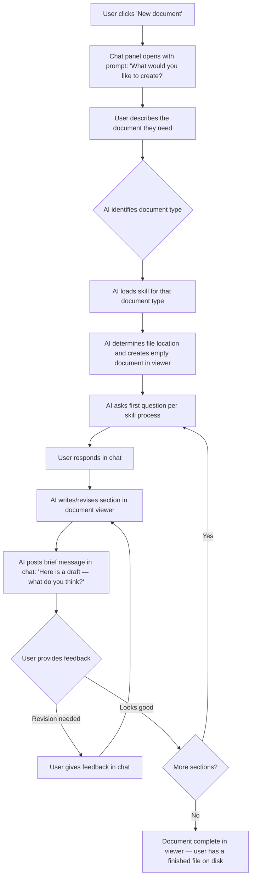
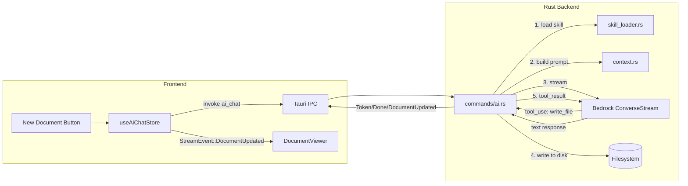
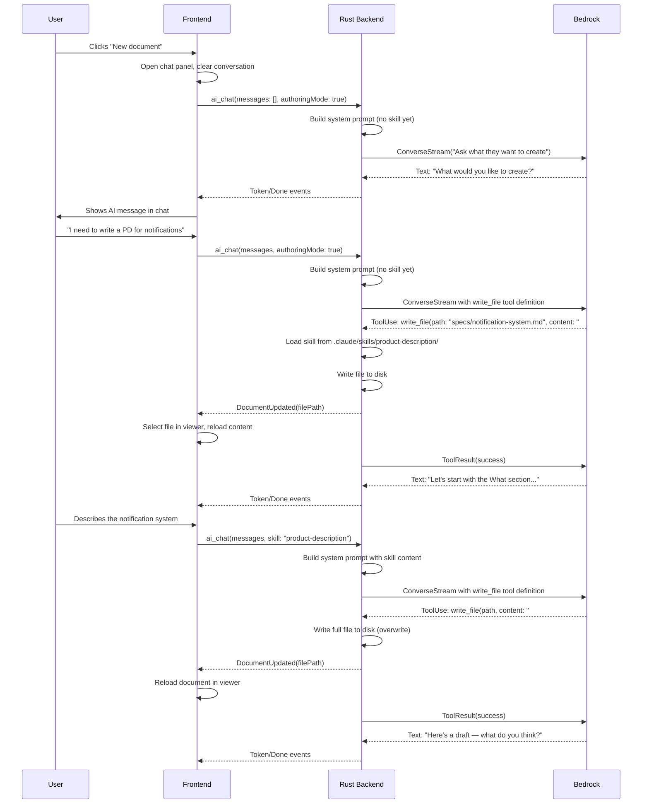

# Document Authoring with AI

## What

Document authoring with AI lets users create new documents through a guided conversation rather than staring at a blank page. The user tells the AI what they want to create — "I need to write a PD for our notification system" — and the AI leads them through the process section by section, asking questions, drafting content, and refining based on feedback. The user focuses entirely on critical thinking (what to build, why it matters, who it's for) while the AI handles process, structure, formatting, and consistency with existing documents.

As the conversation progresses, the document takes shape in the main viewer in real time. When the AI drafts a section, it writes directly to the document — the user sees it appear in the viewer and evaluates it there. The chat panel stays focused on dialogue: "Here's a draft of the Why section — what do you think?" The user reads the actual document, not a preview in the chat, and provides feedback through the conversation. The document is the living artifact from the very first draft, growing and refining as the dialogue continues.

Different document types (product descriptions, technical designs, SOPs) each have their own structure and their own process for working through that structure. The AI knows both — what sections a document needs and how to guide the user through creating each one — so the experience adapts to whatever the user is writing.

## Why

Writing good documentation requires deep thinking about critical decisions — what are we building, why, what trade-offs matter. But authors spend as much energy on mechanical work: picking the right template, remembering what sections to include, structuring their thoughts into proper format, checking consistency with existing documents. This cognitive overhead pulls focus away from the actual problem.

Document authoring with AI eliminates that entire category of work. The AI knows the process and the structure, so the author never thinks about either. They just answer questions and react to drafts. This means a product manager spends 30 minutes thinking hard about the problem space instead of 90 minutes split between thinking and formatting. Every document comes out structurally complete and consistent with the rest of the repository because the AI enforces that automatically.

## Personas

1. **Patricia: Product Manager** — creates product descriptions and requirements; the most frequent author
2. **Eric: Engineer** — writes technical designs and architecture documents
3. **Olivia: Operations Lead** — creates SOPs, process docs, and runbooks

## Narratives

### Patricia creates a product description

Patricia opens Episteme and sees her team's document repository in the left sidebar — product descriptions, technical designs, and architecture decisions organized by project. She clicks "New document" and the AI chat panel opens alongside an empty document viewer. "What would you like to create?" the AI asks.

"I need to write a PD for our new notification system," Patricia types. The AI recognizes this as a product description, determines the right location in the repository structure, and gets started. "Let's begin with the What section. In a couple sentences, what is the notification system and who is it for?" Patricia responds with her core idea.

A moment later, the What section appears in the document viewer — a polished two-paragraph draft that captures her intent and expands on it. Patricia reads it and notices it's too focused on implementation details. "Too technical — rewrite it focusing on user outcomes," she tells the AI. The document updates in place with a revised version that nails the tone. "That's good," she replies, and the AI moves on to Why.

The AI walks Patricia through each section in sequence — Why, Personas, Narratives, User Stories, Goals — asking targeted questions and writing drafts directly to the document. Patricia never thinks about what comes next or how to format anything. She just thinks about the problem: what to build, why it matters, who it's for. Thirty minutes of focused conversation later, she has a complete product description in her document viewer, structurally consistent with every other PD in the repository.

### Eric writes a tech design that builds on existing decisions

Eric needs to write a technical design for the notification delivery service. He clicks "New document" and tells the AI he's writing a tech design. The AI asks what it's for, and Eric explains it implements the delivery backend for Patricia's notification system PD.

The AI immediately pulls context from the repository — it finds Patricia's product description, the existing alert system tech design, and two relevant ADRs about messaging infrastructure. When it drafts the Introduction and Overview section, it references the PD's goals directly and notes where the delivery service boundaries overlap with the alert system. Eric sees the draft appear in the document viewer and notices the AI caught a dependency he hadn't considered: the alert system already has a delivery queue that could be reused. "Good catch — mention that as an option in alternatives considered," he tells the AI.

As they work through the System Design section, the AI drafts an architecture diagram description that's consistent with the patterns used in other tech designs in the repository — same component naming conventions, same level of detail. Eric focuses on the hard engineering decisions: which queue technology, what retry strategy, how to handle delivery failures. The AI turns his answers into structured prose, weaving in references to the ADRs and related documents so the tech design reads as part of a coherent whole rather than an isolated document.

### A new team member discovers the authoring flow

Devon just joined the team and needs to document the deployment runbook for the service he's taking over. He's never used Episteme before and has no idea what template to use or where to put the file. He clicks "New document" and types, "I need to write a deployment runbook for the payments service."

The AI figures out this is an SOP-style document and tells Devon it'll guide him through the standard runbook format. "First, let's describe what this runbook covers and when someone would use it." Devon types a few sentences about the deployment process. The AI writes a clean Purpose section to the document viewer, and Devon is surprised — it already reads like something a senior engineer would write. He didn't know what a "good" runbook looks like at this company, but the AI does because it's seen every other runbook in the repository.

As they move through Prerequisites, Steps, and Rollback Procedures, the AI asks specific questions Devon can answer from his onboarding notes. When Devon isn't sure about the rollback process, the AI surfaces the existing payments service incident report and suggests a rollback procedure based on what the team did last time. Devon confirms the details and the AI writes it up. Twenty minutes in, Devon has a complete, well-structured runbook — formatted consistently with the team's existing documentation — without ever needing to ask a colleague what template to use or how to organize it.

## User stories

### From: Patricia creates a product description

- Patricia can click "New document" to start the authoring flow
- Patricia can tell the AI what type of document she wants to create
- Patricia can see the AI's drafts appear directly in the document viewer
- Patricia can provide feedback on a draft section through the chat panel
- Patricia can see a revised section replace the previous draft in the document viewer
- Patricia can approve a section and have the AI move to the next one automatically
- Patricia can see the complete document in the viewer as sections accumulate

### From: Eric writes a tech design that builds on existing decisions

- Eric can tell the AI what existing document his new document relates to
- Eric can see the AI reference related documents and ADRs in its drafts
- Eric can see the AI surface relevant context from the repository that he didn't explicitly mention
- Eric can direct the AI to place specific content in specific sections
- Eric can focus on answering substantive questions while the AI handles formatting and structure

### From: A new team member discovers the authoring flow

- Devon can describe what he needs to write in plain language without knowing the template
- Devon can see the AI identify the correct document type and structure automatically
- Devon can see drafts that match the style and conventions of existing team documents
- Devon can get suggestions drawn from related documents in the repository
- Devon can produce a complete, well-structured document without prior knowledge of team conventions

## Goals

- Users can create a complete, structurally correct document without knowing the template or process beforehand
- AI-authored drafts reference and stay consistent with existing repository documents
- The authoring conversation produces a document indistinguishable in quality and format from one written by an experienced team member
- Document creation time drops significantly compared to manual authoring — the user spends their time on substance, not mechanics

## Non-goals

- Reopening a previously-completed document for AI-assisted revision (editing during the authoring flow is in scope; opening a finished document and saying "rewrite this section" is a separate future feature)
- Git operations — branching, committing, or pushing the authored document (that's the GitHub integration feature)
- Custom or user-defined document types — start with a fixed set of supported types (PD, tech design, SOP/runbook, ADR)
- Offline authoring — AI-guided authoring requires an active Bedrock connection
- Multi-user co-authoring — one user authors at a time (real-time collaboration is a separate feature)

## Design spec

### User flow



### UI components

#### New document button
- Added to the sidebar, above the file tree
- Ghost button style: `hover:bg-gray-100 text-gray-700`
- Icon: `Plus` from Lucide (`w-4 h-4`) with label "New document"
- Clicking opens the chat panel (if not already open) and starts the authoring flow

#### Chat panel in authoring mode
- Same panel as the existing AI chat assistant — no separate mode or visual distinction
- The authoring conversation is just a conversation where the AI follows a skill's process
- All existing chat panel behaviors apply: streaming responses, message history, clear conversation
- The only difference is behavioral: the AI writes to the document viewer as a side effect of the conversation

#### Document viewer during authoring
- Displays the document being authored, rendered with the existing markdown renderer
- Content updates in real time as the AI writes sections — same rendering pipeline as viewing any other document
- The document is a real file on disk from the start; the viewer is showing the current state of that file
- No editing UI (no cursor, no TipTap editor toolbar) — the user reads and evaluates, all changes go through the chat

#### Authoring-specific chat behaviors
- When starting a new document, the chat panel clears any previous conversation and shows the initial prompt
- The AI's chat messages stay concise — questions and brief status updates, not full section drafts
- Section content appears in the document viewer, not in chat bubbles
- If the user asks to revise a section, the document viewer updates in place

## Tech spec

### Introduction and overview

**Prerequisites:**
- ADR-001 (Tauri) — Rust backend handles file I/O and Bedrock API calls
- ADR-002 (TipTap) — document rendering in the viewer
- ADR-003 (Zustand) — frontend state management for authoring flow
- ADR-008 (Claude skills for document types) — skills define process and template for each document type
- AI chat assistant feature — existing Bedrock streaming infrastructure

**Goals:**
- AI can both converse in chat and write to files on disk within a single turn
- Document viewer updates within 500ms of the AI writing a section
- Skill loading (reading skill files from disk) completes in <100ms
- No user-visible latency difference between regular chat and authoring chat

**Non-goals:**
- Prompt optimization or token budget management for skill content
- Streaming partial section writes (the AI writes a complete section at a time)
- Undo/redo for AI-authored sections (the user asks for revisions through chat)

**Glossary:**
- **Skill** — a document type definition stored at `.claude/skills/<type>/SKILL.md` with a `references/` folder, following the standard Claude Code skills convention per ADR-008
- **Tool use** — Bedrock ConverseStream API feature where the AI can call defined functions during a response, producing both text output and function calls in a single turn
- **Tool use loop** — when the AI calls a tool, the backend executes it, sends the result back to Bedrock, and the AI continues. This may happen multiple times within a single user turn.

### System design and architecture



**Component breakdown:**

- **skill_loader.rs** (new Rust module): Reads `SKILL.md` and `references/` files from `.claude/skills/` in the workspace. Returns skill content as a string for injection into the system prompt.
- **commands/ai.rs** (modified): Extended to support Bedrock tool use. Defines a `write_file` tool schema, handles `ToolUse` blocks in the stream, writes files to disk, sends `ToolResult` back to Bedrock, and emits `DocumentUpdated` events to the frontend. Validates all file paths are within the workspace.
- **context.rs** (modified): System prompt extended to include skill content when in authoring mode. Adds authoring-specific instructions telling the AI to use `write_file` for writing and keep chat messages concise.
- **useAiChatStore** (modified): Handles new `DocumentUpdated` stream event to trigger document viewer refresh. Tracks authoring state (active document path, active skill).
- **DocumentViewer** (modified): Reloads file content when it receives a `DocumentUpdated` notification.

**Sequence diagram — primary authoring flow:**



### Detailed design

#### Rust backend: Skill loader

**`load_skill(workspace_path, skill_name) -> Result<String, String>`**

Reads the skill definition from `.claude/skills/<skill_name>/` within the workspace:

1. Read `SKILL.md` — the main process file (required)
2. Scan `references/` directory for `.md` files (optional)
3. Concatenate: `SKILL.md` content first, then each reference file prefixed with its filename as a heading
4. Return the combined string for injection into the system prompt

**`list_skills(workspace_path) -> Result<Vec<SkillInfo>, String>`**

Lists available document type skills by scanning `.claude/skills/` directories. Returns name and description (parsed from YAML frontmatter) for each. Used to validate the requested document type exists and to inform the AI which document types are available.

#### Rust backend: `write_file` tool execution

When the AI calls `write_file`, the backend:

1. Validate `file_path` is within `workspace_path` (path traversal prevention, reuses existing pattern from `read_file`)
2. Create parent directories if needed
3. Write the full content to disk (create or overwrite)
4. Send `DocumentUpdated` event to frontend with the absolute file path
5. Return success as tool result

This is a general-purpose file write — the same tool works for initial document creation and for every subsequent update. The AI manages the document content; the tool just persists it. This approach also works unchanged for a future editing feature.

#### Rust backend: Tool definition for Bedrock

One tool is defined and passed to the Bedrock ConverseStream API:

**`write_file`**
```json
{
  "name": "write_file",
  "description": "Write content to a file in the workspace. Creates the file if it doesn't exist, or overwrites it if it does. Use this to create and update the document being authored. Always write the complete file content.",
  "inputSchema": {
    "type": "object",
    "properties": {
      "file_path": {
        "type": "string",
        "description": "Relative path within the workspace (e.g., 'specs/notification-system.md')"
      },
      "content": {
        "type": "string",
        "description": "The complete file content to write"
      }
    },
    "required": ["file_path", "content"]
  }
}
```

#### Rust backend: Tool use loop in `ai_chat`

The existing `ai_chat` command is extended to handle tool use. The stream processing loop becomes:

1. Stream response from Bedrock
2. For `ContentBlockDelta` with text: send `Token` event to frontend (same as before)
3. For `ContentBlockStart` with `ToolUse`: begin accumulating tool input JSON
4. For `ContentBlockDelta` with `ToolUse` input: append to accumulated input
5. For `ContentBlockStop` on a tool use block: parse accumulated JSON
6. For `MessageStop` with `stop_reason: "tool_use"`:
   - Execute `write_file`: validate path, write content to disk, send `DocumentUpdated` event
   - If this is the first write and a skill name can be inferred from the file path or conversation, load the skill for subsequent turns
   - Build a `ToolResult` message with the result
   - Send the accumulated assistant message + tool results back to Bedrock
   - Start a new ConverseStream call and continue the loop
7. For `MessageStop` with `stop_reason: "end_turn"`: send `Done` event (same as before)

#### Frontend: Stream event changes

Add a new `StreamEvent` variant:

```typescript
// Existing
type StreamEvent =
  | { type: "Token"; data: string }
  | { type: "Done"; data: string }
  | { type: "Error"; data: string }
  // New
  | { type: "DocumentUpdated"; data: string }  // data = file path
```

Corresponding Rust enum extension:

```rust
#[derive(Clone, Serialize)]
#[serde(tag = "type", content = "data")]
pub enum StreamEvent {
    Token(String),
    Done(String),
    Error(String),
    DocumentUpdated(String),  // file path
}
```

#### Frontend: useAiChatStore changes

New state fields:

```typescript
interface AiChatStore {
  // ... existing fields ...
  authoringMode: boolean;           // true when in document authoring flow
  authoringFilePath: string | null; // path of document being authored
  activeSkill: string | null;       // skill name (e.g., "product-description")
}
```

`sendMessage` changes:
- Pass `authoringMode` and `activeSkill` to the `ai_chat` Tauri command
- On `DocumentUpdated` event: update `authoringFilePath`, trigger file tree store to select the file, trigger document viewer to reload

New action:
- `startAuthoring()`: sets `authoringMode = true`, clears conversation, opens chat panel

#### Frontend: DocumentViewer changes

Subscribe to `authoringFilePath` changes from `useAiChatStore`. When `DocumentUpdated` events arrive during authoring, re-invoke `read_file` to reload the document content. This reuses the existing file reading and markdown rendering pipeline — no new rendering logic needed.

#### System prompt structure in authoring mode

When `authoringMode` is true and a skill is active, the system prompt is extended:

```
You are an AI assistant for Episteme, a document authoring application.
You are currently helping the user create a new document.

## Authoring instructions

- Use the `write_file` tool to write the document — always write the complete file content
- Keep your chat messages concise — ask questions and give brief status updates
- Do NOT include section content in your chat messages; write it to the document using write_file
- Follow the skill process below to guide the user through each section
- After each write, the user sees the updated document in their viewer

## Skill: <skill_name>

<SKILL.md content>

<references/ content>

## Active document
<current file content, updated after each write>

## Repository structure
<existing tree listing>
```

### Security, privacy, and compliance

**File system access**: The `write_file` tool validates all paths are within the workspace directory using the same canonicalization and prefix-checking pattern as the existing `read_file` command. No files outside the workspace can be created or overwritten.

**Skill content**: Skills are read from `.claude/skills/` within the workspace — they're user-controlled content in the repo. The skill content is injected into the system prompt, so a malicious skill could influence AI behavior. This is acceptable because skills are committed to the repo and subject to the same review process as code.

**Data privacy**: Same as the AI chat assistant — document contents and skill content are sent to Bedrock as prompt context. No additional data exposure beyond what the chat assistant already sends.

**Input validation**: The `write_file` tool only accepts relative paths and resolves them against the workspace root. Paths containing `..` or absolute paths are rejected.

### Observability

**Logging** (using existing tauri-plugin-log):
- INFO: Authoring session started (document type, skill name)
- INFO: File written via `write_file` tool (file path, size — no content)
- INFO: Skill loaded (skill name, content size)
- ERROR: Skill not found, file write failures, tool use errors
- DEBUG: Tool use loop iterations, Bedrock tool_use/tool_result exchange timing

### Testing plan

**Unit tests (Vitest):**
- `aiChat` store: authoring mode state transitions, `DocumentUpdated` event handling
- Skill loading: valid skill, missing skill, skill without references

**Unit tests (Rust):**
- Skill loader: reads `SKILL.md`, reads references, handles missing skill directory
- File write: creates file, overwrites file, rejects paths outside workspace, creates parent directories
- Tool use parsing: extracts tool name and input from Bedrock stream events

**Integration tests:**
- Tool use loop: mock Bedrock responses with tool_use blocks, verify file is written and tool_result is sent back
- Full authoring flow with mocked Bedrock: start authoring, create document, write sections, verify file content at each step

**E2E tests (Playwright):**
- "New document" button opens chat panel with initial prompt
- Document viewer updates when file is written during authoring
- Chat messages stay concise (no section content in chat bubbles)

### Alternatives considered

**Domain-specific tools (`create_document`, `write_section`) instead of general `write_file`:**
- Pros: Section-aware writes, smaller payloads (only the new section content)
- Cons: Rigid abstraction that doesn't extend to editing; requires section boundary parsing in Rust; two tools instead of one
- **Decision**: `write_file` is simpler, more general, and follows the proven coding agent pattern. The AI manages document structure; the tool just persists content.

**Streaming section writes (AI streams content directly to the file as tokens arrive):**
- Pros: User sees content appear character by character in the document viewer
- Cons: Significant complexity — need to track write position, handle partial markdown, deal with interrupted writes
- **Decision**: Write complete sections at a time. The latency between the AI deciding to write and the content appearing is negligible. Not worth the complexity.

**Separate authoring UI (dedicated editor mode distinct from chat):**
- Pros: Could offer richer editing controls, clearer mode separation
- Cons: More UI to build and maintain, contradicts the "chat is the interface" design philosophy, fragments the experience
- **Decision**: Reuse the existing chat panel and document viewer. The AI's behavior changes (it follows a skill process and writes files), not the UI.

### Risks

**AI may not reliably follow skill processes**: The skill content is guidance in the system prompt, not enforced logic. The AI might skip sections, ask too many questions at once, or write content in chat instead of using the tool. Mitigation: Careful prompt engineering in the authoring instructions; test with real skills and iterate on the system prompt. The skill format itself (coming from the Claude ecosystem) is designed for LLM consumption.

**Tool use adds latency to each turn**: Each tool call requires a round-trip to Bedrock (assistant message with tool_use → tool_result → assistant continues). A single user turn that triggers a write involves two Bedrock calls instead of one. Mitigation: This is inherent to the tool use pattern and the latency should be acceptable (~1-2s additional). Monitor and optimize if it becomes noticeable.

**Full file rewrites may confuse the AI on large documents**: As the document grows, the AI must reproduce the entire file content for each write, increasing the chance of accidentally dropping or altering earlier sections. Mitigation: The active document is always in the system prompt, so the AI has the current content as reference. For v1, documents are unlikely to exceed a few thousand words. If this becomes a problem, we can add an `edit_file` tool (find/replace pattern) as a complement.

**Skill content may exceed context budget**: A skill with extensive references plus the active document plus the repository listing could consume a significant portion of the context window. Mitigation: Keep initial skills concise. Monitor token usage in practice. If needed, truncate repository listing or load references on demand.

## Task list

- [ ] **Story: Skill loader (Rust backend)**
  - [ ] **Task: Implement `load_skill` function**
    - **Description**: Create `src-tauri/src/skill_loader.rs` with a function that reads a skill from `.claude/skills/<skill_name>/` within the workspace. Read `SKILL.md` (required), scan `references/` for `.md` files (optional), concatenate them with reference filenames as headings, and return the combined string.
    - **Acceptance criteria**:
      - [ ] Reads `SKILL.md` from `.claude/skills/<name>/SKILL.md`
      - [ ] Reads all `.md` files from `references/` subdirectory
      - [ ] Concatenates skill content with reference files prefixed by filename headings
      - [ ] Returns error if `SKILL.md` doesn't exist
      - [ ] Returns successfully if `references/` directory is missing (optional)
      - [ ] Validates skill path is within workspace (no path traversal)
      - [ ] Unit tests cover: valid skill, skill without references, missing skill, path traversal attempt
    - **Dependencies**: None
  - [ ] **Task: Implement `list_skills` function**
    - **Description**: Add a function to `skill_loader.rs` that scans `.claude/skills/` directories in the workspace and returns a list of available skills with name and description (parsed from YAML frontmatter in each `SKILL.md`).
    - **Acceptance criteria**:
      - [ ] Scans `.claude/skills/` for subdirectories containing `SKILL.md`
      - [ ] Parses YAML frontmatter to extract `name` and `description` fields
      - [ ] Returns `Vec<SkillInfo>` with name and description for each skill
      - [ ] Returns empty list if `.claude/skills/` doesn't exist
      - [ ] Unit tests cover: multiple skills, no skills directory, skill with missing frontmatter
    - **Dependencies**: None

- [ ] **Story: Tool use support in Bedrock integration (Rust backend)**
  - [ ] **Task: Define `write_file` tool schema**
    - **Description**: In `commands/ai.rs`, define the `write_file` tool configuration that gets passed to Bedrock's ConverseStream API. The tool accepts `file_path` (relative) and `content` (complete file content). Use the `aws_sdk_bedrockruntime::types::Tool` and `ToolInputSchema` types to build the definition.
    - **Acceptance criteria**:
      - [ ] Tool definition matches the JSON schema in the tech spec
      - [ ] Tool is passed to `converse_stream().tool_config()` when authoring mode is active
      - [ ] Tool is NOT included when authoring mode is inactive (regular chat)
      - [ ] Project compiles with new tool configuration types
    - **Dependencies**: None
  - [ ] **Task: Implement `write_file` tool execution**
    - **Description**: Add a function that executes the `write_file` tool: validates the file path is within the workspace (reuse existing canonicalization pattern from `read_file`), creates parent directories if needed, writes the full content to disk, and returns a success/failure result for the tool response.
    - **Acceptance criteria**:
      - [ ] Creates file if it doesn't exist
      - [ ] Overwrites file if it does exist
      - [ ] Creates parent directories as needed
      - [ ] Rejects paths outside the workspace (path traversal prevention)
      - [ ] Rejects absolute paths and paths containing `..`
      - [ ] Returns descriptive error on write failure
      - [ ] Unit tests cover: create, overwrite, path traversal rejection, parent directory creation
    - **Dependencies**: None
  - [ ] **Task: Implement tool use loop in `ai_chat`**
    - **Description**: Extend the existing stream processing loop in `ai_chat` to handle Bedrock tool use. Accumulate `ToolUse` input from stream events, execute tools on `MessageStop` with `stop_reason: "tool_use"`, send `ToolResult` back to Bedrock, and continue streaming. Send `DocumentUpdated` event to frontend after each file write. Add `DocumentUpdated` variant to `StreamEvent` enum.
    - **Acceptance criteria**:
      - [ ] `StreamEvent` enum extended with `DocumentUpdated(String)` variant
      - [ ] `ToolUse` content blocks accumulated from stream deltas
      - [ ] Tool input JSON parsed when content block completes
      - [ ] `write_file` executed and `DocumentUpdated` event sent to frontend on tool use
      - [ ] `ToolResult` message sent back to Bedrock with tool outcome
      - [ ] New `ConverseStream` call initiated after tool result to continue the conversation
      - [ ] Loop terminates on `stop_reason: "end_turn"` as before
      - [ ] Existing non-authoring chat flow (no tool use) continues to work unchanged
      - [ ] Auth errors during tool use loop handled correctly
    - **Dependencies**: "Task: Define `write_file` tool schema", "Task: Implement `write_file` tool execution"

- [ ] **Story: Authoring system prompt (Rust backend)**
  - [ ] **Task: Extend `ai_chat` command to accept authoring parameters**
    - **Description**: Modify the `ai_chat` Tauri command signature to accept `authoring_mode: bool` and `active_skill: Option<String>`. When `authoring_mode` is true, include tool definitions in the Bedrock call. When `active_skill` is set, load the skill and include its content in the system prompt.
    - **Acceptance criteria**:
      - [ ] `ai_chat` accepts `authoring_mode` and `active_skill` parameters
      - [ ] Tool definitions included only when `authoring_mode` is true
      - [ ] Skill content loaded and injected into system prompt when `active_skill` is provided
      - [ ] Authoring instructions block added to system prompt in authoring mode
      - [ ] Regular chat (authoring_mode: false) works exactly as before
    - **Dependencies**: "Task: Implement `load_skill` function", "Task: Implement tool use loop in `ai_chat`"
  - [ ] **Task: Build authoring system prompt in `context.rs`**
    - **Description**: Extend `build_system_prompt` in `context.rs` to support authoring mode. When authoring, prepend authoring instructions (use `write_file`, keep chat concise, follow skill process), include skill content, and include the active document content and repository structure.
    - **Acceptance criteria**:
      - [ ] Authoring instructions section added when authoring mode is active
      - [ ] Skill content (SKILL.md + references) included under `## Skill: <name>` heading
      - [ ] Active document content included under `## Active document` heading
      - [ ] Repository structure listing included (existing behavior)
      - [ ] Non-authoring prompt unchanged
      - [ ] Unit tests verify authoring prompt structure
    - **Dependencies**: "Task: Implement `load_skill` function"

- [ ] **Story: Frontend authoring state and events**
  - [ ] **Task: Add authoring state to `useAiChatStore`**
    - **Description**: Extend `useAiChatStore` with `authoringMode`, `authoringFilePath`, and `activeSkill` fields. Add `startAuthoring()` action that sets `authoringMode = true`, clears the conversation, and resets authoring fields. Update `sendMessage` to pass `authoringMode` and `activeSkill` to the `ai_chat` Tauri command. Update `clearConversation` to also reset authoring state.
    - **Acceptance criteria**:
      - [ ] New fields added: `authoringMode`, `authoringFilePath`, `activeSkill`
      - [ ] `startAuthoring()` action sets mode, clears messages, resets fields
      - [ ] `sendMessage` passes `authoringMode` and `activeSkill` to Tauri command
      - [ ] `clearConversation` resets authoring state
      - [ ] Unit tests cover authoring state transitions
    - **Dependencies**: None
  - [ ] **Task: Handle `DocumentUpdated` stream event**
    - **Description**: In `useAiChatStore`, extend the `onEvent` Channel handler to process `DocumentUpdated` events. When received, update `authoringFilePath`, trigger `useFileTreeStore` to select the file (so it appears selected in the sidebar), and trigger document viewer to reload by updating a reactive signal.
    - **Acceptance criteria**:
      - [ ] `DocumentUpdated` event type handled in Channel onmessage
      - [ ] `authoringFilePath` updated with the file path from the event
      - [ ] `useFileTreeStore.selectFile()` called with the file path
      - [ ] Document viewer reloads content when `DocumentUpdated` is received
      - [ ] Multiple `DocumentUpdated` events in a single turn handled correctly (each triggers a reload)
      - [ ] Unit tests cover event handling and state updates
    - **Dependencies**: "Task: Add authoring state to `useAiChatStore`"

- [ ] **Story: Frontend UI changes**
  - [ ] **Task: Add "New document" button to sidebar**
    - **Description**: Add a button above the file tree in `Sidebar.tsx` with a `Plus` icon and "New document" label. Clicking it calls `useAiChatStore.startAuthoring()` and opens the chat panel (communicate via a callback prop or by setting a shared state).
    - **Acceptance criteria**:
      - [ ] Button visible above file tree when a folder is open
      - [ ] Ghost button style matching design spec
      - [ ] `Plus` icon from Lucide with "New document" label
      - [ ] Click calls `startAuthoring()` on the chat store
      - [ ] Chat panel opens if not already open
      - [ ] Button disabled during active streaming
    - **Dependencies**: "Task: Add authoring state to `useAiChatStore`"
  - [ ] **Task: Wire DocumentViewer to reload on `DocumentUpdated`**
    - **Description**: Modify `DocumentViewer.tsx` to subscribe to `authoringFilePath` from `useAiChatStore`. When the file path changes or a `DocumentUpdated` event triggers a reload, re-invoke `read_file` to refresh the displayed content. Use a counter or timestamp to force re-render even when the path hasn't changed (same file, new content).
    - **Acceptance criteria**:
      - [ ] Document viewer reloads when `authoringFilePath` is set or updated
      - [ ] Content refreshes on each `DocumentUpdated` event (not just on path change)
      - [ ] Existing file selection from sidebar continues to work
      - [ ] No flicker or scroll position loss during reload
    - **Dependencies**: "Task: Handle `DocumentUpdated` stream event"

- [ ] **Story: Starter skills**
  - [ ] **Task: Create product description skill**
    - **Description**: Create `.claude/skills/product-description/SKILL.md` and `.claude/skills/product-description/references/template.md`. The `SKILL.md` defines the process for guiding a user through creating a product description (What, Why, Personas, Narratives, User Stories, Goals/Non-goals). The template shows the expected section structure. Base the process on the planning-reference skill patterns already used in this project.
    - **Acceptance criteria**:
      - [ ] `SKILL.md` has valid YAML frontmatter with name and description
      - [ ] Process covers all PD sections in order: What, Why, Personas, Narratives, User Stories, Goals, Non-goals
      - [ ] Each section has guidance on what questions to ask and how to draft
      - [ ] `references/template.md` shows the expected document structure
      - [ ] Skill is loadable by `load_skill` function
    - **Dependencies**: "Task: Implement `load_skill` function"
  - [ ] **Task: Create tech design skill**
    - **Description**: Create `.claude/skills/tech-design/SKILL.md` and references. Defines the process for guiding a user through creating a technical design (Introduction, System Design, Detailed Design, Security, Observability, Testing, Alternatives, Risks).
    - **Acceptance criteria**:
      - [ ] `SKILL.md` has valid YAML frontmatter with name and description
      - [ ] Process covers all tech design sections in order
      - [ ] Guidance on referencing existing ADRs and related documents
      - [ ] `references/template.md` shows expected document structure
      - [ ] Skill is loadable by `load_skill` function
    - **Dependencies**: "Task: Implement `load_skill` function"

- [ ] **Story: End-to-end integration and testing**
  - [ ] **Task: Manual integration test with real Bedrock**
    - **Description**: Test the full authoring flow end-to-end with a real AWS SSO profile and Bedrock. Click "New document", describe a product description, verify the AI follows the skill process, writes sections to the document viewer, and produces a complete document. Document any issues with prompt engineering or tool use reliability.
    - **Acceptance criteria**:
      - [ ] "New document" button opens chat with initial prompt
      - [ ] AI identifies document type and creates the file
      - [ ] Document appears in viewer after first write
      - [ ] AI follows skill process section by section
      - [ ] Each section write updates the document viewer
      - [ ] Revision requests result in updated content
      - [ ] Chat messages stay concise (no section content in chat)
      - [ ] Complete document is structurally correct
    - **Dependencies**: All previous tasks
  - [ ] **Task: Unit tests for skill loader and tool execution**
    - **Description**: Write Rust unit tests for `skill_loader.rs` functions and `write_file` tool execution. Use temp directories with test skill files and test documents.
    - **Acceptance criteria**:
      - [ ] Tests for `load_skill`: valid skill, missing skill, skill without references, path traversal
      - [ ] Tests for `list_skills`: multiple skills, empty directory, missing directory
      - [ ] Tests for `write_file` execution: create, overwrite, path validation, parent directory creation
      - [ ] All tests pass with `cargo test`
    - **Dependencies**: "Task: Implement `load_skill` function", "Task: Implement `list_skills` function", "Task: Implement `write_file` tool execution"
  - [ ] **Task: Unit tests for frontend authoring state**
    - **Description**: Write Vitest unit tests for the authoring-related changes in `useAiChatStore`. Test `startAuthoring`, `DocumentUpdated` event handling, authoring state transitions, and interaction with file tree store.
    - **Acceptance criteria**:
      - [ ] Tests for `startAuthoring()` state transitions
      - [ ] Tests for `DocumentUpdated` event handling
      - [ ] Tests for `sendMessage` passing authoring parameters
      - [ ] Tests for `clearConversation` resetting authoring state
      - [ ] All tests pass with `npm run test:unit`
    - **Dependencies**: "Task: Add authoring state to `useAiChatStore`", "Task: Handle `DocumentUpdated` stream event"
  - [ ] **Task: E2E tests with mocked backend**
    - **Description**: Write Playwright E2E tests covering the authoring user flow with mocked Tauri commands. Test "New document" button, chat panel opening, document viewer updating on `DocumentUpdated` events.
    - **Acceptance criteria**:
      - [ ] Test: "New document" button opens chat panel
      - [ ] Test: document viewer updates when `DocumentUpdated` event received
      - [ ] Test: authoring mode clears previous conversation
      - [ ] All tests pass with `npm run test:e2e`
    - **Dependencies**: "Task: Add 'New document' button to sidebar", "Task: Wire DocumentViewer to reload on `DocumentUpdated`"
