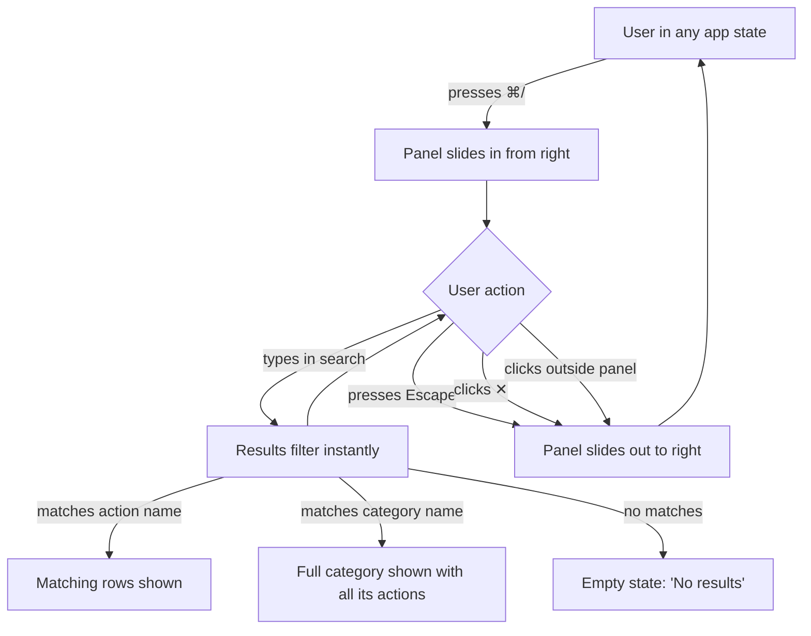

# Keyboard shortcuts

## What

Episteme registers every keyboard-driven action through a central shortcut store, giving users a single place to discover what shortcuts exist. A sidebar panel, opened with `⌘/`, lists all registered shortcuts organized by category — document, file tree, AI chat, navigation. The panel includes a search field: typing filters both action names and category names, and matching a category name shows all actions within it. Users can dismiss the panel by pressing Escape, clicking ✕, or clicking outside it.

Shortcuts are fixed — all bindings are set by the app and are not user-configurable. The registry makes shortcuts enumerable and discoverable, not customizable.

## Why

Keyboard shortcuts are invisible until users know to look for them. New users either discover shortcuts by accident or never find them at all, which means they stay slower than they need to be. Even experienced users can't remember every shortcut across every context — the file tree, the document editor, the AI chat panel — and there's currently no way to check without leaving the app.

An always-accessible reference panel removes the memory burden without interrupting the user's flow. It stays out of the way when not needed, appears instantly when summoned, and answers the question "what can I press here?" without requiring a trip to documentation.

## Personas

- **Eric: Engineer** — writes technical designs, navigates heavily between files and documents; builds up keyboard habits and wants to learn shortcuts early so they become muscle memory
- **Patricia: Product Manager** — drafts requirements and coordinates reviews; uses the app regularly but doesn't memorize shortcuts; benefits most from the reference panel as a quick lookup when she wonders if a faster way exists

## Narratives

### Learning shortcuts in context

Patricia has been using Episteme for a few weeks, mostly by mouse. She's writing a product description and keeps switching between the file tree and the document — clicking back and forth to check her notes. She presses `⌘/` on a hunch and the shortcuts panel slides in from the right. She skims the File tree section, finds arrow key navigation and Enter to open, and realizes she can stay on the keyboard for most of what she's doing. She closes the panel with Escape and immediately starts using the arrow keys.

A few days later she's in the middle of reviewing a document and wants to know if there's a shortcut for the AI chat panel. She presses `⌘/`, types "chat" in the search field, and the list collapses to just the chat-related actions — the AI chat category header and its shortcuts appear together. She notes the shortcut, closes the panel by clicking off it, and opens the chat without reaching for the mouse.

By the end of the week she's using half a dozen shortcuts without thinking about them. When she forgets one mid-task, she presses `⌘/`, finds what she needs in a few seconds, and keeps going. The panel has become a reference she consults the same way she'd glance at a cheat sheet pinned to a monitor — quick, low-friction, never disruptive.

## User stories

**Learning shortcuts in context**

- Patricia can open the shortcuts panel with `⌘/` without interrupting what she's working on
- Patricia can browse shortcuts organized by category so she can find what's relevant to her current context
- Patricia can search by action name to find a specific shortcut quickly
- Patricia can search by category name and see all shortcuts within that category
- Patricia can dismiss the panel by pressing Escape, clicking ✕, or clicking outside it
- Eric can learn shortcuts early by skimming the panel and putting them into practice immediately

## Goals

- Every registered action appears in the panel — no shortcuts exist that aren't listed
- The panel animates in from the right and out to the right when dismissed
- Typing in the search field filters results immediately with no debounce lag
- The panel is reachable from any app state — welcome screen, workspace, settings open, or even while a modal is displayed
- `⌘+,` on macOS and `Ctrl+,` on Windows/Linux both fire the same action — modifier normalization is handled centrally

## Non-goals

- Shortcut customization — bindings are fixed and set by the app
- Keyboard sequences (e.g. `g` then `h`) — single combos only
- Inline shortcut hints in the UI (tooltips, menu labels) — the panel is the one discovery surface

## Design spec

### User flows



### Key UI components

**ShortcutsPanel**

A fixed-position overlay panel anchored to the right side of the window. It sits below the title bar and spans the remaining viewport height. The panel has rounded corners on its left edges only (`border-radius: var(--radius-md) 0 0 var(--radius-md)`), a left border using `--color-border-subtle`, and a solid background using `--color-bg-overlay` so underlying content does not bleed through. It is wide enough to hold both action names and key badges side by side — `--width-shortcuts-panel: 320px`. Padding inside the panel is `var(--padding-panel)` (20px) on all sides.

The panel enters from the right using a CSS slide-in transition (`transform: translateX(100%)` → `translateX(0)`) with `--duration-normal` (150ms) and `--ease-default`. It exits in the same direction with `--duration-fast` (80ms). The panel renders on top of all other content via `z-index` above the settings overlay. Clicking anywhere outside the panel dismisses it.

**Panel header**

A single row at the top of the panel containing the title "Keyboard shortcuts" on the left and a close button (✕) on the right. The title uses `--color-text-primary` at the body font size. The close button is icon-only, `aria-label="Close shortcuts panel"`, and dismisses the panel.

**Search field**

A full-width text input below the header. Placeholder text: "Search shortcuts…". Background is `--color-bg-subtle`; border is `--color-border-subtle`. Typing filters results immediately with no debounce. The field receives focus automatically when the panel opens.

**Category section**

A labeled group of shortcuts. The category name (e.g. "File tree", "Global") appears as a small-caps heading in `--color-text-secondary`. Below it, each registered action renders as a `ShortcutRow`. Category sections are separated by a 12px gap. When a search query matches a category name, the full category is shown — all its actions appear, not just the matching ones. When the query matches only action names, only matching rows appear; any category whose actions are entirely filtered out is hidden entirely.

**ShortcutRow**

A single row showing one action. The action label is on the left in `--color-text-primary`. The key binding is on the right as one or more `Kbd` badge components. Labels and badges are spaced to opposite ends of the row using flexbox with `justify-content: space-between`. Row height is 32px.

**Empty state**

When a search query matches nothing, the panel body shows centered text: "No results" in `--color-text-secondary`.

## Tech spec

### Architecture overview

The feature has three implementation areas:

**1. Shortcut registry cleanup (`src/stores/shortcuts.ts`)**

The `ShortcutAction` interface is simplified: `defaultBinding` is renamed to `binding`, and `rebindable` is removed. `customBindings` store state is removed. `setBinding`, `resetBinding`, `applyCustomBindings`, and `checkConflict` are all deleted — none are needed when bindings are fixed. The internal `comboToAction` map simplifies from `customBinding ?? defaultBinding → action` to just `binding → action`.

**2. Cross-platform modifier normalization (`src/stores/shortcuts.ts`)**

`normalizeCombo` currently processes only `metaKey`. It gains a check: on non-macOS platforms (`!navigator.platform.startsWith("Mac")`), `ctrlKey` is treated as `Meta`. This means `Ctrl+,` on Windows/Linux produces `"Meta+Comma"` — the same string as `⌘+,` on macOS — so all action bindings and tests use a single canonical form.

**3. ShortcutsPanel component (`src/components/ShortcutsPanel.tsx`)**

Replaces `QuickReferenceDialog`. A right-anchored overlay panel that reads all registered actions from `useShortcutsStore`, groups them by `category`, and renders them with a live search field. `App.tsx` controls open/close state via `shortcutsPanelOpen`; the `app.openShortcutsPanel` action sets it to true.

**Removals**

| Item | Location |
|---|---|
| `BindingCard` component | `src/components/ui/BindingCard.tsx` — delete |
| `KeyboardShortcutsSettings` component | `src/components/KeyboardShortcutsSettings.tsx` — delete |
| `QuickReferenceDialog` component | `src/components/QuickReferenceDialog.tsx` — delete |
| `keyboard-shortcuts` settings category | `src/config/settings.ts` |
| `keyboard_shortcuts` preferences field | `src/lib/preferences.ts` and `src-tauri/src/commands/preferences.rs` |
| `applyCustomBindings` call | `src/App.tsx` |
| Tests for removed code | `tests/unit/stores/shortcuts.test.ts`, any component tests |

**Files retained**

- `src/lib/shortcutDisplay.ts` — `displayKey` utility, updated with platform-aware modifier display (see cross-platform section)
- `src/components/ui/Kbd.tsx` — key badge component, still used by `ShortcutsPanel`

### Data model

**`ShortcutAction` interface**

```typescript
interface ShortcutAction {
  id: string;                  // e.g. "app.openSettings"
  label: string;               // e.g. "Open settings"
  binding: string;             // e.g. "Meta+Comma" — canonical combo string
  category: string;            // e.g. "Global", "File tree"
  ignoresActionRestrictions: boolean; // true = fires in restricted contexts (see keyboard event handling)
  callback?: () => void;
}
```

Removed from current interface: `defaultBinding` (renamed to `binding`), `rebindable`.

**Store state**

```typescript
interface ShortcutsState {
  actions: Record<string, ShortcutAction>;
  comboToAction: Record<string, string>;       // binding → action id
  actionsRestricted: boolean;                   // true when a blocking modal is open
  registerAction: (action: ShortcutAction) => void;
  resolveAction: (combo: string, target: Element) => ShortcutAction | null;
  setActionsRestricted: (restricted: boolean) => void;
}
```

`actionsRestricted` lives in the store (not App.tsx) so that any component — modals, dialogs — can call `setActionsRestricted(true)` on mount and `setActionsRestricted(false)` on unmount without prop drilling. The `resolveAction` function checks it internally alongside the input-focus check, keeping all shortcut evaluation logic in one place.

Removed from current store: `customBindings`, `setBinding`, `resetBinding`, `applyCustomBindings`, `checkConflict`. No persistence — bindings are hardcoded at registration time and never written to disk.

### Keyboard event handling

The global `keydown` listener in `App.tsx` calls `resolveAction`, which evaluates two independent dimensions to decide whether a shortcut fires.

**1. Shortcut suppression (store-level boolean)**

When `actionsRestricted` is `true`, only actions with `ignoresActionRestrictions: true` are allowed through. Modals set this on mount/unmount. Panels (settings, shortcuts) do not set it.

**2. Input focus (per-action)**

When a text input, textarea, or contenteditable element is focused, only actions with `ignoresActionRestrictions: true` are allowed through.

**Both dimensions use the same gate.** The set of shortcuts that should fire through a modal (Escape, `⌘/`) is the same set that should fire through a focused input — modifier combos that can't produce text, plus Escape. One field handles both cases:

```
if (actionsRestricted || inputFocused) {
  return action.ignoresActionRestrictions ? action : null;
}
return action;
```

Actions with `ignoresActionRestrictions: true`: `app.openShortcutsPanel` (`⌘/`), `app.closeOverlay` (Escape).

**Overlay close order (LIFO)**

App.tsx maintains an `overlayStack` — an ordered list of overlay IDs. When an overlay opens, its ID is pushed. When an overlay closes (by any means), its ID is removed. When `app.closeOverlay` fires (Escape), it pops the most recently added overlay and closes it. This ensures that if both the settings panel and shortcuts panel are open, Escape closes whichever was opened last.

**Escape two-stage behavior in ShortcutsPanel:**

The panel's search input handles Escape locally via its own `onKeyDown`:
- Search field has text → clear the field, call `stopPropagation()` — Escape never reaches the global listener
- Search field is empty → let it bubble → global listener fires `app.closeOverlay` → panel closes

No special casing in the store. The two-stage behavior is standard DOM event propagation.

### Cross-platform modifier normalization

`normalizeCombo(e: KeyboardEvent)` produces a canonical combo string from a keyboard event:

- Collects active modifiers (`Alt`, `Meta`, `Shift`) in alphabetical order
- Appends `e.code` (e.g. `KeyA`, `Comma`, `Slash`)
- Joins with `+` → `"Meta+Comma"`, `"Meta+Slash"`, `"Escape"`

**Platform normalization:** On non-macOS platforms (`!navigator.platform.startsWith("Mac")`), `e.ctrlKey` is treated as `Meta`. This means `Ctrl+,` on Windows/Linux produces `"Meta+Comma"` — the same canonical form as `⌘+,` on macOS. All action bindings use the `Meta` form.

**Display normalization:** `displayKey` in `src/lib/shortcutDisplay.ts` becomes platform-aware. It caches a `isMac` boolean from `navigator.platform` at module load and maps `Meta` → `⌘` on macOS, `Meta` → `Ctrl` on other platforms. All other mappings (`Shift` → `⇧`, `Alt` → `⌥`, key codes → symbols) remain unchanged. The `Kbd` component requires no changes — it consumes whatever `displayKey` returns.

### Testing plan

**Unit tests (`tests/unit/stores/shortcuts.test.ts`)**

- `normalizeCombo` — existing tests plus new cases for `ctrlKey` on non-Mac platforms (mock `navigator.platform`)
- `registerAction` — registers with `binding` (not `defaultBinding`), builds `comboToAction` correctly
- `resolveAction` — returns `null` when `actionsRestricted` is true and `ignoresActionRestrictions` is false; returns action when `ignoresActionRestrictions` is true regardless of restriction; returns `null` for bare-key combos when input is focused; returns action for `ignoresActionRestrictions` combos when input is focused
- `setActionsRestricted` — toggles `actionsRestricted` state

**Unit tests (`tests/unit/lib/shortcutDisplay.test.ts`)**

- `displayKey` — maps `Meta` → `⌘` on Mac, `Meta` → `Ctrl` on non-Mac; maps key codes to symbols (`Comma` → `,`, `Slash` → `/`); passes through unknown segments unchanged

**Component tests (`tests/unit/components/ShortcutsPanel.test.tsx`)**

- Renders all registered actions grouped by category
- Search filters by action label; search filters by category name (shows full category)
- Empty state renders when no results match
- Escape in search field with text clears text (does not close panel)
- Escape in search field without text closes panel
- Close button dismisses panel
- Click outside dismisses panel

**Integration tests (`tests/unit/app.test.tsx`)**

- `⌘/` opens shortcuts panel
- `⌘/` opens shortcuts panel even when `actionsRestricted` is true
- Escape closes most recently opened overlay (LIFO)
- Overlay stack tracks open/close order correctly

## Task list

- [x] **Story: Registry cleanup**
  - [x] **Task: Simplify ShortcutAction interface and store**
    - **Description**: Rename `defaultBinding` → `binding`, rename `firesThroughInputs` → `ignoresActionRestrictions`, remove `rebindable` from the `ShortcutAction` interface. Remove `customBindings` state, `setBinding`, `resetBinding`, `applyCustomBindings`, and `checkConflict` from the store. Simplify the `comboToAction` map to use `binding` directly (no `customBindings` fallback). Add `actionsRestricted` boolean and `setActionsRestricted` method to the store.
    - **Acceptance criteria**:
      - [x] `ShortcutAction` has `binding` (not `defaultBinding`), `ignoresActionRestrictions` (not `firesThroughInputs`), no `rebindable`
      - [x] Store exposes `actionsRestricted`, `setActionsRestricted`, `registerAction`, `resolveAction` — nothing else
      - [x] `comboToAction` built from `action.binding` directly
      - [x] TypeScript compiles with no errors
    - **Dependencies**: None
  - [x] **Task: Update resolveAction for action restrictions**
    - **Description**: Modify `resolveAction` to check both `actionsRestricted` and input focus using the same gate: `if (actionsRestricted || inputFocused) return action.ignoresActionRestrictions ? action : null`. Remove the old `firesThroughInputs` check logic.
    - **Acceptance criteria**:
      - [x] `resolveAction` returns `null` when `actionsRestricted` is true and action has `ignoresActionRestrictions: false`
      - [x] `resolveAction` returns the action when `actionsRestricted` is true and action has `ignoresActionRestrictions: true`
      - [x] Same behavior when input is focused (regardless of `actionsRestricted`)
      - [x] When neither condition is true, all actions resolve normally
    - **Dependencies**: "Task: Simplify ShortcutAction interface and store"
  - [x] **Task: Update all registerAction call sites**
    - **Description**: Update every `registerAction` call in `App.tsx` (and any other files) to use `binding` instead of `defaultBinding`, `ignoresActionRestrictions` instead of `firesThroughInputs`, and remove `rebindable`. Set `ignoresActionRestrictions: true` on `app.openShortcutsPanel` and `app.closeOverlay`. Remove the `applyCustomBindings` call.
    - **Acceptance criteria**:
      - [x] All `registerAction` calls use new field names
      - [x] `app.openShortcutsPanel` (renamed from `app.openQuickReference`) has `ignoresActionRestrictions: true`
      - [x] `app.closeOverlay` has `ignoresActionRestrictions: true`
      - [x] No references to `defaultBinding`, `rebindable`, `firesThroughInputs`, or `applyCustomBindings` remain
      - [x] App compiles and existing shortcut behavior is preserved
    - **Dependencies**: "Task: Simplify ShortcutAction interface and store"
  - [x] **Task: Update store unit tests**
    - **Description**: Rewrite `tests/unit/stores/shortcuts.test.ts` to reflect the simplified store. Remove tests for `setBinding`, `resetBinding`, `applyCustomBindings`, `checkConflict`. Update `normalizeCombo` and `registerAction` tests to use `binding`. Add tests for `actionsRestricted`/`setActionsRestricted` and the updated `resolveAction` behavior (both dimensions gated by `ignoresActionRestrictions`).
    - **Acceptance criteria**:
      - [x] No tests reference removed methods or fields
      - [x] Tests cover: `registerAction` builds `comboToAction` from `binding`; `resolveAction` returns null when restricted and `ignoresActionRestrictions` is false; `resolveAction` returns action when restricted and `ignoresActionRestrictions` is true; same for input-focused; `setActionsRestricted` toggles state
      - [x] All tests pass
    - **Dependencies**: "Task: Update resolveAction for action restrictions"

- [x] **Story: Remove customization code**
  - [x] **Task: Delete customization components and settings**
    - **Description**: Delete `src/components/ui/BindingCard.tsx`, `src/components/KeyboardShortcutsSettings.tsx`, and `src/components/QuickReferenceDialog.tsx`. Remove the `keyboard-shortcuts` category from `src/config/settings.ts`. Remove `keyboard_shortcuts` from `PreferencesSchema` in `src/lib/preferences.ts` and `DEFAULT_PREFERENCES`. Remove `keyboard_shortcuts` from the `Preferences` struct in `src-tauri/src/commands/preferences.rs` and its `Default` impl.
    - **Acceptance criteria**:
      - [x] All three component files deleted
      - [x] No `keyboard-shortcuts` category in settings config
      - [x] No `keyboard_shortcuts` field in TS preferences or Rust preferences
      - [x] No import references to deleted files remain
      - [x] TypeScript and Rust compile with no errors
    - **Dependencies**: None (can run in parallel with registry cleanup)
  - [x] **Task: Delete tests for removed code**
    - **Description**: Remove any test files or test cases that exercise `BindingCard`, `KeyboardShortcutsSettings`, `QuickReferenceDialog`, `setBinding`, `resetBinding`, `applyCustomBindings`, or `checkConflict`. Check for component test files in `tests/unit/components/`.
    - **Acceptance criteria**:
      - [x] No test files or cases reference deleted components or store methods
      - [x] All remaining tests pass
    - **Dependencies**: "Task: Delete customization components and settings"

- [x] **Story: Cross-platform modifier normalization**
  - [x] **Task: Add ctrlKey normalization to normalizeCombo**
    - **Description**: In `normalizeCombo`, detect non-macOS platforms using `navigator.platform`. When `!navigator.platform.startsWith("Mac")`, treat `e.ctrlKey` as `Meta` in the modifier collection. On macOS, `ctrlKey` continues to be ignored (macOS uses `metaKey` for ⌘).
    - **Acceptance criteria**:
      - [x] On non-Mac (mocked `navigator.platform`), `ctrlKey: true` + `code: "Comma"` produces `"Meta+Comma"`
      - [x] On Mac, `ctrlKey: true` + `code: "Comma"` does NOT produce `"Meta+Comma"` (Ctrl is not remapped)
      - [x] On Mac, `metaKey: true` + `code: "Comma"` still produces `"Meta+Comma"`
      - [x] Unit tests for all three cases pass
    - **Dependencies**: "Task: Simplify ShortcutAction interface and store" (needs updated test file)
  - [x] **Task: Make displayKey platform-aware**
    - **Description**: In `src/lib/shortcutDisplay.ts`, cache an `isMac` boolean from `navigator.platform` at module load. Change the `Meta` mapping: `Meta → ⌘` on macOS, `Meta → Ctrl` on other platforms. All other mappings remain unchanged.
    - **Acceptance criteria**:
      - [x] On Mac (mocked), `displayKey("Meta")` returns `"⌘"`
      - [x] On non-Mac (mocked), `displayKey("Meta")` returns `"Ctrl"`
      - [x] All other mappings (`Shift → ⇧`, `Alt → ⌥`, `Comma → ,`, etc.) unchanged
      - [x] Unit tests in `tests/unit/lib/shortcutDisplay.test.ts` (new file) pass
    - **Dependencies**: None

- [x] **Story: ShortcutsPanel component**
  - [x] **Task: Build ShortcutsPanel layout and animation**
    - **Description**: Create `src/components/ShortcutsPanel.tsx`. Fixed-position panel anchored to right edge, below title bar, full remaining height. Solid background `--color-bg-overlay`, left border `--color-border-subtle`, border-radius on left edges only. Width `320px` (add `--width-shortcuts-panel` token). CSS transition: `translateX(100%) → translateX(0)` enter with `--duration-normal` (150ms), exit with `--duration-fast` (80ms), using `--ease-default`. Panel header with "Keyboard shortcuts" title and ✕ close button (`aria-label="Close shortcuts panel"`).
    - **Acceptance criteria**:
      - [x] Panel renders anchored to right edge, below title bar
      - [x] Solid background, no content bleed-through
      - [x] Slide-in and slide-out animations work
      - [x] Close button dismisses panel
      - [x] `--width-shortcuts-panel` design token added
    - **Dependencies**: "Task: Delete customization components and settings" (removes QuickReferenceDialog which this replaces)
  - [x] **Task: Build search and category display**
    - **Description**: Add search field below header: full-width, `--color-bg-subtle` background, `--color-border-subtle` border, placeholder "Search shortcuts…", auto-focus on panel open. Read all actions from `useShortcutsStore`, group by `category`. Render category sections with small-caps heading in `--color-text-secondary`, 12px gap between sections. Each action renders as a `ShortcutRow` — label left, `Kbd` badge(s) right, `justify-content: space-between`, 32px row height.
    - **Acceptance criteria**:
      - [x] Search field auto-focuses when panel opens
      - [x] All registered actions appear grouped by category
      - [x] Category headings render in small-caps
      - [x] ShortcutRows show label and Kbd badges
    - **Dependencies**: "Task: Build ShortcutsPanel layout and animation"
  - [x] **Task: Implement search filtering and empty state**
    - **Description**: Typing in the search field filters results immediately (no debounce). Matching logic: if query matches a category name (case-insensitive), show all actions in that category. If query matches only action labels, show only matching rows; hide categories with no matching actions. When nothing matches, show centered "No results" in `--color-text-secondary`.
    - **Acceptance criteria**:
      - [x] Typing filters results instantly
      - [x] Searching a category name shows the full category
      - [x] Searching an action name shows only matching rows
      - [x] Categories with no matches are hidden
      - [x] Empty state "No results" shows when nothing matches
      - [x] Clearing search restores full list
    - **Dependencies**: "Task: Build search and category display"
  - [x] **Task: Implement Escape two-stage behavior**
    - **Description**: Add `onKeyDown` handler to the search input. When Escape is pressed and the field has text, clear the field and call `stopPropagation()` — Escape does not reach the global listener. When Escape is pressed and the field is empty, let it bubble normally so the global listener closes the panel.
    - **Acceptance criteria**:
      - [x] Escape with text in search clears the field, panel stays open
      - [x] Escape with empty search closes the panel
      - [x] No special casing needed in the store or global listener
    - **Dependencies**: "Task: Build search and category display"
  - [x] **Task: Add ShortcutsPanel component tests**
    - **Description**: Create `tests/unit/components/ShortcutsPanel.test.tsx`. Test: renders all registered actions grouped by category; search filters by action label; search filters by category name (shows full category); empty state when no matches; Escape in search with text clears (panel stays open); Escape in search without text closes panel; close button dismisses; click outside dismisses.
    - **Acceptance criteria**:
      - [x] All test cases listed in testing plan pass
      - [x] Tests use mocked store with representative actions across multiple categories
    - **Dependencies**: "Task: Implement search filtering and empty state", "Task: Implement Escape two-stage behavior"

- [x] **Story: App integration and overlay management**
  - [x] **Task: Implement LIFO overlay stack**
    - **Description**: Add an `overlayStack` array to App.tsx state (or a shared location). When an overlay opens, push its ID. When it closes (by any means), remove its ID. Update the `app.closeOverlay` callback to pop the most recent overlay and close it, rather than closing a hardcoded target.
    - **Acceptance criteria**:
      - [x] Opening settings then shortcuts panel produces stack `["settings", "shortcutsPanel"]`
      - [x] Escape closes shortcuts panel (most recent), stack becomes `["settings"]`
      - [x] Escape again closes settings, stack is empty
      - [x] Closing via ✕ or click-outside also removes from stack
    - **Dependencies**: "Task: Simplify ShortcutAction interface and store"
  - [x] **Task: Wire ShortcutsPanel into App.tsx**
    - **Description**: Add `shortcutsPanelOpen` state to App.tsx. Register `app.openShortcutsPanel` action with binding `Meta+Slash`, `ignoresActionRestrictions: true`, callback sets `shortcutsPanelOpen = true` and pushes to overlay stack. Mount `ShortcutsPanel` conditionally. Pass `onClose` prop that sets `shortcutsPanelOpen = false` and removes from overlay stack. Implement click-outside dismissal.
    - **Acceptance criteria**:
      - [x] `⌘/` opens the shortcuts panel
      - [x] `⌘/` works even when `actionsRestricted` is true (modal open)
      - [x] `⌘/` works even when a text input is focused
      - [x] Panel closes via Escape, ✕, or click outside
      - [x] Panel participates in LIFO overlay stack
    - **Dependencies**: "Task: Implement LIFO overlay stack", "Task: Build ShortcutsPanel layout and animation"
  - [x] **Task: Add integration tests**
    - **Description**: Update `tests/unit/app.test.tsx`. Test: `⌘/` opens shortcuts panel; `⌘/` opens panel when `actionsRestricted` is true; Escape closes most recently opened overlay (LIFO order); overlay stack tracks open/close correctly. Remove any tests for deleted `QuickReferenceDialog` or old `app.openQuickReference` action.
    - **Acceptance criteria**:
      - [x] All integration test cases listed in testing plan pass
      - [x] No references to removed components or actions
      - [x] All existing app tests still pass
    - **Dependencies**: "Task: Wire ShortcutsPanel into App.tsx"
