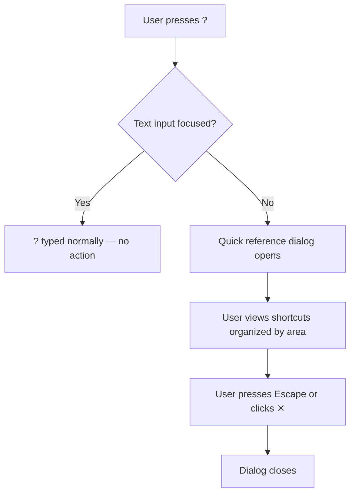
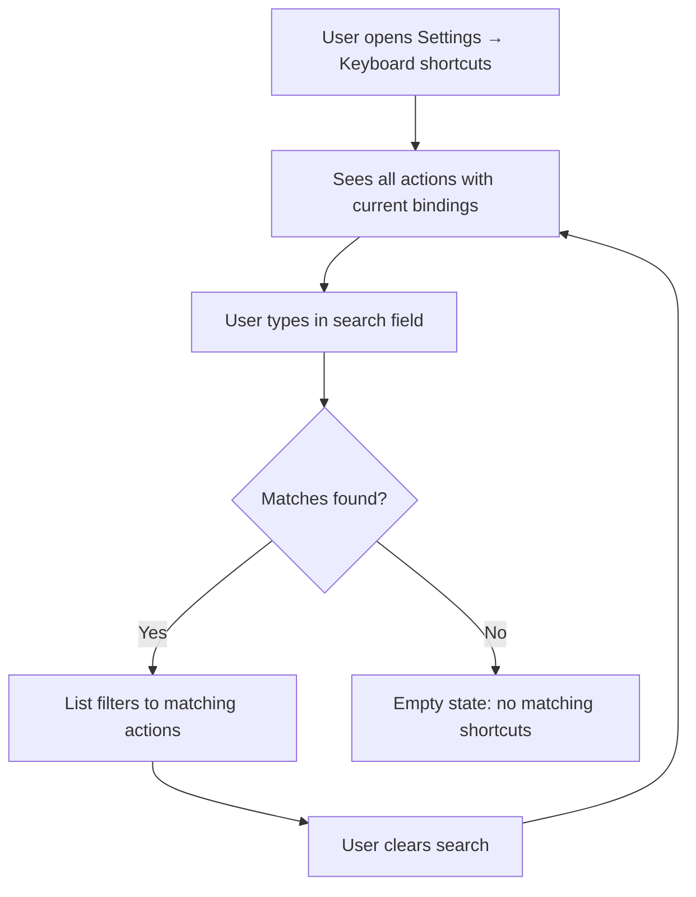
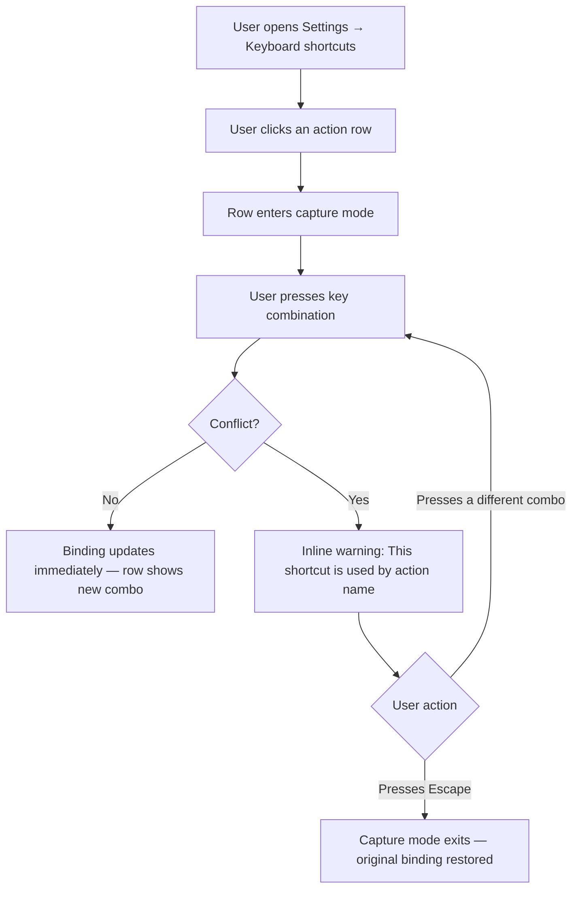
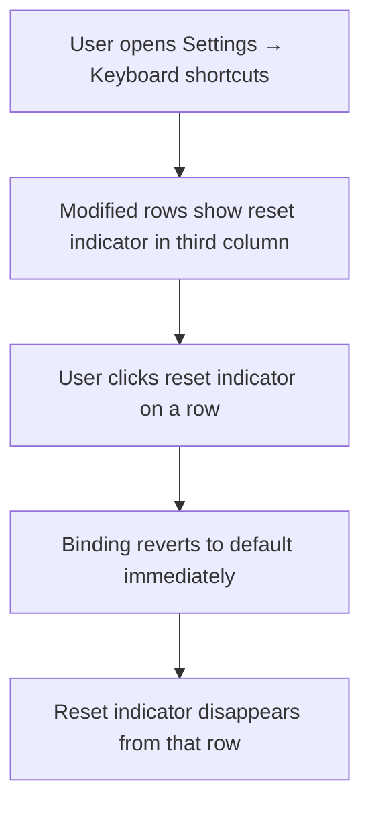
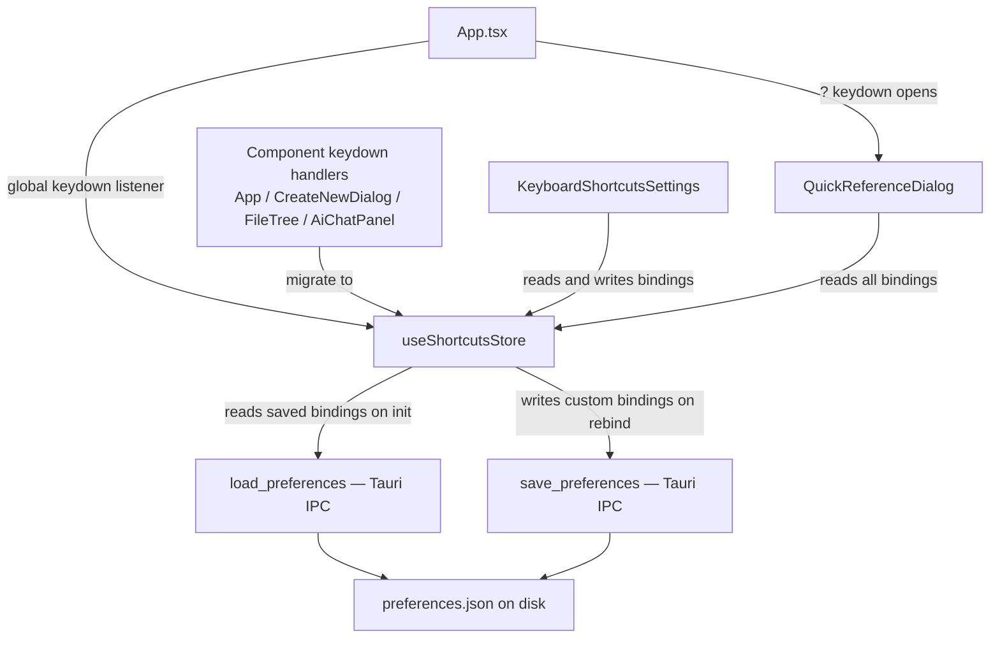
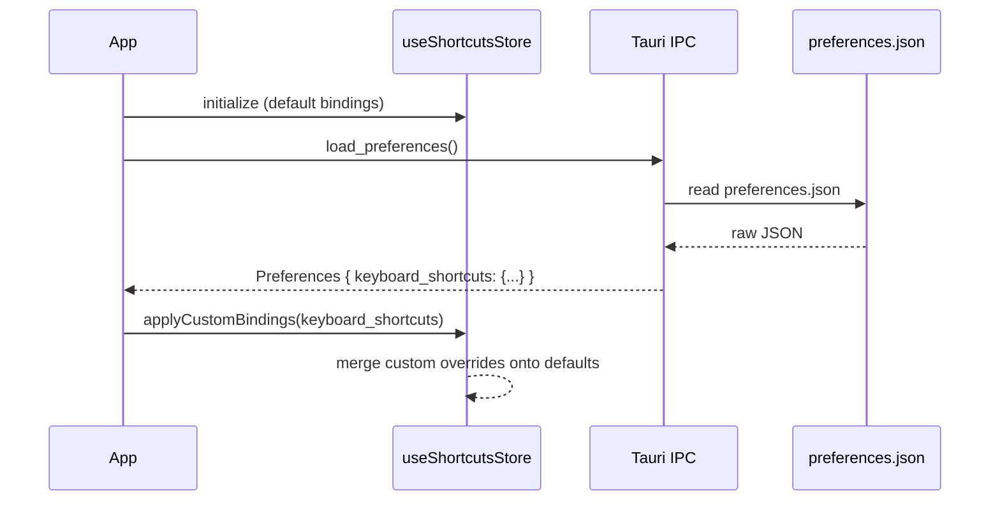
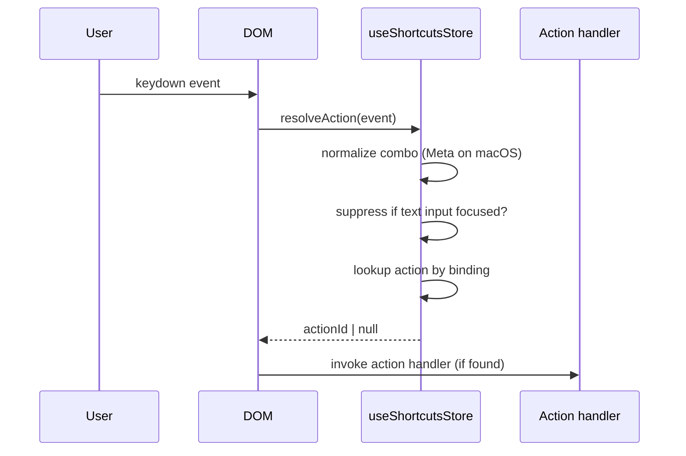
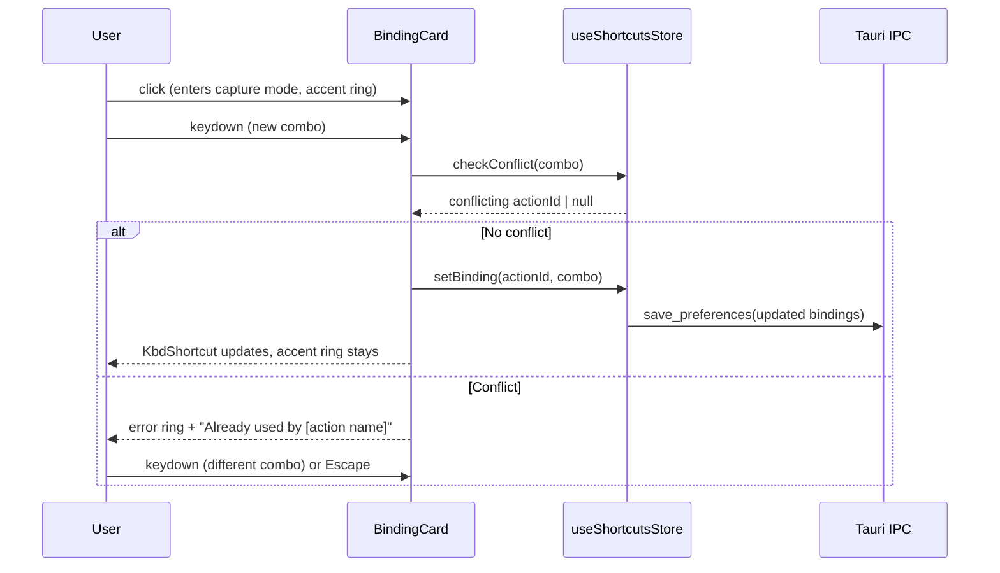

# Keyboard shortcuts

## What

Episteme gives every user-facing action a keyboard shortcut, but those shortcuts are hardcoded in components today. Users who prefer different bindings have no way to change them. This feature introduces a central shortcut registry — a Zustand store that owns all bindings, handles platform differences (Cmd on macOS, Ctrl on Windows), and detects conflicts — and a settings screen that lets users view, change, and reset their shortcuts.

All keyboard-driven actions in the app — closing settings, navigating the file tree, sending a chat message, and others — are registered through the registry rather than handled with inline `onKeyDown` logic. A user can open Settings, find the "Keyboard shortcuts" category, see every action listed with its current binding, click any row to capture a new key combination, and save. The new binding takes effect immediately and persists across restarts.

## Why

Power users build muscle memory around keyboard shortcuts across every tool they use daily. When an app's shortcuts conflict with those habits — or can't be changed — users face friction on every keystroke. The ability to rebind shortcuts removes that friction and lets users configure Episteme to match how they already work.

There's also a foundation benefit: building the shortcut registry is a prerequisite for making shortcuts discoverable at all. Once every action is registered centrally, shortcuts can appear in tooltips, menus, and help dialogs — rather than existing only as tribal knowledge.

## Personas

- **Eric: Engineer** — works heavily in Episteme writing and reviewing technical docs; benefits most from shortcut customization to match his existing habits across development tools
- **Patricia: Product Manager** — uses the app daily for authoring and coordination; saves time when shortcuts match her preferred workflow
- **Olivia: Operations Lead** — creates and maintains process docs regularly; efficiency-focused users like Olivia gain the most from removing keyboard friction

## Narratives

### Eric remaps shortcuts to match his editor

Eric spends most of his day in VS Code, where Cmd+P opens the command palette and Cmd+Shift+F triggers a search. When he switches to Episteme to write a technical design, the muscle memory from his editor keeps firing. He opens Settings and navigates to "Keyboard shortcuts." The panel lists every registered action with its current binding — he can see at a glance that Cmd+Shift+F is unassigned in Episteme. He clicks the row for "Search files" and presses Cmd+Shift+F; the field captures the combination, shows the display label "⌘⇧F," and the binding takes effect immediately.

Later that week, Eric tries to remap another action and accidentally picks a key combination already assigned to "Close settings." The conflict warning appears inline — "This shortcut is used by Close settings" — and the binding won't apply until he resolves it. He picks a different combination, the conflict clears, and the new binding activates without any extra step.

### Patricia discovers shortcuts through the UI

Patricia has been using Episteme for a few weeks but navigates almost entirely by mouse. A colleague mentions there are keyboard shortcuts — she hadn't realized. She presses `?` and a dialog opens listing the most common shortcuts organized by area: Document, File tree, AI chat, Navigation. She scans through it and discovers she can navigate the file tree with arrow keys and that Enter in the chat panel sends a message without reaching for the mouse.

Patricia wants to know if there's a shortcut for opening the AI chat panel. She opens Settings, navigates to "Keyboard shortcuts," and types "chat" into the search field. The list filters to just the chat-related actions — she finds the toggle shortcut, notes it, and closes Settings. Over the next few days she starts using the file tree and chat shortcuts without thinking about it. The `?` dialog gave her discovery; the search field in Settings let her find exactly what she was looking for without scrolling through the full list.

### Olivia hits a conflict and resolves it

Olivia has been using Episteme to write runbooks for months. She opens Settings and goes to "Keyboard shortcuts" — she wants to assign Cmd+Shift+S to "Save and publish," which she uses constantly. She clicks the row, presses Cmd+Shift+S, and immediately sees an inline warning: "This shortcut is already used by Send AI message." Olivia didn't know that action existed — she never uses the AI chat panel. She decides she'd rather reassign "Send AI message" to something she'll never accidentally trigger.

She clicks the "Send AI message" row, assigns it Cmd+Shift+Return, and the conflict clears — the binding applies immediately. She then clicks "Save and publish," presses Cmd+Shift+S, and it too takes effect right away. Both changes are visible in the list with no extra confirm step.

### Eric notices and clears his customized bindings

Eric has been customizing shortcuts for a few weeks. He opens Settings and navigates to "Keyboard shortcuts" — each row he's changed shows a small reset indicator to the right of the key binding. He can see at a glance exactly which actions he's modified. He clicks the reset indicator on a few rows to revert them one at a time, and the indicators disappear as each binding returns to its default.

## User stories

**Eric remaps shortcuts to match his editor**

- Eric can open a "Keyboard shortcuts" settings panel and see every registered action with its current binding
- Eric can click any action row and press a key combination to capture a new binding
- Eric can see an inline conflict warning when the chosen combination is already assigned to another action
- Eric's binding takes effect immediately when no conflict exists — no save step required
- Eric's binding won't apply until he resolves any conflict

**Patricia discovers shortcuts through the UI**

- Patricia can press `?` to open a quick-reference dialog showing common shortcuts organized by area
- Patricia can open Settings and navigate to a "Keyboard shortcuts" category
- Patricia can type in a search field to filter the shortcuts list by action name

**Olivia hits a conflict and resolves it**

- Olivia can reset an individual action's binding to its shipped default
- Olivia can resolve a conflict by reassigning the conflicting action to a different combination

**Eric notices and clears his customized bindings**

- Eric can see which bindings have been customized at a glance because modified rows show a reset indicator to the right of the key binding
- Eric can reset an individual binding to its default by clicking its reset indicator

## Goals

- All user-facing actions with keyboard shortcuts are registered through the central registry — zero hardcoded `keydown` handlers remain in components
- Users can rebind any action to a new shortcut in under 10 seconds from the settings panel
- Conflict detection is immediate — users see a warning before a conflicting binding is applied, and the binding is blocked from taking effect until the conflict is resolved
- Custom bindings persist across app restarts via the existing preferences system
- The `?` quick-reference dialog lists all common shortcuts organized by area

## Non-goals

- Showing keyboard shortcuts in tooltips, hover states, or menus — the registry makes this possible in the future, but wiring it up to UI surfaces is out of scope for this feature
- Syncing shortcut preferences across devices or users
- Importing or exporting shortcut profiles

## Design spec

### User flows

**Quick reference dialog**



**Search**



**Rebinding a shortcut**



**Reset individual binding**



### Key UI components

#### Quick reference dialog

- Radix `Dialog.Root` — wide variant (640px)
- At 640px or wider, action rows are laid out in a two-column CSS grid; below that, single column
- Header: title "Keyboard shortcuts", close button (✕, ghost icon-only)
- Body: sections grouped by area (Document, File tree, AI chat, Navigation), each with a section label followed by rows of action name + `<KbdShortcut>` — depends on issue #59
- Read-only — no interactive elements in the body
- Opens on `?` keydown when no text input is focused; closes on Escape or ✕

#### Keyboard shortcuts settings panel

Replaces the content area when the "Keyboard shortcuts" settings category is active.

- **Search field**: standard `Input` at the top of the panel, placeholder "Search shortcuts…", filters the list as the user types
- **Empty state** (no search matches): centered text "No matching shortcuts", `--color-text-tertiary`, `--font-size-ui-base`
- **Shortcut rows**: full-width rows, `--height-control-base` (28px), three columns:
  - Column 1 — action name: `--font-size-ui-base`, `--color-text-primary`, left-aligned, fills available space
  - Column 2 — binding card: a styled container holding a `<KbdShortcut>` showing the current binding; interactive states described below — depends on issue #59
  - Column 3 — reset indicator: ghost icon-only button (RotateCcw, 14px), visible only on rows where the binding differs from the default; clicking immediately reverts to the default and the indicator disappears
- **Binding card states**:
  - *Default*: shows current `<KbdShortcut>`, no focus ring
  - *Focused/capture*: clicking the row focuses the card with `--color-accent` focus ring; `<KbdShortcut>` continues showing the current binding; card listens for keydown
  - *After key press — no conflict*: `<KbdShortcut>` updates to the new combo immediately, binding saves automatically, card remains focused with accent ring; Escape blurs the card
  - *After key press — conflict*: `<KbdShortcut>` shows the pressed combo, card switches to error ring (`--color-state-danger` border + `0 0 0 2px color-mix(in oklch, var(--color-state-danger) 25%, transparent)` shadow), inline message appears below the row in `--color-state-danger`, `--font-size-ui-sm`: "Already used by [action name]"; pressing a new combo retries from the same focused state; Escape reverts `<KbdShortcut>` to the previous binding and blurs the card
  - *Escape at any time*: blurs the card; if in conflict state, reverts the `<KbdShortcut>` to the previous binding first

## Tech spec

### 1. Introduction and overview

#### Prerequisites and assumptions

- **ADR-003** (Zustand state management) — the shortcut registry is a new Zustand store, consistent with existing stores
- **ADR-009** (keyboard shortcuts strategy) — this feature is the direct implementation of that decision
- **ADR-004** (Tailwind CSS) and **ADR-010** (Radix UI primitives) — used for styling and dialog primitives throughout
- **Dependent feature**: `enhancement-kbd-primitive.md` (issue #59) must be implemented before this feature; `<KbdShortcut>` is used in both the quick reference dialog and the binding cards in the settings panel
- The existing `load_preferences` / `save_preferences` Tauri commands are extended with a `keyboard_shortcuts` field — no new IPC commands are introduced
- This spec covers macOS only; Windows modifier key normalization (Ctrl in place of Cmd) is handled by the registry but Windows platform testing is deferred

#### Goals and objectives

- All existing ad hoc `keydown` handlers in `App.tsx`, `CreateNewDialog.tsx`, `FileTree.tsx`, and `AiChatPanel.tsx` are migrated to the registry — zero components register raw `document.addEventListener("keydown", ...)` for named actions after this feature ships
- Conflict detection runs synchronously on every binding attempt — no async round-trips
- Custom bindings survive app restart via the existing preferences JSON file
- The `?` dialog and keyboard shortcuts settings panel render in under 100ms on first open

#### Non-goals

- No new Tauri IPC commands
- No shortcut display in tooltips or menu items
- No cross-device sync or profile import/export
- Windows platform support (modifier normalization is implemented but not tested)

#### Glossary

| Term | Definition |
|------|-----------|
| Action | A named user-facing operation, e.g. `settings.close` |
| Binding | A normalized key combination string mapped to an action, e.g. `Meta+Escape` |
| Registry | The central Zustand store (`useShortcutsStore`) that owns all action → binding mappings |
| Default binding | The shipped key combination for an action; used to determine whether a binding has been customized |
| Capture mode | UI state in which a binding card listens for the next keydown event |
| Conflict | Two actions mapped to the same binding |

### 2. System design and architecture

#### High-level architecture



#### Component breakdown

| Component | Type | Responsibility |
|---|---|---|
| `useShortcutsStore` | New Zustand store | Owns default bindings, custom overrides, merged map, conflict detection, platform normalization, action registration |
| `QuickReferenceDialog` | New component | Radix Dialog; reads all bindings from store; 2-column grid at 640px+ |
| `KeyboardShortcutsSettings` | New component | Settings panel content; search field + list of `ShortcutRow` |
| `ShortcutRow` | New component | Single action row; manages capture mode state locally; contains `BindingCard` |
| `BindingCard` | New component | Styled container with `<KbdShortcut>`; visual states: default, focused, conflict |
| `App.tsx` | Modified | Migrates two `keydown` listeners; adds `?` handler; renders `QuickReferenceDialog` |
| `CreateNewDialog.tsx` | Modified | Migrates inline `keydown` handler to registry |
| `FileTree.tsx` | Modified | Migrates `onKeyDown` tree navigation to registry |
| `AiChatPanel.tsx` | Modified | Migrates send/connect `onKeyDown` to registry |
| `config/settings.ts` | Modified | Adds "Keyboard shortcuts" settings category |
| `lib/preferences.ts` | Modified | Adds `keyboard_shortcuts` field to `PreferencesSchema` |
| `commands/preferences.rs` | Modified | Adds `keyboard_shortcuts` field to `Preferences` struct |

#### Sequence diagrams

**App startup — loading saved bindings**



**Global keydown — action dispatch**



**User rebinds a shortcut**



### 3. Detailed design

#### Store shape — `useShortcutsStore`

```typescript
type ShortcutArea = "Document" | "File tree" | "AI chat" | "Navigation";
type ShortcutScope = "global" | "focus-scoped";

interface ShortcutAction {
  id: string;                  // e.g. "settings.close"
  label: string;               // e.g. "Close settings"
  area: ShortcutArea;
  scope: ShortcutScope;
  rebindable: boolean;         // false = excluded from settings panel and ? dialog
  firesThroughInputs: boolean; // true = fires even when a text input is focused
  handler?: () => void;        // global-scoped actions only
}

interface ShortcutsStore {
  actions: Record<string, ShortcutAction>;
  defaultBindings: Record<string, string>;   // actionId → normalized combo
  customBindings: Record<string, string>;    // user overrides only
  bindings: Record<string, string>;          // merged (custom overrides default)
  comboToAction: Record<string, string>;     // reverse map for dispatch and conflict detection

  registerAction: (action: ShortcutAction, defaultBinding: string) => void;
  applyCustomBindings: (saved: Record<string, string>) => void;
  setBinding: (actionId: string, combo: string) => void;
  resetBinding: (actionId: string) => void;
  checkConflict: (combo: string, excludeActionId?: string) => string | null;
  resolveAction: (event: KeyboardEvent) => string | null;
  getBinding: (actionId: string) => string;
}
```

`bindings` and `comboToAction` are always derived from `defaultBindings` merged with `customBindings` — recomputed on every `setBinding` and `resetBinding` call.

Conflict detection applies to global-scoped actions only. Focus-scoped actions may share a binding without conflict — their focus context prevents ambiguity.

The settings panel and `?` dialog only render actions where `rebindable === true`.

---

#### Preferences schema extension

**TypeScript** (`src/lib/preferences.ts`):
```typescript
export const PreferencesSchema = z.object({
  last_opened_folder: z.string().nullable(),
  aws_profile: z.string().nullable(),
  recently_used_skill_types: z.array(z.string()).default([]),
  keyboard_shortcuts: z.record(z.string(), z.string()).default({}),
});
```

**Rust** (`src-tauri/src/commands/preferences.rs`):
```rust
pub struct Preferences {
    pub last_opened_folder: Option<String>,
    #[serde(default)]
    pub aws_profile: Option<String>,
    #[serde(default)]
    pub recently_used_skill_types: Vec<String>,
    #[serde(default)]
    pub keyboard_shortcuts: std::collections::HashMap<String, String>,
}
```

`#[serde(default)]` ensures existing `preferences.json` files without the field deserialize cleanly to an empty map.

---

#### Key algorithms

**`normalizeCombo(event: KeyboardEvent): string`**

1. Collect active modifiers: `Alt` (altKey), `Meta` (metaKey), `Shift` (shiftKey). On Windows (future), substitute `Ctrl` for `Meta`.
2. Sort modifiers alphabetically: `Alt` < `Meta` < `Shift`
3. Append the physical key code (`e.code`): e.g. `Comma`, `Escape`, `KeyK`, `Slash`
4. Join with `+`

Examples: Cmd+, → `Meta+Comma` · Cmd+Shift+K → `Meta+Shift+KeyK` · ? → `Shift+Slash` · Escape → `Escape`

`e.code` is used (not `e.key`) because it is keyboard-layout-independent.

---

**`resolveAction(event: KeyboardEvent): string | null`**

Used by the single global `document.addEventListener("keydown")` in `App.tsx`:

1. Normalize the event to a combo string
2. Look up the combo in `comboToAction`
3. If no match, return `null`
4. If the matching action has `firesThroughInputs: false` and `document.activeElement` is `INPUT`, `TEXTAREA`, or `[contenteditable]`, return `null` (suppress)
5. Return the actionId

---

**`setBinding(actionId, combo)` / `resetBinding(actionId)`**

Both follow the same pattern:
1. Update `customBindings` (set or delete the actionId key)
2. Recompute `bindings` = `{ ...defaultBindings, ...customBindings }`
3. Recompute `comboToAction` = invert `bindings` (global-scoped actions only)
4. Call `save_preferences` with the full preferences object, replacing `keyboard_shortcuts` with the new `customBindings`

---

#### Initial action registry

All actions registered at app startup in `App.tsx`:

| Action ID | Label | Area | Default binding | Scope | Rebindable | Fires through inputs |
|---|---|---|---|---|---|---|
| `settings.close` | Close settings | Navigation | `Escape` | Global | No | Yes |
| `settings.open` | Open settings | Navigation | `Meta+Comma` | Global | Yes | Yes |
| `shortcuts.quick-reference` | Show keyboard shortcuts | Navigation | `Shift+Slash` | Global | Yes | No |
| `dev.kitchen-sink` | Toggle design kitchen | — | `Meta+Shift+KeyK` | Global, dev-only | No | No |
| `file-tree.navigate-up` | Navigate up | File tree | `ArrowUp` | Focus-scoped | Yes | — |
| `file-tree.navigate-down` | Navigate down | File tree | `ArrowDown` | Focus-scoped | Yes | — |
| `file-tree.expand` | Expand folder | File tree | `ArrowRight` | Focus-scoped | Yes | — |
| `file-tree.collapse` | Collapse folder | File tree | `ArrowLeft` | Focus-scoped | Yes | — |
| `chat.send` | Send message | AI chat | `Enter` | Focus-scoped | Yes | — |
| `chat.connect` | Connect | AI chat | `Enter` | Focus-scoped | Yes | — |

`dev.kitchen-sink` is registered only when `import.meta.env.DEV` is true. Focus-scoped actions are not processed by `resolveAction` — their `firesThroughInputs` field is not applicable (`—`). Focus-scoped components replace raw `e.key`/`e.code` checks with `normalizeCombo(e) === getBinding(actionId)`.

### 4. Security, privacy, and compliance

- **Authentication/authorization**: not applicable — keyboard shortcuts are a local user preference with no access control
- **Data privacy**: `keyboard_shortcuts` in `preferences.json` contains only action IDs and key combination strings — no PII
- **Input validation**: combo strings written to `customBindings` must come from `normalizeCombo()` output only — no raw user text is ever written directly to preferences. The Zod schema (`z.record(z.string(), z.string())`) validates shape on load; unrecognized action IDs in saved preferences are silently ignored on apply (unknown keys are not registered actions and have no effect)

### 5. Observability

This feature has no server-side components. No logging, metrics, or alerting requirements beyond what the existing app produces.

### 6. Testing plan

**Unit tests**
- `useShortcutsStore`: `normalizeCombo`, `resolveAction` (suppression logic, `firesThroughInputs`), `checkConflict`, `setBinding`/`resetBinding` (merge and persistence), `applyCustomBindings` (merge on load)
- `preferences.ts`: round-trip with `keyboard_shortcuts` field present and absent
- `BindingCard`: default → capture → no-conflict (auto-save) flow; default → capture → conflict (error ring + message) flow; Escape in conflict state reverts and blurs
- `KeyboardShortcutsSettings`: search filters correctly; reset indicator appears only on modified rows; clicking reset indicator calls `resetBinding`
- `QuickReferenceDialog`: renders all rebindable global actions grouped by area; two-column layout at 640px+

**Integration tests**
- Custom binding persists across store re-initialization (preferences round-trip)
- Migrated components (`FileTree`, `AiChatPanel`, `CreateNewDialog`) fire correct actions using current binding from store

**E2E tests**
- Open `?` dialog, verify shortcuts listed
- Open settings → keyboard shortcuts, rebind an action, verify new binding fires and old does not
- Rebind to a conflicting combo, verify error state appears and binding is not applied

### 7. Alternatives considered

**Library-based approach (`react-hotkeys-hook` or similar)**
Using a shortcut library for low-level event handling with a thin registry on top. Rejected per ADR-009: the library handles edge cases unlikely to arise in a Tauri/WKWebView context, while the registry layer — the majority of the work — still needs to be built regardless. Full DIY gives tighter control without the dependency.

**Shortcut handling inside each component (status quo)**
Each component owns its `onKeyDown`. Simple, zero infrastructure. Rejected because it makes rebinding impossible, prevents conflict detection, and scatters platform normalization logic across the codebase. ADR-009 documents this in detail.

### 8. Risks

| Risk | Likelihood | Mitigation |
|---|---|---|
| Focus-scoped migration breaks existing behavior in `FileTree` or `AiChatPanel` | Medium | Migrate one component at a time; keep existing tests green at each step |
| `e.code` is layout-independent but display labels (e.g. "," for `Comma`) may be confusing on non-QWERTY keyboards | Low | Out of scope for this feature; noted for future i18n work |
| Saved `customBindings` for an action that no longer exists causes silent no-op on load | Low | `applyCustomBindings` skips unrecognized action IDs; no crash or corruption |
| `settings.close` moved into registry but Escape suppression path changes subtly | Medium | Write explicit unit tests covering Escape when input is focused and when settings is closed |

## Task list

- [x] **Story: Shortcut registry**
  - [x] **Task: Implement `useShortcutsStore`**
    - **Description**: Create `src/stores/shortcuts.ts`. Define `ShortcutAction`, `ShortcutScope`, `ShortcutArea` types. Implement the Zustand store with: `registerAction`, `applyCustomBindings`, `setBinding`, `resetBinding`, `checkConflict`, `resolveAction`, `getBinding`. Export `normalizeCombo` as a standalone utility function. `bindings` and `comboToAction` are always derived from `defaultBindings` merged with `customBindings` — recomputed on every mutation. Conflict detection applies to global-scoped actions only. `setBinding` and `resetBinding` both call `save_preferences` with the updated `customBindings` after recomputing derived state.
    - **Acceptance criteria**:
      - [x] `normalizeCombo` produces `Meta+Comma` for Cmd+,, `Shift+Slash` for ?, `Escape` for Escape, `Meta+Shift+KeyK` for Cmd+Shift+K
      - [x] `resolveAction` returns `null` when a text input is focused and `firesThroughInputs` is `false`
      - [x] `resolveAction` returns the actionId when `firesThroughInputs` is `true` regardless of focus
      - [x] `checkConflict` returns the conflicting actionId when a combo is already bound to a different global action
      - [x] `checkConflict` returns `null` when `excludeActionId` matches the existing binding
      - [x] `setBinding` updates `bindings` and `comboToAction` immediately
      - [x] `resetBinding` removes from `customBindings` and reverts to default in `bindings`
      - [x] `applyCustomBindings` merges saved overrides onto defaults without mutating `defaultBindings`
    - **Dependencies**: None
  - [x] **Task: Write unit tests for `useShortcutsStore`**
    - **Description**: Create `tests/unit/stores/shortcuts.test.ts`. Cover all algorithms: `normalizeCombo` (modifiers, alphabetical sort, `e.code`), `resolveAction` (suppression, `firesThroughInputs`, no match), `checkConflict` (conflict, no conflict, `excludeActionId`), `setBinding`/`resetBinding` (merge, `comboToAction` update), `applyCustomBindings` (merge on load).
    - **Acceptance criteria**:
      - [x] All acceptance criteria from "Implement `useShortcutsStore`" are covered by tests
      - [x] All tests pass
    - **Dependencies**: Task: Implement `useShortcutsStore`

- [x] **Story: Preferences extension**
  - [x] **Task: Extend Rust `Preferences` struct with `keyboard_shortcuts`**
    - **Description**: In `src-tauri/src/commands/preferences.rs`, add `pub keyboard_shortcuts: std::collections::HashMap<String, String>` with `#[serde(default)]` to the `Preferences` struct and return an empty `HashMap::new()` in the `Default` impl.
    - **Acceptance criteria**:
      - [x] `preferences.json` files without `keyboard_shortcuts` deserialize cleanly to an empty map
      - [x] `keyboard_shortcuts` round-trips correctly through `save_preferences` / `load_preferences`
    - **Dependencies**: None
  - [x] **Task: Extend TypeScript `PreferencesSchema` with `keyboard_shortcuts`**
    - **Description**: In `src/lib/preferences.ts`, add `keyboard_shortcuts: z.record(z.string(), z.string()).default({})` to `PreferencesSchema` and `keyboard_shortcuts: {}` to `DEFAULT_PREFERENCES`.
    - **Acceptance criteria**:
      - [x] `parsePreferences` returns `{}` for `keyboard_shortcuts` when the field is absent from the input
      - [x] `parsePreferences` correctly parses a `keyboard_shortcuts` map when present
      - [x] Existing preferences tests pass
    - **Dependencies**: None
  - [x] **Task: Write unit tests for preferences round-trip**
    - **Description**: In `tests/unit/preferences.test.ts`, add cases: (1) preferences JSON without `keyboard_shortcuts` parses to empty map; (2) preferences JSON with `keyboard_shortcuts` entries parses correctly; (3) `DEFAULT_PREFERENCES` has empty `keyboard_shortcuts`.
    - **Acceptance criteria**:
      - [x] All three cases pass
    - **Dependencies**: Task: Extend TypeScript `PreferencesSchema` with `keyboard_shortcuts`

- [x] **Story: App startup wiring**
  - [x] **Task: Register all actions and wire global keydown listener in `App.tsx`**
    - **Description**: In `App.tsx`: (1) Add a `useEffect` that calls `registerAction` for every action in the initial registry (tech spec section 3 table). Register `dev.kitchen-sink` only when `import.meta.env.DEV` is true. (2) Replace the two existing `document.addEventListener("keydown", ...)` calls with a single listener that calls `resolveAction` and invokes the matched action's `handler`. (3) In the existing preferences load `useEffect`, call `applyCustomBindings` with `prefs.keyboard_shortcuts` after `load_preferences` returns.
    - **Acceptance criteria**:
      - [x] All actions from the initial registry are registered on mount
      - [x] `settings.close` (Escape) fires through inputs and closes settings when open; no-ops when settings is closed
      - [x] `settings.open` (Cmd+,) fires through inputs and opens settings
      - [x] `shortcuts.quick-reference` (?) fires only when no input is focused
      - [x] `dev.kitchen-sink` (Cmd+Shift+K) is only registered in dev mode
      - [x] Previously hardcoded `keydown` listeners in `App.tsx` are removed
      - [x] Saved custom bindings are applied to the store on app startup
    - **Dependencies**: Task: Implement `useShortcutsStore`, Task: Extend TypeScript `PreferencesSchema` with `keyboard_shortcuts`

- [x] **Story: Focus-scoped component migration**
  - [x] **Task: Migrate `CreateNewDialog` keydown handler to registry**
    - **Description**: In `src/components/CreateNewDialog.tsx`, remove `document.addEventListener("keydown", handleKey)`. Replace hardcoded `e.key` comparisons with `normalizeCombo(e) === getBinding(actionId)` lookups for any actions registered in the store. Actions not yet in the initial registry (e.g. number key shortcuts for type selection) should be registered as new focus-scoped actions.
    - **Acceptance criteria**:
      - [x] No `document.addEventListener` calls remain in `CreateNewDialog.tsx`
      - [x] Dialog keyboard behavior is unchanged
      - [x] Existing `CreateNewDialog` tests pass
    - **Dependencies**: Task: Register all actions and wire global keydown listener in `App.tsx`
  - [x] **Task: Migrate `FileTree` `onKeyDown` to registry**
    - **Description**: In `src/components/FileTree.tsx`, replace the four hardcoded `e.key` checks in `handleKeyDown` (`ArrowUp`, `ArrowDown`, `ArrowRight`, `ArrowLeft`) with `normalizeCombo(e) === getBinding(actionId)` comparisons using the corresponding `file-tree.*` action IDs.
    - **Acceptance criteria**:
      - [x] All four navigation actions read their binding from the store
      - [x] No hardcoded key strings remain in `FileTree.tsx`
      - [x] Existing `FileTree` tests pass
    - **Dependencies**: Task: Register all actions and wire global keydown listener in `App.tsx`
  - [x] **Task: Migrate `AiChatPanel` `onKeyDown` to registry**
    - **Description**: In `src/components/AiChatPanel.tsx`, replace hardcoded `e.key === "Enter"` checks with `normalizeCombo(e) === getBinding("chat.send")` and `normalizeCombo(e) === getBinding("chat.connect")`.
    - **Acceptance criteria**:
      - [x] Both chat actions read their binding from the store
      - [x] No hardcoded key strings remain in `AiChatPanel.tsx`
      - [x] Existing `AiChatPanel` tests pass
    - **Dependencies**: Task: Register all actions and wire global keydown listener in `App.tsx`

- [x] **Story: Quick reference dialog**
  - [x] **Task: Implement `QuickReferenceDialog` component**
    - **Description**: Create `src/components/QuickReferenceDialog.tsx`. Uses Radix `Dialog.Root`. Reads all actions from `useShortcutsStore` where `rebindable === true`, grouped by `area`. Body uses CSS grid: two columns at 640px+, single column below. Each row shows action label + `<KbdShortcut keys={...} />` with the current binding. Header: title "Keyboard shortcuts", close button (✕). Closes on Escape or ✕. Accepts `open` and `onOpenChange` props.
    - **Acceptance criteria**:
      - [x] Only rebindable actions are shown
      - [x] Actions are grouped by area with section labels
      - [x] Two-column grid layout at 640px or wider; single column below
      - [x] `<KbdShortcut>` displays the current binding from the store
      - [x] Dialog closes on Escape and ✕
      - [x] Non-rebindable actions (e.g. `settings.close`) do not appear
    - **Dependencies**: Task: Implement `useShortcutsStore`, issue #59 (`KbdShortcut` must be implemented first — already done)
  - [x] **Task: Wire `?` keydown to open `QuickReferenceDialog`**
    - **Description**: In `App.tsx`, add `quickReferenceOpen` state and render `<QuickReferenceDialog open={quickReferenceOpen} onOpenChange={setQuickReferenceOpen} />`. Set the `shortcuts.quick-reference` action handler to `() => setQuickReferenceOpen(true)`.
    - **Acceptance criteria**:
      - [x] Pressing `?` when no input is focused opens the dialog
      - [x] Pressing `?` when an input is focused does not open the dialog
      - [x] Dialog can be closed with Escape or ✕
    - **Dependencies**: Task: Implement `QuickReferenceDialog` component, Task: Register all actions and wire global keydown listener in `App.tsx`
  - [x] **Task: Write unit tests for `QuickReferenceDialog`**
    - **Description**: Create `tests/unit/components/QuickReferenceDialog.test.tsx`. Cover: only rebindable actions render; non-rebindable excluded; actions grouped correctly by area; `<KbdShortcut>` receives correct keys; closes on Escape.
    - **Acceptance criteria**:
      - [x] Non-rebindable actions absent from rendered output
      - [x] Section labels match `ShortcutArea` values
      - [x] All tests pass
    - **Dependencies**: Task: Implement `QuickReferenceDialog` component

- [x] **Story: Keyboard shortcuts settings panel**
  - [x] **Task: Add "Keyboard shortcuts" category to `settingsConfig`**
    - **Description**: In `src/config/settings.ts`, add a new `SettingsCategory` with `id: "keyboard-shortcuts"`, `label: "Keyboard shortcuts"`, `icon: Keyboard` (from Lucide), `order: 2`, and an empty `sections: []` array. The panel renders custom content rather than `SettingItem` entries.
    - **Acceptance criteria**:
      - [x] "Keyboard shortcuts" appears in the settings sidebar nav
      - [x] Existing settings category tests pass
    - **Dependencies**: None
  - [x] **Task: Implement `BindingCard` component**
    - **Description**: Create `src/components/ui/BindingCard.tsx`. A styled `div` container wrapping `<KbdShortcut>`. Props: `actionId: string`, `onCapture: (combo: string) => void`, `onEscape: () => void`, `hasConflict: boolean`. States: default (no ring), focused/capture (`--color-accent` focus ring, `tabIndex={0}`, listens for `keydown`), conflict (`--color-state-danger` border + glow). In capture mode, `keydown` calls `normalizeCombo` and invokes `onCapture`. Escape calls `onEscape`. The card does not call store methods directly.
    - **Acceptance criteria**:
      - [x] Default state shows `<KbdShortcut>` with no focus ring
      - [x] Clicking enters capture mode with accent focus ring
      - [x] Keydown in capture mode calls `onCapture` with normalized combo
      - [x] `hasConflict={true}` renders error ring
      - [x] Escape in any state calls `onEscape`
    - **Dependencies**: Task: Implement `useShortcutsStore`, issue #59 (already done)
  - [x] **Task: Implement `ShortcutRow` component**
    - **Description**: Create `src/components/ShortcutRow.tsx`. Renders a three-column row: (1) action label (`--color-text-primary`, fills available space), (2) `BindingCard`, (3) reset indicator (RotateCcw 14px ghost icon button, visible only when `customBindings[actionId]` exists). Manages capture state locally. On `onCapture`: calls `checkConflict`; if no conflict, calls `setBinding` and clears conflict state; if conflict, sets `conflictingLabel` to show inline error. On `onEscape`: clears conflict state, exits capture. Reset indicator click calls `resetBinding`.
    - **Acceptance criteria**:
      - [x] Reset indicator only visible when binding differs from default
      - [x] Clicking reset indicator calls `resetBinding`; indicator disappears
      - [x] No-conflict capture: `setBinding` called, card shows new binding, no error
      - [x] Conflict capture: inline "Already used by [action label]" shown in `--color-state-danger`, `setBinding` not called
      - [x] Escape clears conflict state and blurs
    - **Dependencies**: Task: Implement `BindingCard` component
  - [x] **Task: Implement `KeyboardShortcutsSettings` component**
    - **Description**: Create `src/components/KeyboardShortcutsSettings.tsx`. Reads all rebindable actions from `useShortcutsStore`, grouped by area. Renders a search `Input` (placeholder "Search shortcuts…") at top, followed by `ShortcutRow` per action. Search filters by action label (case-insensitive substring). Empty state: centered "No matching shortcuts" in `--color-text-tertiary` when no rows match. Wire into `SettingsPanel.tsx`: add a `categoryId === "keyboard-shortcuts"` branch in `CategoryContent` that renders `<KeyboardShortcutsSettings />` instead of the default section loop.
    - **Acceptance criteria**:
      - [x] All rebindable actions render as `ShortcutRow` components grouped by area
      - [x] Search field filters rows by label in real time
      - [x] Empty state renders when search yields no results
      - [x] Non-rebindable actions do not appear
      - [x] Wired correctly in `SettingsPanel.tsx` — navigating to "Keyboard shortcuts" shows the panel
    - **Dependencies**: Task: Implement `ShortcutRow` component, Task: Add "Keyboard shortcuts" category to `settingsConfig`
  - [x] **Task: Write unit tests for settings panel components**
    - **Description**: Create `tests/unit/components/BindingCard.test.tsx` and `tests/unit/components/ShortcutRow.test.tsx`. Add keyboard shortcuts cases to `tests/unit/SettingsPanel.test.tsx`.
    - **Acceptance criteria**:
      - [x] `BindingCard`: default → capture → no-conflict flow passes
      - [x] `BindingCard`: default → capture → conflict error ring flow passes
      - [x] `BindingCard`: Escape reverts and blurs
      - [x] `ShortcutRow`: reset indicator visible only for modified bindings
      - [x] `ShortcutRow`: reset indicator click calls `resetBinding`
      - [x] `KeyboardShortcutsSettings`: search filters correctly
      - [x] `KeyboardShortcutsSettings`: empty state renders when no matches
      - [x] All tests pass
    - **Dependencies**: Task: Implement `KeyboardShortcutsSettings` component

- [x] **Story: E2E tests**
  - [x] **Task: Write E2E tests for keyboard shortcuts**
    - **Description**: Create `tests/e2e/keyboard-shortcuts.spec.ts`. Cover: (1) pressing `?` opens the quick reference dialog and lists rebindable actions; (2) opening settings → keyboard shortcuts, rebinding an action, verifying the new binding fires and the old does not; (3) rebinding to a conflicting combo shows the error message and does not apply the binding.
    - **Acceptance criteria**:
      - [x] `?` dialog opens and displays at least one rebindable action
      - [x] Rebound action: new binding triggers the action; old binding does not
      - [x] Conflicting rebind: "Already used by" error appears; binding is not applied
      - [x] All E2E tests pass
    - **Dependencies**: All story tasks complete
