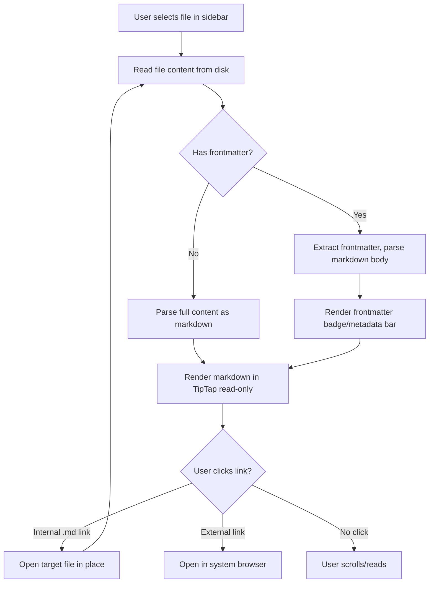
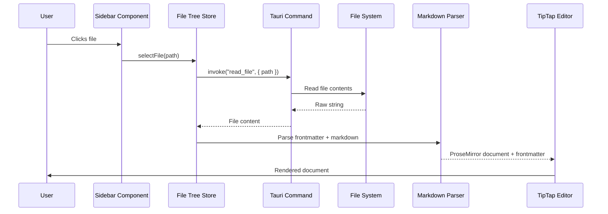

# Feature: Markdown Rendering

## What

Render markdown files in a clean, readable format in the main content area using TipTap. When users select a file from the sidebar, the markdown content is parsed and displayed with proper formatting—headings, lists, links, code blocks, tables, and other standard markdown elements. The rendered view uses typography and styling that makes long-form documentation comfortable to read.

The renderer supports standard markdown syntax, GitHub Flavored Markdown extensions (tables, task lists, strikethrough), and YAML frontmatter. Documents are displayed in read-only mode for this initial feature, establishing the viewing experience before adding editing capabilities in future features.

## Why

Reading documentation is the primary activity in Episteme, so rendering quality directly impacts user experience. Users need markdown to be displayed beautifully—proper typography, clear hierarchy, and attention to readability. Poor rendering makes documentation painful to read and defeats the purpose of having a dedicated documentation tool.

By using TipTap with the Tailwind typography plugin, we get excellent default styling that's been refined for readability. Users can focus on content without being distracted by rendering quirks or formatting issues.

## Personas

1. **Patricia: Product Manager** - Reads product descriptions to review what's been documented
2. **Eric: Engineer** - Reviews technical designs and architecture decisions
3. **Raquel: Reviewer** - Reads documents to provide feedback
4. **Aaron: Approver** - Reviews documents before approving them
5. **Olivia: Operations Lead** - Reads SOPs and process documentation

## Narratives

### Reading a technical design document

Eric selects "notification-system-tech-design.md" from the sidebar. The document renders in the main content area with clear visual hierarchy—the title is prominently displayed, section headings are distinct and easy to scan, and body text is comfortable to read. Code blocks are syntax-highlighted, making technical examples easy to understand.

As he scrolls through the document, he sees a table comparing different notification providers, formatted cleanly with aligned columns. Below that, a bulleted list of technical requirements is easy to scan. The YAML frontmatter at the top of the file (author, status, reviewers) is either hidden or displayed in a subtle way that doesn't interfere with the main content.

Eric notices a link to another document and clicks it—Episteme opens that file in place, making it easy to follow references between related documents.

### Reading a product description

Patricia opens a product description and immediately notices the excellent readability. The prose flows naturally with comfortable line length (not too wide), generous line spacing, and a clear type hierarchy that makes it easy to skim for key sections.

When she encounters a section with a task list using GitHub Flavored Markdown syntax (`- [ ]` and `- [x]`), the checkboxes render properly. She sees that some items are checked and others aren't, giving her quick insight into progress.

## User stories

**From narrative: Reading a technical design document**
- User selects markdown file from sidebar and sees it rendered in main area
- User sees proper heading hierarchy (H1 largest, H2, H3, etc.)
- User sees code blocks with monospace font and background
- User sees tables formatted with aligned columns
- User sees bulleted and numbered lists formatted correctly
- User can click links to other markdown files and navigate to them
- User sees external links that open in browser
- YAML frontmatter is handled gracefully (hidden or minimally displayed)

**From narrative: Reading a product description**
- User sees comfortable reading experience (line length, spacing, typography)
- User sees GitHub Flavored Markdown features (task lists, strikethrough, tables)
- User can scroll smoothly through long documents
- User sees clear visual distinction between sections
- User can read for extended periods without eye strain

## Goals

- Markdown rendering matches or exceeds GitHub's rendering quality
- Documents up to 10,000 lines render in under 1 second
- Typography is optimized for long-form reading
- All standard markdown and GFM features are supported
- Links between documents work seamlessly

## Non-goals

- Editing markdown (read-only for this feature, editing comes later)
- Live preview while typing (no editing yet)
- Custom markdown extensions beyond GFM
- PDF export or print styles
- Syntax highlighting for code blocks (nice-to-have, not required for v1)

## Testing requirements

### Unit tests (Vitest)
- Tauri `read_file` command returns correct file content for valid path
- Tauri `read_file` command returns error for nonexistent file
- Markdown parser converts standard markdown to TipTap-compatible format
- Markdown parser handles headings (H1-H6)
- Markdown parser handles bold, italic, strikethrough
- Markdown parser handles ordered and unordered lists
- Markdown parser handles code blocks (fenced and inline)
- Markdown parser handles tables (GFM)
- Markdown parser handles task lists (GFM)
- Markdown parser handles links (internal and external)
- Markdown parser handles images
- Markdown parser handles blockquotes
- Markdown parser handles horizontal rules
- Markdown parser extracts YAML frontmatter separately from content
- Markdown parser handles empty files gracefully
- TipTap editor component renders in read-only mode
- TipTap editor component applies prose/typography classes
- Document viewer component displays frontmatter metadata
- Internal link handler resolves relative markdown links

### Integration tests (Vitest)
- Select file → read content → parse markdown → render in TipTap
- File with frontmatter → frontmatter extracted and displayed separately
- File with internal links → clicking link opens target file
- File with external links → clicking link opens in system browser
- Large file (10,000 lines) → renders within performance budget
- File with all GFM features → all features render correctly

### E2E tests (Playwright)
- Select markdown file → content renders in main area
- Headings display with correct visual hierarchy
- Code blocks display with monospace font and background
- Tables render with aligned columns and borders
- Task lists render with checkboxes
- Links are clickable
- Internal document links navigate to target file
- External links open in system browser
- Long documents are scrollable
- Dark mode renders correctly (if implemented)
- Document content area has comfortable max-width

### Acceptance criteria
- All unit tests pass with 100% coverage on new code
- Integration tests cover the full read → parse → render pipeline
- E2E tests verify visual rendering quality
- All standard markdown and GFM elements render correctly
- Performance: 10,000 line document renders in under 1 second
- No regressions in previous feature tests

## Design spec

### User flow



### Layout

```
┌────────────┬─────────────────────────────────────┐
│            │  ┌───────────────────────────────┐  │
│  Sidebar   │  │ Frontmatter metadata bar      │  │
│            │  │ Status: draft │ Author: psmith │  │
│            │  ├───────────────────────────────┤  │
│            │  │                               │  │
│            │  │  # Document Title             │  │
│            │  │                               │  │
│            │  │  Body text with proper         │  │
│            │  │  typography and comfortable    │  │
│            │  │  line length (max-w-4xl).     │  │
│            │  │                               │  │
│            │  │  ## Section Heading            │  │
│            │  │                               │  │
│            │  │  More content...              │  │
│            │  │                               │  │
│            │  └───────────────────────────────┘  │
│            │         ↑ centered, scrollable      │
└────────────┴─────────────────────────────────────┘
```

### UI components

#### Main content area
- Background: `bg-white dark:bg-gray-900`
- Content centered horizontally with `max-w-4xl mx-auto`
- Padding: `p-8`
- Scrollable: `overflow-y-auto` full height

#### Frontmatter metadata bar
- Displayed above document content when frontmatter exists
- Horizontal row of key-value badges
- Background: `bg-gray-50 dark:bg-gray-800 rounded-lg p-3 mb-6`
- Each field: `text-xs text-gray-500` label, `text-sm text-gray-700 dark:text-gray-300 font-medium` value
- Fields separated by `border-r border-gray-200 dark:border-gray-700 px-3`
- Only show meaningful fields (status, author, type); hide internal fields (id)

#### Rendered markdown (TipTap + prose)
- Use `prose dark:prose-invert max-w-none` from @tailwindcss/typography
- Headings: Clear visual hierarchy per design system (bold, distinct sizes)
- Code blocks: `bg-gray-100 dark:bg-gray-800 rounded-lg p-4 font-mono text-sm`
- Inline code: `bg-gray-100 dark:bg-gray-800 rounded px-1.5 py-0.5 font-mono text-sm`
- Tables: Full width, `border border-gray-200 dark:border-gray-700`, alternating row colors
- Task lists: Rendered checkboxes (read-only, not interactive)
- Links: `text-blue-600 dark:text-blue-400 hover:underline`
- Blockquotes: Left border `border-l-4 border-gray-300 dark:border-gray-600 pl-4 italic`

#### Empty state (no file selected)
- Centered in main content area
- "Select a document from the sidebar" in `text-gray-400 text-lg`

#### Loading state
- While file is being read/parsed: subtle loading indicator
- "Loading document..." in `text-gray-400`

## Tech spec

### Introduction and overview

**Prerequisites:** Feature: Baseline App, Feature: Open Folder, Feature: Sidebar Browser, ADR-001 (Tauri), ADR-002 (TipTap), ADR-004 (Tailwind)

**Depends on:** feature-baseline-app, feature-open-folder, feature-sidebar-browser

**Goals:**
- Tauri command to read file contents from disk
- Markdown-to-TipTap parsing pipeline (markdown → ProseMirror document)
- TipTap editor in read-only mode with Tailwind typography styling
- YAML frontmatter extraction and display
- Internal markdown link navigation
- External links open in system browser
- Render 10,000 line document in under 1 second

**Non-goals:**
- Editing (read-only for now)
- Syntax highlighting for code blocks
- PDF export
- Custom markdown extensions

### System design and architecture



**Component breakdown:**
- `DocumentViewer.tsx` - Main content area container
- `FrontmatterBar.tsx` - Displays extracted frontmatter metadata
- `MarkdownRenderer.tsx` - TipTap editor configured for read-only markdown
- `src/lib/markdown.ts` - Markdown parsing utilities (frontmatter extraction, link resolution)
- `src-tauri/src/commands/files.rs` - Add `read_file` command

**Key libraries:**
- `@tiptap/react` - React bindings for TipTap
- `@tiptap/starter-kit` - Base TipTap extensions (headings, lists, code blocks, etc.)
- `@tiptap/extension-table` - Table support (GFM)
- `@tiptap/extension-task-list` + `@tiptap/extension-task-item` - Task list support (GFM)
- `@tiptap/extension-link` - Link handling
- `gray-matter` - YAML frontmatter parsing
- `@tailwindcss/typography` - Prose styling

### Detailed design

**Tauri command (Rust):**

```rust
// Read file contents as UTF-8 string
#[tauri::command]
async fn read_file(file_path: String) -> Result<String, String>
```

**Frontmatter extraction:**

```typescript
import matter from 'gray-matter';

interface ParsedDocument {
  frontmatter: Record<string, unknown> | null;
  content: string; // markdown body without frontmatter
}

function parseDocument(raw: string): ParsedDocument {
  const { data, content } = matter(raw);
  return {
    frontmatter: Object.keys(data).length > 0 ? data : null,
    content,
  };
}
```

**TipTap configuration:**

```typescript
const editor = useEditor({
  editable: false, // read-only
  extensions: [
    StarterKit,
    Table.configure({ resizable: false }),
    TaskList,
    TaskItem.configure({ nested: true }),
    Link.configure({
      openOnClick: false, // handle clicks manually
    }),
  ],
  content: markdownToTipTap(parsedContent),
});
```

**Markdown-to-TipTap conversion:**
- Use TipTap's built-in markdown extension or a markdown-to-ProseMirror converter
- Libraries to evaluate: `tiptap-markdown` extension, or parse with `unified`/`remark` and convert to ProseMirror schema

**Link handling:**
- Internal links (relative `.md` paths): intercept click, resolve path relative to current document, call `selectFile(resolvedPath)` on store
- External links (`http://`, `https://`): open in system browser via Tauri's `shell.open()`

**Frontmatter display fields:**
- Show: `title`, `status`, `author`, `type`, `reviewers`, `approvers`
- Hide: `id`, internal fields
- Format dates as readable strings

### Security, privacy, and compliance

**Input validation:**
- Validate `file_path` is within workspace root (prevent path traversal)
- Sanitize rendered HTML to prevent XSS (TipTap handles this internally via ProseMirror schema)
- External link clicks use Tauri's shell API (sandboxed)

### Testing plan

See Testing requirements section above for detailed test cases.

### Alternatives considered

**Markdown rendering approach:**
- **Option A: TipTap with markdown extension** - Use TipTap's built-in markdown support to parse and render. Pros: single library, consistent with future editing. Cons: may need custom handling for GFM features.
- **Option B: Remark/unified pipeline** - Parse markdown with remark, convert to ProseMirror. Pros: more control over parsing. Cons: more complex pipeline, two parsing systems.
- **Chosen: Option A** - Simpler architecture, consistent with future editing needs.

### Risks

- **TipTap markdown fidelity**: TipTap's markdown support may not handle all GFM features perfectly. Mitigation: test against comprehensive markdown samples, add custom extensions as needed.
- **Large document performance**: 10,000 line documents may be slow to parse/render. Mitigation: profile and optimize, consider virtualized rendering if needed.
- **gray-matter YAML parsing**: Malformed frontmatter could crash parsing. Mitigation: wrap in try/catch, treat as regular content on failure.

## Task list

- [x] **Story: File reading backend**
  - [x] **Task: Implement `read_file` Tauri command**
    - **Description**: Create Rust command that reads a file from disk and returns its contents as a UTF-8 string
    - **Acceptance criteria**:
      - [x] Command defined in `src-tauri/src/commands/files.rs`
      - [x] Returns file contents as string on success
      - [x] Returns error for nonexistent file
      - [x] Returns error for unreadable file
      - [x] Validates file path is within workspace root
    - **Dependencies**: Feature: Sidebar Browser complete
- [x] **Story: Markdown parsing**
  - [x] **Task: Create frontmatter extraction utility**
    - **Description**: Create utility at `src/lib/markdown.ts` that extracts YAML frontmatter from markdown content using `gray-matter`
    - **Acceptance criteria**:
      - [x] `gray-matter` installed
      - [x] `parseDocument(raw)` returns `{ frontmatter, content }`
      - [x] Returns `null` frontmatter if no frontmatter present
      - [x] Returns `null` frontmatter if YAML is malformed (no crash)
      - [x] Strips frontmatter from content body
      - [x] Unit tests cover: with frontmatter, without frontmatter, malformed frontmatter, empty file
    - **Dependencies**: Feature: Baseline App complete
  - [x] **Task: Create internal link resolver utility**
    - **Description**: Create utility to resolve relative markdown links to absolute file paths within the workspace
    - **Acceptance criteria**:
      - [x] `resolveInternalLink(href, currentFilePath, workspacePath)` returns absolute path
      - [x] Handles relative paths (`../other-doc.md`)
      - [x] Handles same-directory paths (`other-doc.md`)
      - [x] Returns null for external links (`http://`, `https://`)
      - [x] Unit tests cover all link types
    - **Dependencies**: Feature: Baseline App complete
- [x] **Story: TipTap editor setup**
  - [x] **Task: Install TipTap and extensions**
    - **Description**: Install TipTap core packages, starter kit, and GFM extensions (table, task list, link)
    - **Acceptance criteria**:
      - [x] `@tiptap/react`, `@tiptap/starter-kit` installed
      - [x] `@tiptap/extension-table`, `@tiptap/extension-table-row`, `@tiptap/extension-table-cell`, `@tiptap/extension-table-header` installed
      - [x] `@tiptap/extension-task-list`, `@tiptap/extension-task-item` installed
      - [x] `@tiptap/extension-link` installed
      - [x] Markdown extension installed (`tiptap-markdown`)
      - [x] All packages import without errors
    - **Dependencies**: Feature: Baseline App complete
  - [x] **Task: Create MarkdownRenderer component**
    - **Description**: Create React component that initializes TipTap in read-only mode with all required extensions and Tailwind typography styling
    - **Acceptance criteria**:
      - [x] Component at `src/components/MarkdownRenderer.tsx`
      - [x] TipTap editor initialized with `editable: false`
      - [x] StarterKit, Table, TaskList, TaskItem, Link extensions configured
      - [x] Markdown content converted and loaded into editor
      - [x] `prose dark:prose-invert max-w-none` classes applied
      - [x] Editor updates when content prop changes
      - [x] Unit tests verify component renders markdown correctly
    - **Dependencies**: "Task: Install TipTap and extensions", "Task: Create frontmatter extraction utility"
  - [x] **Task: Create FrontmatterBar component**
    - **Description**: Create component that displays extracted frontmatter metadata as a horizontal bar of key-value badges above the document
    - **Acceptance criteria**:
      - [x] Component at `src/components/FrontmatterBar.tsx`
      - [x] Displays meaningful fields: status, author, type, reviewers, approvers
      - [x] Hides internal fields: id
      - [x] Styled per design spec (gray background, badges with labels)
      - [x] Hidden when no frontmatter present
      - [x] Unit tests verify render with and without frontmatter
    - **Dependencies**: Feature: Baseline App complete
- [x] **Story: Document viewer integration**
  - [x] **Task: Create DocumentViewer component**
    - **Description**: Create main content area component that reads selected file, parses it, and displays FrontmatterBar + MarkdownRenderer
    - **Acceptance criteria**:
      - [x] Component at `src/components/DocumentViewer.tsx`
      - [x] Reads file via `read_file` Tauri command when `selectedFilePath` changes
      - [x] Passes frontmatter to FrontmatterBar
      - [x] Passes markdown body to MarkdownRenderer
      - [x] Shows loading state while reading/parsing
      - [x] Shows empty state when no file selected ("Select a document from the sidebar")
      - [x] Shows error state if file read fails
      - [x] Centered content with `max-w-4xl mx-auto p-8`
      - [x] Scrollable (`overflow-y-auto`)
      - [x] Unit tests verify all states
    - **Dependencies**: "Task: Create MarkdownRenderer component", "Task: Create FrontmatterBar component", "Task: Implement `read_file` Tauri command"
  - [x] **Task: Implement internal link navigation**
    - **Description**: Handle clicks on internal markdown links to navigate to target file within the workspace
    - **Acceptance criteria**:
      - [x] Internal links (`.md` relative paths) open target file in DocumentViewer
      - [x] Uses link resolver utility to resolve relative paths
      - [x] Calls `selectFile(resolvedPath)` on file tree store
      - [x] External links (`http://`, `https://`) open in system browser via Tauri shell API
      - [x] Unit tests verify link type detection and navigation
    - **Dependencies**: "Task: Create DocumentViewer component", "Task: Create internal link resolver utility"
  - [x] **Task: Integrate DocumentViewer into App layout**
    - **Description**: Add DocumentViewer to the workspace layout next to the sidebar
    - **Acceptance criteria**:
      - [x] DocumentViewer fills main content area (`flex-1`)
      - [x] Clicking file in sidebar shows document in viewer
      - [x] Layout matches design spec (sidebar left, content right)
      - [x] Scrolling works independently in sidebar and content
    - **Dependencies**: "Task: Implement internal link navigation"
- [x] **Story: Markdown rendering tests**
  - [x] **Task: Write markdown parsing unit tests**
    - **Description**: Comprehensive unit tests for markdown parsing covering all GFM features
    - **Acceptance criteria**:
      - [x] Test: headings H1-H6 render correctly
      - [x] Test: bold, italic, strikethrough render correctly
      - [x] Test: ordered and unordered lists render correctly
      - [x] Test: code blocks (fenced and inline) render correctly
      - [x] Test: tables render correctly
      - [x] Test: task lists render with checkboxes
      - [x] Test: links render correctly
      - [x] Test: blockquotes render correctly
      - [x] Test: horizontal rules render correctly
      - [x] Test: images render correctly
      - [x] All tests pass
    - **Dependencies**: "Task: Create MarkdownRenderer component"
  - [x] **Task: Write integration tests for document viewer**
    - **Description**: Integration tests for the complete read → parse → render pipeline
    - **Acceptance criteria**:
      - [x] Test: select file → content renders in viewer
      - [x] Test: file with frontmatter → frontmatter bar shown
      - [x] Test: file without frontmatter → no frontmatter bar
      - [x] Test: internal link click → navigates to target file
      - [x] Test: external link click → opens in browser (mock)
      - [x] Test: large file → renders within performance budget
      - [x] All tests pass
    - **Dependencies**: "Task: Integrate DocumentViewer into App layout"
  - [x] **Task: Write E2E tests for markdown rendering**
    - **Description**: Playwright E2E tests verifying documents render correctly in the app
    - **Acceptance criteria**:
      - [x] Test: select file from sidebar → content renders
      - [x] Test: headings display with correct visual hierarchy
      - [x] Test: code blocks display with monospace styling
      - [x] Test: tables render with borders
      - [x] Test: internal link navigation works
      - [x] Test: long document is scrollable
      - [x] All tests pass
    - **Dependencies**: "Task: Write integration tests for document viewer"
