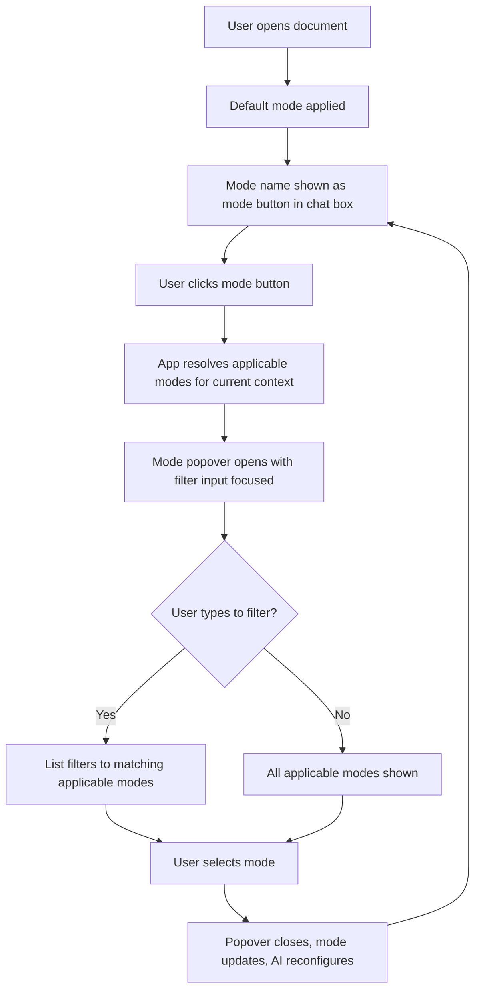
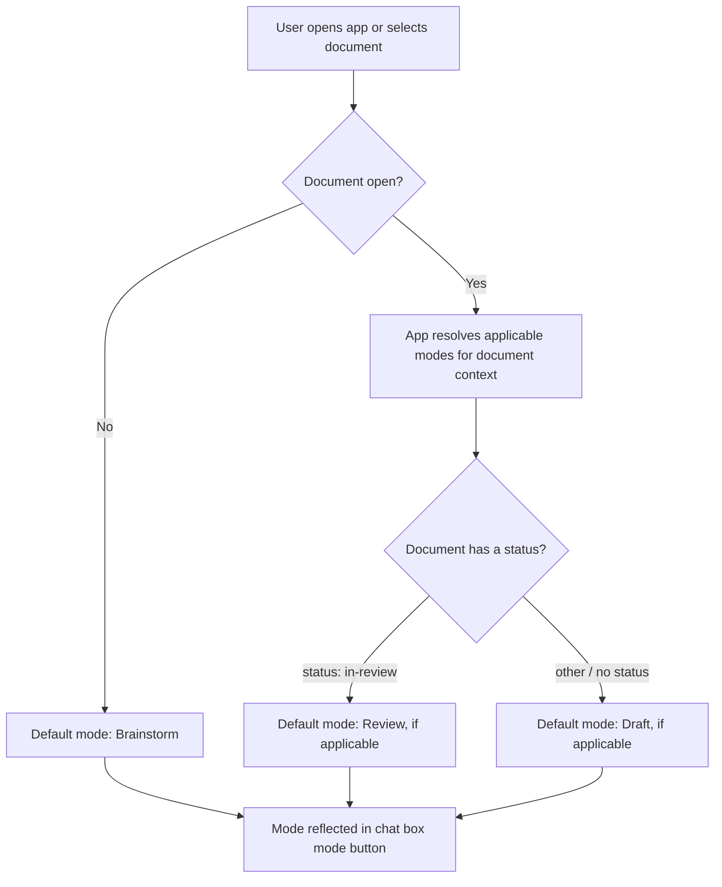
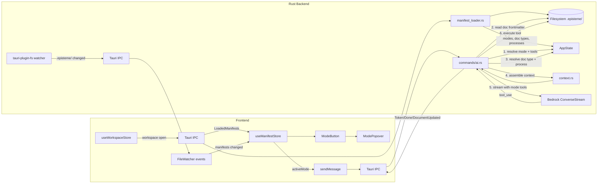
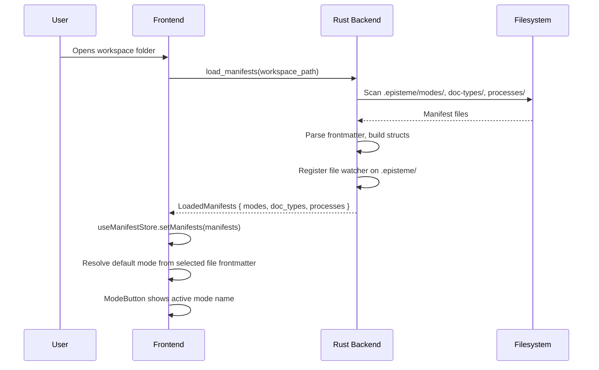
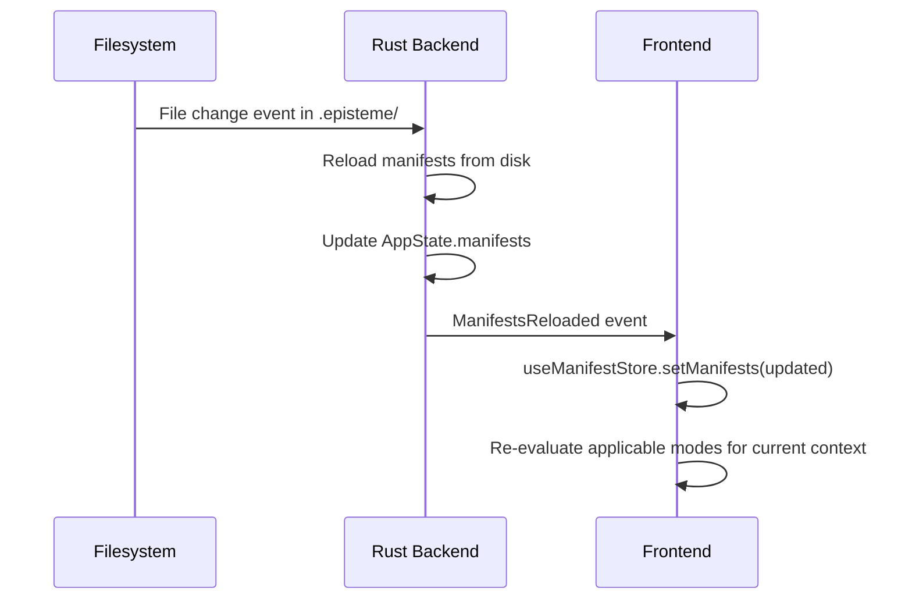
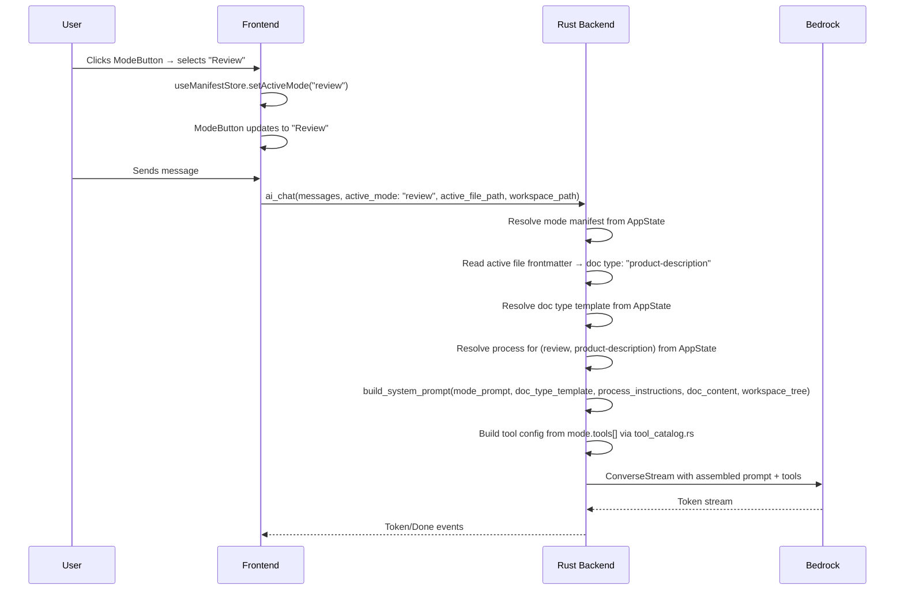

# Document Modes

## What

Document modes configure the AI session — defining which tools the AI can use and what system prompt it operates under. The active mode determines what the AI can do: whether it can edit a document, annotate it, read across the workspace, or something else entirely. Users select a mode explicitly from a picker, and the application enforces the configuration — if the active mode doesn't include write tools, the editor locks.

Modes can operate at three scopes: within a single document, across the entire workspace, or without any document at all (a free-form AI session). Built-in modes ship with the app; workspace owners can define custom modes by dropping manifest files on disk. Opening a document starts in a read-only default mode; workspace-scoped and document-free modes are part of the model but their implementation is deferred to future work.

## Why

Right now, every AI session in Episteme has the same capabilities and the same goal, regardless of what the user is trying to do. The AI infers intent from the conversation. That works for simple interactions, but it breaks down as the app grows: the AI that helps you draft a document shouldn't have the same tools as the one reviewing it for approval, and neither should behave the same as one running an audit across an entire workspace.

Modes give the application a formal way to configure AI sessions. Without this, every new capability — annotations, workspace search, document review — has to be bolted on as a special case, with the app guessing when to enable it. With modes, the model is clean: the user declares what they're doing, the app enforces the right boundaries, and new capabilities can be added by defining a new manifest rather than modifying application code. Custom modes also give workspace owners a way to encode their own workflows — a team's specific review process, a summary format their executives expect — without requiring app changes.

## Personas

- **Patricia: Product Manager** — selects Draft or Revise mode when creating and iterating on documents; benefits from mode preventing accidental edits during review cycles
- **Eric: Engineer** — uses Review mode to annotate others' technical designs; may define custom modes for team-specific workflows
- **Raquel: Reviewer** — primary user of Review mode; needs the AI to surface issues without modifying source documents
- **Aaron: Approver** — uses Approval readiness mode to evaluate readiness; needs write access locked while the AI surfaces risks
- **Olivia: Operations Lead** — may define custom Summary or Audit modes tailored to SOP documentation

## Narratives

### Switching from Review to Author mode

Raquel opens a product description that Patricia submitted for review. The document loads in Review mode — the default for a document in review state — and the AI panel is ready to help her read critically. Raquel asks the AI to surface gaps in the Personas section. The AI identifies two missing user roles and flags that one narrative doesn't map to any defined persona. Raquel starts typing a comment, then pauses — she knows how to fix this and it would be faster to just do it. She switches to Revise mode from the mode picker.

The mode transition is immediate. The editor unlocks, the AI's goal shifts from "surface issues" to "help you improve," and the tool set expands to include write access. Raquel asks the AI to draft a revised Personas section incorporating the two missing roles. The AI writes directly to the document. Raquel reviews the draft, makes a small tweak, and switches back to Review mode when she's done making changes — the editor locks again, and the AI resumes its reviewer goal for the rest of her session.

### Approving a doc and running a batch mode

Aaron has been notified that the notification system PD is ready for sign-off. He opens it in Approval readiness mode — the AI's goal is to help him evaluate readiness, not make changes. He asks the AI whether all the open questions from the review have been resolved. The AI surfaces two that haven't been explicitly addressed in the document and drafts a short checklist of what's missing. Aaron sends the checklist back to Patricia as a comment and puts the document back to In Review.

While he's in the document, Aaron remembers he's supposed to sign off on three other PDs this sprint. Rather than opening each one individually, he switches to Writing guidelines audit mode — a workspace-scoped mode — which operates across all documents rather than a single file. The AI scans the workspace, identifies which documents are in "ready for approval" state, and produces a summary report: two are ready to approve, one has a formatting violation in the Goals section that needs fixing first. Aaron reviews the report and routes accordingly. The batch mode produced a new document — the audit report — and Aaron can open it in any doc-scoped mode to work with it further.

### Adding a custom mode

Eric's team does a lot of architecture review — reading tech designs and evaluating whether they align with existing ADRs and platform decisions. The built-in Review mode is close to what they need, but it doesn't know to check ADR alignment specifically, and its system prompt is too general. Eric decides to define a custom mode.

He creates a new manifest file in the workspace's modes directory — a YAML file with a name, a system prompt that instructs the AI to cross-reference ADRs and flag deviations, and a tool set that includes `read_file` and `search_workspace`. He drops it on disk and reloads the workspace. The new "Architecture review" mode appears in the mode picker alongside the built-in modes. Eric opens a tech design, selects Architecture review, and asks the AI to evaluate the document. The AI immediately surfaces a section that introduces a new queue technology without referencing the existing ADR on messaging infrastructure. The custom mode does exactly what the built-in one couldn't.

## User stories

**Switching from Review to Author mode**

- Raquel can open a document and have a default mode applied automatically
- Raquel can see available modes in a mode picker
- Raquel can switch modes from the picker without leaving the document
- Raquel can see the editor lock or unlock automatically based on the active mode
- Raquel can see the AI's goal shift immediately when she changes modes

**Approving a doc and running a batch mode**

- Aaron can open a document with write access locked by the active mode
- Aaron can switch from a doc-scoped mode to a workspace-scoped mode from the same picker
- Aaron can see a workspace-scoped mode operate across all documents rather than a single file
- Aaron can open a document produced by a batch mode in any doc-scoped mode

**Adding a custom mode**

- Eric can define a custom mode by dropping a manifest file into the workspace
- Eric can specify the tool set and goal for a custom mode
- Eric can see a custom mode appear in the picker alongside built-in modes after reloading

## Goals

- The active mode is always explicit — the app never infers it from conversation context
- Switching modes is instantaneous from the user's perspective; the editor state and AI configuration update without a page reload or visible delay
- Editor write access is derived entirely from the active mode's tool set — no separate editability flag
- Workspace owners can add a custom mode by dropping a single manifest file on disk; no app changes required
- Built-in modes cover the primary workflows out of the box so most users never need to define a custom mode

## Non-goals

- Document-free modes — acknowledged in the model, implementation deferred to a future feature
- Additional workspace-scoped modes beyond Ask (e.g. writing guidelines audit, link audit) — deferred to a future feature
- `available_when` and `priority` expressions for auto-selecting modes based on document state — manifest fields reserved for later
- User-level mode permissions or role-based mode availability
- A UI for creating or editing mode manifests — users write manifest files directly
- Undo/redo across mode switches

## Design spec

### User flow

**Switching modes**



**Resolving default mode**



### UI components

#### Mode button

Lives in the chat box input area alongside the send button and other chat controls. Shows the active mode name; clicking opens the mode popover.

- Ghost button style, `--height-control-sm` (24px), showing the active mode name with a trailing chevron icon
- Hover: background `--color-bg-subtle`, text `--color-text-primary`
- Always visible — modes exist for all contexts, including when no document is open

#### Mode popover

Opens above the mode button when clicked.

- Width: 280px, anchored to the mode button, opens upward
- Background: `--color-bg-overlay`, border: 1px `--color-border-subtle`, radius: `--radius-lg`, shadow: `--shadow-base` (light) / none (dark)
- **Filter input**: auto-focused on open; filters the mode list as the user types; placeholder: "Search modes…"; standard input styling at `--height-control-base`
- **Mode list**: scrollable; one item per applicable mode
  - Top of list reserved for a future "Recommended" section (not implemented yet)
  - Remaining modes listed alphabetically by name
  - Each item: mode name (`--font-size-ui-base`, `--color-text-secondary`) with optional one-line description below (`--font-size-ui-sm`, `--color-text-tertiary`)
  - Active mode: checkmark to indicate current selection
  - Hover: background `--color-bg-hover`, text `--color-text-primary`
- Keyboard: arrow keys navigate list, Enter selects, Escape closes

## Tech spec

### Introduction and overview

**Prerequisites:**
- ADR-001 (Tauri) — Rust backend handles file I/O and manifest loading
- ADR-003 (Zustand) — frontend state management for active mode
- ADR-010 (Radix UI) — mode popover built on Radix `Popover` primitive
- ADR-012 (Modes, doc types, and processes) — domain model this feature implements
- `feature-document-authoring` — existing tool use infrastructure and Bedrock context assembly pipeline that this feature extends

**Technical goals:**
- Mode, doc type, and process manifests are loaded from disk at workspace open; switching modes requires no additional disk reads
- Context assembly (mode + doc type + process) completes before the first token is sent to Bedrock
- Adding a custom mode, doc type, or process requires no app code changes — drop a file, reload workspace
- The mode popover filters and renders applicable modes with no perceptible lag

**Non-goals:**
- Document-free modes (deferred)
- Additional workspace-scoped modes beyond Ask (deferred)
- `available_when` and `priority` expression evaluation (deferred)
- Schema validation of manifest files
- Migration tooling for existing `.claude/skills/` files

**Glossary:**
- **Mode** — a manifest defining tools and system prompt for an AI session; lives in `.episteme/modes/`
- **Doc type** — a markdown file defining the template structure for a document category; lives in `.episteme/doc-types/`
- **Process** — a markdown file or directory providing instructions for a specific (mode, doc type) pair; lives in `.episteme/processes/`
- **Tool catalog** — the app-owned set of tools that can be referenced by mode manifests
- **Context assembly** — the runtime step where the app combines mode, doc type, process, and document content into the AI system prompt
- **Applicable modes** — the subset of loaded modes that are valid for the current context; inapplicable modes are excluded from the picker

### System design and architecture

**High-level architecture:**



**Component breakdown:**

- **manifest_loader.rs** (new) — scans `.episteme/modes/`, `.episteme/doc-types/`, and `.episteme/processes/` on workspace open. Parses YAML frontmatter from each file. Returns structured `ModeManifest`, `DocTypeManifest`, and `ProcessManifest` types. Replaces `skill_loader.rs`.
- **tool_catalog.rs** (new) — defines the app-owned tool catalog: a registry mapping tool names to their Bedrock tool schemas and execution handlers. Mode manifests reference tools by name; this module resolves names to implementations. V1 catalog: `write_file`, `read_file`, `list_files`, `search_workspace`.
- **AppState** (modified) — gains a `manifests` field holding all loaded modes, doc types, and processes. Populated on workspace open, cleared and reloaded on workspace change or `.episteme/` file change.
- **commands/ai.rs** (modified) — `ai_chat` command signature changes: `authoring_mode: bool` and `active_skill: Option<String>` removed; `active_mode: String` added. Tool configuration built by resolving mode manifest's `tools[]` against `tool_catalog.rs`. Passes assembled context to `context.rs`.
- **commands/workspace.rs** (modified) — on workspace open, loads manifests and registers a `tauri-plugin-fs` watcher on `.episteme/`. On change event, reloads manifests, updates AppState, and emits `ManifestsReloaded` event to frontend.
- **context.rs** (modified) — `build_system_prompt` accepts structured inputs: mode system prompt, optional doc type template, optional process instructions, document content, workspace tree. Binary `authoring_mode` flag removed.
- **useManifestStore** (new) — holds `modes`, `docTypes`, `processes`, and `activeMode`. Populated on workspace open via `load_manifests` command. Reloaded on `ManifestsReloaded` event. Exposes `applicableModes()` which filters by current document type. `setActiveMode()` updates active mode and triggers session update.
- **ModeButton** (new) — renders in `ChatInputCard`'s existing `modeButton` slot. Ghost button showing active mode name + chevron. Opens `ModePopover` on click.
- **ModePopover** (new) — Radix `Popover` with filter input and alphabetical mode list. Calls `useManifestStore.setActiveMode()` on selection.

**Sequence diagram — workspace open and default mode resolution:**



**Sequence diagram — manifest hot reload:**



**Sequence diagram — mode switch and message send:**



### Detailed design

#### Manifest file schemas

**Mode** (`.episteme/modes/<id>.md`) — filename stem is the canonical ID (e.g. `draft.md` → ID `draft`):

```yaml
---
name: Draft                  # display name
description: Help draft and revise this document
scope: document              # document | workspace | any
tools:
  - read_file
  - write_file
---
You are helping the user draft a document. Guide them through each section,
ask focused questions, and write content directly to the document...
```

**Doc type** (`.episteme/doc-types/<id>.md`) — filename stem is the canonical ID:

```yaml
---
name: Product description
description: A product description document
---
## Template

### What
1-3 paragraphs describing what is being built, for whom, and what outcome...
```

**Process** (`.episteme/processes/<id>.md` or `.episteme/processes/<id>/process.md`) — filename stem is the canonical ID. Applies to the intersection of declared modes and doc types:

```yaml
---
modes:
  - draft
doc_types:
  - product-description
stages:
  - stages/discovery.md
  - stages/drafting.md
---
Main process instructions that apply across all stages...
```

`modes` and `doc_types` are always arrays. `stages` is optional; if present, it is an ordered list of relative paths to stage files. Stage context loading mechanics are deferred to issue #112.

Manifests are designed to be forward-compatible: new frontmatter fields can be added without breaking existing files. Rust structs use `Option<>` for non-required fields and serde's default behavior (unknown fields ignored).

---

#### Rust types (`manifest_loader.rs`)

```rust
#[derive(Clone, Serialize, Deserialize, PartialEq)]
#[serde(rename_all = "lowercase")]
pub enum ModeScope {
    Document,
    Workspace,
    Any,
}

#[derive(Clone, Serialize, Deserialize)]
pub struct ModeManifest {
    pub id: String,                    // derived from filename stem
    pub name: String,
    pub description: Option<String>,
    pub scope: ModeScope,
    pub tools: Vec<String>,
    pub system_prompt: String,         // markdown body after frontmatter
}

#[derive(Clone, Serialize, Deserialize)]
pub struct DocTypeManifest {
    pub id: String,                    // derived from filename stem
    pub name: String,
    pub description: Option<String>,
    pub template: String,              // markdown body after frontmatter
}

#[derive(Clone, Serialize, Deserialize)]
pub struct ProcessManifest {
    pub id: String,                    // derived from filename stem
    pub modes: Vec<String>,            // mode IDs this process applies to
    pub doc_types: Vec<String>,        // doc type IDs this process applies to
    pub stages: Vec<String>,           // optional: ordered relative paths to stage files
    pub instructions: String,          // body content (excluding stage files)
}

#[derive(Clone, Serialize, Deserialize)]
pub struct LoadedManifests {
    pub modes: Vec<ModeManifest>,
    pub doc_types: Vec<DocTypeManifest>,
    pub processes: Vec<ProcessManifest>,
}
```

Process resolution: find all processes where `modes` contains the active mode ID AND `doc_types` contains the current doc type ID. If multiple match, first match wins.

---

#### Tool catalog (`tool_catalog.rs`)

The tool catalog maps tool names declared in mode manifests to their AI provider schemas and execution handlers. The catalog is app-owned — workspace owners reference tool names but cannot add new tools.

**V1 catalog:**

| Tool | Input | Description |
|---|---|---|
| `read_file` | `file_path: string` (relative) | Reads a single file; validates path is within workspace |
| `write_file` | `file_path: string`, `content: string` | Writes complete file content; creates parent dirs; validates path |
| `list_files` | none | Returns all markdown files in the workspace as `[{path, title}]` |
| `search_workspace` | `query: string` | V1: returns files whose content contains the query string. Semantic search is a future enhancement. |

`build_tool_config(tools: &[String]) -> Result<ToolConfiguration>` resolves a mode's `tools` array to a provider tool configuration. Returns an error if a tool name is not in the catalog — catches typos in manifests at session start rather than at invocation time.

---

#### AppState

```rust
pub struct ManifestState(pub std::sync::Mutex<Option<LoadedManifests>>);

// Registered in lib.rs run():
app.manage(ManifestState(std::sync::Mutex::new(None)));
```

---

#### `load_manifests` command (new)

```rust
pub async fn load_manifests(
    workspace_path: String,
    app: tauri::AppHandle,
    manifest_state: tauri::State<'_, ManifestState>,
) -> Result<LoadedManifests, String>
```

1. Scan `.episteme/modes/` — parse each `.md` file; derive `id` from filename stem; parse frontmatter + body into `ModeManifest`. Merge with hardcoded built-in modes (Draft, Ask, Review), with workspace manifests taking precedence on name collision.
2. Scan `.episteme/doc-types/` — parse each `.md` file into `DocTypeManifest`
3. Scan `.episteme/processes/` — for each entry: if file, parse directly; if directory, read `process.md` as body and note stage paths relative to directory root
4. Store result in `ManifestState`
5. Register `tauri-plugin-fs` watcher on `.episteme/`; on any change: reload manifests, update `ManifestState`, emit `manifests-reloaded` event with updated `LoadedManifests`
6. Return `LoadedManifests` to frontend

If `.episteme/` does not exist, returns built-in modes only with empty doc types and processes — no error.

---

#### `ai_chat` command changes

```rust
// Before
pub async fn ai_chat(
    messages: Vec<ChatMessage>,
    active_file_path: Option<String>,
    workspace_path: String,
    aws_profile: String,
    authoring_mode: bool,          // removed
    active_skill: Option<String>,  // removed
    on_event: Channel<StreamEvent>,
) -> Result<(), String>

// After
pub async fn ai_chat(
    messages: Vec<ChatMessage>,
    active_mode: String,
    active_file_path: Option<String>,
    workspace_path: String,
    aws_profile: String,
    on_event: Channel<StreamEvent>,
) -> Result<(), String>
```

Context assembly steps:

1. Look up `ModeManifest` from `ManifestState` by `active_mode` ID. Error if not found.
2. Build tool configuration from `mode.tools` via `tool_catalog::build_tool_config()`
3. If `mode.scope == Document` and `active_file_path` is set: read file frontmatter to extract `type` field (reuses `extract_type_from_file` logic)
4. Look up `DocTypeManifest` from `ManifestState` by doc type ID (if present)
5. Look up `ProcessManifest` from `ManifestState` where `modes` contains `active_mode` and `doc_types` contains the doc type ID (if present)
6. Call `context::build_system_prompt()` with assembled inputs

---

#### `context::build_system_prompt` changes

```rust
// Before
pub fn build_system_prompt(
    active_file_path: Option<&str>,
    _open_file_paths: &[String],
    workspace_path: &str,
    authoring_mode: bool,
    skill_content: Option<&str>,
) -> Result<String, String>

// After
pub fn build_system_prompt(
    mode: &ModeManifest,
    doc_type: Option<&DocTypeManifest>,
    process: Option<&ProcessManifest>,
    active_file_path: Option<&str>,
    workspace_path: &str,
) -> Result<String, String>
```

Assembled prompt structure:

```
<mode.system_prompt>

## Document type
<doc_type.template>         ← omitted if no doc type

## Process guidance
<process.instructions>      ← omitted if no process
                            ← stage content deferred to issue #112

## Active document
<file content>              ← omitted for workspace/any-scoped modes or no file open

## Workspace
<markdown file listing with titles>
```

---

#### Frontend: TypeScript types

```typescript
interface ModeManifest {
  id: string;
  name: string;
  description?: string;
  scope: "document" | "workspace" | "any";
  tools: string[];
  system_prompt: string;
}

interface DocTypeManifest {
  id: string;
  name: string;
  description?: string;
  template: string;
}

interface ProcessManifest {
  id: string;
  modes: string[];
  doc_types: string[];
  stages: string[];
  instructions: string;
}

interface LoadedManifests {
  modes: ModeManifest[];
  doc_types: DocTypeManifest[];
  processes: ProcessManifest[];
}
```

---

#### Frontend: `useManifestStore`

```typescript
interface ManifestStore {
  modes: ModeManifest[];
  docTypes: DocTypeManifest[];
  processes: ProcessManifest[];
  activeMode: string | null;

  loadManifests: (workspacePath: string) => Promise<void>;
  setManifests: (manifests: LoadedManifests) => void;
  setActiveMode: (name: string) => void;
  applicableModes: (docType: string | null) => ModeManifest[];
  resolveDefaultMode: (docType: string | null, status: string | null) => string | null;  // stub: see issue #113
}
```

`applicableModes` filters by scope at v1: excludes `document`-scoped modes when no document is open; excludes `workspace`-scoped modes when a document is open. Modes with `scope: any` are always included. The `available_when` expression system (deferred per ADR-012) will replace this with manifest-declared rules.

`resolveDefaultMode` is a minimal stub pending issue #113. For v1: return `"ask"` when no document is open, `"draft"` otherwise. Fallback to first alphabetical applicable mode if preferred mode is unavailable.

`sendMessage` in `useAiChatStore`: remove `authoringMode` and `activeSkill` params; read `activeMode` from `useManifestStore` and pass as `active_mode` to `ai_chat`.

### Security, privacy, and compliance

**File system access:** Manifest files are read from `.episteme/` within the workspace. The same path canonicalization and prefix-checking pattern used by existing `read_file` and `write_file` commands applies to all new tool executions — no file access outside the workspace is permitted.

**Manifest content:** Manifests are user-controlled content committed to the workspace repository, subject to normal git review. A malicious mode manifest could influence AI behavior via its system prompt — this is acceptable for the same reason skills are acceptable today. Workspace owners are responsible for the manifests they commit.

**Tool execution:** `read_file` and `write_file` already validate paths. `list_files` and `search_workspace` must apply the same workspace boundary check. `build_tool_config` validates all tool names against the catalog before any session starts — unknown tool names are rejected.

**Data privacy:** Same posture as the existing AI chat — document content and manifest content are sent to the AI provider as prompt context. No additional data exposure.

---

### Observability

**Logging** (using existing tauri-plugin-log):

| Level | Event |
|---|---|
| INFO | Manifests loaded — counts of modes, doc types, processes |
| INFO | Manifest hot-reload triggered — which file changed |
| INFO | Mode resolved for session — mode ID, doc type ID, process ID (or "none") |
| WARN | Mode not found in manifests — mode ID requested |
| WARN | Tool not in catalog — tool name from manifest |
| WARN | Multiple processes matched (mode, doc_type) — using first match |
| ERROR | Manifest parse failure — file path, error |
| DEBUG | Context assembly — token estimates per section |

---

### Testing plan

**Unit tests (Rust):**
- `manifest_loader`: parses mode/doc type/process frontmatter correctly; derives ID from filename stem; handles missing `.episteme/`; merges built-in and workspace modes; assembles directory-form process content
- `tool_catalog`: resolves known tool names; rejects unknown tool names; builds correct provider schema for each tool
- `context.rs`: assembles prompt correctly for each scope; omits sections correctly when doc type/process/file absent
- `commands/ai.rs`: resolves process for (mode, doc_type) pair; handles multiple matches; handles no match

**Unit tests (Vitest):**
- `useManifestStore`: `loadManifests`, `setActiveMode`, `applicableModes` filtering by scope, `resolveDefaultMode` stub behavior, `manifests-reloaded` event handling
- `ModePopover`: filter input narrows list; alphabetical ordering; active mode shows checkmark; selecting mode calls `setActiveMode`

**Integration tests (Rust):**
- Full `ai_chat` call with mode context assembly: mock AI provider responses, verify system prompt contains mode prompt, doc type template, and process instructions in correct sections
- File watcher: write a manifest file to `.episteme/`, verify `manifests-reloaded` event emitted with updated manifests

**E2E tests (Playwright):**
- Mode button is visible in chat input at all times
- Clicking mode button opens popover with filter input focused
- Typing in filter narrows mode list
- Selecting a mode closes popover and updates mode button label
- Mode button shows correct default mode on workspace open

---

### Alternatives considered

**Frontend-side context assembly:** The frontend could assemble the full system prompt and pass it to the backend, rather than the backend resolving manifests from AppState. Simpler backend, but leaks AI provider prompt format to the frontend, makes context assembly untestable, and requires passing large strings over IPC on every message.

**Single manifest type (mode absorbs doc type and process):** Addressed in ADR-012 — rejected due to combinatorial explosion.

**Database-backed manifests:** Store manifests in SQLite rather than files. Enables querying, schema enforcement, and transactional updates. Adds significant complexity, removes git-versioning, and contradicts the "drop a file" extensibility model. File-based wins clearly for this use case.

**Polling instead of file watcher:** Reload manifests on a timer rather than via `tauri-plugin-fs`. Simpler but introduces latency and unnecessary disk reads. File watching is the right tool.

---

### Risks

**File watcher reliability:** `tauri-plugin-fs` watcher behavior varies across OS and filesystem types. Mitigation: treat the watcher as best-effort; always expose a manual "reload workspace" action as a fallback.

**Hot reload mid-session:** If manifests change while a session is active, the in-flight mode manifest may be stale relative to what's on disk. Mitigation: resolve the mode manifest once at session start and hold the resolved copy for that session's duration — don't re-resolve on every message.

**Multiple processes matching (mode, doc_type):** When a workspace defines multiple processes whose `modes` and `doc_types` arrays overlap, first-match behavior may be surprising. Mitigation: log a warning when multiple matches are found. Full resolution strategy deferred to issue #114.

**Large process files exceeding context:** Process files with many examples or extensive stage content could consume a significant portion of the context window. Mitigation: deferred to issue #112 for stage-aware loading; monitor token usage in practice and truncate non-stage content if needed.

**`skill_loader.rs` deprecation:** Existing callers (`commands/skills.rs`, `ai_chat`) depend on `skill_loader`. Removing it is a breaking change to the existing authoring flow. Mitigation: `skill_loader.rs` and `manifest_loader.rs` can coexist temporarily; remove `skill_loader` once all callers are migrated.

## Task list

- [ ] **Story: Rust manifest infrastructure**
  - [x] **Task: Add `tauri-plugin-fs` dependency**
    - **Description**: Add `tauri-plugin-fs` to `src-tauri/Cargo.toml` and register it in `lib.rs`. This plugin provides file watching capabilities needed for `.episteme/` hot reload.
    - **Acceptance criteria**:
      - [ ] `tauri-plugin-fs` added to `Cargo.toml` dependencies
      - [ ] Plugin registered in `lib.rs` `run()` via `.plugin(tauri_plugin_fs::init())`
      - [ ] Project compiles with the new dependency
    - **Dependencies**: None
  - [x] **Task: Implement `manifest_loader.rs`**
    - **Description**: Create `src-tauri/src/manifest_loader.rs`. Implement `load_manifests(workspace_path: &str) -> Result<LoadedManifests, String>` which scans `.episteme/modes/`, `.episteme/doc-types/`, and `.episteme/processes/`. For each `.md` file, parse YAML frontmatter and body. Derive `id` from filename stem. For directory-form processes, read `process.md` as body and note stage paths. Define `ModeManifest`, `DocTypeManifest`, `ProcessManifest`, and `LoadedManifests` structs with serde derives. Do not use `deny_unknown_fields` — manifests must be forward-compatible. Return empty vecs (not an error) if `.episteme/` does not exist.
    - **Acceptance criteria**:
      - [x] `ModeManifest`, `DocTypeManifest`, `ProcessManifest`, `LoadedManifests` structs defined with correct fields per spec
      - [x] `ModeScope` enum defined with `Document`, `Workspace`, `Any` variants
      - [x] `id` derived from filename stem for all manifest types
      - [x] Parses frontmatter fields correctly for all three types
      - [x] Body (content after frontmatter) stored in `system_prompt` / `template` / `instructions`
      - [x] Directory-form process: reads `process.md` as body, stage paths preserved relative to process directory
      - [x] Missing `.episteme/` returns empty `LoadedManifests`, not an error
      - [x] Unknown frontmatter fields ignored (forward-compatible)
      - [x] Unit tests: valid mode, valid doc type, valid process (file and directory forms), missing `.episteme/`, malformed frontmatter
    - **Dependencies**: None
  - [x] **Task: Add `ManifestState` to AppState**
    - **Description**: Define `pub struct ManifestState(pub std::sync::Mutex<Option<LoadedManifests>>)` in `lib.rs` (or a dedicated `state.rs`). Register it in `run()` via `app.manage(ManifestState(std::sync::Mutex::new(None)))`. Import `LoadedManifests` from `manifest_loader`.
    - **Acceptance criteria**:
      - [x] `ManifestState` struct defined and exported
      - [x] Registered in `run()` alongside existing `PendingUpdate` state
      - [x] Project compiles
    - **Dependencies**: "Task: Implement `manifest_loader.rs`"
  - [x] **Task: Implement `load_manifests` command**
    - **Description**: Create a new Tauri command `load_manifests(workspace_path: String, manifest_state: State<ManifestState>) -> Result<LoadedManifests, String>`. Call `manifest_loader::load_manifests()`, define the three built-in modes (Draft, Review, Ask) as hardcoded `ModeManifest` structs in the app, merge them with workspace-loaded modes (workspace modes take precedence on ID collision), store result in `ManifestState`, and return `LoadedManifests`. Register the command in `lib.rs`.
    - **Acceptance criteria**:
      - [x] Command callable from frontend via `invoke("load_manifests", { workspacePath })`
      - [x] Built-in modes (draft, review, ask) always present in returned modes list
      - [x] Workspace modes with matching IDs override built-in modes
      - [x] `ManifestState` updated with loaded manifests
      - [x] Registered in `lib.rs` invoke handler
      - [x] Unit tests: built-in modes present when `.episteme/` absent; workspace mode overrides built-in; all three manifest types returned
    - **Dependencies**: "Task: Implement `manifest_loader.rs`", "Task: Add `ManifestState` to AppState"
  - [x] **Task: Implement file watcher on `.episteme/`**
    - **Description**: After loading manifests in `load_manifests`, register a `tauri-plugin-fs` watcher on the `.episteme/` directory. On any file change event: reload manifests from disk, update `ManifestState`, and emit a `manifests-reloaded` Tauri event to the frontend window with the updated `LoadedManifests` payload. If `.episteme/` does not exist, skip watcher registration without error.
    - **Acceptance criteria**:
      - [x] Watcher registered on `.episteme/` after successful `load_manifests` call
      - [x] File change in `.episteme/` triggers manifest reload and `ManifestState` update
      - [x] `manifests-reloaded` event emitted to frontend with updated `LoadedManifests`
      - [x] Missing `.episteme/` skips watcher registration silently
      - [ ] Previous watcher cleaned up if workspace changes
      - [ ] Integration test: write a manifest file to `.episteme/`, verify event emitted
    - **Dependencies**: "Task: Add `tauri-plugin-fs` dependency", "Task: Implement `load_manifests` command"

- [x] **Story: Tool catalog**
  - [x] **Task: Implement `tool_catalog.rs` with `build_tool_config`**
    - **Description**: Create `src-tauri/src/tool_catalog.rs`. Define the catalog as a map of tool name → provider tool schema. Implement `build_tool_config(tools: &[String]) -> Result<ToolConfiguration, String>` which resolves each name in the slice against the catalog and builds the provider tool configuration. Return an error (not a panic) if any tool name is not in the catalog.
    - **Acceptance criteria**:
      - [x] Catalog contains entries for `read_file`, `write_file`, `list_files`, `search_workspace`
      - [x] `build_tool_config` returns correct provider config for any subset of valid tool names
      - [x] `build_tool_config` returns `Err` for unknown tool names
      - [x] Unit tests: all four tools individually; mixed valid set; unknown tool name; empty slice
    - **Dependencies**: None
  - [x] **Task: Implement `read_file` AI tool**
    - **Description**: Add `read_file` to the tool catalog and implement its execution handler in `tool_catalog.rs`. Input: `file_path` (relative). Reuse the path validation logic from `commands/files.rs` `read_file`. Return file contents as a string tool result.
    - **Acceptance criteria**:
      - [x] Tool schema defined: `file_path` (string, required)
      - [x] Validates path is within workspace (reuses canonicalization pattern)
      - [x] Returns file content on success
      - [x] Returns descriptive error on path traversal attempt, missing file, or read failure
      - [x] Unit tests: valid read, path traversal rejection, missing file
    - **Dependencies**: "Task: Implement `tool_catalog.rs` with `build_tool_config`"
  - [x] **Task: Implement `list_files` AI tool**
    - **Description**: Add `list_files` to the tool catalog. No input parameters. Reuse `context.rs` `collect_markdown_entries` to return all markdown files in the workspace as a formatted list of `path: "title"` pairs.
    - **Acceptance criteria**:
      - [x] Tool schema defined: no required inputs
      - [x] Returns formatted list of all workspace markdown files with titles
      - [x] Excludes hidden directories and `node_modules`
      - [x] Unit tests: workspace with files, empty workspace
    - **Dependencies**: "Task: Implement `tool_catalog.rs` with `build_tool_config`"
  - [x] **Task: Implement `search_workspace` AI tool**
    - **Description**: Add `search_workspace` to the tool catalog. Input: `query` (string). V1 implementation: walk workspace markdown files and return paths + titles of files whose content contains the query string (case-insensitive). Returns up to 20 matches.
    - **Acceptance criteria**:
      - [x] Tool schema defined: `query` (string, required)
      - [x] Returns paths and titles of matching files
      - [x] Case-insensitive match
      - [x] Capped at 20 results
      - [x] Returns empty list (not error) when no matches found
      - [x] Unit tests: matching files found, no matches, query across multiple files
    - **Dependencies**: "Task: Implement `tool_catalog.rs` with `build_tool_config`"

- [x] **Story: Mode-driven context assembly (Rust)**
  - [x] **Task: Refactor `context.rs` `build_system_prompt`**
    - **Description**: Replace the existing `build_system_prompt(active_file_path, open_file_paths, workspace_path, authoring_mode, skill_content)` signature with `build_system_prompt(mode: &ModeManifest, doc_type: Option<&DocTypeManifest>, process: Option<&ProcessManifest>, active_file_path: Option<&str>, workspace_path: &str) -> Result<String, String>`. Assemble the prompt per the spec: mode system prompt, then doc type template section (if present), then process guidance section (if present), then active document section (omitted for workspace/any-scoped modes or if no file open), then workspace listing.
    - **Acceptance criteria**:
      - [x] New signature matches spec exactly
      - [x] Mode system prompt always present as first section
      - [x] Doc type section included only when `doc_type` is `Some`
      - [x] Process section included only when `process` is `Some`
      - [x] Active document section omitted for `workspace` and `any` scoped modes
      - [x] Active document section omitted when `active_file_path` is `None`
      - [x] Workspace listing always present
      - [x] Old signature and `authoring_mode` branch removed
      - [x] Unit tests: document-scoped with all sections; workspace-scoped; no doc type; no process; no file open
    - **Dependencies**: "Task: Implement `manifest_loader.rs`"
  - [x] **Task: Refactor `ai_chat` command**
    - **Description**: Update `ai_chat` command signature: remove `authoring_mode: bool` and `active_skill: Option<String>`, add `active_mode: String`. Replace the binary authoring mode branch with: (1) look up `ModeManifest` from `ManifestState` by `active_mode` ID, error if not found; (2) call `tool_catalog::build_tool_config` from mode's `tools` array; (3) read active file frontmatter to extract `type` field; (4) look up `DocTypeManifest` from `ManifestState`; (5) find matching `ProcessManifest` (first match on mode + doc_type, warn if multiple); (6) call updated `build_system_prompt`. Update tool execution dispatch to handle all catalog tools, not just `write_file`.
    - **Acceptance criteria**:
      - [x] `authoring_mode` and `active_skill` params removed
      - [x] `active_mode` param added
      - [x] Mode manifest looked up from `ManifestState`; returns error if not found
      - [x] Tool config built from mode's `tools` array via `tool_catalog`
      - [x] Doc type resolved from active file frontmatter
      - [x] Process resolved by matching mode + doc_type (first match, warning logged if multiple)
      - [x] `build_system_prompt` called with resolved inputs
      - [x] Tool execution handles all V1 catalog tools (`read_file`, `write_file`, `list_files`, `search_workspace`)
      - [x] Registered in `lib.rs` (replaces existing `ai_chat` registration)
      - [x] Existing tests updated to use new signature
    - **Dependencies**: "Task: Refactor `context.rs` `build_system_prompt`", "Task: Implement `tool_catalog.rs` with `build_tool_config`", "Task: Implement `load_manifests` command"

- [x] **Story: Frontend manifest store**
  - [x] **Task: Implement `useManifestStore`**
    - **Description**: Create `src/stores/manifests.ts`. Define `ModeManifest`, `DocTypeManifest`, `ProcessManifest`, `LoadedManifests` TypeScript interfaces per spec. Implement Zustand store with state (`modes`, `docTypes`, `processes`, `activeMode`) and actions: `loadManifests(workspacePath)` (invokes `load_manifests` command), `setManifests(manifests)`, `setActiveMode(id)`, `applicableModes(docType)` (filters by scope), `resolveDefaultMode(docType, status)` (stub per issue #113: returns `"ask"` when no doc type, `"draft"` otherwise, fallback to first alphabetical).
    - **Acceptance criteria**:
      - [x] All interfaces defined matching Rust types
      - [x] `loadManifests` invokes `load_manifests` Tauri command and updates store state
      - [x] `setManifests` replaces all manifest state
      - [x] `setActiveMode` updates `activeMode`
      - [x] `applicableModes`: excludes `document`-scoped modes when `docType` is null; excludes `workspace`-scoped modes when `docType` is present; `any`-scoped always included
      - [x] `resolveDefaultMode` stub returns correct defaults per spec
      - [x] Unit tests: `applicableModes` filtering, `resolveDefaultMode` stub cases, `setActiveMode`
    - **Dependencies**: None
  - [x] **Task: Wire workspace open to `load_manifests` and handle `manifests-reloaded`**
    - **Description**: In `useWorkspaceStore` (or wherever workspace folder open is handled), call `useManifestStore.loadManifests(folderPath)` after a folder is successfully opened. Subscribe to the `manifests-reloaded` Tauri event (using `listen` from `@tauri-apps/api/event`) and call `useManifestStore.setManifests(payload)` when received. After manifests load, call `resolveDefaultMode` for the current file and set active mode.
    - **Acceptance criteria**:
      - [x] `loadManifests` called when workspace folder is opened
      - [x] `manifests-reloaded` event listener registered on workspace open
      - [x] Store updated when `manifests-reloaded` event received
      - [x] Active mode set to resolved default after manifests load
      - [x] Event listener cleaned up when workspace closes or component unmounts
      - [ ] Unit tests: manifests loaded on workspace open, store updated on reload event
    - **Dependencies**: "Task: Implement `useManifestStore`", "Task: Implement file watcher on `.episteme/`"

- [x] **Story: Mode picker UI**
  - [x] **Task: Implement `ModeButton` component**
    - **Description**: Create `src/components/ui/ModeButton.tsx`. Ghost button (`--height-control-sm`, 24px) showing the active mode's display name and a trailing `ChevronDown` icon (12px). Reads active mode from `useManifestStore`. On click, opens `ModePopover`. Uses design system tokens per spec.
    - **Acceptance criteria**:
      - [x] Renders active mode display name from `useManifestStore`
      - [x] Ghost button style at `--height-control-sm`
      - [x] `ChevronDown` icon trailing
      - [x] Renders a placeholder label when `activeMode` is null
      - [x] Click handler wires to popover open state
      - [x] Unit test: renders active mode name; renders placeholder when null
    - **Dependencies**: "Task: Implement `useManifestStore`"
  - [x] **Task: Implement `ModePopover` component**
    - **Description**: Create `src/components/ModePopover.tsx` using Radix `Popover` primitive. Opens above the mode button. Contains: a filter input (auto-focused on open, `--height-control-base`) that filters the mode list as the user types; a scrollable list of applicable modes in alphabetical order (top reserved for future "Recommended" section); each item shows mode name and optional description; active mode shows a `Check` icon; hover uses `--color-bg-hover`. Keyboard: arrow keys navigate, Enter selects, Escape closes. On selection: calls `useManifestStore.setActiveMode(id)` and closes popover.
    - **Acceptance criteria**:
      - [x] Popover opens above mode button, width 280px
      - [x] Filter input auto-focused on open
      - [x] Typing filters mode list (case-insensitive, matches name or description)
      - [x] Modes listed alphabetically
      - [x] Active mode shows `Check` icon
      - [x] Each item shows name; description shown if present
      - [x] Arrow key navigation cycles through visible items
      - [x] Enter selects focused item, closes popover
      - [x] Escape closes popover without selection
      - [x] Selecting a mode calls `setActiveMode` and closes popover
      - [x] Unit tests: filter narrows list; active mode checkmark; selection calls setActiveMode; keyboard navigation
    - **Dependencies**: "Task: Implement `ModeButton` component"
  - [x] **Task: Wire `ModeButton` into `ChatInputCard` and `ChatView`**
    - **Description**: `ChatInputCard` already has a `modeButton?: ReactNode` slot. In the parent component that renders `ChatInputCard` (likely `ChatView` or `AiChatPanel`), pass `<ModeButton />` as the `modeButton` prop. Ensure `ModePopover` is rendered in the correct position relative to the button.
    - **Acceptance criteria**:
      - [x] `ModeButton` visible in the chat input bottom bar at all times
      - [x] `ModePopover` opens and closes correctly relative to `ModeButton`
      - [x] No layout shift in `ChatInputCard` when mode button is present
      - [ ] E2E test: mode button visible in chat panel; clicking opens popover
    - **Dependencies**: "Task: Implement `ModePopover` component"

- [ ] **Story: AI chat store migration**
  - [ ] **Task: Migrate `useAiChatStore` to mode-driven sessions**
    - **Description**: Remove `authoringMode: bool`, `authoringFilePath: string | null`, and `activeSkill: string | null` from `useAiChatStore`. Remove `startAuthoring()` action. Update `sendMessage` to read `activeMode` from `useManifestStore` and pass it as `active_mode` to the `ai_chat` Tauri command. Update `newSession` and `loadSessions` to use the active mode from `useManifestStore` instead of the hardcoded `"view"` string. Update any callers of `startAuthoring` to use `useManifestStore.setActiveMode("draft")` instead.
    - **Acceptance criteria**:
      - [ ] `authoringMode`, `authoringFilePath`, `activeSkill` removed from store state
      - [ ] `startAuthoring` action removed
      - [ ] `sendMessage` passes `active_mode` from `useManifestStore` to `ai_chat`
      - [ ] `newSession` and `loadSessions` use active mode from manifest store
      - [ ] All existing callers of `startAuthoring` updated
      - [ ] No TypeScript errors
      - [ ] Unit tests updated to use new store shape
    - **Dependencies**: "Task: Implement `useManifestStore`", "Task: Refactor `ai_chat` command"

- [x] **Story: Built-in mode manifests**
  - [x] **Task: Author `draft` built-in mode**
    - **Description**: Define the Draft mode as a hardcoded `ModeManifest` in `load_manifests` (or a dedicated `built_in_modes.rs`). Scope: `Document`. Tools: `read_file`, `write_file`. System prompt: instructs the AI to help the user write and revise a document, use `write_file` to write content directly, follow any process guidance, and keep chat messages concise.
    - **Acceptance criteria**:
      - [x] ID: `draft`, name: `Draft`, scope: `Document`
      - [x] Tools: `[read_file, write_file]`
      - [x] System prompt covers: write to document via tool, keep chat concise, follow process if present
      - [x] Appears in `load_manifests` response without any `.episteme/modes/draft.md` present
    - **Dependencies**: "Task: Implement `load_manifests` command"
  - [x] **Task: Author `review` built-in mode**
    - **Description**: Define the Review mode as a hardcoded `ModeManifest`. Scope: `Document`. Tools: `read_file`. System prompt: instructs the AI to read the document critically, surface issues with clarity, structure, and completeness, suggest improvements without rewriting, and not modify the document.
    - **Acceptance criteria**:
      - [x] ID: `review`, name: `Review`, scope: `Document`
      - [x] Tools: `[read_file]`
      - [x] System prompt covers: read-only, surface issues, suggest without rewriting
      - [x] Appears in `load_manifests` response without any `.episteme/modes/review.md` present
    - **Dependencies**: "Task: Implement `load_manifests` command"
  - [x] **Task: Author `ask` built-in mode**
    - **Description**: Define the Ask mode as a hardcoded `ModeManifest`. Scope: `Workspace`. Tools: `read_file`, `list_files`, `search_workspace`. System prompt: instructs the AI to answer questions by drawing on any document in the workspace, use tools to find and read relevant documents, and cite sources by file path.
    - **Acceptance criteria**:
      - [x] ID: `ask`, name: `Ask`, scope: `Workspace`
      - [x] Tools: `[read_file, list_files, search_workspace]`
      - [x] System prompt covers: answer from workspace documents, use tools, cite by path
      - [x] Appears in `load_manifests` response without any `.episteme/modes/ask.md` present
    - **Dependencies**: "Task: Implement `load_manifests` command"

- [ ] **Story: Tests**
  - [ ] **Task: Rust unit and integration tests**
    - **Description**: Write Rust tests covering: `manifest_loader` (all manifest types, directory-form process, missing `.episteme/`, unknown fields ignored); `tool_catalog` (`build_tool_config` valid/invalid tool names, all four tool execution handlers); `context.rs` (all prompt assembly combinations); `ai_chat` context assembly (process resolution, multiple matches warning, no match). Use `tempfile` crate for filesystem tests.
    - **Acceptance criteria**:
      - [ ] `manifest_loader`: valid mode, doc type, process (file + directory), missing dir, unknown fields
      - [ ] `tool_catalog`: all tools, unknown name, empty slice
      - [ ] `context.rs`: document-scoped full, workspace-scoped, missing sections
      - [ ] `ai_chat`: process found, multiple matches (warning), no match
      - [ ] All tests pass with `cargo test`
    - **Dependencies**: "Task: Refactor `ai_chat` command", "Task: Refactor `context.rs` `build_system_prompt`"
  - [ ] **Task: Vitest unit tests**
    - **Description**: Write Vitest tests for `useManifestStore` and `ModePopover`. For the store: `loadManifests`, `setActiveMode`, `applicableModes` filtering, `resolveDefaultMode` stub, `manifests-reloaded` event handling. For the popover: filter behavior, active mode checkmark, selection callback, keyboard navigation.
    - **Acceptance criteria**:
      - [ ] `useManifestStore`: all actions and selectors covered
      - [ ] `ModePopover`: filter, checkmark, selection, keyboard
      - [ ] All tests pass with `npm run test:unit`
    - **Dependencies**: "Task: Implement `ModePopover` component", "Task: Implement `useManifestStore`"
  - [ ] **Task: E2E tests**
    - **Description**: Write Playwright tests for the mode picker flow with mocked Tauri commands.
    - **Acceptance criteria**:
      - [ ] Mode button visible in chat input at all times
      - [ ] Clicking mode button opens popover with filter input focused
      - [ ] Typing filters the mode list
      - [ ] Selecting a mode closes popover and updates button label
      - [ ] All tests pass with `npm run test:e2e`
    - **Dependencies**: "Task: Wire `ModeButton` into `ChatInputCard` and `ChatView`"

- [x] **Story: Cleanup**
  - [x] **Task: Remove `skill_loader.rs` and update callers**
    - **Description**: Delete `src-tauri/src/skill_loader.rs`. Update `commands/skills.rs` to remove the `list_skills` command and its `skill_loader` import. Remove `list_skills` from the `lib.rs` invoke handler. Remove the `mod skill_loader` declaration from `lib.rs`. Verify `count_documents_by_type` is unaffected (it does not use `skill_loader`).
    - **Acceptance criteria**:
      - [x] `skill_loader.rs` deleted
      - [x] `list_skills` command removed from `commands/skills.rs` and `lib.rs`
      - [x] `count_documents_by_type` still compiles and passes its tests
      - [x] No remaining references to `skill_loader` in the codebase
      - [x] Project compiles with `cargo build`
    - **Dependencies**: "Task: Implement `load_manifests` command", "Task: Migrate `useAiChatStore` to mode-driven sessions"
