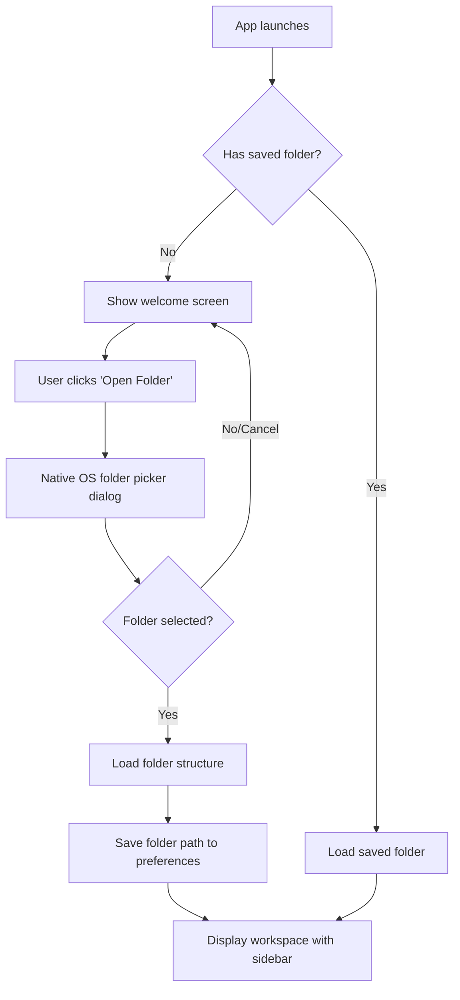
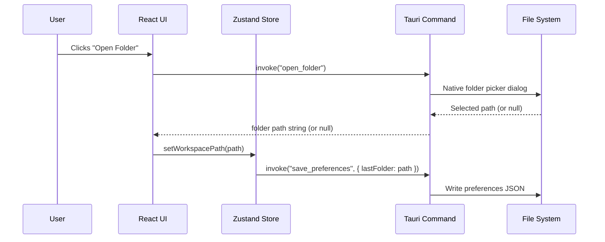

# Feature: Open Folder

## What

Enable users to select and open a local folder containing markdown documentation files. When opening a folder, Episteme loads the folder's file structure into memory and makes it the active workspace. Users can open any folder on their local machine that contains markdown files, whether it's a git repository or just a regular folder.

The open folder functionality is the entry point to working with documents in Episteme. After opening a folder, users can browse files in the sidebar, view documents, and (in future features) begin authoring and reviewing.

## Why

Users need a simple way to point Episteme at their documentation. Unlike cloud-based document tools where you're locked into a proprietary storage system, Episteme works with folders and files users already have on their computer. This means users maintain full control and ownership of their documents—they can edit files in any text editor, use git for version control, and organize folders however they want.

By starting with "open folder," users can immediately use Episteme with existing documentation without migration, import, or setup complexity.

## Personas

1. **Patricia: Product Manager** - Opens folders to access and create product descriptions
2. **Eric: Engineer** - Opens folders to work on technical design documents
3. **Raquel: Reviewer** - Opens folders to review team documents
4. **Aaron: Approver** - Opens folders to review documents for approval
5. **Olivia: Operations Lead** - Opens folders to maintain SOPs and process documentation

## Narratives

### Opening a documentation folder

Patricia launches Episteme for the first time. The app displays a welcome screen with a prominent "Open Folder" button. She clicks it, and the system's native folder picker dialog appears. Patricia navigates to her team's documentation repository at `/Users/patricia/work/team-docs` and selects it.

Episteme loads the folder structure, and Patricia sees the sidebar populate with her team's documentation files organized by project. The app remembers this as her active workspace, so next time she launches Episteme, it automatically opens to this folder.

## User stories

**From narrative: Opening a documentation folder**
- User can click "Open Folder" button from welcome screen
- User sees native OS folder picker dialog
- User can navigate filesystem and select any folder
- User sees confirmation when folder is loaded
- App remembers last opened folder and reopens it on launch
- User can open different folder from menu or keyboard shortcut

## Goals

- Users can open any folder on their filesystem
- Folder selection uses native OS dialog (feels native, not like a web app)
- Last opened folder is remembered across app launches
- Opening a folder completes in under 2 seconds for typical documentation repos (< 1000 files)

## Non-goals

- Opening multiple folders simultaneously (single folder workspace for now)
- Git repository validation (works with any folder, git not required)
- Remote folder support (network drives, cloud storage)
- Folder watching for external changes (future feature)

## Testing requirements

### Unit tests (Vitest)
- Tauri `open_folder` command returns correct path when folder selected
- Tauri `open_folder` command returns null/empty when dialog cancelled
- Zustand workspace store updates state when folder is opened
- Zustand workspace store persists last opened folder path
- Zustand workspace store loads persisted folder on initialization
- Welcome screen component renders "Open Folder" button
- Welcome screen component calls open folder handler on button click

### Integration tests (Vitest)
- Open folder flow: dialog → Tauri command → store update → UI update
- Persistence flow: open folder → close app → reopen → folder restored
- Error handling: invalid folder path → graceful error message

### E2E tests (Playwright)
- Welcome screen displays when no folder is open
- Click "Open Folder" triggers native dialog (verify dialog appears)
- After opening folder, welcome screen is replaced with workspace view
- App remembers folder after restart
- Menu item / keyboard shortcut opens folder picker

### Acceptance criteria
- All unit tests pass with 100% coverage on new code
- Integration tests cover happy path and error cases
- E2E tests verify the complete user flow
- No regressions in baseline app tests

## Design spec

### User flow



### UI components

#### Welcome screen
- Centered vertically and horizontally in main window
- App logo/name at top ("Episteme")
- Brief tagline ("Open a folder to get started")
- Primary "Open Folder" button (`bg-blue-600 hover:bg-blue-700 text-white px-6 py-3 rounded-lg text-lg`)
- Below button: "or drag a folder here" hint text in `text-gray-400 text-sm`
- Clean, minimal design with `bg-gray-50 dark:bg-gray-900` background

#### Loading state
- Replace welcome screen content with spinner/loading indicator
- Text: "Loading folder..." in `text-gray-600`
- Appears briefly while folder structure is read from disk

#### Error state
- If folder cannot be read, show inline error below button
- Red text: `text-red-600 text-sm`
- Message: "Could not open folder. Please check permissions and try again."

## Tech spec

### Introduction and overview

**Prerequisites:** Feature: Baseline App, ADR-001 (Tauri), ADR-003 (Zustand), ADR-006 (Zod)

**Depends on:** feature-baseline-app

**Goals:**
- Tauri command to open native folder picker and return selected path
- Zustand store to manage workspace state (current folder path)
- Persist last opened folder to local preferences file
- Welcome screen component with "Open Folder" button
- Folder loads in under 2 seconds for repos with < 1000 files

**Non-goals:**
- Multi-folder workspaces
- Git repository detection
- File watching

### System design and architecture



**Component breakdown:**
- `WelcomeScreen.tsx` - Displayed when no folder is open
- `src/stores/workspace.ts` - Zustand store for workspace state
- `src-tauri/src/commands/folder.rs` - Tauri commands for folder operations
- `src-tauri/src/commands/preferences.rs` - Tauri commands for preferences

### Detailed design

**Tauri commands (Rust):**

```rust
// Open native folder picker, returns Option<String>
#[tauri::command]
async fn open_folder() -> Result<Option<String>, String>

// Save preferences to local JSON file
#[tauri::command]
async fn save_preferences(preferences: Preferences) -> Result<(), String>

// Load preferences from local JSON file
#[tauri::command]
async fn load_preferences() -> Result<Preferences, String>
```

**Preferences schema (Zod + Rust):**

```typescript
// Frontend validation
const PreferencesSchema = z.object({
  lastOpenedFolder: z.string().nullable(),
});
type Preferences = z.infer<typeof PreferencesSchema>;
```

```rust
// Backend struct
#[derive(Serialize, Deserialize)]
struct Preferences {
    last_opened_folder: Option<String>,
}
```

**Preferences storage location:**
- macOS: `~/Library/Application Support/com.episteme.app/preferences.json`
- Use Tauri's `app_data_dir()` API

**Zustand store:**

```typescript
interface WorkspaceStore {
  folderPath: string | null;
  isLoading: boolean;
  error: string | null;
  openFolder: () => Promise<void>;
  loadSavedFolder: () => Promise<void>;
}
```

### Security, privacy, and compliance

**Input validation:**
- Validate folder path exists and is readable before accepting
- Validate preferences JSON with Zod before trusting
- Sanitize folder path to prevent path traversal in display

### Testing plan

See Testing requirements section above for detailed test cases.

### Risks

- **Tauri dialog API**: Folder picker is OS-native; behavior may vary. Mitigation: test on macOS, document known quirks.
- **Preferences file corruption**: If JSON is malformed, app should handle gracefully. Mitigation: wrap in try/catch, reset to defaults on parse failure.

## Task list

- [x] **Story: Tauri folder commands**
  - [x] **Task: Implement `open_folder` Tauri command**
    - **Description**: Create Rust command that opens a native folder picker dialog and returns the selected path (or null if cancelled)
    - **Acceptance criteria**:
      - [x] Command defined in `src-tauri/src/commands/folder.rs`
      - [x] Command registered in Tauri app builder
      - [x] Returns `Ok(Some(path))` when folder selected
      - [x] Returns `Ok(None)` when dialog cancelled
      - [x] Uses Tauri's `dialog` API for native picker
      - [x] Tauri capabilities updated to allow dialog access
    - **Dependencies**: Feature: Baseline App complete
  - [x] **Task: Implement preferences commands**
    - **Description**: Create Rust commands to save and load preferences JSON file using Tauri's app data directory
    - **Acceptance criteria**:
      - [x] `save_preferences` command writes JSON to `app_data_dir/preferences.json`
      - [x] `load_preferences` command reads and parses JSON
      - [x] `load_preferences` returns defaults if file doesn't exist
      - [x] `load_preferences` returns defaults if JSON is malformed
      - [x] Preferences struct includes `last_opened_folder: Option<String>`
    - **Dependencies**: Feature: Baseline App complete
- [x] **Story: Workspace state management**
  - [x] **Task: Create workspace Zustand store**
    - **Description**: Create Zustand store at `src/stores/workspace.ts` that manages the current folder path, loading state, and error state
    - **Acceptance criteria**:
      - [x] Store exports `useWorkspaceStore` hook
      - [x] Store has `folderPath`, `isLoading`, `error` state
      - [x] `openFolder()` action invokes Tauri `open_folder` command
      - [x] `openFolder()` saves path to preferences on success
      - [x] `loadSavedFolder()` action loads from preferences on app start
      - [x] Unit tests cover all store actions and state transitions
    - **Dependencies**: "Task: Implement `open_folder` Tauri command", "Task: Implement preferences commands"
  - [x] **Task: Create Zod schema for preferences**
    - **Description**: Create Zod validation schema for preferences data at `src/lib/preferences.ts`
    - **Acceptance criteria**:
      - [x] `PreferencesSchema` validates preferences shape
      - [x] Invalid data returns safe defaults instead of crashing
      - [x] TypeScript type inferred from schema
      - [x] Unit tests cover valid and invalid input
    - **Dependencies**: Feature: Baseline App complete
- [x] **Story: Welcome screen UI**
  - [x] **Task: Create WelcomeScreen component**
    - **Description**: Create React component displayed when no folder is open, with centered layout, app name, tagline, and "Open Folder" button
    - **Acceptance criteria**:
      - [x] Component at `src/components/WelcomeScreen.tsx`
      - [x] Displays "Episteme" title and tagline
      - [x] Primary "Open Folder" button styled per design spec
      - [x] Button calls `openFolder()` from workspace store
      - [x] Centered vertically and horizontally
      - [x] Unit test verifies render and button click handler
    - **Dependencies**: "Task: Create workspace Zustand store"
  - [x] **Task: Create App layout with conditional rendering**
    - **Description**: Update `App.tsx` to show WelcomeScreen when no folder is open, or workspace layout when folder is loaded
    - **Acceptance criteria**:
      - [x] App shows WelcomeScreen when `folderPath` is null
      - [x] App shows workspace layout when `folderPath` is set
      - [x] App calls `loadSavedFolder()` on mount
      - [x] Loading state shows loading indicator
      - [x] Error state shows error message (displayed in WelcomeScreen)
      - [x] Unit test verifies conditional rendering
    - **Dependencies**: "Task: Create WelcomeScreen component"
- [x] **Story: Open folder tests**
  - [x] **Task: Write integration tests for open folder flow**
    - **Description**: Create integration tests that verify the complete open folder flow from button click through store update
    - **Acceptance criteria**:
      - [x] Test mocks Tauri commands appropriately
      - [x] Test covers: click button → dialog opens → path returned → store updated → UI updates
      - [x] Test covers: dialog cancelled → store unchanged
      - [x] Test covers: error case → error displayed
      - [x] All tests pass
    - **Dependencies**: "Task: Create App layout with conditional rendering"
  - [x] **Task: Write E2E tests for open folder**
    - **Description**: Create Playwright E2E tests for the open folder workflow
    - **Acceptance criteria**:
      - [x] Test verifies welcome screen displays on first launch
      - [x] Test verifies "Open Folder" button is visible and clickable
      - [x] Test verifies app remembers folder after restart (not feasible in browser-only E2E — tested in integration tests)
      - [x] All tests pass
    - **Dependencies**: "Task: Write integration tests for open folder flow"
