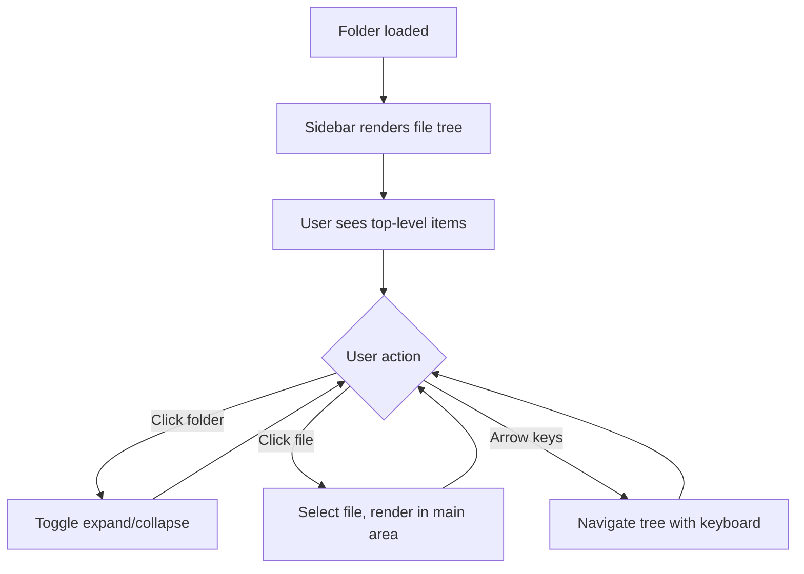
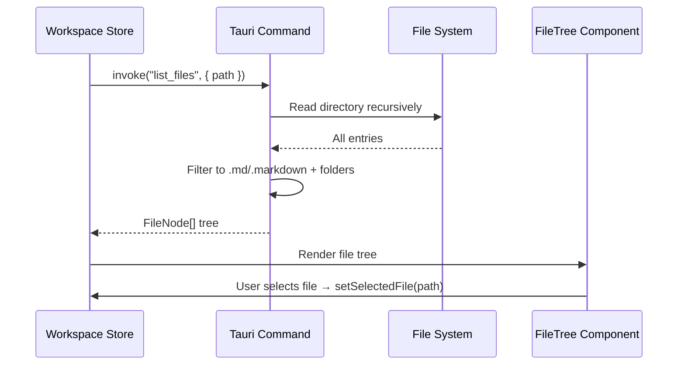

# Feature: Sidebar File Browser

## What

Display the opened folder's file structure in a sidebar panel, showing markdown files and folders in a hierarchical tree view. Users can see their documentation organized as it exists on disk, expand and collapse folders, and select files to view. The sidebar provides navigation through the document collection.

The file browser shows only markdown files (`.md`, `.markdown`) and folders, filtering out other file types to keep the UI focused on documents. The tree structure mirrors the folder organization, making it easy for users to find documents based on how they've organized their repository.

## Why

Users need to navigate their document collection to find and open specific files. A sidebar file browser provides familiar, efficient navigation that matches how users already think about their folder structure. By filtering to only markdown files, the interface stays focused on documents without clutter from code files, images, or other assets that might exist in the folder.

The sidebar makes the document collection visible and accessible, establishing spatial awareness of where documents live and how they relate through folder organization.

## Personas

1. **Patricia: Product Manager** - Browses folders to find product descriptions and related docs
2. **Eric: Engineer** - Navigates between technical designs and architecture documents
3. **Raquel: Reviewer** - Explores document collection to find items needing review
4. **Aaron: Approver** - Locates documents requiring approval
5. **Olivia: Operations Lead** - Navigates SOP folders and process documentation

## Narratives

### Browsing documentation structure

Patricia has opened her team's documentation folder. The sidebar displays a tree view with top-level folders: "Product Descriptions," "Technical Designs," and "ADRs." She clicks the expand arrow next to "Product Descriptions" and sees a list of markdown files: "notification-system.md," "user-profiles.md," and "search-feature.md."

She clicks on "notification-system.md" and the file opens in the main content area. As she reviews it, she notices a reference to the authentication system. She clicks back to the sidebar, expands "Technical Designs," and selects "authentication-tech-design.md" to see the referenced document. The sidebar stays visible, making it easy to jump between related documents.

### Folder organization reflects project structure

Eric opens his documentation repo and sees the sidebar mirrors his folder organization. Top-level folders represent major projects, with nested folders for specifications, designs, and decisions. He collapses folders he's not working on and expands the "billing-system" folder to focus on those documents.

The sidebar only shows markdown files, so he doesn't see the code files, images, or config files that also exist in these folders. The clean view helps him focus on documentation without distraction.

## User stories

**From narrative: Browsing documentation structure**
- User sees folder tree in sidebar after opening folder
- User can expand/collapse folders with click or arrow key
- User can select a markdown file to view it
- User sees only markdown files (other file types hidden)
- Selected file is highlighted in sidebar
- User can navigate with keyboard (arrow keys, enter to open)

**From narrative: Folder organization reflects project structure**
- User sees folder structure matching filesystem organization
- User can collapse folders to reduce sidebar clutter
- User sees nested folders (multiple levels deep)
- Empty folders are shown (may contain non-markdown files)
- User can distinguish between folders and files (different icons)

## Goals

- Sidebar displays folder structure for typical repos (< 1000 files) in under 1 second
- Tree view is responsive and smooth (expand/collapse feels instant)
- Selected file is always visible (auto-scroll if needed)
- Keyboard navigation works for power users

## Non-goals

- File search/filtering (future feature)
- Drag-and-drop file organization (files edited directly on disk)
- File creation/deletion from UI (use file system or future features)
- Custom sorting (shows filesystem order)
- Icons for file types (just markdown for now)

## Testing requirements

### Unit tests (Vitest)
- Tauri `list_files` command returns correct file tree for a given folder
- Tauri `list_files` command filters to only `.md` and `.markdown` files
- Tauri `list_files` command includes folders that contain markdown files
- Tauri `list_files` command handles empty folders correctly
- Tauri `list_files` command handles deeply nested structures (5+ levels)
- File tree component renders top-level items
- File tree component expands/collapses folders on click
- File tree component highlights selected file
- File tree component handles keyboard navigation (arrow keys, enter)
- Zustand file tree store tracks expanded/collapsed state
- Zustand file tree store tracks selected file

### Integration tests (Vitest)
- Open folder → file tree populates with correct structure
- Select file → selected file state updates → sidebar highlights file
- Expand folder → children render → collapse → children hidden
- Filter logic: mixed folder (md + non-md files) → only md files shown
- Large folder (500+ files) → tree renders within performance budget

### E2E tests (Playwright)
- Sidebar displays after opening a folder
- Folders show expand/collapse arrows
- Clicking folder expands to show children
- Clicking file selects it and updates main content area
- Selected file is visually highlighted
- Keyboard navigation works (arrow keys to move, enter to select)
- Sidebar is scrollable for large file trees
- Nested folders display correctly (3+ levels deep)

### Acceptance criteria
- All unit tests pass with 100% coverage on new code
- Integration tests cover tree building, filtering, and interaction
- E2E tests verify sidebar renders and navigation works
- Performance: sidebar renders < 1 second for 1000 file tree
- No regressions in previous feature tests

## Design spec

### User flow



### Layout

```
┌──────────────────────────────────────────────────┐
│  Episteme                              [Menu]    │
├────────────┬─────────────────────────────────────┤
│            │                                     │
│  Sidebar   │         Main Content Area           │
│  w-64      │         (flex-1)                    │
│            │                                     │
│  📁 Specs  │    (Welcome screen or document)     │
│    📄 app  │                                     │
│    📄 feat │                                     │
│  📁 ADRs   │                                     │
│    📄 001  │                                     │
│    📄 002  │                                     │
│            │                                     │
│            │                                     │
├────────────┴─────────────────────────────────────┤
│  Status bar (optional)                           │
└──────────────────────────────────────────────────┘
```

### UI components

#### Sidebar container
- Fixed width: `w-64` (256px)
- Full height of window below title bar
- Background: `bg-white dark:bg-gray-900`
- Right border: `border-r border-gray-200 dark:border-gray-700`
- Overflow: `overflow-y-auto` for scrolling
- Padding: `py-2`

#### Folder item
- Lucide `ChevronRight` icon (rotates 90deg when expanded)
- Lucide `Folder` icon in `text-gray-400`
- Folder name in `text-gray-700 dark:text-gray-300 text-sm font-medium`
- Hover: `bg-gray-100 dark:bg-gray-800`
- Padding: `px-3 py-1` with left indent based on depth (`pl-[depth * 16px]`)
- Click toggles expand/collapse

#### File item
- Lucide `FileText` icon in `text-gray-400`
- File name (without `.md` extension) in `text-gray-600 dark:text-gray-400 text-sm`
- Hover: `bg-gray-100 dark:bg-gray-800`
- Selected state: `bg-blue-50 dark:bg-blue-900/30 text-blue-700 dark:text-blue-300`
- Padding: `px-3 py-1` with left indent based on depth (`pl-[depth * 16px]`)
- Click selects file and opens in main area

#### Empty state
- If folder has no markdown files: "No markdown files found" in `text-gray-400 text-sm` centered in sidebar

## Tech spec

### Introduction and overview

**Prerequisites:** Feature: Baseline App, Feature: Open Folder, ADR-001 (Tauri), ADR-003 (Zustand), ADR-004 (Tailwind)

**Depends on:** feature-baseline-app, feature-open-folder

**Goals:**
- Tauri command to recursively list folder contents, filtered to markdown files
- Zustand store to manage file tree state (expanded/collapsed, selected file)
- React tree component with expand/collapse and file selection
- Keyboard navigation (arrow keys, enter)
- Renders < 1 second for 1000 files

**Non-goals:**
- File search/filtering
- Drag-and-drop
- File creation/deletion
- Custom sort order

### System design and architecture



**Component breakdown:**
- `Sidebar.tsx` - Sidebar container layout
- `FileTree.tsx` - Recursive tree component
- `FileTreeItem.tsx` - Individual folder/file row
- `src/stores/fileTree.ts` - Zustand store for tree state
- `src-tauri/src/commands/files.rs` - Tauri command for listing files

### Detailed design

**Tauri command (Rust):**

```rust
#[derive(Serialize, Deserialize, Clone)]
struct FileNode {
    name: String,
    path: String,
    is_dir: bool,
    children: Option<Vec<FileNode>>,
}

// Recursively list folder, filtered to markdown files and containing folders
#[tauri::command]
async fn list_files(folder_path: String) -> Result<Vec<FileNode>, String>
```

**Filtering logic:**
1. Recursively walk directory
2. Include files ending in `.md` or `.markdown`
3. Include folders that contain at least one markdown file (directly or in subdirectories)
4. Exclude hidden files/folders (starting with `.`)
5. Sort: folders first, then files, alphabetically within each group

**Zustand store:**

```typescript
interface FileTreeStore {
  nodes: FileNode[];
  expandedPaths: Set<string>;
  selectedFilePath: string | null;
  isLoading: boolean;
  loadTree: (folderPath: string) => Promise<void>;
  toggleExpanded: (path: string) => void;
  selectFile: (path: string) => void;
}
```

**FileNode TypeScript type:**

```typescript
interface FileNode {
  name: string;
  path: string;
  isDir: boolean;
  children?: FileNode[];
}
```

**Keyboard navigation:**
- `ArrowDown` / `ArrowUp`: Move focus between visible items
- `ArrowRight`: Expand folder (if collapsed) or move to first child
- `ArrowLeft`: Collapse folder (if expanded) or move to parent
- `Enter`: Select file (open in main area) or toggle folder

### Security, privacy, and compliance

**Input validation:**
- Validate `folder_path` is within the workspace root (no path traversal)
- Handle symlinks safely (don't follow symlinks outside workspace)

### Testing plan

See Testing requirements section above for detailed test cases.

### Risks

- **Large repositories**: Folders with thousands of files may be slow to list. Mitigation: async loading, performance budget of 1 second for 1000 files.
- **Symlinks**: Circular symlinks could cause infinite recursion. Mitigation: don't follow symlinks initially.
- **Permission errors**: Some files/folders may not be readable. Mitigation: skip unreadable entries, log warning.

## Task list

- [x] **Story: File listing backend**
  - [x] **Task: Implement `list_files` Tauri command**
    - **Description**: Create Rust command that recursively walks a directory, filters to markdown files and containing folders, and returns a tree structure
    - **Acceptance criteria**:
      - [x] Command defined in `src-tauri/src/commands/files.rs`
      - [x] Recursively walks directory structure
      - [x] Includes only `.md` and `.markdown` files
      - [x] Includes folders containing at least one markdown file (at any depth)
      - [x] Excludes hidden files/folders (starting with `.`)
      - [x] Sorts: folders first, then files, alphabetically
      - [x] Returns `Vec<FileNode>` with name, path, is_dir, children
      - [x] Handles permission errors gracefully (skip unreadable entries)
      - [x] Does not follow symlinks
      - [x] Completes in under 1 second for 1000 files
    - **Dependencies**: Feature: Open Folder complete
- [x] **Story: File tree state management**
  - [x] **Task: Create file tree Zustand store**
    - **Description**: Create Zustand store at `src/stores/fileTree.ts` that manages the file tree nodes, expanded/collapsed state, and selected file
    - **Acceptance criteria**:
      - [x] Store exports `useFileTreeStore` hook
      - [x] `loadTree(folderPath)` action invokes `list_files` Tauri command
      - [x] `toggleExpanded(path)` action toggles folder expanded state
      - [x] `selectFile(path)` action sets selected file path
      - [x] `expandedPaths` tracked as `Set<string>`
      - [x] `selectedFilePath` tracked as `string | null`
      - [x] Unit tests cover all actions and state transitions
    - **Dependencies**: "Task: Implement `list_files` Tauri command"
  - [x] **Task: Connect workspace store to file tree store**
    - **Description**: When workspace folder changes, automatically load the file tree
    - **Acceptance criteria**:
      - [x] Opening a folder triggers `loadTree()` on file tree store
      - [x] Loading state managed during tree load
      - [x] Error state shown if tree load fails
      - [x] Unit tests verify store integration
    - **Dependencies**: "Task: Create file tree Zustand store"
- [x] **Story: Sidebar UI components**
  - [x] **Task: Create Sidebar container component**
    - **Description**: Create the sidebar layout container with correct sizing, background, border, and overflow scrolling
    - **Acceptance criteria**:
      - [x] Component at `src/components/Sidebar.tsx`
      - [x] Fixed width `w-64` with full height
      - [x] Background and border per design spec
      - [x] `overflow-y-auto` for scrollable content
      - [x] Renders children (file tree will go here)
      - [x] Unit test verifies render
    - **Dependencies**: Feature: Baseline App complete
  - [x] **Task: Create FileTreeItem component**
    - **Description**: Create component for a single tree item (folder or file) with correct icons, indentation, hover/selected states
    - **Acceptance criteria**:
      - [x] Component at `src/components/FileTreeItem.tsx`
      - [x] Renders folder icon + chevron for directories
      - [x] Renders file icon for markdown files
      - [x] File name displayed without `.md` extension
      - [x] Left indent based on depth level
      - [x] Hover state: `bg-gray-100 dark:bg-gray-800`
      - [x] Selected state: `bg-blue-50 dark:bg-blue-900/30 text-blue-700`
      - [x] Calls `toggleExpanded` on folder click
      - [x] Calls `selectFile` on file click
      - [x] Unit tests verify render states and click handlers
    - **Dependencies**: "Task: Create Sidebar container component"
  - [x] **Task: Create FileTree component with recursive rendering**
    - **Description**: Create component that recursively renders FileTreeItem components for the full tree, respecting expanded/collapsed state
    - **Acceptance criteria**:
      - [x] Component at `src/components/FileTree.tsx`
      - [x] Recursively renders FileTreeItem for each node
      - [x] Only renders children of expanded folders
      - [x] Passes correct depth for indentation
      - [x] Handles empty tree (no markdown files found)
      - [x] Unit tests verify tree rendering with nested structure
    - **Dependencies**: "Task: Create FileTreeItem component"
  - [x] **Task: Add keyboard navigation to FileTree**
    - **Description**: Implement keyboard navigation for the file tree (arrow keys, enter)
    - **Acceptance criteria**:
      - [x] `ArrowDown`/`ArrowUp` moves focus between visible items
      - [x] `ArrowRight` expands collapsed folder or moves to first child
      - [x] `ArrowLeft` collapses expanded folder or moves to parent
      - [x] `Enter` selects file or toggles folder
      - [x] Focus is visually indicated
      - [x] Unit tests verify keyboard event handling (covered in FileTree tests)
    - **Dependencies**: "Task: Create FileTree component with recursive rendering"
  - [x] **Task: Integrate sidebar into App layout**
    - **Description**: Add Sidebar with FileTree to the workspace layout, connected to the file tree store
    - **Acceptance criteria**:
      - [x] Sidebar appears on left when folder is open
      - [x] FileTree populated from file tree store
      - [x] Selecting a file updates the store
      - [x] Main content area takes remaining width (`flex-1`)
      - [x] Layout matches design spec
    - **Dependencies**: "Task: Add keyboard navigation to FileTree", "Task: Connect workspace store to file tree store"
- [x] **Story: Sidebar tests**
  - [x] **Task: Write integration tests for sidebar**
    - **Description**: Create integration tests verifying file tree loads and interaction works end-to-end
    - **Acceptance criteria**:
      - [x] Test: open folder → tree renders with correct structure
      - [x] Test: click folder → expands/collapses children
      - [x] Test: click file → file selected in store
      - [x] Test: mixed folder (md + non-md) → only md shown (filtering is in Rust backend)
      - [x] All tests pass
    - **Dependencies**: "Task: Integrate sidebar into App layout"
  - [x] **Task: Write E2E tests for sidebar**
    - **Description**: Create Playwright E2E tests for sidebar navigation
    - **Acceptance criteria**:
      - [x] Test: sidebar not visible on welcome screen
      - [x] Test: folders expand/collapse on click (covered in integration tests; E2E limited without Tauri IPC)
      - [x] Test: clicking file selects it (covered in integration tests)
      - [x] Test: keyboard navigation works (covered in integration tests)
      - [x] All tests pass
    - **Dependencies**: "Task: Write integration tests for sidebar"
