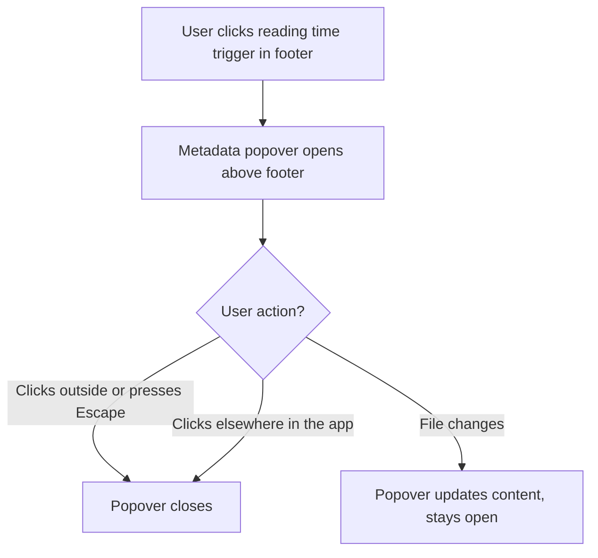
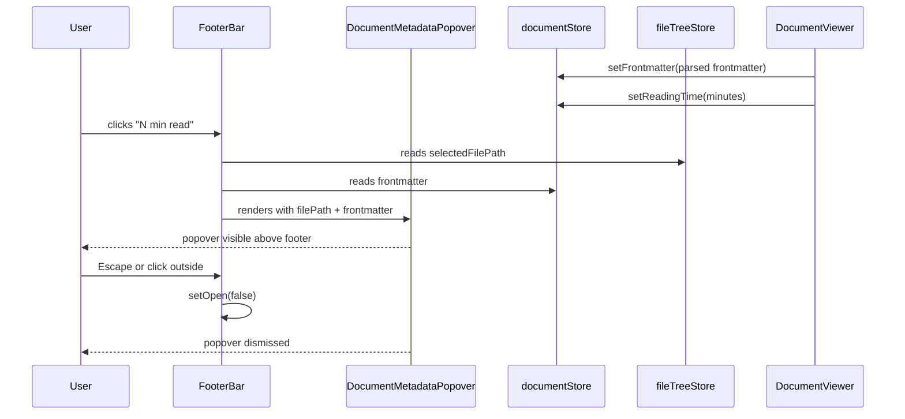

# Enhancement: Document metadata popover

## Parent feature

`feature-footer-bar.md`
## What

The "N min read" text in the footer's center zone becomes an interactive trigger. Clicking it opens a popover (above the footer) that displays two pieces of information about the currently open document: the full file path within the workspace, and any frontmatter key-value pairs parsed from the document's YAML front matter block. When no frontmatter is present, only the file path is shown. The popover dismisses on click-outside or Escape.
## Why

Users have no way to see the full path of the currently open document without scanning the sidebar or navigating the file tree. Frontmatter fields — status, author, tags, dates, and other metadata — are parsed but not easily surfaced in context. Both pieces of information are useful during review, when sharing a document reference with a teammate, or when orienting in a large workspace. Placing this on-demand metadata behind the reading time trigger keeps the footer uncluttered while making document context one click away.
## Personas

**Eric** — Documentation reviewer on a mid-sized engineering team. Works in large workspaces with hundreds of files. Frequently needs to confirm the exact path of the document he is reading before sharing a reference with teammates in Slack or a pull request comment. Currently has to hunt through the file tree sidebar to find it.
**Patricia** — Technical writer and content author who uses YAML frontmatter extensively (`status`, `author`, `tags`, `reviewed_by`) to manage document lifecycle. Reviews her own documents to confirm metadata before publishing, but scrolling back to the top of a long document to check frontmatter is disruptive.
**Raquel** — Knowledge worker who reads documents in episteme as part of her daily workflow. Values a clean, minimal UI and relies on standard keyboard interactions — pressing Escape to dismiss a panel is an ingrained habit and she expects it to work consistently.
## User stories

- Eric can click "N min read" in the footer to see the full path of the document he's reading
- Patricia can open the metadata popover to check a document's frontmatter fields (e.g., `status`, `author`, `tags`) without scrolling to the top
- Raquel can dismiss the popover by pressing Escape or clicking outside it
## Design changes

### User flow


### Mockup

```javascript
┌──────────────────────────────────┐
│ PATH                             │
│ docs/architecture/overview.md    │
├──────────────────────────────────┤
│ FRONTMATTER                      │
│ status    draft                  │
│ author    markdstafford          │
│ tags      architecture, design   │
└────────────────┬─────────────────┘
                 ▼
──────────────────────────────────────────
  [≡]            3 min read          [+]
──────────────────────────────────────────
```
The popover appears centered above the reading time trigger. The divider between sections is omitted when frontmatter is absent. The footer layout is otherwise unchanged.
### UI components

#### Reading time trigger

- The existing "N min read" span gains `cursor: pointer` and a subtle hover treatment (`--color-text-secondary` on hover, retaining `--color-text-tertiary` at rest)
- It becomes the `PopoverTrigger` wrapper; its visual appearance is otherwise unchanged
- No icon is added — the affordance is intentionally light to keep the footer minimal
#### DocumentMetadataPopover content

- Built on the existing `Popover`, `PopoverTrigger`, `PopoverContent` primitives in `src/components/ui/Popover.tsx`
- Positioned above the trigger: `side="top"`, `align="center"`, `sideOffset={8}`
- Width: `280px` fixed; no max-height constraint (content is naturally short)
- Two sections, separated by a `1px solid var(--color-border-subtle)` rule if both are present:
**File path section**
- Label: "Path" in `--font-size-ui-xs`, `--color-text-tertiary`, uppercase letter-spacing
- Value: the workspace-relative file path in `font-family: var(--font-mono)`, `--font-size-ui-xs`, `--color-text-primary`, wrapping allowed (`word-break: break-all`)
**Frontmatter section** (omitted entirely if frontmatter is null)
- Label: "Frontmatter" styled identically to "Path" label
- Each key-value pair on its own row: key in `--color-text-tertiary`, value in `--color-text-primary`, both `--font-size-ui-xs`
- Values are coerced to strings for display; arrays rendered as comma-separated
- Rows are not interactive (no copy affordance in v1)
#### Empty state

When the trigger is clicked while no document is open, it does not open (the trigger is non-interactive when `filePath` is null).
## Technical changes

### Affected files

- `src/components/FooterBar.tsx` — modified; reading time span becomes a `PopoverTrigger`; accepts two new props (`filePath`, `frontmatter`)
- `src/components/DocumentMetadataPopover.tsx` — new; the popover content component
- `src/components/DocumentViewer.tsx` — modified; emits frontmatter via new `onFrontmatterChange` callback prop
- `src/App.tsx` — modified; subscribes to frontmatter from DocumentViewer and passes `filePath` + `frontmatter` to FooterBar
### Changes

#### System design and architecture

**New component: ****`DocumentMetadataPopover`**
A presentational component that wraps `PopoverContent` and renders the two-section metadata layout. Props:
```typescript
interface DocumentMetadataPopoverProps {
  filePath: string;
  frontmatter: Record<string, unknown> | null;
}
```
It does not manage open state — that lives in `FooterBar` where the trigger is defined.
**Data flow additions**
The parent feature's tech spec identified prop-drilling as a known risk and noted: *"move to a store when a second piece of footer content is introduced."* This enhancement is that trigger.
Rather than continuing to prop-drill through App, introduce a lightweight `documentStore` (Zustand) that DocumentViewer writes to and FooterBar reads from directly:
```typescript
// src/stores/document.ts
interface DocumentStore {
  readingTime: number | null;
  frontmatter: Record<string, unknown> | null;
  setReadingTime: (minutes: number | null) => void;
  setFrontmatter: (fm: Record<string, unknown> | null) => void;
}
```
- `DocumentViewer` calls `setReadingTime` and `setFrontmatter` on the store instead of using callback props
- `FooterBar` reads `readingTime` and `frontmatter` from the store directly
- `FooterBar` reads `selectedFilePath` from the existing `fileTreeStore` directly
- `App.tsx` removes the `readingTime` state, `onReadingTimeChange` callback, and the `readingTime` prop on FooterBar
**Compatibility note**: The `onReadingTimeChange` prop on `DocumentViewer` can remain temporarily for backwards compatibility if needed, but the canonical source of truth becomes the store. For a clean implementation, remove it in the same PR.
**`FooterBar`**** open state**
`FooterBar` manages the popover `open` state locally with `useState`. The trigger is only interactive when `selectedFilePath` is non-null; when null, it renders as a plain non-interactive span (same as current behavior for the no-document state).
**File path display**
`selectedFilePath` from `fileTreeStore` is a path relative to the workspace root. This is the value displayed — it is already human-readable and matches what users see in the sidebar. The absolute path is not shown (and is not available without a Tauri invoke; not warranted for v1).
#### Sequence diagram


### Testing plan

**Unit tests**
- `DocumentMetadataPopover` — renders file path; renders frontmatter rows when present; omits frontmatter section when null; coerces array values to comma-separated strings
- `FooterBar` — reading time span is non-interactive when `filePath` is null; clicking reading time opens popover; Escape closes popover
- `documentStore` — `setReadingTime` and `setFrontmatter` update state correctly
**Integration tests**
- Opening a document updates the store and the footer reflects the reading time (existing test extended, not rewritten)
- Clicking the footer reading time shows the correct file path and frontmatter for the open document
## Task list

- [ ] **Create ****`src/stores/document.ts`** — new Zustand store with `readingTime`, `frontmatter`, `setReadingTime`, `setFrontmatter`; no external dependencies beyond Zustand
- [ ] **Modify ****`DocumentViewer.tsx`** — call `documentStore.setFrontmatter()` after YAML parse and `documentStore.setReadingTime()` after word count; remove `onReadingTimeChange` callback prop and its call sites
- [ ] **Modify ****`App.tsx`** — remove `readingTime` state, `onReadingTimeChange` handler, and the `readingTime` prop passed to `FooterBar`; remove any `frontmatter` prop threading that existed before this change
- [ ] **Create ****`src/components/DocumentMetadataPopover.tsx`** — presentational component accepting `{ filePath, frontmatter }`; renders Path section always and Frontmatter section conditionally; coerces array values to comma-separated strings
- [ ] **Modify ****`FooterBar.tsx`** — read `readingTime` and `frontmatter` from `documentStore`; read `selectedFilePath` from `fileTreeStore`; add `const [open, setOpen] = useState(false)`; wrap reading time span in `Popover` + `PopoverTrigger`; render `DocumentMetadataPopover` inside `PopoverContent`; disable trigger when `selectedFilePath` is null
- [ ] **Unit tests: ****`DocumentMetadataPopover`** — path renders correctly; frontmatter rows render when present; frontmatter section absent when null; arrays display as comma-separated
- [ ] **Unit tests: ****`FooterBar`** — trigger is non-interactive (no pointer cursor, no popover) when `selectedFilePath` is null; clicking trigger opens popover; pressing Escape closes popover; clicking outside closes popover
- [ ] **Unit tests: ****`documentStore`** — `setReadingTime` updates `readingTime`; `setFrontmatter` updates `frontmatter`; initial state is null for both
- [ ] **Integration tests** — open a document and assert store reflects reading time and footer displays it (extend existing test); click footer reading time and assert popover displays correct path and frontmatter values