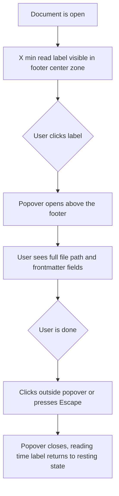

# Enhancement: Footer file info popover

## Parent feature

[`feature-footer-bar.md`](.eng-docs/specs/feature-footer-bar.md)
## What

The "X min read" label in the footer center zone becomes an interactive trigger. When clicked, a popover opens above the footer showing two pieces of information about the currently open document: the full file path and all frontmatter fields. When no document is open, the center zone remains empty and non-interactive, unchanged from current behavior. The popover is dismissed by clicking outside it or pressing Escape.
## Why

There is currently no way to see the full path to an open file in Episteme. The sidebar shows filenames, but the complete path — needed to reference a file in a terminal command, share its location with a colleague, or confirm you're looking at the right document — is invisible from the UI. Frontmatter fields are shown in the FrontmatterBar above the document content, but that bar scrolls out of view as you read deeper into the file. Surfacing both pieces of information behind a click on the already-present reading time label fills these gaps without adding to the footer's visual footprint or requiring a new UI surface.
## Personas

**Eric** — Developer / Knowledge Worker
Eric uses Episteme as a technical knowledge base and frequently switches between the app and the terminal. He needs the full file path to reference documents in shell commands, share locations with colleagues, and confirm he's editing the right file. He doesn't want to leave the reader view to look up a path.
**Patricia** — Technical Reviewer
Patricia reviews documents across multiple repositories in Episteme. When reviewing a long document she needs to verify she's looking at the correct file and check its metadata (status, author, tags) without scrolling back to the top. She works methodically and values being able to confirm document identity at a glance at any point in her reading session.
## User stories

- Eric can click the reading time label to see the full file path of the currently open document
- Eric can see all frontmatter fields for the open document without scrolling back to the top of the document
- Patricia can verify she is reviewing the correct file by checking its path and metadata in the footer popover
## Design changes

### User flow

**ASCII art — annotated UI state when popover is open:**
```javascript
  ┌────────────────────────────────┐
  │ PATH                           │
  │ docs/engineering/api-spec.md   │
  ├────────────────────────────────┤
  │ FRONTMATTER                    │
  │ status   draft                 │
  │ author   markdstafford         │
  │ tags     design, api           │
  └────────────────────────────────┘
               ▲  24px offset
┌──────────────────────────────────────────┐
│  ‹ previous    [3 min read]    next ›    │
└──────────────────────────────────────────┘
                     ^
                  trigger
```
**Interaction flow:**

### Key UI components

#### Reading time trigger

Delta on current behavior: the "X min read" text label becomes a `PopoverTrigger` wrapping a `<button>` element when a document is open.
- Text: unchanged — `--font-size-ui-xs`, `--color-text-tertiary`
- Hover state: text color shifts to `--color-text-secondary`; `cursor: pointer`
- No background, border, or padding added — the trigger should look like text, not a button chip
- When no document is open: center zone remains empty (no trigger rendered)
#### FileInfoPopoverContent

A new component rendered inside the popover. Two sections separated by a 1px `--color-border-subtle` horizontal divider.
**Path section**
- Section label: "Path" — `--font-size-ui-xs`, weight 500, uppercase, letter-spacing 0.06em, `--color-text-tertiary`
- File path value: `--font-size-ui-xs`, `--font-mono`, `--color-text-secondary`
- `user-select: text` so the user can select and copy the path manually
- Long paths wrap with `word-break: break-all`
**Frontmatter section** (rendered only when the document has frontmatter fields beyond `doc_id`)
- Section label: "Frontmatter" — same label style as above
- Key/value pairs stacked vertically, `--space-2` (8px) gap between pairs
- Key: `--font-size-ui-xs`, weight 500, `--color-text-tertiary`
- Value: `--font-size-ui-xs`, `--color-text-secondary`, `user-select: text`
- Array values rendered as comma-separated strings
- `doc_id` field excluded — it is an internal implementation detail with no user-facing meaning
**Popover container**
- Width: 280px
- Padding: `--space-3` (12px)
- Background: `--color-bg-overlay`
- Border: 1px `--color-border-subtle`
- Radius: `--radius-lg` (8px)
- Shadow: `--shadow-base` (light mode); no shadow in dark mode (background contrast handles elevation)
- Positioned `side="top"`, `sideOffset={24}` — opens above the footer bar
## Technical changes

### Affected files

- `src/components/FooterBar.tsx` — add `filePath` and `frontmatter` props; wrap reading time label in Popover trigger
- `src/App.tsx` — add `frontmatter` state; pass `filePath` and `frontmatter` to `FooterBar`
- `src/components/DocumentViewer.tsx` — add `onFrontmatterChange` callback prop; emit frontmatter when it changes
New:
- `src/components/FileInfoPopoverContent.tsx` — displays file path and frontmatter in the popover body
### Changes

**DocumentViewer**
Add optional prop: `onFrontmatterChange?: (frontmatter: Record<string, unknown> | null) => void`
Call this callback in the same effect that calls `onReadingTimeChange`, passing the current `frontmatter` state. Call with `null` when no document is open. The callback is optional so existing call sites without it require no changes.
**App**
Add state: `frontmatter: Record<string, unknown> | null` (default `null`).
Pass `onFrontmatterChange={(fm) => setFrontmatter(fm)}` to `DocumentViewer`. Reset `frontmatter` to `null` when the selected file path changes (to prevent stale frontmatter displaying during the load of the next document).
Pass two new props to `FooterBar`:
- `filePath` — the currently selected file path, already held in App state
- `frontmatter` — the new state above
**FooterBar**
Add to `FooterBarProps`:
- `filePath: string | null`
- `frontmatter: Record<string, unknown> | null`
Reading time display changes:
- When `readingTime` is non-null: wrap existing label in `<Popover>` + `<PopoverTrigger asChild>` containing a `<button>`. Render `<PopoverContent side="top" sideOffset={24}>` with `<FileInfoPopoverContent filePath={filePath} frontmatter={frontmatter} />`.
- When `readingTime` is null: no change — center zone stays empty.
## Task list

- [x] **Story: Data plumbing**
	- [x] **Task: Add ****`onFrontmatterChange`**** callback to ****`DocumentViewer`**
		- **Description**: Add `onFrontmatterChange?: (frontmatter: Record<string, unknown> | null) => void` to `DocumentViewerProps`. Call it in the effect that fires when the document's frontmatter state changes — same trigger as `onReadingTimeChange`. Pass the current frontmatter object, or `null` when no document is open.
		- **Acceptance criteria**:
			- [x] Prop is optional; existing `DocumentViewer` call sites without it compile without error
			- [x] Callback fires with the frontmatter object when a document with frontmatter is opened
			- [x] Callback fires with `null` when no document is open
			- [x] Callback does not fire on every render — only when the frontmatter value changes
		- **Dependencies**: None
	- [x] **Task: Wire ****`frontmatter`**** and ****`filePath`**** through ****`App`**
		- **Description**: In `App.tsx`, add `frontmatter: Record<string, unknown> | null` state (default `null`). Pass `onFrontmatterChange={(fm) => setFrontmatter(fm)}` to `DocumentViewer`. Reset `frontmatter` to `null` when the selected file path changes (before the new document's frontmatter arrives). Pass `filePath` (currently selected file path from existing App state) and `frontmatter` as new props to `FooterBar`.
		- **Acceptance criteria**:
			- [x] `frontmatter` state initializes to `null`
			- [x] `frontmatter` updates when a document with frontmatter is opened
			- [x] `frontmatter` resets to `null` when the selected file changes, before the new document loads
			- [x] `filePath` passed to `FooterBar` matches the currently selected file path
			- [x] No TypeScript errors at `FooterBar` and `DocumentViewer` call sites
		- **Dependencies**: "Task: Add `onFrontmatterChange` callback to `DocumentViewer`"
- [x] **Story: FileInfoPopoverContent component**
	- [x] **Task: Build ****`FileInfoPopoverContent`**** component**
		- **Description**: Create `src/components/FileInfoPopoverContent.tsx`. Props: `filePath: string`, `frontmatter: Record<string, unknown> | null`. Render a Path section (label + monospace path value, `word-break: break-all`, `user-select: text`). If frontmatter is non-null and has keys other than `doc_id`, render a Frontmatter section separated from Path by a 1px `--color-border-subtle` divider: a "Frontmatter" section label followed by stacked key/value pairs. Array values render as comma-separated strings. `doc_id` key is always excluded. Outer padding: `--space-3` (12px).
		- **Acceptance criteria**:
			- [x] Renders Path section with "Path" label and full path value in monospace
			- [x] File path text is selectable (`user-select: text`)
			- [x] Frontmatter section is absent when `frontmatter` is `null`
			- [x] Frontmatter section is absent when frontmatter contains only `doc_id`
			- [x] Frontmatter section renders all fields (except `doc_id`) when present
			- [x] Array field values render as comma-separated strings
			- [x] Divider appears between Path and Frontmatter sections when both are present
			- [x] Component does not crash when `frontmatter` is `null` or `{}`
		- **Dependencies**: None
- [x] **Story: FooterBar popover integration**
	- [x] **Task: Add Popover trigger to reading time in ****`FooterBar`**
		- **Description**: In `FooterBar.tsx`, add `filePath: string | null` and `frontmatter: Record<string, unknown> | null` to `FooterBarProps`. When `readingTime` is non-null, replace the plain reading time text with a `<Popover>` containing a `<PopoverTrigger asChild>` wrapping a `<button>`. The button renders the "X min read" text with the existing text style (`--font-size-ui-xs`, `--color-text-tertiary`) plus hover color `--color-text-secondary` and `cursor-pointer`. Render `<PopoverContent side="top" sideOffset={24}>` containing `<FileInfoPopoverContent filePath={filePath ?? ''} frontmatter={frontmatter} />`. When `readingTime` is null, keep the center zone empty (no trigger).
		- **Acceptance criteria**:
			- [x] "X min read" renders as a button trigger when `readingTime` is non-null
			- [x] Clicking the trigger opens the popover above the footer
			- [x] Popover closes on Escape and click-outside
			- [x] `filePath` and `frontmatter` are correctly forwarded to `FileInfoPopoverContent`
			- [x] Hover state changes text color to `--color-text-secondary`
			- [x] When `readingTime` is null, center zone is empty — no trigger rendered
			- [x] No TypeScript errors
		- **Dependencies**: "Task: Wire `frontmatter` and `filePath` through `App`", "Task: Build `FileInfoPopoverContent` component"
- [ ] **Story: Tests**
	- [ ] **Task: Unit tests for ****`FileInfoPopoverContent`**
		- **Description**: Create `tests/unit/components/FileInfoPopoverContent.test.tsx`. Cover: file path rendered in path section; path text is selectable; frontmatter section absent when `frontmatter` is null; frontmatter section absent when only `doc_id` is present; frontmatter section renders all non-`doc_id` fields; array values render as comma-separated strings; divider present when both sections render.
		- **Acceptance criteria**:
			- [ ] All cases described above are covered
			- [ ] Tests pass
		- **Dependencies**: "Task: Build `FileInfoPopoverContent` component"
	- [ ] **Task: Update ****`FooterBar`**** tests**
		- **Description**: Update `tests/unit/components/FooterBar.test.tsx`. Add: reading time renders as a trigger button (not plain text) when `readingTime` is non-null; center zone is empty when `readingTime` is null (verify existing test still passes); popover opens when trigger is clicked and contains a `FileInfoPopoverContent`; `filePath` and `frontmatter` are forwarded into the popover content.
		- **Acceptance criteria**:
			- [ ] New test cases added as described
			- [ ] All existing `FooterBar` tests continue to pass
			- [ ] Tests pass
		- **Dependencies**: "Task: Add Popover trigger to reading time in `FooterBar`"